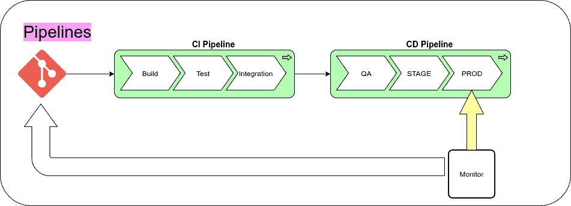
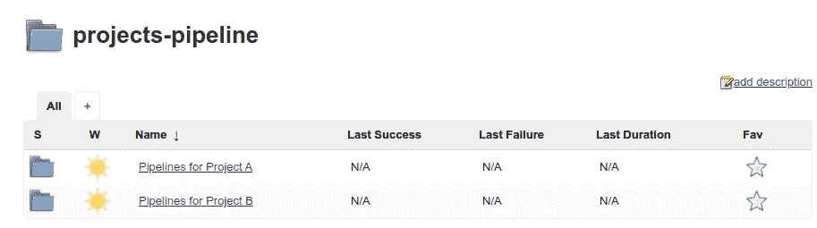
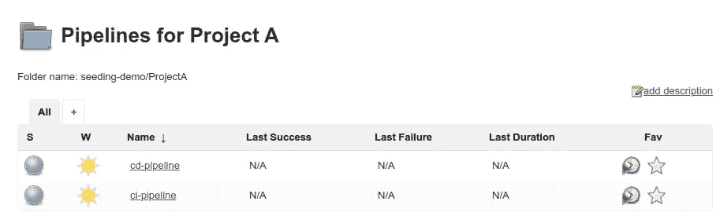
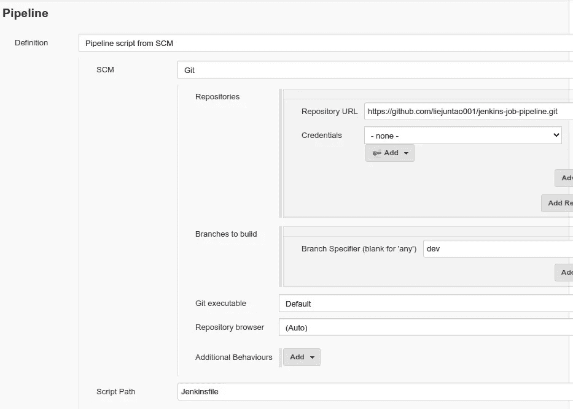
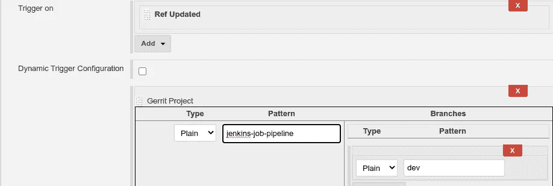
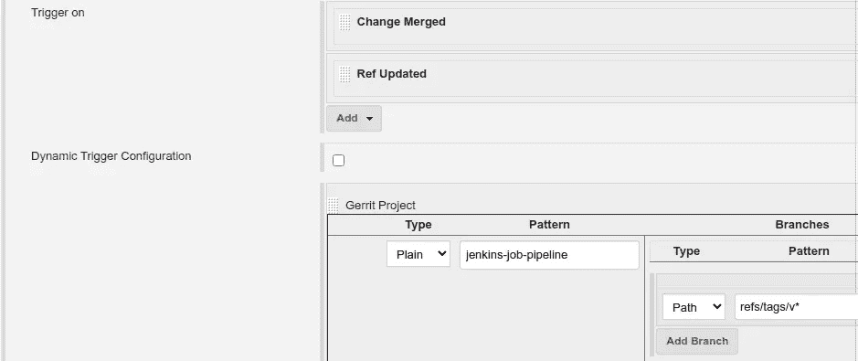

# CI/CD 管道的持续部署管道

> 原文：<https://itnext.io/continuous-deployment-pipeline-for-the-ci-cd-pipelines-a677de68be7?source=collection_archive---------2----------------------->

持续集成/持续交付管道广泛应用于现代软件开发中。为了快速和可靠地开发/交付软件，变更要通过管道并到达产品。


软件 CI/CD 管道

CI/CD 管道本身如何？它们也是由代码创建的吗？他们遵循相同的软件开发/交付过程吗？



管道对管道

在本文中，我想分享我在 CI/CD 管道的持续部署管道方面的一些经验。

以下示例来自 Jenkins/Gerrit 工作流程。应该很容易扩展到 Jenkins/Github 工作流，或者其他类似的工作流。

## Jenkins 中的软件 CI/CD 管道

例如，我们有几个项目。



对于每个项目，都有一个 CI 渠道和一个 CD 渠道。



我们使用 [Jenkins pipeline 作为每个作业的代码](https://www.jenkins.io/doc/book/pipeline-as-code/)来定义管道，假设它们分别是 Jenkinsfile_ci.groovy 和 Jenkinsfile_cd.groovy，例如，ci-pipeline 将为项目的每次更改执行 Jenkinsfile_ci.groovy。

# 通过 Jenkins JodDSL 创建 Jenkins 工作

在将 Jenkins 管道定义为代码之后，很自然地就可以使用 [**JobDSL**](https://github.com/jenkinsci/job-dsl-plugin) 从一些源代码中创建作业。

例如，我们可以用 DSL 定义一个 Jenkins 作业，如下所示:

```
pipelineJob("projectA/ci-pipeline") {
    description("CI pipeline for Project <b>projectA</b>.")
    definition {
      cpsScm {
        scm {
          git {
            remote {
              url('${GERRIT_HOST}/a/projectA')
              credentials('gerrit_username_password')
              refspec('${GERRIT_REFSPEC}')
            }
            branch('FETCH_HEAD')
          }
        }
        scriptPath('Jenkinsfile_ci.groovy')
        lightweight(false)
      }
    }
}
```

为了简单起见，我省略了作业的“触发器”部分。在现实世界的作业中，应该定义一个“触发器”,以便在发生变化时构建作业。

# 通过 Jenkins JobDSL 创建多个 Jenkins 作业

当有许多类似的项目时，会有许多重复的源代码来定义这些项目的 Jenkins 作业。

```
pipelineJob("projectA/ci-pipeline") {
 ...
}
pipelineJob("projectA/cd-pipeline") {
   ...
}
pipelineJob("projectB/ci-pipeline")
pipelineJob("projectB/cd-pipeline")
```

我发现这个 Jenkins JobDSL [gradle 演示项目](https://github.com/sheehan/job-dsl-gradle-example)是从一个中心位置定义大量工作的一个很好的起点。

我将它分支到我的 git [这里](https://github.com/liejuntao001/jenkins-job-pipeline)，其中包含了本文中使用的所有源代码。

这是一个 gradle 项目，结构如下。，您将在 src/jobs 中定义 Jenkins，并支持在将定义的作业放入 Jenkins 之前执行“gradle test”来测试它们。

```
.
├── src
│   ├── jobs                # DSL script files
│   ├── main
│   │   ├── groovy          # support classes
│   │   └── resources
│   │       └── idea.gdsl   # IDE support for IDEA
│   ├── scripts             # scripts to use with "readFileFromWorkspace"
│   └── test
│       └── groovy          # specs
└── build.gradle            # build file$ ./gradlew test
Tests: 3, Failures: 0, Errors: 0, Skipped: 0BUILD SUCCESSFUL in 9s
```

我定义了一个 JSON 文件格式的项目列表，如下所示

```
"simple_projects": [
  "projectA","projectB"
]
```

然后，对于每个项目，在 groovy 文件中定义它的 ci/cd 管道

```
simpleProjectsPipeline.groovyprojects.each { project ->
    pipelineJob("${project}/ci-pipeline") {
        ...
    }
    pipelineJob("${project}/cd-pipeline") {
       ...
    }
}
```

用这种方法，我们可以一起定义一堆相似的詹金斯工作。使用多个 groovy 文件，如 simpleProjectsPipeline.groovy，我们可以满足非常复杂的管道定义的需要。

# 为 Jenkins 工作创建类别

詹金斯的工作可能有不同的种类。

例如，我们可以让一些 Jenkins 作业负责一个单独的项目，或者让一些 Jenkins 作业将一些项目集成在一起，或者让一些作业执行一些 SCM 任务。这些工作在性质上有些不同，或者属于不同的团队。

工作类别是将相似的 Jenkins 工作组合在一起，并隔离不同的工作。

在本文的演示代码中，我将类别定义为 src/jobs 中的一个子文件夹。包含多个类别的结构如下所示。

```
config
├── samples.json
├── category1.json
└── category.json
src
├── jobs
│   ├── samples
│       └── simpleProjectsPipeline.groovy
│   ├── category1
│   └── category2
```

在类别“samples”的 simpleProjectsPipeline.groovy 中，读取匹配的 JSON 文件，并相应地创建作业。

```
def content = readFileFromWorkspace('config/samples.json')
def jsonConfig = new JsonSlurper().parseText(content)
List<String> projects = jsonConfig['simple_projects'].unique()
```

通过定义“类别”，我们可以在一个中心位置组织各种詹金斯工作。

# 创建种子以部署作业

如使用 [JobDSL](https://github.com/jenkinsci/job-dsl-plugin) 的第一步所述，我们需要一个种子项目来部署作业。

通常，该种子作业是在 Jenkins 中创建的第一个手动作业，然后运行该种子作业来创建其他 Jenkins 作业。

我们可以定义一个“管道代码”来调用 JobDSL，而不是创建一个自由形式的种子作业来调用 Job DSL，正如这里的[所描述的](https://github.com/jenkinsci/job-dsl-plugin/wiki/User-Power-Moves#use-job-dsl-in-pipeline-scripts)。

这里有一个 [Jenkinsfile](https://github.com/liejuntao001/jenkins-job-pipeline/blob/master/Jenkinsfile) 放在演示项目的根文件夹中，它运行 jodDsl 作为构建步骤，部署 src/job/${category}中定义的所有作业。

```
jobDsl targets: ["src/jobs/${job_category}/*.groovy", 'src/jobs/*.groovy'].join('\n'),
    ignoreMissingFiles: true,
    removedJobAction: 'DISABLE',
    removedViewAction: 'DELETE',
    lookupStrategy: 'SEED_JOB'
```

现在我们需要一个种子项目。在这篇文章中，我将只定义一个手动的。在现实世界中，当创建 Jenkins 实例时，应该使用代码为的 [Jenkins 配置来定义它。](https://www.jenkins.io/projects/jcasc/)

这是一个创建为 seeding-demo/seed 的作业，它指向演示项目 dev branch，以执行上面提到的 Jenkinsfile。

```
[https://github.com/liejuntao001/jenkins-job-pipeline](https://github.com/liejuntao001/jenkins-job-pipeline)
```


种子作业



种子作业配置

成功运行后，它会创建以下工作:


种子作业结果

这些作业由来自 [jenkins-job-pipeline](https://github.com/liejuntao001/jenkins-job-pipeline) 、dev 分支、category samples 的代码定义。

# 为种子创建 CI/CD 管道

在一个测试 Jenkins 实例中，我们可以创建一个从“开发”或特性分支变更中触发的种子作业。上面描述的例子是这样的，就是运行 dev 分支。

如果您将 jenkinsfile_ci.groovy 指向一个测试版本，测试 Jenkins 实例不仅可以对 [jenkins-job-pipeline](https://github.com/liejuntao001/jenkins-job-pipeline) 的源代码进行测试，还可以对单个项目的 Jenkins 管道的源代码进行测试。

在 Jenkins/Gerrit 工作流中，这是一个触发器，定义如下:



暂存种子

在生产 Jenkins 实例中，我们可以通过匹配“refs/tags/v.*”来创建一个由正式发布标记触发的种子作业，以部署正式管道。



生产种子

对于不同类别的作业，在文件夹中定义种子作业。

例如，project-review/seed 为类别“project-review”创建作业，所有与项目评审相关的作业都将在“project-review”文件夹中创建。类似地，创建另一个 scm/seed 作业，为类别“scm”创建作业。

类别被定义为种子作业中的一个参数。


定义范畴

[Jenkinsfile](https://github.com/liejuntao001/jenkins-job-pipeline/blob/master/Jenkinsfile) 使用该参数为相应的类别创建作业。

```
def job_category = 'samples'
if (params.JOB_CATEGORY) {
  job_category = params.JOB_CATEGORY
}
jobDsl targets: ["src/jobs/${job_category}/*.groovy", 'src/jobs/*.groovy'].join('\n'),
```

# 摘要

在 DevOps 世界“一切都是代码”的潮流中，詹金斯很好地顺应了潮流。

1.  作为代码的 Jenkins 管道:定义在 Jenkins 作业中运行的内容
2.  Jenkins jobs as code:从代码创建 Jenkins jobs
3.  Jenkins 配置为代码:从代码创建 Jenkins 实例

本文适合第 2 项，为种子作业创建一个 CI/CD 管道，通过它可以从代码中创建大量的 Jenkins 作业。

**本文的源代码在 Github 中共享。**

```
[Link to Github](https://github.com/liejuntao001/jenkins-job-pipeline)
```

## 参考资料:

[CI/CD 管道:温柔的介绍](https://semaphoreci.com/blog/cicd-pipeline)

[詹金斯 JobDSL](https://github.com/jenkinsci/job-dsl-plugin)

[詹金斯工作 DSL 梯度示例](https://github.com/sheehan/job-dsl-gradle-example)

感谢阅读。