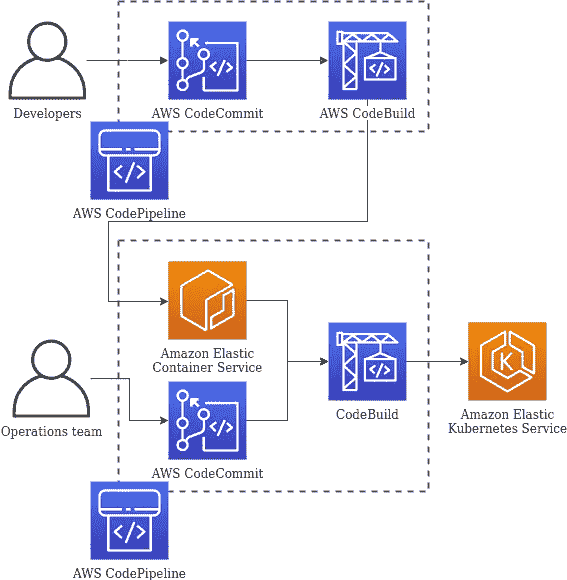
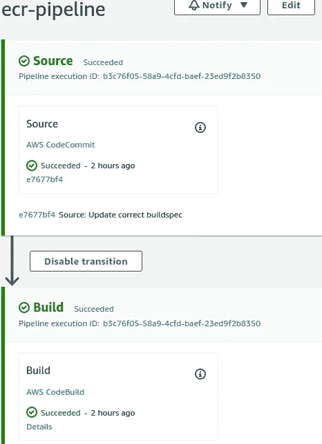
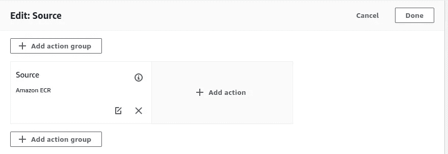
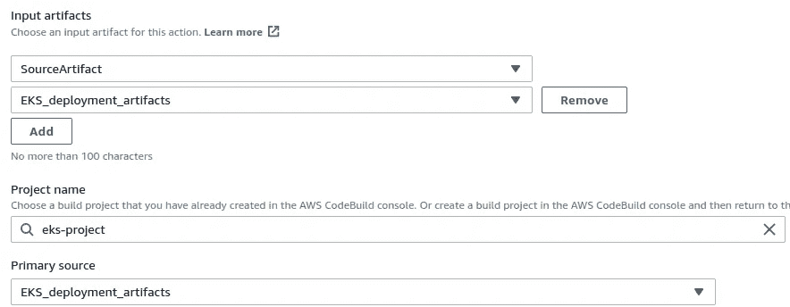
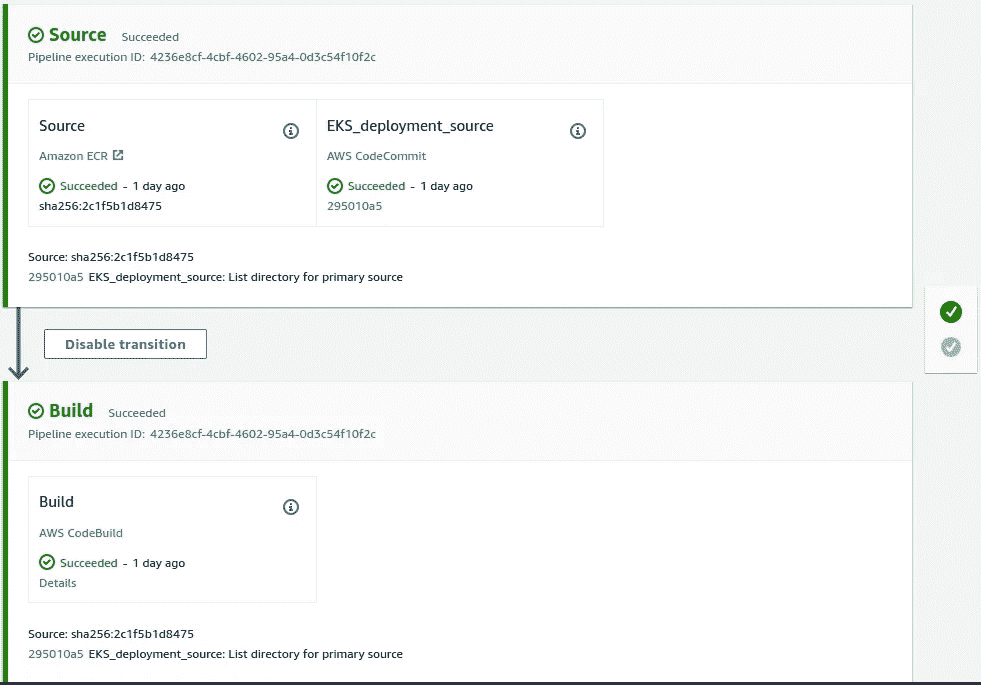

# 使用 AWS CodePipeline、AWS CodeCommit 和 AWS CodeBuild 持续部署到 Kubernetes (EKS)

> 原文：<https://itnext.io/continuous-deployment-to-kubernetes-eks-using-aws-codepipeline-aws-codecommit-and-aws-codebuild-fce7d6c18e83?source=collection_archive---------0----------------------->

## 一个简单的管道可以用于 Kubernetes 集群，而不需要任何复杂的机制。

我一直在考虑实现一个解决方案，关于如何使用完全由 AWS 提供的服务进行持续部署的解决方案，类似于 Google Cloud 提供的 [GitOps 风格的持续交付管道教程。部分原因是，我想看看在 AWS 上实现这样一个解决方案有多难(或多容易),因为 EKS 和持续交付解决方案在 AWS 中是本地可用的。我之所以想使用完全依赖 AWS 服务的解决方案，是为了避免管理托管解决方案的额外成本和开销。事不宜迟，让我告诉你我想做什么。](https://cloud.google.com/kubernetes-engine/docs/tutorials/gitops-cloud-build#create_the_continuous_delivery_pipeline)

我在 AWS DevOps 博客上看到了这篇文章，它提供了一个使用 AWS CodePipeline、AWS CodeCommit、AWS CodeBuild、Amazon ECR 和 AWS Lambda 实现连续交付的解决方案。

[](https://aws.amazon.com/blogs/devops/continuous-deployment-to-kubernetes-using-aws-codepipeline-aws-codecommit-aws-codebuild-amazon-ecr-and-aws-lambda/) [## 使用 AWS CodePipeline、AWS CodeCommit、AWS CodeBuild、Amazon ECR 和 AWS Lambda 持续部署到 Kubernetes

aws.amazon.com](https://aws.amazon.com/blogs/devops/continuous-deployment-to-kubernetes-using-aws-codepipeline-aws-codecommit-aws-codebuild-amazon-ecr-and-aws-lambda/) 

这篇文章本身没有问题，但我想看看是否有可能删除 AWS Lambda 要求，就像它在 GCP 是如何实现的一样(或在某种程度上)。我最终做到了这一点，现在我将向你解释这是如何做到的。

对于这个练习，您需要两个代码管道。为什么是两个？正如在 Google 的文章中，源代码和 Kubernetes 部署有两个不同的生命周期。此外，开发源代码的开发人员不会对它是如何部署的太感兴趣。首先，我建议你看一下 [GCP 教程](https://cloud.google.com/kubernetes-engine/docs/tutorials/gitops-cloud-build#create_the_continuous_delivery_pipeline)，对所用的比喻有一个公平的概念，因为没有必要延长这篇文章。



管道的架构

## 第一个代码管道:从 git 仓库到容器注册中心

首先，您需要一个 git 存储库来存储源代码。我在这里使用 CodeCommit。它在根目录中包含以下内容:

*   **code** directory:每当有更新时要被容器化的源代码。
*   **docker-distribution***目录:仅包含 **Dockerfile** 。*
*   ***buildspec.yaml** 文件:包含 CodeBuild 稍后在管道阶段使用的指令。*

*一旦对 CodeCommit 存储库进行了任何代码更改，就需要根据 Dockerfile 中的指令创建 docker 容器，并将其推送到容器注册中心，在本例中是弹性容器注册中心。*

*我现在将告诉您如何从 AWS 控制台设置管道。*

*一旦进入 AWS 控制台，从**服务**中选择**代码管道**，点击**创建管道**。在本例中，我将管道命名为 **ecs-pipeline** 。以下是我使用的设置:*

*   ***管道名称:***ECR-管道**
*   ***服务角色:** *新增服务角色**
*   *确保**允许 AWS 代码管道创建一个服务角色，这样它就可以与选择的这个新管道**一起使用。*
*   *点击**下一步***
*   ***来源提供者:** *AWS 代码提交**
*   ***存储库名称:**代码所在的存储库。*
*   ***分店名称:**分店名称*
*   *将所有其他内容保留为默认值，然后单击下一步的**。***
*   ***构建提供者:** AWS 代码构建*
*   *点击**创建项目***
*   *将**项目名称**命名为*ECR-项目**
*   ***环境镜像:** *管理镜像**
*   ***操作系统:** *亚马逊 Linux 2**
*   ***运行时:** *标准**
*   ***图片:***AWS/codebuild/amazonlinux 2-x86 _ 64-standard:2.0**
*   ***服务角色:** *新服务角色**
*   ***角色名称:** *给角色起个名字**
*   *展开**附加配置。***
*   *给出这些环境变量:*

```
*AWS_DEFAULT_REGION: us-east-1
AWS_ACCOUNT_ID: <your-aws-account-id>
ENV: latest #use other environment name based on the type; eg., **staging**
IMAGE_REPO_NAME: web-app #The container image name I intent to use*
```

*   *在**构建规范**下，选择**使用构建规范文件**。*
*   *进行其他必要的更改，并选择**继续编码管道**。*
*   *回到代码管道页面，点击下一个的**。***
*   *在部署阶段，点击**跳过部署阶段**。*
*   *查看并选择**创建管道**。*

*如果您需要对许多管道应用这种方法，为了简单起见，您也可以为 CodePipeline 和 CodeBuild 创建一个 JSON 文件。这超出了本文的范围。*

*第一次构建将会失败，因为您还没有创建 **buildspec.yaml** 。现在，我们将继续定义我们的 buildspec。我需要构建做的是，每当代码有任何更改时，将目录更改为**代码**目录，使用 **yarn build** 为生产构建静态文件，使用 Dockerfile 中的指令对此进行容器化，并将其推送到弹性容器注册表。*

*下面是 buildspec 创建时的样子:*

*现在让我们来分解一下。*

*第一阶段是**安装**阶段。这里，要使用的 nodejs 的版本可以在**运行时-版本**下指定。在**命令下**为**安装**阶段是**纱线安装**。由于*AWS/code build/amazonlinux 2-x86 _ 64-standard:2.0*build image 预装了 yarn，我们不需要在安装阶段单独安装。因此，我们现在将运行 yarn install 来安装所需的包。我还将指定一个 COMMIT_HASH，它是 code build _ RESOLVED _ SOURCE _ VERSION 的截断版本，code build _ RESOLVED _ SOURCE _ VERSION 是从源阶段返回到构建环境的环境变量，它只不过是启动管道的最后一个 git 提交 ID。您可以在此链接中看到构建环境使用的环境变量列表:*

 *[## 构建环境中的环境变量

### AWS CodeBuild 提供了几个可以在构建命令中使用的环境变量:CODEBUILD_BUILD_ARN

docs.aws.amazon.com](https://docs.aws.amazon.com/codebuild/latest/userguide/build-env-ref-env-vars.html)* 

*COMMIT_HASH 将被用作构建图像的图像标签。*

*在 **pre_build** 阶段，云构建角色将使用命令`$(aws ecr get-login — no-include-email — region $AWS_DEFAULT_REGION)`登录 Amazon ECR。但这需要访问 ECR，而我们的云构建帐户没有。但是我们不需要给 Cloud Build account 不必要的权限来创建容器存储库，只需要更新镜像即可。因此，我们将继续在 ECR 中手动创建一个映像。继续从 ECR 创建一个名为 **web-app** (在我的例子中)的存储库。现在，转到 **IAM** > **角色** > 选择您的云构建角色>添加策略**amazonec 2 containerregistrypoweruser**。权限完成了。现在，我们将看看在构建规范中还有什么。现在，有两个命令**纱线清洁**和**纱线构建**来构建我们的文件。您将需要根据您的要求来改变这一点。*

*接下来如果**建立**阶段。在这一阶段，我们将把目录更改为 **docker-distribution** ，并构建 docker 映像。*

*在 **post_build** 阶段，我们会将此 docker 映像上传到 ECR，这应该不会有问题，因为我们已经将所需的策略附加到云构建角色。*

*一旦 buildspec.yaml 被创建并被推送到 CodeCommit，这将再次触发管道。最终产品将是上传到 ECR 的容器图像。*

**

*现在，我们将讨论如何将这个容器映像应用到 kubernetes (EKS)部署中。*

## *第二条代码管道:从 ECR 到 EKS*

*如前所述，开发人员不需要知道 Kubernetes 部署是什么样子的。此外，您可能希望限制对少数人的访问。这就是为什么您需要第二个管道(加上我试图在单个管道中设置它，但未能满足我的要求)。*

*对于这个管道，我们需要两个源(它启动管道的触发器):*

1.  *每当 container registry 中有新的映像时，它都应该应用到我们已经存在的 Kubernetes 部署中。*
2.  *如果我们的 Kubernetes 部署清单有变化，也应该应用到部署中。*

*那是什么意思？所以，你有一个 EKS 部署。当 ECR 中有新的容器映像可用时，您需要更新该部署中的映像。如果存储在 Git 存储库(在我们的例子中是另一个 CodeCommit 存储库)中的[部署清单](https://kubernetes.io/docs/concepts/overview/working-with-objects/kubernetes-objects/)被更新，那么部署也应该被更新。*

*现在让我解释一下我的 CodeCommit 存储库在它的根目录中存储了什么(这只是一个测试用例)。*

*   *一个包含部署清单的 **deployment.yaml** 文件。*
*   *一个 **buildspec.yaml** ，它存储了关于如何应用这个 deployment.yaml 文件的信息。*

*我们将从为第一个源——ECR registry 创建管道开始。转到 IAM，创建一个名为 **codebuild-eks** 的角色。它应该应用于 codebuild 服务。*

**

*现在，创建一个名为 **EKS 集群访问**的 IAM 策略，具有以下权限:*

*这是 CodeBuild 角色向 EKS 群集(您应该已经创建了该群集)进行身份验证所必需的。您不需要附加任何其他策略，因为它将在接下来的步骤中完成。我们现在将像以前一样创建一个新的管道。*

*   ***管道名称:***eks-管道**
*   ***服务角色:** *新增服务角色**
*   *确保**允许 AWS 代码管道创建一个服务角色，这样它就可以与选择的这个新管道**一起使用。*
*   *点击**下一个***
*   ***货源供应商:** *亚马逊 ECR**
*   ***资源库名称:** *web-app**
*   ***图像标签:**最新*
*   *点击下一个的**。***
*   ***构建提供者:** AWS 代码构建*
*   *点击**创建项目***
*   *将**项目名称**命名为*eks-项目**
*   ***环境图像:** *管理图像**
*   ***操作系统:**亚马逊 Linux 2*
*   ***运行时:** *标准**
*   ***图片:***AWS/codebuild/amazonlinux 2-x86 _ 64-standard:2.0**
*   ***服务角色:** *现有服务角色**
*   ***角色 ARN:** 选择 *codebuild-eks* 角色对应的 ARN*
*   *确保**允许 AWS CodeBuild 修改此服务角色，以便它可以与选择的构建项目**一起使用。*
*   *展开**附加配置。***
*   *给出这些环境变量:*

```
*AWS_DEFAULT_REGION: us-east-1
AWS_CLUSTER_NAME: <your-cluster-name>*
```

*   *在**构建规范**下，选择**使用构建规范文件**。*
*   *进行其他必要的更改，并选择**继续编码管道**。*
*   *回到代码管道页面，点击**下一个**。*
*   *在部署阶段，点击**跳过部署阶段**。*
*   *查看并选择**创建管道**。*

*正如所料，这个管道也会失败，因为 CodeBuild 在其当前工作目录( [CODEBUILD_SRC_DIR](https://docs.aws.amazon.com/codebuild/latest/userguide/build-env-ref-env-vars.html) )中没有 **buildspec.yaml** 文件。继续创建一个空的 CodeCommit 存储库，比如说 **eks-distribution** 。现在，回到 CodePipeline 并执行以下操作:*

*   *选择**eks-管道**。*
*   *点击**编辑***
*   *在**编辑:源**部分选择**编辑阶段**。*

**

*   *点击**添加动作**。*

*弹出新的**编辑动作**页面。*

*   ***动作名称:***EKS _ 部署 _ 来源**
*   ***动作提供者:** *AWS 代码提交**
*   ***储存库名称:** *eks-distribution**
*   ***分公司名称:**主*
*   ***输出工件:***EKS _ 部署 _ 工件**
*   *将其他一切保持默认，并点击**完成***
*   *在**编辑:eks-pipeline** 页面下再次点击**完成**。*
*   *现在点击**编辑:构建**部分中的**编辑阶段**。*
*   *点击铅笔按钮，编辑已经存在的 **AWS CodeBuild** 动作。*
*   *当弹出新的**编辑动作**页面时，点击输入工件下的**添加**，选择*EKS _ 部署 _ 工件*。*
*   *在**主源**下，选择*EKS _ 部署 _ 工件*。*
*   *您的构建阶段现在应该如下所示:*

**

*   *其他一切保持原样，点击**完成**。*

*这一次，管道也将失败，因为我们的 eks 发行版存储库中什么也没有。继续创建 **deployment.yaml** 文件，确保将标签中的图像替换为**:最新的**标签。 **buildspec.yaml** 文件应该是这样的:*

*我还在上面的 repo 中包含了一个示例 deployment.yaml。*

*阶段很简单。在安装阶段，我们安装 kubectl 命令。在**预构建**阶段，我们向 EKS 集群进行身份认证。这将创建一个 [kubeconfig 文件](https://kubernetes.io/docs/concepts/configuration/organize-cluster-access-kubeconfig/)。但是，尽管 CodeBuild 角色拥有向群集进行身份验证的权限，但它没有在群集上执行任何其他操作所需的 RBAC 访问权限。您甚至可以在集群中列出 pod。您应该阅读以下来自 EKS 文档的引文:*

> *当您创建一个亚马逊 EKS 集群时，IAM 实体用户或角色，比如创建集群的[联合用户](https://docs.aws.amazon.com/IAM/latest/UserGuide/id_roles_providers.html)，在集群的 RBAC 配置中被自动授予`system:masters`权限。要授予其他 AWS 用户或角色与您的集群交互的能力，您必须在 Kubernetes 中编辑`aws-auth` ConfigMap。*

*因此，您需要编辑 aws-auth 配置图。你是怎么做到的？如果您是创建集群的人，您需要在本地终端中运行以下命令来创建一个`aws-auth`配置图的副本。*

```
*# aws configure
# aws eks — region $AWS_DEFAULT_REGION update-kubeconfig — name $AWS_CLUSTER_NAME
# kubectl get configmaps aws-auth -n kube-system -o yaml > aws-auth.yaml*
```

*正如您可能已经想到的，您需要有可用的 aws 和 kubectl 命令。您可以使用下面的链接来参考如何设置它:*

*[安装 AWS CLI 版本 2](https://docs.aws.amazon.com/cli/latest/userguide/install-cliv2.html)
安装 kubectl*

*现在，编辑您的 aws-auth.yaml，并在 **data.mapRoles** 下添加以下内容*

```
*- rolearn: arn:aws:iam::510442909921:role/codebuild-eks
  username: codebuild-eks
  groups:
    - system:masters*
```

*最终的 aws-auth.yaml 看起来应该有点像这样:*

*从您的终端应用此配置:*

*`# kubectl apply -f aws-auth.yaml`*

*现在，CodeBuild 帐户拥有了必需的 RBAC 访问权限。在**构建**阶段，有一个到 **$CODEBUILD_SRC_DIR** 的变更目录，这不是必需的，因为默认情况下代码构建将在这个目录中。如果**EKS _ 部署 _ 工件**不是主要来源，您需要将目录更改为**$ CODEBUILD _ SRC _ DIR _ EKS _ 部署 _ 工件**。你可以在这里阅读更多信息:*

 *[## AWS 代码管道与 CodeBuild 和多个输入源和输出工件的集成示例

docs.aws.amazon.com](https://docs.aws.amazon.com/codebuild/latest/userguide/sample-pipeline-multi-input-output.html)* 

*在最后一个阶段，您使用`kubectl apply -f deployment.yaml`应用部署*

*现在您提交 **buildspec.yaml** 文件并将更改推送到 CodeCommit。管道随之而来，如果到目前为止你做了所有正确的事情，它应该是成功的。*

**