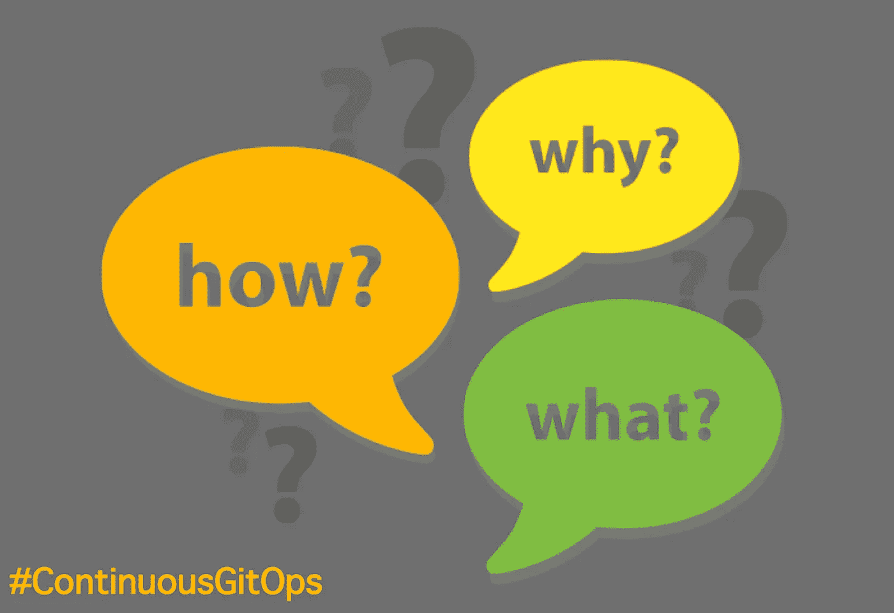
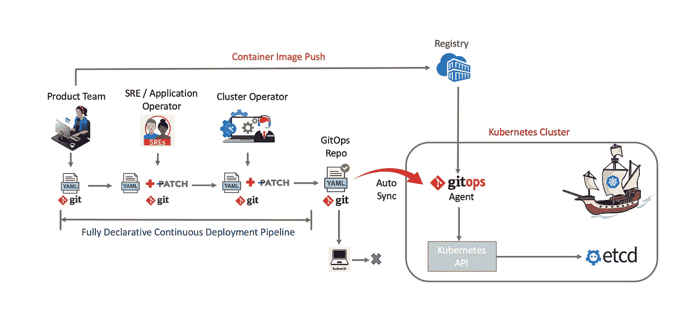
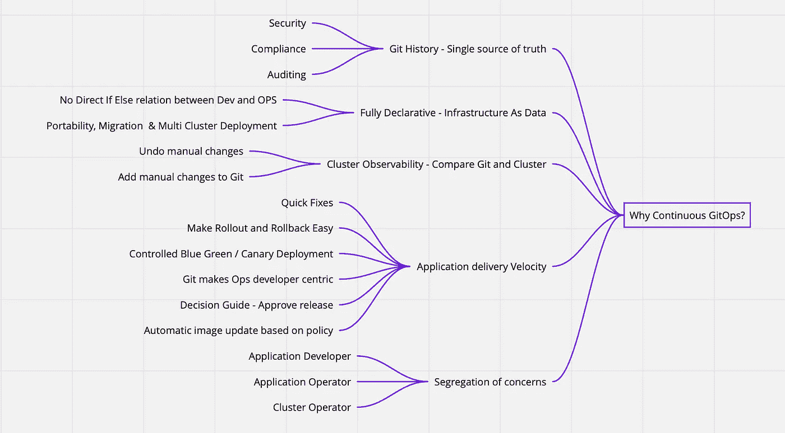
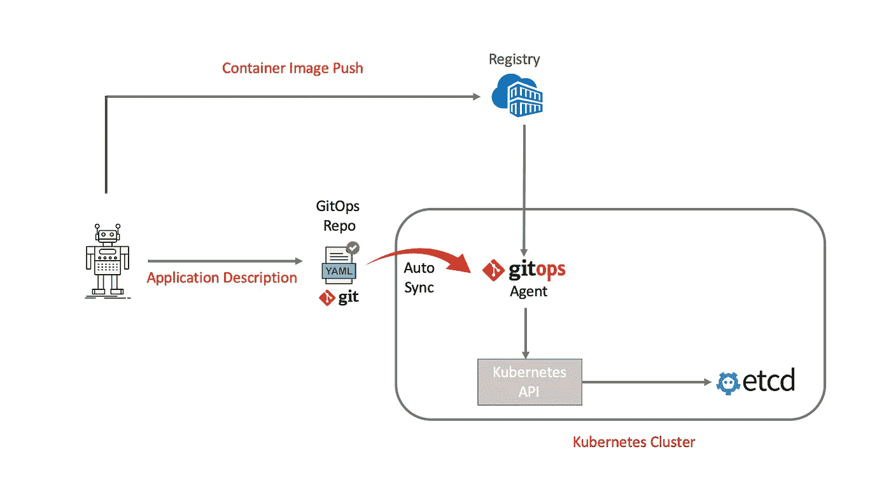
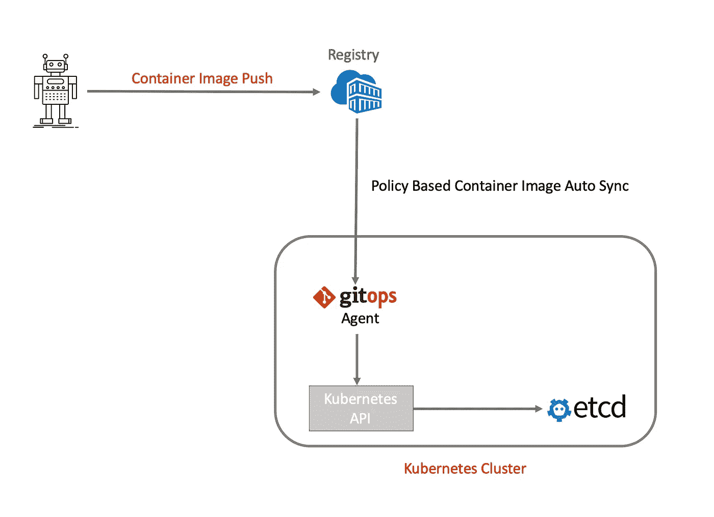
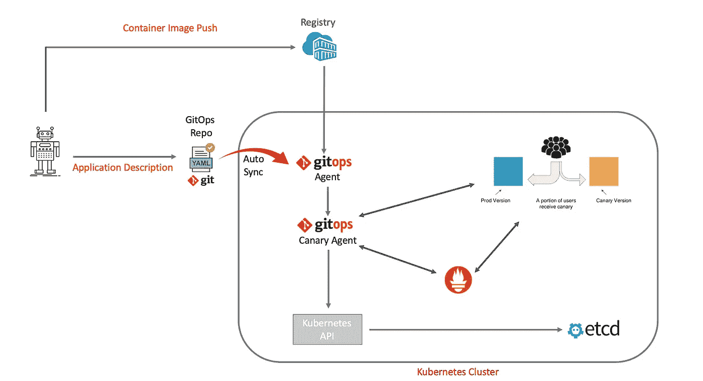
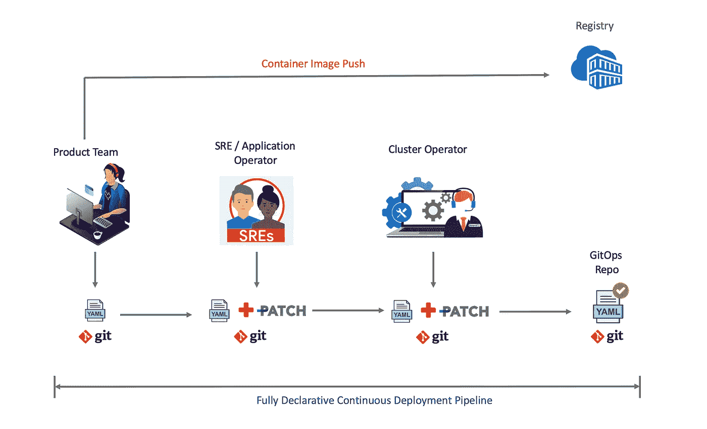
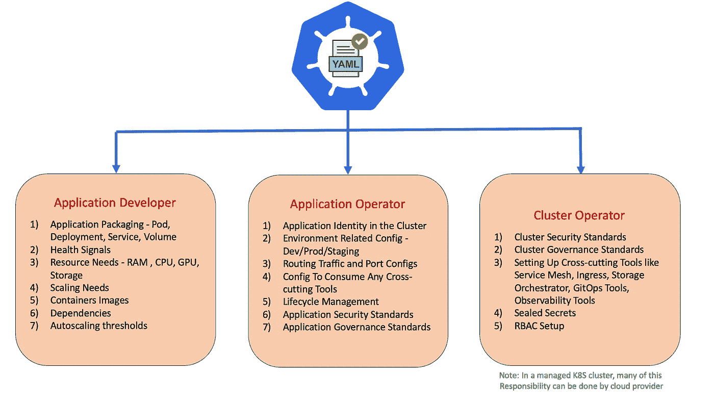
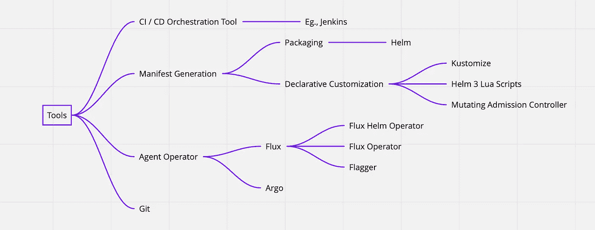

# 持续的 GitOps，在 Kubernetes 做 DevOps 的方法

> 原文：<https://itnext.io/continuous-gitops-the-way-to-do-devops-in-kubernetes-896b0ea1d0fb?source=collection_archive---------0----------------------->

## 持续 GitOps，新时代 DevOps 实践通过实现端到端的“Git 真实来源”,无需手动更改 Kubernetes 集群来提高交付速度🏄

从我们第一次听说持续交付这个词到现在已经 10 年了。Jez 和法利·大卫在 2010 年通过他们的书《持续交付:通过构建、测试和部署自动化的可靠软件发布》谈到了持续交付。在过去的十年中，连续交付*已经改变了我们发布软件的方式。现在，随着围绕 Kubernetes 生态系统开发的一套新工具，我们正在持续交付之旅中迈出又一大步。这些工具围绕着*连续 GitOps 的概念。这篇博客试图揭开为什么？什么？又是怎么做到的？“连续的 GitOps”。

# 什么是连续 GitOp？

连续 GitOps 是一个概念，我们将软件的端到端描述放入 Git，然后尝试使集群状态与 Git 存储库持续同步。这里有两个关键词会有所不同。

1.  **软件的描述表示**:使用 *Kubernetes，应用程序和底层基础设施之间的关系完全是声明性的。你用声明式(YAML 式)询问你想从基础设施中得到什么。这些 YAML 的实现细节被底层的 Kubernetes 集群抽象出来，该集群具有控制器、调度器、KubeDNS、KubeProxy、操作器等。，这使我们能够从传统的“基础设施即代码”转向“基础设施即数据”。更多关于此的信息，请点击*[*【GitHub】*](https://github.com/kubernetes/community/blob/master/contributors/design-proposals/architecture/declarative-application-management.md)*。这里的关键是，应用程序所需的每个声明性标签(来自*应用程序开发人员/应用程序操作人员/集群操作人员*)都被充实到持续交付管道中的 YAML 中，并最终被推入 GitOps 存储库。并且对集群中的任何手动 YAML 更改都应该零容忍。*
2.  **持续同步:**持续同步意味着持续查看 git 存储库，以将任何状态变化反映到 Kubernetes 集群中。这是一个强大的想法，来自一个叫做**的工具。Flux 试图使用 Kubernetes 操作符将部署自动化从 Kubernetes 集群外部转移到集群中。**

*持续 GitOps 是四个主要组件的交集，它们共同创造了奇迹*

1.  ***Git 仓库**:将我们的应用程序的声明性定义存储为 YAML 的源代码仓库。*
2.  ***Kubernetes 集群**:我们部署应用的底层集群。*
3.  ***同步代理**:Kubernetes 操作符扩展，它负责将 Git 存储库和应用程序状态持续同步到集群中。*
4.  ***CD 管道**:编排整个流程的持续部署管道。*

*下面给出了关于这些组件如何协同工作以创建连续 GitOps 流的参考架构。*

**

*在上述参考架构中，YAML 创建和*丰富在*应用开发者、应用运营商和集群运营商之间分成三个部分。根据您的组织团队结构、集群多租户和治理需求，您可以选择分一两步完成。我们将在下面的“管理声明性 YAML”一节中对此进行更深入的探讨。*

*现在让我们来看看，为什么要连续 GitOps？*

# *为什么持续 GitOps？*

*持续的 GitOps 在许多方面增加价值。让我们来看看一些关键的问题，*

***应用交付速度**:*

*持续的 GitOps 将通过以下方式提高产品交付速度:*

1.  *自信的展示，能够比较最终的完整 YAML 和集群状态。这也可以作为批准发布的决策指南。*
2.  *借助 Prometheus 的应用指标，通过自动蓝绿色部署轻松部署流程。*
3.  *基于策略的自动化容器映像更新。例如，Istio sidecar 次要版本是向后兼容的，可以自动更新。*
4.  *GitOps 将以开发者为中心进行运营，提供低摩擦的开发体验。*
5.  *应用团队可以接手一些运营工作，运营团队可以专注于平台。*
6.  *GitOps repository 充当了一种绕过紧急发布的完整连续部署流程的方式。*

***端到端自动化:***

*在 GitOps 方法中，与应用程序开发人员、应用程序操作员和集群操作员相关的一切都通过 git 嵌入到 YAML 中，实现了端到端自动化。*

***安全、审计&合规:***

*零手动更改集群的策略将极大地提高集群安全性，并支持任何合规性要求。因为集群中的所有东西都在 git 中，所以我们将有一个完整的审计日志，记录集群中发生的事情。*

***集群可观测性:***

*有了完整的审计日志，我们可以很容易地获得集群中发生的更改的列表，以帮助任何问题的调试。*

***关注点分离&轻松迁移:***

*持续的 GitOps 将使应用程序开发人员、应用程序操作人员和集群操作人员之间的问题分离。来自这些团队的依赖以声明的方式作为依赖注入注入到 git 中。这将简化我们对底层 k8s 集群、治理策略或横切工具的迁移。*

**

*阅读有关 Kubernetes DevOps 的端到端 DevOps 工作流[的更多信息。](https://link.medium.com/yqPhMzi4G5)*

# *我们如何采用连续 GitOps？*

*我们将研究以下四个不同的方面，这将有助于我们做到这一点*

*   *要实施的 GitOps 工作流*
*   *管理声明性 YAML 氏症*
*   *工具*
*   *从哪里开始？*

## ***GitOps**w**workflow to implement***

*当我们开始使用 GitOps 时，以下三个工作流是要采用的流行工作流*

***工作流程 1** :标准 GitOps 流程*

*这是标准的 GitOps 工作流程，我们将应用程序 YAML 描述推送到 GitOps 存储库中，GitOps 代理将自动同步状态更改。*

**

***工作流程 2** :自动图像更新*

*在这个工作流中，GitOps 代理将根据指定的策略从容器映像注册中心自动更新容器映像的新版本。例如，我们可以设置这样的策略，如果映像中有微小的版本变化，我们可以自动更新，因为它们是向后兼容的。*

**

***工作流程 3** :自动化金丝雀部署*

*这是一个强大的工作流程，我们可以在其中自动化金丝雀部署。这样，我们逐渐将流量转移到金丝雀，同时使用 Prometheus 测量关键性能指标，如 HTTP 请求成功率、请求平均持续时间和 pod 运行状况。基于 KPI 的分析，金丝雀被提升或中止*

**

## ***管理声明性 YAML 的***

*假设我们有一个电子商务购物车应用程序，完整的应用程序定义是以下内容的混合*

1.  *应用程序图像。*
2.  *Pod、部署、服务、卷和配置图的 YAML。*
3.  *数据库通信的几个秘密？*
4.  *使用 Istio 服务网格作为集群治理策略的默认横切边盘。*
5.  *环境治理策略，如在转移阶段进行一次复制，在生产阶段进行三次复制。*
6.  *标签来增加高可用性节点调度的节点亲和力和容忍度。*
7.  *基于 pod 标签的网络安全策略 YAML。*

*为了构建最终的应用程序 YAML，我们需要来自应用程序开发人员、应用程序操作人员和集群操作人员的输入。根据您的组织团队结构、集群多租户和治理复杂性，所有这些活动可能由一个到三个不同的团队执行。让我们更详细地看看这个。*

*假设你是一个小组织，管理手满荚的，你会有小*

*下面的流程展示了我们如何构建一个协调的持续部署自动化管道。*

**

*这种分离关注点的方式深受开放应用模型的影响，该模型试图为云原生应用开发提供一个框架。*

*开放应用模型 [[OAM](https://oam.dev/) ]描述了一种模型，其中*

*   ***开发者**负责定义应用组件。*
*   ***应用操作员**负责创建那些组件的实例，并为它们分配应用配置。*
*   *基础设施操作员负责声明、安装和维护平台上可用的底层服务。*

*通过应用 OAM 框架，下表尝试分离 YAML 摊缴责任。这可能会根据您的组织结构和您选择的 Kubernetes 集群类型而有所变化。*

**

## ***工具***

*如果您对 GitOps 的想法深信不疑，那么您的下一步就是确定所需的工具。有许多工具可以支持我们实现 GitOps 的不同方面。让我们看看其中的一些工具及其用法*

***Git:** 这个是我们使用 GitOps 存储 YAML 工件的基础。*

*这是一个强大的组合，可以帮助我们生成声明性的 YAML 清单。我们可以用 Helm 打包应用程序及其依赖项。然后 Kustomize 将*帮助我们定制和修补 YAML 的文件，而不改动原来的 YAML。*在[掌舵的时候多读点这个还不够，你还需要 kutomize](https://medium.com/@imarunrk/helm-is-not-enough-you-also-need-kustomize-82bae896816e)。如果你正在寻找一些其他的替代工具来做这件事 [*阅读*](https://github.com/kubernetes/community/blob/master/contributors/design-proposals/architecture/declarative-application-management.md) *。**

*Argo CD: 这是一个 GitOps 连续交付工具，它可以作为一个代理，将 GitOps 存储库中的更改同步到 Kubernetes 集群中。( [Argo CD](https://argoproj.github.io/argo-cd/) )*

***Flux** :这是另一个 GitOps 连续交付工具，可以作为代理将 GitOps 存储库的变更同步到 Kubernetes 集群。([通量](https://fluxcd.io))*

***Flagger** :这个工具与 flux 配合得很好，可以通过 GitOps ( [Flagger](https://github.com/weaveworks/flagger) )交付金丝雀部署*

**

## ***从何说起？***

*如果你正在开始一个绿地项目，从一开始就采用 GitOps 有点容易。我们所要做的就是选择我们的 CI/CD 工具、声明式 YAML 管理和 GitOps 代理来让它运行起来。*

*如果您正在寻找在棕地应用程序中实现 GitOps，以下几点可能会为您提供指导*

1.  *您可以一次选择一个应用程序，并使用成功案例来扩大应用范围。*
2.  *当您选择第一个应用程序时，请选择变化更频繁的应用程序。这将有助于我们为成功案例建立一些可靠的衡量标准。*
3.  *选择一个经常崩溃的应用程序。有了 GitOps，这些应用程序应该不那么频繁地崩溃，当它崩溃时，您应该有更好的可观察性。*
4.  *比起像 Istio、RBAC 集成等运营交叉问题，更喜欢业务应用。这些贯穿各领域的业务问题非常复杂，而且不是唾手可得的。*
5.  *如果需要，引入虚拟人工批准步骤，直到您有信心为止。*

*在下一篇文章中，让我们一步步地了解 GitOps。*