# 使用 Terraform 云进行持续基础架构部署

> 原文：<https://itnext.io/continuous-infrastructure-deployment-with-terraform-cloud-2853cbbb920?source=collection_archive---------1----------------------->

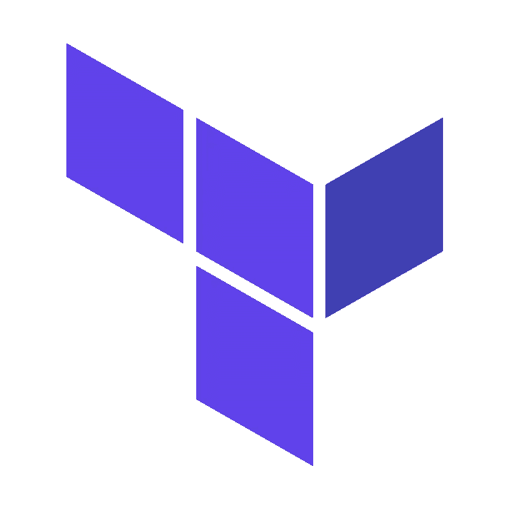

# 地形和自动化

在我上一家公司，我们经常使用 Terraform。它允许我们重复地创建基础设施，并利用彼此的代码来这样做。它还为我们提供了一种标准的方法，无需团队编写自己的专用工具就可以对基础设施进行更改，同时以代码的形式记录基础设施！如果您熟悉 Terraform 或其他基础设施作为代码工具，您可能已经理解并获得了使用它们的好处。

然而，有时 Terraform 需要共享的结构和工作流，以保持环境的一致性，并支持团队成员之间的协作。为此，您可以使用远程状态、工作区或类似于 [Terragrunt](https://terragrunt.gruntwork.io/) 的工具。这也是像[地形云](https://www.terraform.io/docs/cloud/index.html)、[太空飞船](https://spacelift.io/)、 [env0](https://www.env0.com/) 、 [Scalr](https://scalr.com/) 或[亚特兰蒂斯](https://www.runatlantis.io/)这样的选项发挥作用的地方。这些 Terraform 自动化工具[由 CloudPosse](https://www.youtube.com/watch?v=4MLBpBqZmpM) 创造的“TACOS”(terra form Automation&协作软件)提供了多种优势，这些优势在部署您自己的基础设施自动化时难以匹敌。其中包括:

*   放手，保护你的地形状态的后端
*   共享计划输出，简化协作
*   Terraform 版本锁定
*   版本控制之外的附加权限管理
*   一个工作空间的 Webhooks 和“触发器”基于另一个工作空间的运行
*   政策作为代码框架，如 [OPA](https://www.openpolicyagent.org/) 或 [Sentinel](https://www.hashicorp.com/sentinel)
*   API 驱动的地形运行
*   估价
*   国家审计和税务
*   私有模块注册表

虽然这些工具往往具有相似的功能集，但今天我将探索 [Terraform Cloud](https://www.terraform.io/docs/cloud/index.html) 通过 GitHub 操作自动化基础架构更改，并将这些更改从一个环境推广到下一个环境。作为演示，我将创建一个具有 3 种不同环境的小型 AWS 模块:“tst”、“stg”和“prd”。这些环境都将位于 AWS 区域“美国-西部-2”。

这篇文章的目标是探索三件事:

1.  使用“工作区”和 Terraform 云后端在同一模块中处理多个环境。
2.  自动化从一个环境到下一个环境应用更改的过程。
3.  使用哨兵策略，防止不符合规范的基础设施更新。

## 21 年 6 月 2 日更新

我在发表这篇文章后被告知，通过提供`TF_CLI_ARGS`环境变量，在 Terraform Cloud 中使用`-tfvars`选项实际上是可能的。虽然我还没有尝试过，但这将解决我在创建这个演示时遇到的主要问题，正如你将看到的那样，无法为每个特定的环境提供特定的`*.tfvars`文件，这意味着我必须做一些代码调整来弥补。相反，我可以将每个工作区中的`TF_CLI_ARGS`设置为指定的`tfvars`。如果这没有意义的话，应该在文章的最后。

大声呼喊[杰里米·盖瑟](https://medium.com/@jeremygaither)指出这一点。

# 项目设置

不再浪费时间，让我们进入代码(你可以在这个报告中找到[)。](https://github.com/5t33/tf-cloud-workspaces-demo)

我将使用的文件夹结构如下:

```
├── module
├── sentinel
├── usr_mgmt
└── workspaces
```

如果这是一个真实的环境，这些文件夹中的每一个都代表一组资源，这些资源可能是它自己的存储库，但是出于演示的目的，我将它们放在一起。现在不用太担心其他文件夹，我将部署的资源将放入`module`目录。

下面是我将部署的简单模块:

以及随之而来的变量:

(编辑:这就是 06/02/21 更新将会改变的地方。代替一个 vars 文件，这些块中的每一个都在它自己的特定于环境的 vars 文件中，例如`prd-us-west-2.json`。然后，通过`TF_CLI_ARGS`环境变量，例如`TF_CLI_ARGS="-var-file=prd-us-west-2.json"`，在自动化过程中指定 vars 文件

您可能会立即注意到我的变量声明的一些奇怪之处。我没有单独定义每个变量，而是将它们都定义在一个名为“变量”的映射中。这不是正常的模式。

如果您熟悉 Terraform，您会知道通常不同的输入变量是通过变量文件或变量参数提供的。对于每个环境，可以使用`-var-file`标志或通过`-var`在文件中提供一组特定的配置变量。但是，Terraform Cloud 目前不支持通过 CLI 提供 var 或 var 文件。

相反，你有三个选择:

1.  为你所有的变量使用 [Terraform 云变量资源](https://registry.terraform.io/providers/hashicorp/tfe/latest/docs/resources/variable)(这极其繁琐，完全不现实)。
2.  用相同的代码使用完全不同的文件夹，或者潜在地调用一个模块。
3.  把你的每个变量做成一个地图，然后根据工作空间选择变量，这就是我在这里做的。

我的工作空间由`environment` ( `tst`、`stg`或`prd`)和`aws_region`的组合来定义。然后这些在模块中被连接成一个局部变量，这给了我`tst-us-west-2`、`stg-us-west-2`和`prd-us-west-2`。正如您马上会看到的，这两个变量(environment 和 aws_region)将通过 Terraform cloud 提供给工作区，因此开发人员不必担心设置它们。然后可以使用它们来检索特定于环境的变量，如下所示:

```
var.variables[local.workspace].<variable name>
```

老实说，我真的不喜欢为了适应不同的自动化解决方案而不得不修改代码。感觉像是为了 CI 牺牲了我模块的逻辑。我通常选择上面列出的第二个选项，但是工作区应该给你从同一个模块部署不同环境的选择，以保持你的代码干燥，我想尝试一下。希望 Hashicorp 很快将`-var-file`作为一个选项添加进来，因为没有它是一种拖累。

# 工作区

在使用 Terraform Cloud 部署这个资源之前，我必须设置我的工作区。如果您正在跟进，并且您还没有 TF Cloud 帐户，您可以在此处注册一个[。在](https://app.terraform.io/signup/account)[工作区](https://www.terraform.io/docs/cloud/workspaces/index.html)快速靠边。工作区是一个平台概念，其中同一个模块可以存在多种状态，通常用于区分环境，例如测试、试运行、生产。“工作空间”与状态文件 1:1 映射。

令人困惑的是，传统的 CLI 工作区与 Terraform Cloud“工作区”并不相同，正如您可以从以下文档片段中看到的:

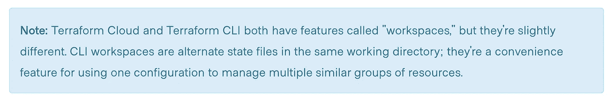

Terraform 云工作空间是这样描述的:

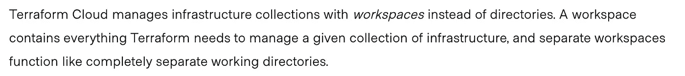

我明白他们在说什么…但最终每个工作空间仍然有一个状态，它们可以互换工作，所以我真的不明白为什么 Terraform Cloud 工作空间不是备用状态文件。我想这是因为在 TF Cloud 中,“工作空间”也意味着与之相关的产品特性，但是它的措辞很奇怪。无论如何，要了解工作区是如何工作的，最好先在 TF Cloud 控制台中设置一个工作区，这会给出以下设置屏幕:

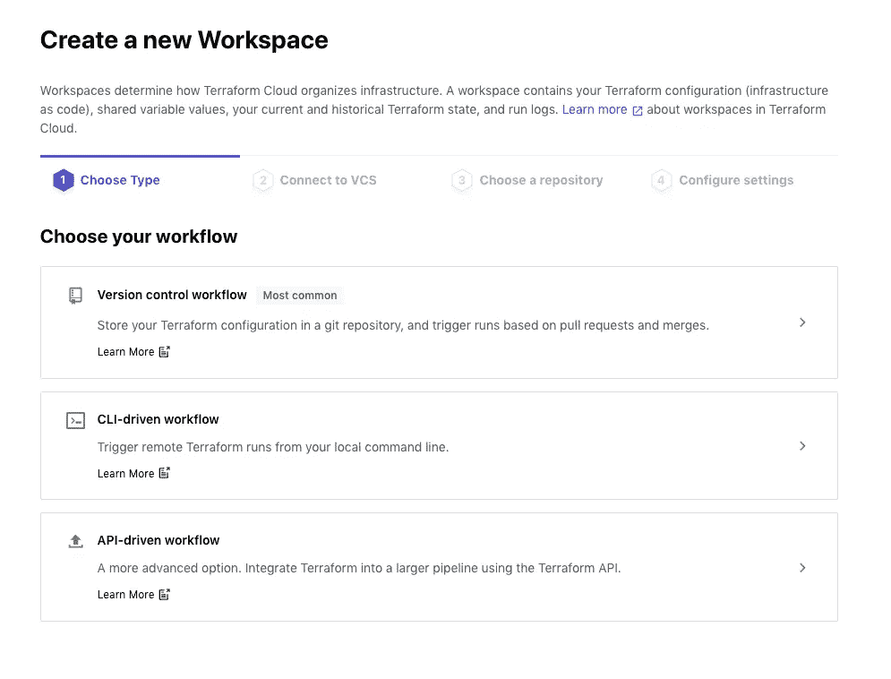

有三个选项可供选择。各有利弊。让我们检查一下。

## VCS 工作区

VCS 工作区是迄今为止最容易设置的。它为您处理大量自动化工作。无需添加您自己的构建步骤，Terraform Cloud 将克隆您的存储库，运行一个计划，并在计划通过后提供一个漂亮的绿色检查(哪个开发人员不喜欢绿色检查标记呢？):

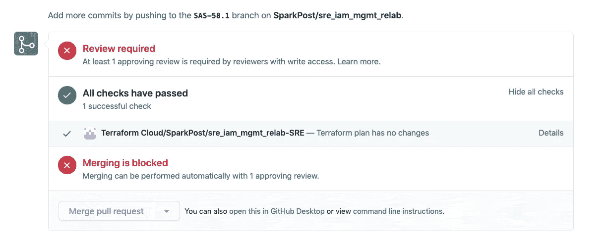

如果您的存储库有子模块，只要提供了令人满意的 ssh 密钥，它也会处理这个问题。一旦 PR 合并，它将开始应用运行，这必须在 Terraform 云控制台中批准(如果需要)。这个选择有很多优点。这可能是设置 TF Cloud Automation 最简单的方法，它可以防止从控制台进行应用，而您可能想要限制这种应用。然而，这也有点限制，而且*也有一些缺点。*

## VCS 骗局

如前所述，您将无法从命令行运行应用程序，这可能是您所希望的，但它也有很大的局限性。TF Cloud *没有*为您提供在构建脚本中与计划/应用步骤一起运行额外代码的选项(其他一些 TACOS 有)，因此您可能希望选择更加手动的 CLI 方法来为您提供灵活性。

此外，如果您只在版本控制中的一个主要分支上工作，您将不能真正地按照您自己的方式将变更从一个环境提升到下一个环境。当 PR 被合并时，所有的申请被一次排队。对于具有多分支 git-flow 设置的存储库来说，这并不是一个问题，例如“开发”、“暂存”和“主”。然而，如果您依赖 CI/CD 管道来连续地对每个环境进行变更，这并不太好。对于一个主分支和多个工作区，不能保证顺序。运行以您在 TF Cloud 控制台中批准它们的任何顺序发生。假设您进行了合并，测试和试运行环境开始运行，并等待您在每个环境上点击“approve”以启动应用。您可以点击“运行:测试前的登台环境”,这是不允许的。此外，考虑到所有运行都是排队的，并且 TF Cloud 有并发限制，也有可能您会被迫在测试之前应用生产，因为测试卡在了队列中！

此外，由于 VCS 工作区仅包含 PR 中计划结果的链接，因此所有用户都必须拥有一个帐户才能查看该计划。如果您更多地手动运行您的计划，您可以在注释中将计划输出到 github，这只是流程的一部分。出于这些原因，我将在余下的演示中选择 CLI 工作区(另外，VCS 工作区也很容易理解)。

## CLI 工作区

CLI 工作区更需要手动操作，因为您必须运行一个计划并在您的 CI 环境中进行应用，但它让您能够更好地控制应用的时间，而不是在合并后立即进行。在只有一个主要分支的情况下，您可以构建一个部署管道，将变更依次应用到您的每个工作区。此外，您可以添加额外的步骤，比如在应用脚本之后进行冒烟测试。使用 VCS 选项时，您必须在申请后使用 webhook 来添加额外的自动化和检查。

然而，设置更加复杂，您需要添加一个 TF Cloud 令牌作为 Github 操作的秘密(或者您用来运行 Terraform 的 CI 工具)。

## API 工作区

API 工作区并不是*真正的*一种独立类型的工作区。您可以从命令行(如 CLI 工作区)应用它们，并且可以在 CLI、API 或 VCS 工作区上使用`/run` API 端点。据我所知，CLI 和 API 工作区的设置完全相同。我认为 TF Cloud 只是将它作为一个选项包含在 builder 中，以指出使用 API 调用运行您的 Terraform 是一个功能。请注意，创建带有工作区的应用运行如下所示:

```
export TOKEN="<your token>"
curl \
  --header "Authorization: Bearer $TOKEN" \
  --header "Content-Type: application/vnd.api+json" \
  --request POST \
  --data @create_run.json \
  https://app.terraform.io/api/v2/runs
```

您的数据在哪里:

```
{
  "data": {
    "attributes": {
      "is-destroy": false,
      "message": "This is an API driven run"
    },
    "type":"runs",
    "relationships": {
      "workspace": {
        "data": {
          "type": "workspaces",
          "id": "id-xxxxxxxxx"
        }
      }
    }
  }
}
```

然而，只有上面的初始设置，这将只适用于 VCS 的工作空间。为了进行远程运行，TF Cloud 需要 terraform 资源文件来运行并与状态进行比较。VCS 工作区的优势之一是每次运行时，TF Cloud 都会从您的版本控制提供商那里获取文件。CLI 工作区将要求您[上传带有您的 Terraform 代码的 zip 文件](https://www.terraform.io/docs/cloud/run/api.html)形式的“配置”。

# 地形改造

在 TF Cloud 控制台中点击来设置你的工作空间是相当简单的，但是这不是非常可重复的，所以我做了这个小的 Terraform 模块来完成它。像这样的“Terraforming Terraform”实际上是 Terraform Cloud 是一个好选择的原因之一，但其他 TF 自动化解决方案也提供提供商。

以下是使用 Terraform 云提供商的工作空间资源示例:

这是我创建的通用模块(顺便说一下，它位于演示库的`workspaces`部分):

正如你所看到的，它还延伸到一个名为“tf-cloud-variables”的子模块，这是我创建的一个模块，用于创建 Terraform 云变量，可以选择从 AWS SSM 参数存储中提取敏感数据。该模块看起来有点像这样:

当然，它去掉了一堆东西。你可以在回购中看到完整的模块。重点是允许我将变量&环境变量声明包含在我的工作区声明中，如下面的 tfvars 文件示例所示:

为了节省空间，我删除了另外两个工作区，但是除了环境值/工作区名称之外，它们完全相同。通过将`vcs_repo`设置为空，工作区就变成了 CLI 工作区。没有办法选择 CLI 或 API(这使我认为它们是一回事)。如你所见，我在这里包含了两个变量:`environment`和`region`，它们将在前面的模块中用来创建局部变量:`workspace`，这将允许模块为它正在运行的环境提取正确的配置。

但是，在设置工作空间之前，需要添加 Terraform 云提供商:

`tfe_token`将需要是一个[团队](https://www.terraform.io/docs/cloud/users-teams-organizations/teams.html)或[用户](https://www.terraform.io/docs/cloud/users-teams-organizations/users.html)令牌，可以在 TF Cloud 应用程序上创建。我将这个变量添加到我的 gitignore 中的 secrets 文件中，名为 secrets.auto.tfvars。

应用 workspaces 模块后，您应该会看到它们在 TF Cloud 控制台中创建(以及在您的 terraform 命令行输出中):

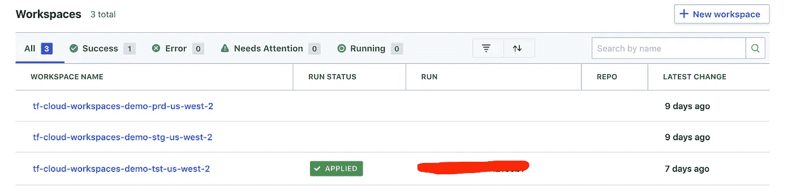

(“应用的”部分还没有出现，但是我在创建初始工作空间后拍了这张照片)。

顺便说一句，我没有为这个工作空间模块设置后端，但讽刺的是，您可能必须首先在控制台中这样做，或者创建没有工作空间的工作空间模块的工作空间，然后在 fact… meta 之后添加它。

# Terraform 云后端

现在工作区已经设置好了，我们实际上可以开始使用它们了！为此，我们将返回 S3 模块，添加 Terraform 云后端，如下所示:

这将取代你目前使用的后端。需要注意的一点是`prefix`设置。这就是 Terraform Cloud 为单个模块设置多个工作区的方式。当您运行`terraform init`时，任何以上述前缀`tf-cloud-workspaces-demo-`开头的工作区都将是一个选项。

然而，在运行`plan`之前，您还需要用令牌设置您的`.terraformrc`配置。这可以通过运行`terraform login`或者将以下内容复制到您的主目录中的一个名为`.terraformrc`的文件中来完成

```
credentials "app.terraform.io" {
  token = "<your token here>"
}
```

接下来，当您运行`terraform init`时，您将看到以下输入:

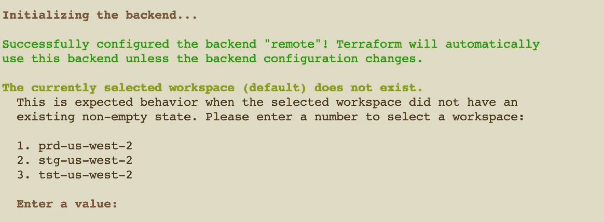

从这里，您可以选择要在本地运行计划的工作空间。

## 本地工作区

工作区应该在 TF Cloud 服务器上的一致环境中运行(这可能是他们喜欢区别于“CLI”工作区的另一个原因)。因此，即使你在本地运行你的计划，它们实际上是从一个 TF 云服务器流结果。然而，如果你想在你自己的计算机上运行 Terraform，而*只是*使用 TF Cloud 进行状态管理，你可以通过将你的工作空间设置为“本地”来实现。

# IAM &承担角色提供者

在部署这些资源之前，还有一个必要的步骤。我将使用辊运行此 Terraform，因为这将是自动化的，我不会使用我自己的凭证。因为我不会使用 Terraform Cloud 的本地代理，所以我需要提供一些单独的凭据。这意味着创建一个有权限创建/更新指定存储桶和存储桶对象的用户。或者，更准确地说，是一个具有创建/更新存储桶权限的角色，Terraform 用户能够承担这个角色。因为我很懒，不想为最少的 perms 而工作，所以该假定角色的策略资源如下所示:

这里的`for_each`遍历每个工作区，我之前提到的是`tst-us-west-2`、`stg-us-west-2`和`prd-us-west-2`。该策略的角色如下所示:

如这条线所示:

```
AWS = data.aws_iam_user.deployment_user.arn
```

该角色只能由控制台中定义的用户担任。既然已经创建了角色和用户，模块的 AWS 提供者可以像这样更新:

正如您在上面看到的，我在每个 Terraform Cloud 工作区中提供了`AWS_ACCESS_KEY_ID`和`AWS_SECRET_ACCESS_KEY`环境变量(使用我之前创建的 perms 用户的密钥来承担部署角色)。

最酷的是，运行 Terraform 的人甚至不需要 AWS 权限来运行计划/应用程序，他们只需要权限来访问 Terraform Cloud 中的环境。这大大减少了为改变基础设施而需要的许可证数量。

这里的另一个选项是通过环境变量`AWS_ACCESS_KEY_ID`、`AWS_SECRET_ACCESS_KEY`和`SESSION_TOKEN`为所承担的角色提供临时凭证。那么永久凭证就没有必要了，可以从 aws 提供者中删除“assume_role”。然而，这也需要一些自动化的过程来每天更新临时凭证，我不会在这里这样做。

既然提供者已经就位，我可以通过在本地运行一个计划来测试它，开始是这样的:

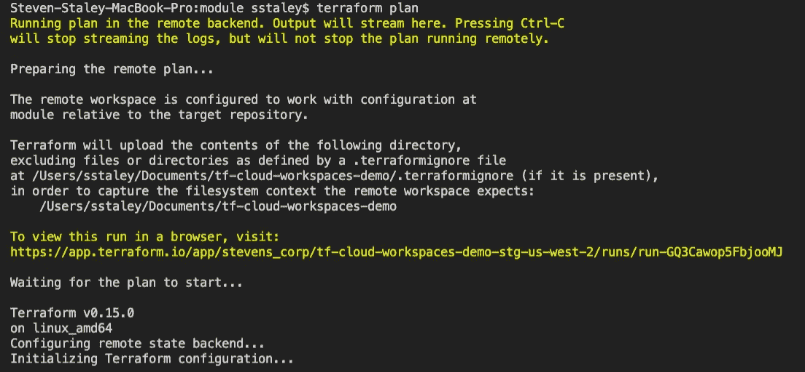

快速浏览显示，该计划正在使用 Terraform v0.15 的 linux 机器上运行，并且提供了一个漂亮的链接，可用于共享该计划的输出。接下来，我们得到了我们的计划以及成本估算:

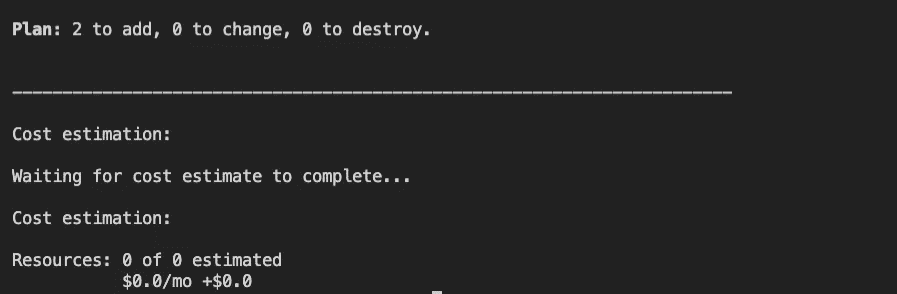

# Github 操作

现在，全自动部署的所有部分都应该就绪了。要开始 Github 操作，您需要将一个 TF Cloud 令牌添加到存储库的秘密中。你可以通过导航到你的仓库中的**设置**->-秘密来找到 Github 的秘密部分。我将把这个令牌命名为`TF_CLOUD_TOKEN`。

## 计划

创建 PRs 时，我们需要一个操作来为每个工作区运行一个计划。Github Actions 的工作流程是这样的(正如我之前提到的，我在演示的这一部分使用了本教程的):

和以前一样，我删除了`stg`和`prd`任务以节省空间，因为它们完全相同。为了澄清这里发生了什么，`on`部分声明下面的作业列表将在针对主分支的拉请求时被触发。`paths`指示将监视哪些文件夹路径的更改。另一个重要的部分是定义了一个环境变量的`env`部分:`TF_WORKSPACE`。这告诉 Terraform 选择哪个工作空间。如果没有这个，`init`将需要手动输入。

随后，作业`plan-tst`执行以下动作:

*   结帐(结帐回购)
*   设置 Terraform(下载所需的 Terraform 版本)
*   Terraform Init(初始化工作空间)
*   地形格式
*   地形图
*   更新拉式请求(将计划添加到拉式请求中)
*   地形计划状态(如果计划失败，退出 1)

这些步骤相当简单，但是有一些事情需要强调。首先，`cli_config_credentials_token:${{ secrets.TF_CLOUD_TOKEN}}`提供了我作为秘密添加到 Github repo 中的令牌。其次，在作业级设置的环境变量`TF_WORKSPACE`将工作空间设置为`tst-us-west-2`。这告诉 Terraform 使用哪个工作空间，否则`init`将需要输入。最后，`continue_on_error`允许作业继续进行，即使当`plan`或`fmt`命令失败时，这些结果可以作为注释的输出。此外，我在`module`目录中过滤了作业，因此只有对模块的更改才会启动这些计划。

现在，一旦创建了 PR，这些计划将运行并将其结果发布到 PR:

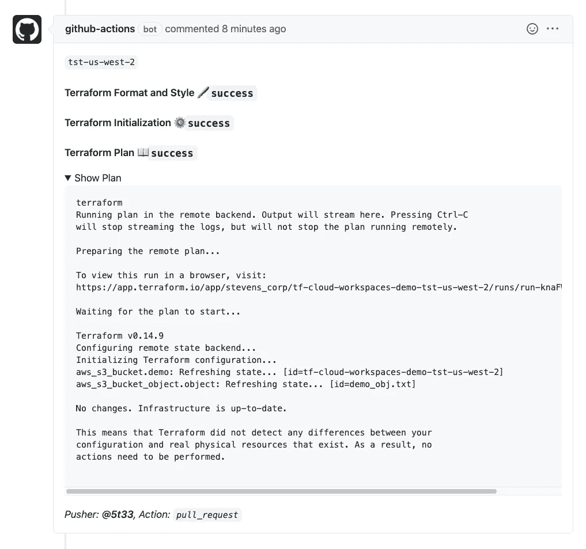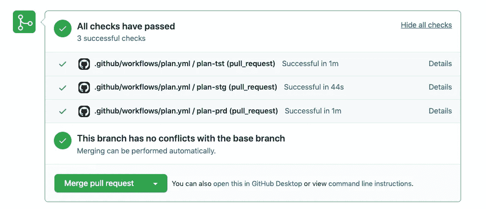

## 适用

上面的 GH 操作提供了一个蓝图，可以很容易地进行调整，以在每个工作区中连续运行应用程序，并在操作之间进行批准。当 Terraform Apply 在 TF Cloud workspace 上运行时，您可以选择从 TF Cloud 控制台批准它:

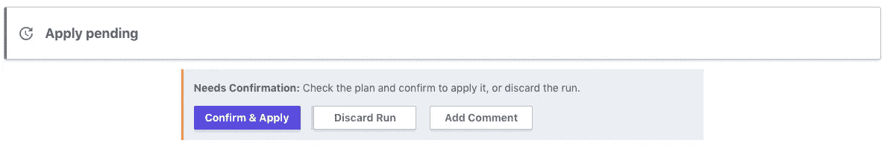

因此，实际上没有必要添加额外的逻辑来增加环境之间的审批门。此外，由于 Terraform Cloud 有自己的访问控制，所以您不需要依赖 Github 授权来获得批准。如果您的 Github 控制不像您希望的那样严格，这对于批准基础设施变更很有帮助。

为了更新应用的 Github 操作，我首先将`on`条件更改为`push`，这意味着工作流将在 PR 合并时启动。第二，我将把`need`配置添加到`stg`和`prd`作业中，这样它们在开始之前会等待对方完成。如果一个失败了，下一个就不会开始。最后，我将删除`fmt`命令和 PR 注释，因为它们对于应用阶段是不必要的。最后，我们将得到类似这样的结果(这次我将所有工作区都留在了中):

现在，当我合并一个 PR 时，工作开始了:

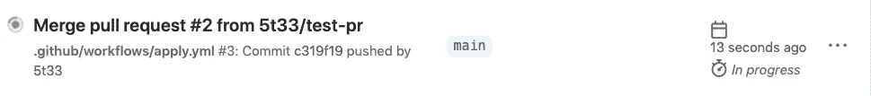

然后我可以在 TF Cloud 控制台中批准:


应用更改后，我看到下一个作业开始了:

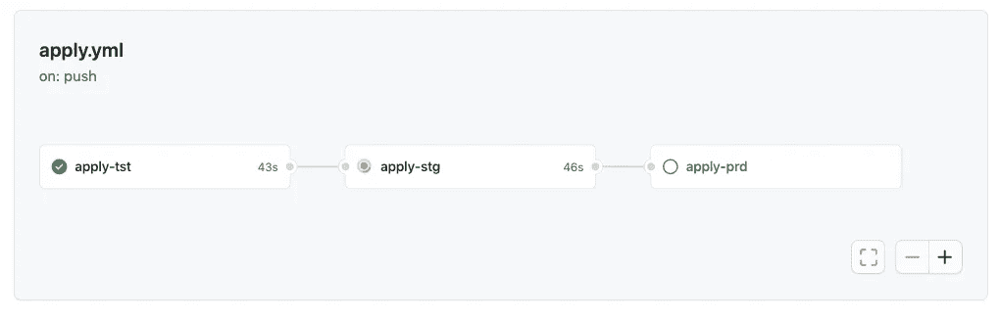

## 审计线索

Terraform Cloud(和其他 TACOS)的另一个很酷的方面是，每次基础架构更新都会记录状态差异，因此在应用后，您可以返回并查看您的状态是如何变化的:

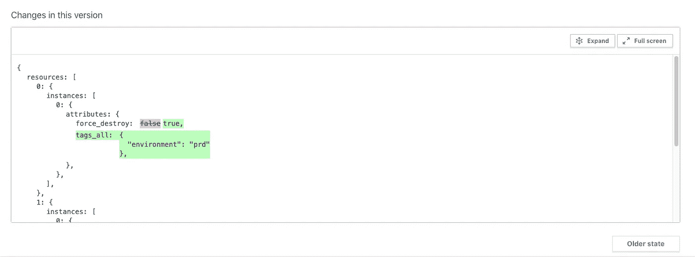

# 哨兵

Sentinel 是 Hashicorp 的政策，作为代码语言，内置于他们的一些产品中。通过 Terraform Cloud，Sentinel 允许您指定计划必须遵守的规则才能通过。您可以对几乎任何想要的东西实施限制:EC2 大小、公共 S3 桶、开放安全组、宽 IAM 策略等。事实上，因为 TF Cloud 也进行成本估算，所以您也可以强制实施成本限制。这些强制措施可以是“建议性的”、“硬性强制的”或“软性强制的”。

与工作空间一样，Terraform Cloud provider 允许您使用 Terraform 创建 Sentinel 策略。该资源如下所示:

这些策略可以应用于单个 VCS 存储库、特定工作区，或者全局应用于所有工作区。我将创建一个全局策略，以确保所有存储桶都是私有的，如下所示:

`must_not_be_public.sentinel`

该策略通过`tfplan/v2`导入应用于计划输出，过滤所有资源更改，以执行“aws_s3_bucket”资源上的“创建”或“更新”操作。然后检查公共选项的`acl`属性。然后，对 bucket 对象执行相同的过程。最后，检查每个列表的长度是否为 0。这发生在`main`规则中，这是策略的入口点(顺便说一下，这个策略最初来自 Hashicorp 演示，但是我怎么也找不到它)。

## 测试哨兵

要知道这个策略是否真的如我们所愿，需要对它进行测试，这就需要模拟数据。您可以从 Terraform cloud 中运行的任何计划中下载数据，方法是导航到该计划并点击“下载 sentinel 模拟”按钮:

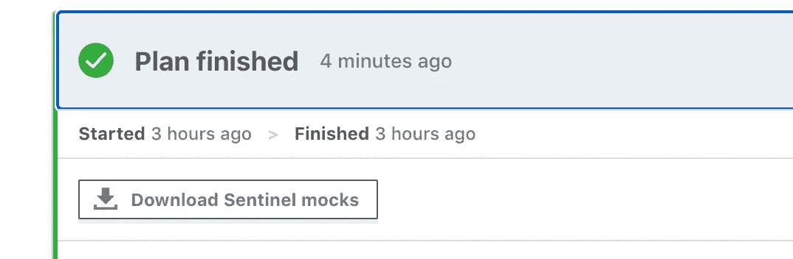

**注意:这被称为“模拟”数据，但似乎包含敏感值。确保在添加到您的版本控制之前扫描它们。**

下载完成后，您可以用 tar 解压它们:

```
tar xzf ~/Downloads/run-xxxx-sentinel-mocks
```

提供了各种文件，其中一个将被称为`mock-tfplan-v2.sentinel`。这对应于使用`tfplan/v2`时可用的数据。这是我用来嘲笑我的哨兵测试计划的。这里需要注意的一点是，这些模拟计划中包含了敏感数据，在提交之前，您需要去除这些敏感数据。

Sentinel 使用文件结构来确定测试的位置。您的 sentinel 策略应该在您的目录的底部，并且所有的测试应该在“test”文件夹中，就像这样:`test/<your_policy_name>/*.json`。每个 sentinel 策略都有自己的文件夹，其中可能包含多个测试。按照这种格式，我有以下文件结构:

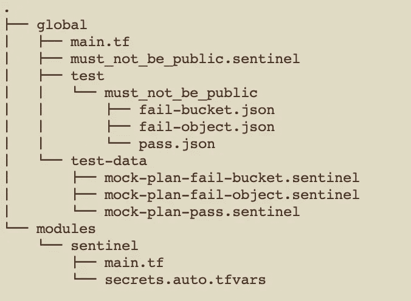

`global`文件夹保存全球应用的 sentinel 策略。如果我要包含工作区或回购特定策略，我会将它们包含在`workspaces/<workspace name>`或`repository/<repository name>`文件夹中。`module`保存将在多个文件夹中共享的共享 Terraform 模块。

文件中的每个测试如下所示:

`fail-bucket.json`:

```
{
  "mock": {
    "tfplan/v2": "../../test-data/mock-plan-fail-bucket.sentinel"
  },
  "test": {
    "main": false
  }
}
```

`mock`部分指向被改变以使公共桶的标记检查失败的模拟数据，并且`test`部分断言对于所提供的模拟数据，主检查为假。

运行`sentinel test`后，我得到以下输出:

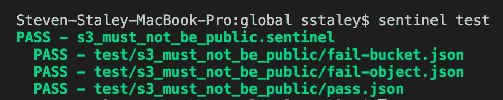

我编写的三个测试都通过了，所以我可以继续部署了。

## 地形哨兵

与前面的 workspaces 模块一样，我还创建了一个 sentinel 模块来集中和重用我的 sentinel 代码。sentinel 策略 Terraform 资源如下所示:

```
resource "tfe_sentinel_policy" "test" {
  name         = "my-policy-name"
  description  = "This policy always passes"
  organization = "my-org-name"
  policy       = "main = rule { true }"
  enforce_mode = "hard-mandatory"
}
```

这些策略被添加到策略“集合”中，如下所示:

```
resource "tfe_policy_set" "test" {
  name          = "my-policy-set"
  description   = "A brand new policy set"
  organization  = "my-org-name"
  policy_ids    = [tfe_sentinel_policy.test.id]
  workspace_ids = [tfe_workspace.test.id]
}
```

策略可以应用于一组工作区，或者使用`global`标志在所有工作区中全局应用(在这种情况下，不提供工作区 id)。与其他 Terraform 云提供商资源一样，我已经将这两者捆绑到一个模块中，这次我不会深入讨论这个模块，但它允许我将策略集声明为工作区名称到策略的映射，如下所示:

这将导致创建以下资源:

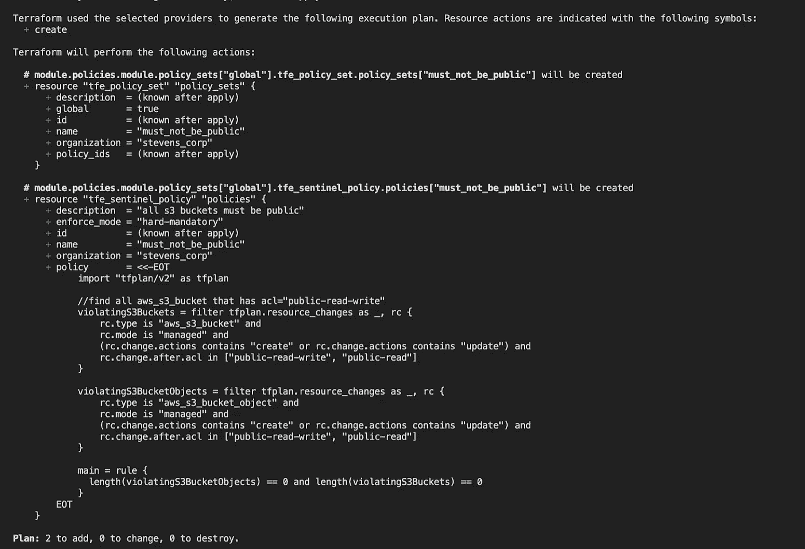

现在，我可以通过推动一项将我的存储桶公开的更改来测试该策略。让我们看看当我在 s3 资源上将 acl 设置为“public-read”时会发生什么，如下所示:

```
resource "aws_s3_bucket" "demo" {
  bucket = "tf-cloud-workspaces-demo-${local.workspace}"
  force_destroy = var.variables[local.workspace].force_destroy
  tags =  var.variables[local.workspace].tags
  acl = "public-read"
}
```

打开公共读取选项后，当我运行一个计划时，我突然得到这个输出(在两张照片中，因为我的屏幕不够大):

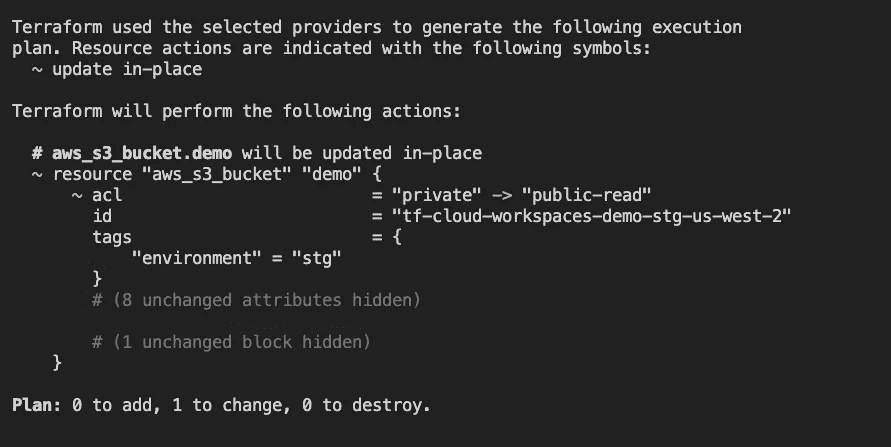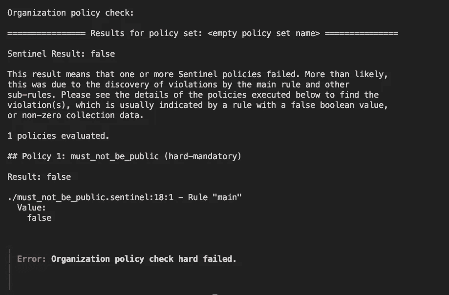

它没有通过检查！虽然“空策略集名称”很奇怪…但这似乎没什么大不了的。只是为了好玩，我也会把这个推给 Github 的一个 PR，看看这个计划在那里也失败了。

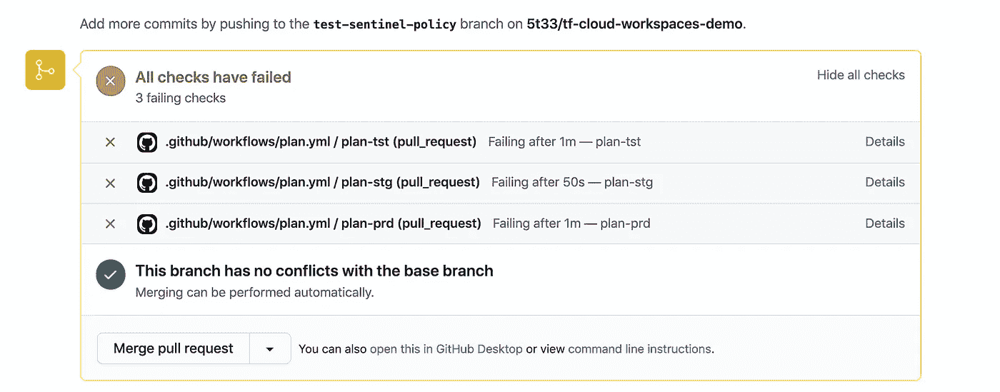

就像在本地运行一样，我所有的 Github 检查都失败了。成功！或者..犯罪..失败…我猜。

# 结论

如你所见… TF 云！很好。它做的事情。

我认为这些工具对大型组织非常有用，这样开发人员可以轻松地共享运行，拥有一致的部署环境，实施基础架构策略，监控成本，提供状态审计跟踪，并可能通过 API 调用运行自动化的基础架构更改。然而，即使对于一个较小的组织来说，让 Terraform Cloud 用锁而不是 S3 桶和 dynamodb 表(或者您选择的任何方式)来管理您的远程状态也是不错的。S3 引发了一些引人注目的安全事件，因此将这一责任推给托管服务可能会有所帮助。您还可以随时添加远程执行和 sentinel 策略等功能。

也就是说，我在开头列出的一些其他服务也有很强的产品，可能会超过 Hashicorp 的价格。此外，它们中的许多允许您用 OPA 编写策略，OPA 是开源的，因此即使您停止使用该服务，您仍有可能使用它们。Sentinel 不提供这个选项。其中一些甚至可能提供对`-tvfars`的支持，这样你就不必编辑你的代码来使用单个文件夹中的多个工作空间。

我希望这是信息丰富的，并提供了关于 Terraform Cloud 基础设施自动化的广泛概述。如果您有任何问题或意见，请随时通过 linkedin 联系 https://www.linkedin.com/in/steven-staley/ T2。