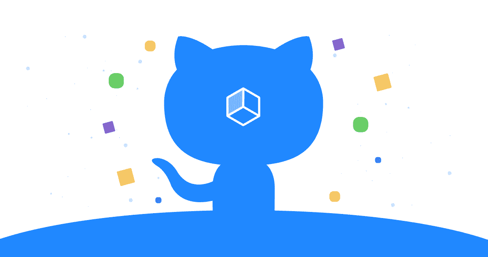
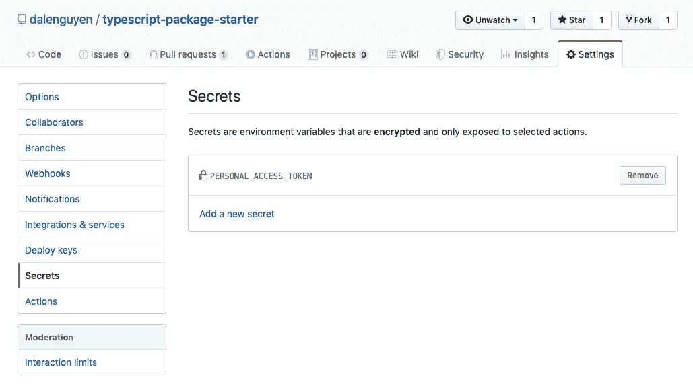
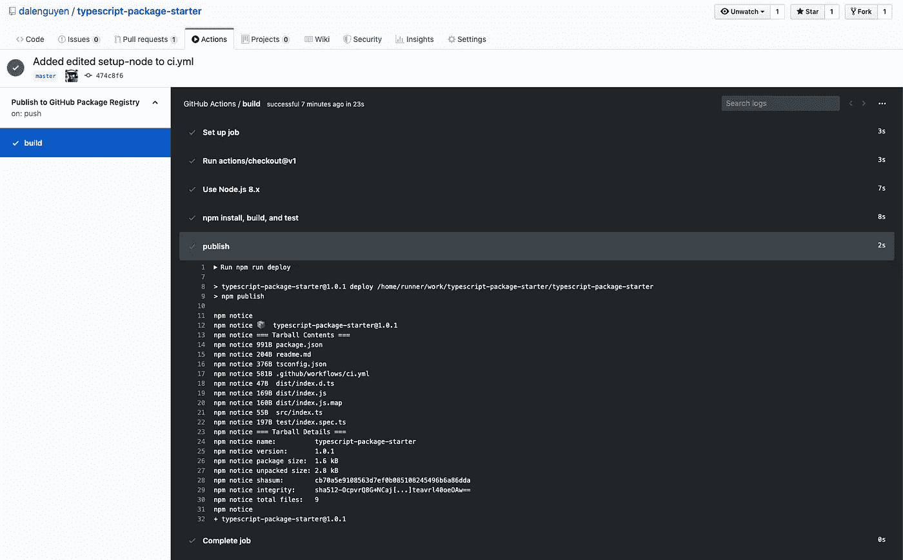

# Github 包和 Github 动作的持续集成和部署(CI/CD 管道)

> 原文：<https://itnext.io/continuous-integration-and-deployment-ci-cd-pipeline-with-github-package-and-github-actions-24547f98c85c?source=collection_archive---------5----------------------->



来源 Github.blog

在之前的帖子中，我向你展示了如何创建你的第一个 Github 包 。我希望你玩得开心。在本文中，您将了解如何将 CI/CD 管道添加到流程中。

这意味着每次你推或者合并到 master， [Github Actions](https://github.com/features/actions) 将会触发管道，运行你的测试用例，并且自动将你的包部署到 [Github 包注册表](https://github.com/features/package-registry)。从现在开始，您可以管理您的回购中的一切—这有趣吗？:)

在开始之前，您需要将您的[个人访问令牌](https://help.github.com/en/github/authenticating-to-github/creating-a-personal-access-token-for-the-command-line)添加到环境中。



这个过程非常简单。一旦你准备好了你的包，你需要做的就是在你的 repo 中创建一个 ***ci.yml*** 文件。记得在脚本中更改我的用户名。

```
// .github/workflows/ci.ymlname: Publish to GitHub Package Registryon: [push]jobs:
  build:runs-on: ubuntu-lateststeps:
    - uses: actions/checkout@v1
    - name: Use Node.js 8.x
      uses: actions/setup-node@v1
      with:
        registry-url: [https://npm.pkg.github.com/](https://npm.pkg.github.com/)
        node-version: 8.x
        scope: '[@dalenguyen](http://twitter.com/dalenguyen)'
    - name: npm install, build, and test
      run: |
        npm install
        npm run build --if-present
        npm test      
    - name: publish
      env:
        NODE_AUTH_TOKEN: ${{ secrets.PERSONAL_ACCESS_TOKEN }}
      run: |
        npm run deploy
```

如果您想要在合并到主文件时触发构件，您可以使用:

```
on:
  pull_request:
    branches:
      - master
```

在您推送或合并到 master 之后，您可以在 Actions 选项卡下检查构建



等一切都过去了，我的包就换成了更新版本。


剧本由 [hongsq90](https://github.com/honsq90) 通过 **#Hacktoberfest** 事件贡献。