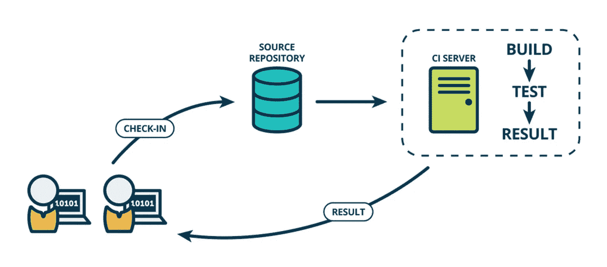
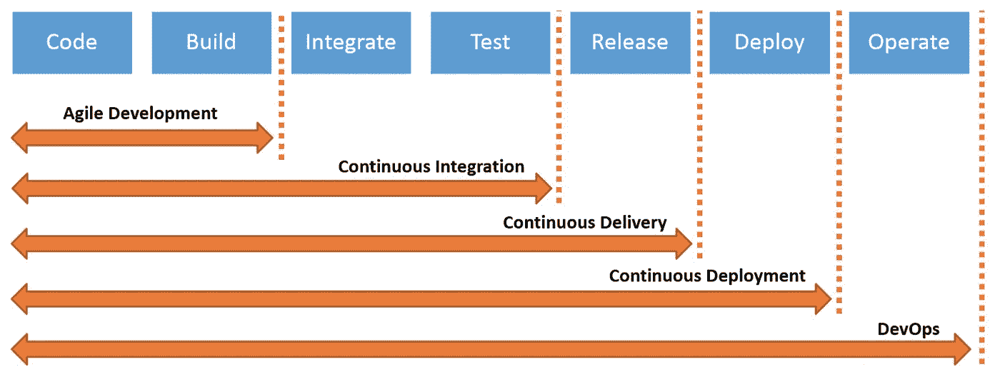
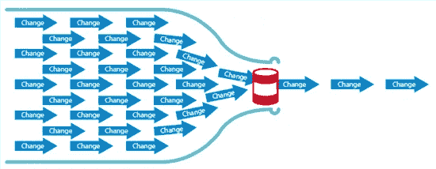
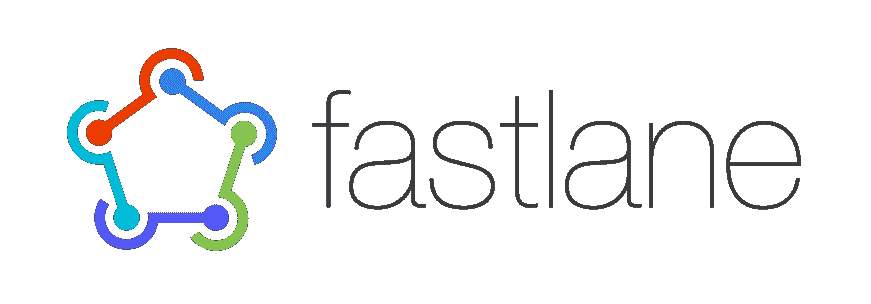
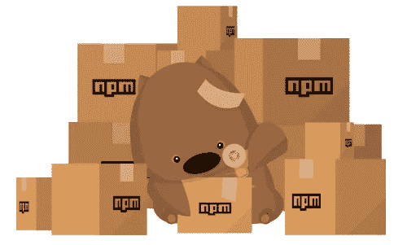
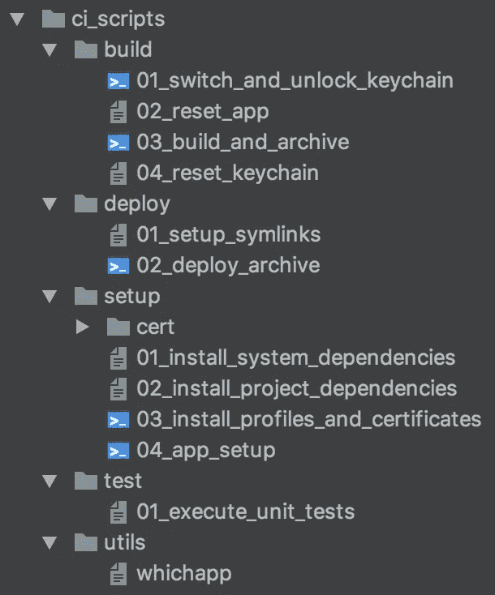
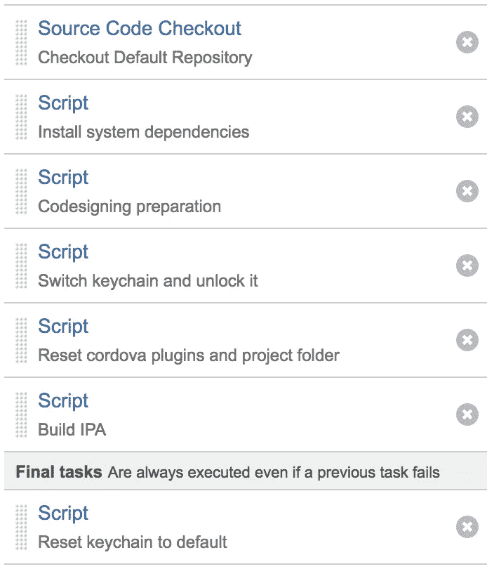
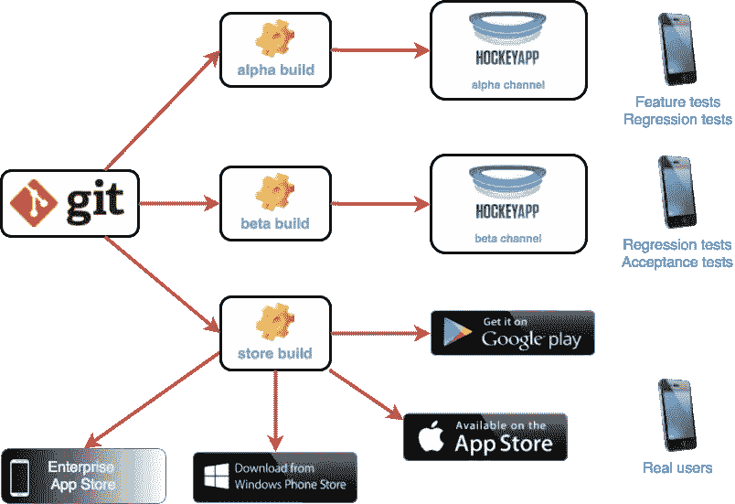
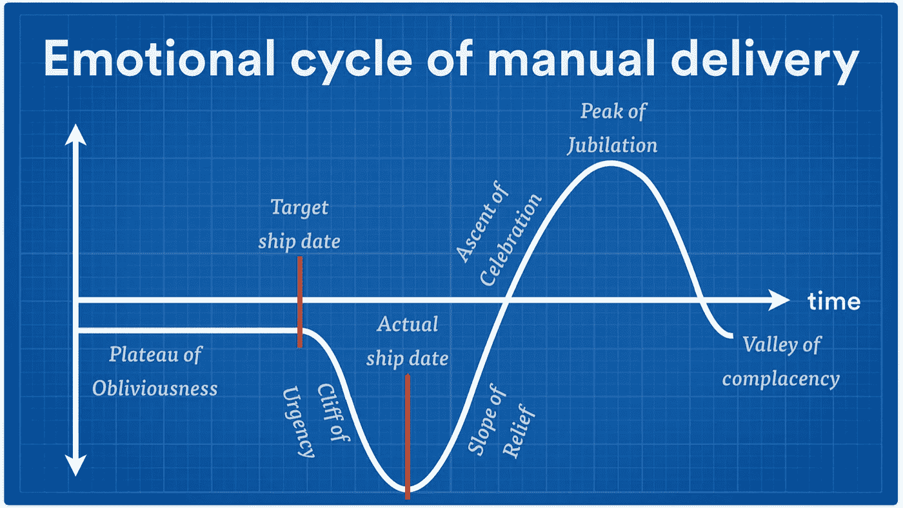

# 为您的企业混合移动应用提供持续集成和部署

> 原文：<https://itnext.io/continuous-integration-and-deployment-for-your-enterprise-hybrid-mobile-apps-51a57501abf0?source=collection_archive---------1----------------------->

最近，我花了一些时间为一个企业客户设置持续集成(CI)和持续交付(CD)。我自动化了构建、签名/签名和分发操作，我们必须每天为我们的混合移动应用程序执行这些操作。无论你使用什么平台来构建你的移动应用程序，ionic ， **cordova** ， **nativescript，flutter** 或者 **react native** ，它们在构建和发布阶段都有共同的实践和关注点。

我想分享我的经验，并希望能激励那些正在建立或维护 CI/CD 的人。虽然这是一篇相当技术性的文章，但我也将触及商业价值，以吸引企业主和经理。所以，请原谅我。

# **为什么您应该开始使用连续交付管道？**

您可能有太多的手动过程和软件交付的瓶颈。每天，由于您在上下文切换、手动构建、修复构建和依赖性问题、处理 iOS 代码签名问题、手动归档、手动部署、手动重新打包、代码重新签名等方面所花费的时间和精力，它会降低您交付特性的效率。

通过在您的组织中引入 CI/CD pipeline，您可以提高混合移动应用的质量，加快交付并实现流程自动化。

在继续之前，我想回顾一下持续集成、持续交付和持续部署术语。我认为澄清它们是什么以及它们之间的联系是很重要的。事实上，我想强调它对您的业务的实际意义。

## 持续集成

> 持续集成——频繁地将新的或更改的代码与现有的代码存储库进行集成的实践——应该足够频繁地发生，以便在提交和构建之间不留下干预窗口，并且在开发人员没有注意到错误并立即纠正它们的情况下不会出现错误。

这对您的应用和团队意味着什么

*   通过测试单元功能确保代码质量
*   防止编译错误
*   代码林挺
*   早期检测外部依赖关系的可能问题，如 npm 包和插件
*   增加您的代码覆盖率
*   更快的构建时间
*   保护一个稳定的、工作的开发版本
*   向每个人显示构建结果的透明性
*   部署自动化

## 持续交付/部署(CD)

> **持续交付**是持续集成的扩展，以确保您能够以可持续的方式快速向客户发布新的变更。这意味着除了自动化您的测试之外，您还自动化了您的发布过程，并且您可以通过点击一个按钮在任何时间点部署您的应用程序。
> 
> **持续部署**是持续交付的下一步:通过自动化测试的每一个变更都被自动部署到生产中。持续部署应该是大多数不受法规或其他要求约束的公司的目标。

这对你的 iOS 应用和你的团队意味着什么

*   不再有关于开发和发行证书的 xcode 代码签名问题，因为你不需要在我们的本地计算机上构建
*   开发人员不再需要切换上下文，就可以为测试人员、用户和利益相关者提供 QA 版本
*   不再有因系统工具和依赖项不匹配而导致的构建错误
*   测试人员无需再等待在设备上安装特定的构建/修订版本
*   不再需要通过重建、重新包装和重新签署生产企业证书来为生产进行手动发布准备
*   我们的客户和利益相关者不再需要为了获得构建/版本而在办公室停下来——这要归功于测试版应用分发
*   任何开发人员或测试人员都能够从一个分支/修订中远程触发一个构建，并为 QA 或 PROD 部署它(如果您遵循连续交付方法)
*   任何开发人员或测试人员都能够通过推送新代码或合并 PR 来远程触发构建，并为 QA 或 PROD 部署它(如果您遵循持续部署方法)

从现在开始，我将重点介绍为您的混合应用程序设置 CI/CD 的技巧和诀窍。为了避免复杂性，在我的例子中，我只提到 iOS 平台上的 **ionic 应用**。

# 找到瓶颈并自动化手动流程

您在设置 CI 环境时可能遇到的一个障碍可能是您必须实现自动化。它可以是协同设计操作、重新设计操作、重新打包或您需要上传文件或提交表单的网页。

## 分析

从分析交付管道上的手动流程开始。这是您必须提交的变更请求吗？是 QA 的发行版吗？是辞职操作吗？定义它们并思考自动化它们的方法。

## 使用 fastlane 实现自动化

整合[快车道](https://fastlane.tools/)！浪子是一个很棒的平台，专注于解决移动开发环境中存在多年的问题。

*“fast lane*处理繁琐的任务，让您不必如此”——fast lane . tools

它可以帮助您组织和维护代码签名的配置文件和证书，集成测试版部署等等。

## 使用您自己的脚本实现自动化

对于不能通过 fastlane 或任何其他有用的平台或库实现自动化的流程，您可能需要编写自己的脚本。

在编写自己的 node.js 脚本之前，一定要浏览一下 npmjs.com

您可能需要重新打包应用程序、重新签名应用程序、将应用程序上传到网页或企业 MDM 提供商。在这种情况下，您应该创建自己的 bash 可执行文件，以便自动化日常操作。浏览 npm 包并使用 node.js 构建您的脚本可能是明智的，因为它是一个大型社区，并且可能已经有了满足您需求的包。

“木偶师是一个节点库，它提供了一个高级 API 来控制[无头](https://developers.google.com/web/updates/2017/04/headless-chrome) Chrome 或通过 [DevTools 协议](https://chromedevtools.github.io/devtools-protocol/)的 Chrome。也可以配置成使用全(非无头)铬或铬。”

如果你需要手动处理网页，Puppeteer 是一个非常强大的库，也是一个很好的工具集。它可以是你自动化基于浏览器的过程的最好的朋友。

我使用 puppeteer 来自动化一个重签名操作，我必须将重新打包的应用程序上传到一个 web 表单，并从 Nexus 服务器下载一个重签名的应用程序。

# 设置配置项配置

编译构建一个 iOS 平台的应用包，需要一个我们都知道的 iOS 设备，xcode，代码签名。无论您使用哪种 CI 解决方案，您都需要为您的构建配置确定并指向正确的代理。

确保您已经为您的自动化流程构建了具有正确功能的代理

## **构建代理的先决条件**

定义您的需求，并为 CI 代理设置先决条件和功能。例如，假设你正在开发一个 ionic 应用程序，你已经用 fastlane 和 puppeteer 自动完成了一些任务。您可能需要为您的代理安装 brew、nvm、cordova、xcode、yarn、ionic、ios-deploy、fastlane 和 google-chrome。

您需要确保这些工具安装在您的 CI 代理上。作为构建配置的第一步，明智的做法是检查 CI 系统上是否安装了这些工具，如果没有，就用命令行脚本安装它们！

断言并安装脚本所需的工具

## 管理开发人员和企业分发证书以及 CI 代理上的代码签名

如果你正在为 iOS 开发移动应用，你可能已经知道代码设计是一项具有挑战性的任务。如果你在一个拥有多个产品团队的大型组织中工作，这很难理解，甚至更难维持。

我建议您使用 [fastlane match](https://docs.fastlane.tools/actions/match/) 来管理您团队的发展证书。您还应该使用 *match* 在您的 CI 代理上安装您的分发证书。

如果使用 match，您需要在构建配置中引入一个新步骤，从证书存储库中下载预置描述文件和证书。否则，您可以使用 sigh & cert 从您的 Apple 开发者帐户下载它。以下代码片段是如何在 macOS 构建代理上处理 iOS 代码签名的示例。

下载您的预置描述文件和证书，将它们设置到 CI 上的自定义钥匙串中

*我想在这里指出一个重要的细节。为了让 xcode 在构建期间从钥匙串中获取您的证书，您的钥匙串应该被解锁——参见上面代码片段中的第 7 行。否则，您的构建将被挂在解锁钥匙串提示上。*

## 维护您的配置项脚本

虽然您可以将命令行脚本添加到 CI 的构建配置中，但是我建议您将构建脚本保留在源代码控制系统中。这将更容易开发，审查和维护您的脚本，它将使人们有可能看到修订历史。

维护配置项脚本的文件夹结构示例

## 在构建配置中设置步骤

在构建您的定制脚本之后，您需要将它们分配到您的构建步骤配置中。这里有一个创建基于 Bamboo 的应用程序工件的构建步骤的例子。

一旦您有了您的工件(在我们的例子中是 IPA 文件),您可能想要将它用于 beta 部署。为了实现这一点，您可以引入一个新的部署阶段，并设置与上面类似的构建配置，以部署您刚刚构建的工件。

# 面向持续部署的测试版应用分发

在将应用发布给生产用户之前，测试版应用分发是将应用分发给 QA、关键用户和利益相关者的一种非常好的方式。苹果为商业应用引入了 [TestFlight](https://developer.apple.com/testflight/) ，不幸的是，企业开发者账户无法使用。

然而，对于服务于相同目标的企业来说，还有其他很好的选择。有关第三方测试版分发服务，请参见 [HockeyApp](https://hockeyapp.net/) 、 [Fabric Beta](https://docs.fabric.io/apple/beta/overview.html) 和 [TestFairy](https://testfairy.com/) 。

如果你正在使用 *fastlane* ，你可以利用每个测试服务的预建脚本——参见 [*fastlane beta*](https://docs.fastlane.tools/getting-started/ios/beta-deployment/) 。它内置了 TestFlight、Fabric Beta、HockeyApp 和 TestFairy 的动作。否则，您也可以轻松地与他们的 API 通信，以上传您的包并分发它。

测试版应用版本的分发流程

您可以在您的配置项上设置自动分发阶段，作为您的构建的附加步骤，或者使用您的配置项的部署管道。

在下面，您会看到一个简单的 bash 脚本，它将您的应用程序工件上传到 HockeyApp。HockeyApp 自动将此部署分发到选定的用户组，并相应地发送电子邮件/slack 通知，其中包含您的应用程序的安装链接。

如果您不使用 fastlane，编写自己的测试版应用程序部署脚本并不复杂

# 简单地

虽然这篇文章比我计划的要长，但它仍然是整个管道的概述，有一些深入的主题，如代码签名、CI 配置和自动化流程。

我希望它能帮助您实现流程自动化，并为您的组织启用 CI/CD(如果尚未启用的话)。否则，你可能会感觉到人工分娩的情绪循环。

我们都掉下了紧急悬崖。我理解你。

如有任何问题或备注，请留言！我很乐意听听你旅途中的经历。如果你觉得我的文章有价值，别忘了鼓掌。干杯！