# 使用 GitHub 操作持续集成和部署 Docker 映像

> 原文：<https://itnext.io/continuous-integration-and-deployment-of-docker-images-using-github-actions-7077991bcfde?source=collection_archive---------1----------------------->

## 使用 GitHub 操作自动构建 Docker 映像并将其推送到 Docker Hub

根据 [GitHub](https://docs.github.com/en/actions) 的说法，GitHub Actions 允许你在你的存储库中自动化、定制和执行你的软件开发工作流程。您可以发现、创建和共享操作，以执行您喜欢的任何工作，包括持续集成(CI)和持续部署(CD)，并将操作组合到完全定制的工作流中。

这篇简短的帖子将研究 GitHub 操作的一个简单用例——自动构建一个新的 Docker 映像并推送到 Docker Hub。每当一个新的 Git 标签被推送到 GitHub 存储库时，就会触发一个 GitHub Actions 工作流。

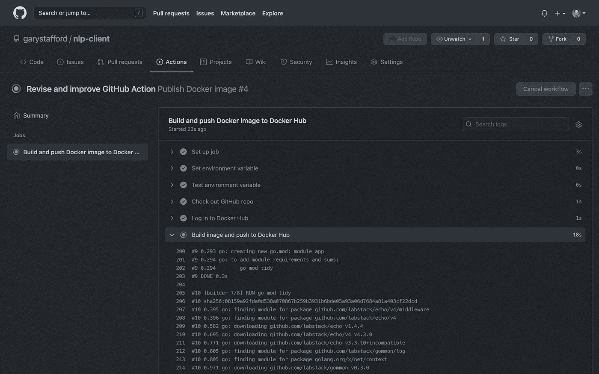

GitHub Actions 工作流运行，基于新的 git 标签的推送

# GitHub 项目资源库

为了演示，我们将使用公共的 [NLP 客户端](https://github.com/garystafford/nlp-client)微服务 GitHub 项目存储库。用 Go 编写的 NLP 客户端是组成自然语言处理(NLP) API 的五个微服务的一部分。我开发这个 API 是为了演示架构原则和 DevOps 实践。API 的微服务旨在作为分布式系统运行，使用容器编排平台，如 Docker Swarm、Red Hat OpenShift、Amazon ECS 和 Kubernetes (EKS、GKE、阿拉斯加)。

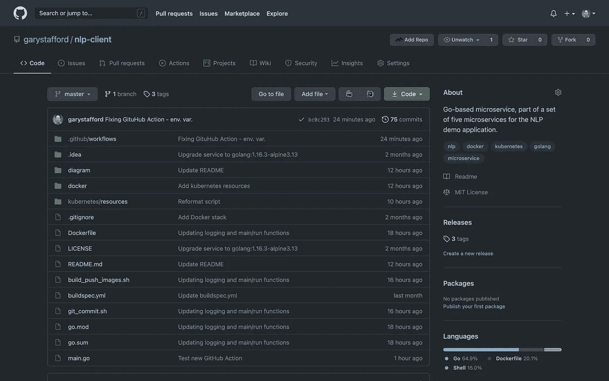

公共 NLP 客户端 GitHub 项目存储库

# 加密的秘密

要将新图像推送到 Docker Hub，工作流程必须登录到您的 Docker Hub 帐户。GitHub 建议将您的 Docker Hub 用户名和密码存储为[加密机密](https://docs.github.com/en/actions/reference/encrypted-secrets)，这样它们就不会暴露在您的工作流文件中。加密机密允许您将敏感信息作为加密的环境变量存储在您的组织、存储库或存储库环境中。您创建的机密将可在 GitHub 操作工作流程中使用。为了允许工作流登录 Docker Hub，我使用我的组织的凭证创建了两个秘密，`DOCKERHUB_USERNAME`和`DOCKERHUB_PASSWORD`，然后在工作流中引用它们。

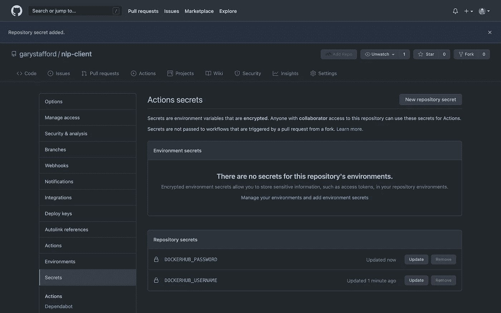

GitHub 项目的“机密”标签中显示的操作机密

# GitHub 操作工作流程

根据 [GitHub](https://docs.github.com/en/actions/reference/workflow-syntax-for-github-actions) 的说法，工作流是由一个或多个工作组成的可配置的自动化流程。您可以创建一个 YAML 文件来定义您的工作流配置。GitHub 包含许多可搜索的[代码示例](https://docs.github.com/en/actions#code-examples)，您可以使用它们来引导您的工作流开发。对于这个演示，我从 GitHub 操作指南中显示的例子开始，[发布 Docker 图像](https://docs.github.com/en/actions/guides/publishing-docker-images)，并修改它以满足我的需要。工作流文件被检入到项目存储库的`[.github/workflows](https://github.com/garystafford/nlp-client/tree/master/.github/workflows)`目录中。

## 工作流开发

[Visual Studio Code](https://code.visualstudio.com/)(VS Code)是一个全功能、可扩展、开源的 IDE，用于软件开发和编写基础设施 as Code (IaC)。VS 代码有一个庞大的扩展生态系统，包括 GitHub 动作。目前，我正在使用 Christopher Schleiden 的 GitHub Actions 扩展。

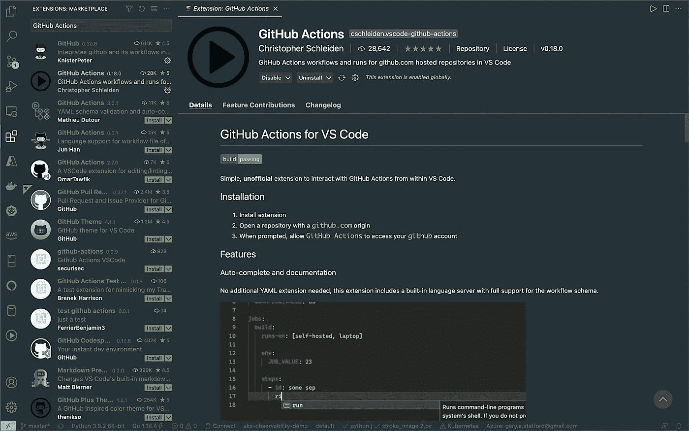

[GitHub 动作细节](https://github.com/cschleiden/vscode-github-actions)扩展

该扩展具有自动完成功能，如下图 GitHub 操作工作流 YAML 文件所示。

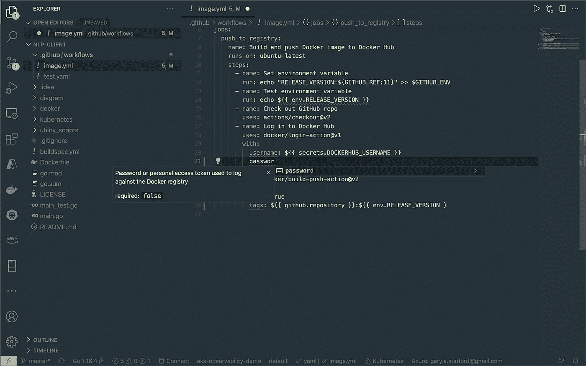

使用 [GitHub Actions](https://github.com/cschleiden/vscode-github-actions) 扩展的自动完成示例

# Git 标签

该演示的工作流被设计为当一个新的 Git 标签被推送到 NLP 客户端项目存储库时被触发。使用该工作流，您可以在不触发该工作流的情况下执行到存储库的推送(`git push`)。例如，在更新项目的自述文件时，您通常不希望触发新的映像构建和推送。因此，我们使用新的 Git 标签作为工作流触发器。对存储库的推送由运行一组单元测试的独立工作流来处理。

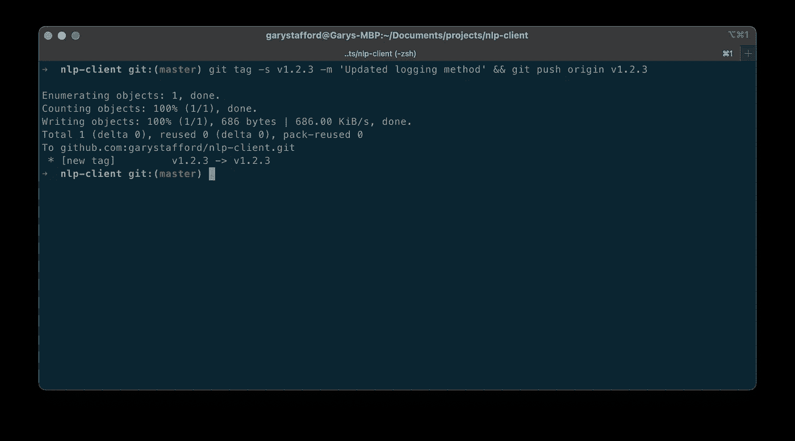

向 GitHub 推送新标签

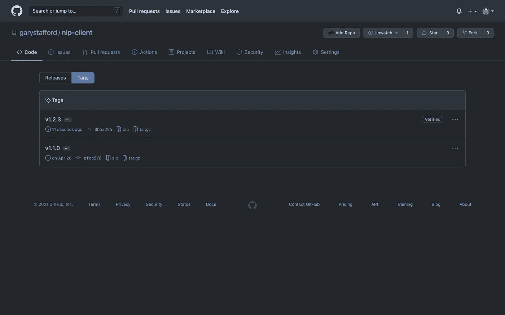

GitHub 项目资源库中显示的 Git 标签

为了一致性，我还将工作流设计为只有当 Git 标签的格式遵循版本号 MAJOR 的通用[语义版本化](https://semver.org/) (SemVer)约定时才被触发。小调.补丁(`v*.*.*`)。

```
on:
  push:
    tags:
 **- 'v*.*.*'**
```

此外，遵循工作流中常见的 Docker 约定，Git 标签(例如，`v1.2.3`)被截断以移除字母‘v’并用作 Docker 图像的标签(例如，`1.2.3`)。在工作流中，shell 命令的`GITHUB_REF:11`部分将`refs/tags/v1.2.3`的 Git 标签引用截断为仅`1.2.3`。

```
run: echo "RELEASE_VERSION=${**GITHUB_REF:11**}" >> $GITHUB_ENV
```

由于我的 GitHub 帐户和存储库名称与我的 Docker Hub 帐户和映像名称`garystafford/nlp-client`匹配，我可以引用`github.repository` [上下文](https://docs.github.com/en/actions/reference/context-and-expression-syntax-for-github-actions#contexts)来标记工作流中的 Docker 映像。

```
- name: Build image and push to Docker Hub
        uses: docker/build-push-action@v2
        with:
          push: true
          tags: **${{ github.repository }}**:${{ env.RELEASE_VERSION }}
```

# 工作流运行

按下 Git 标签会触发工作流自动运行，如**动作**选项卡所示。

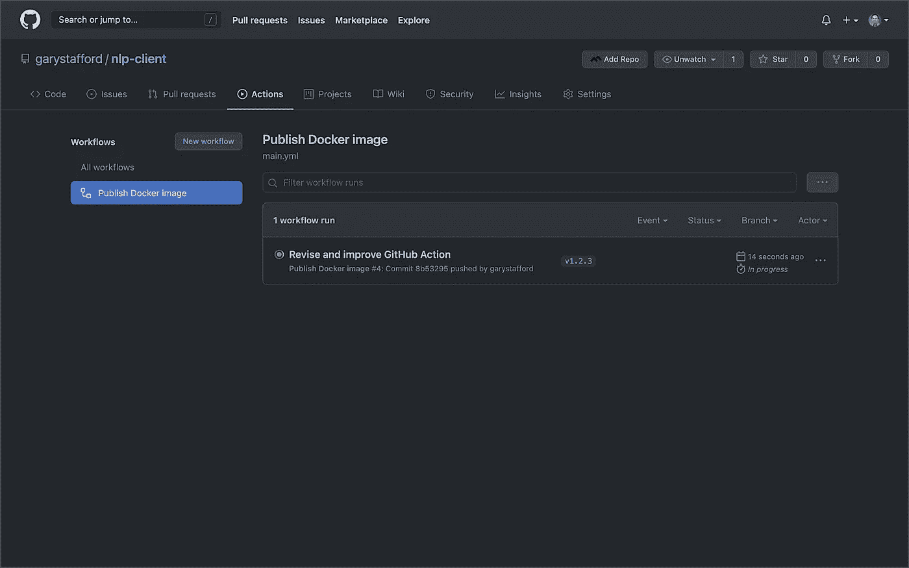

GitHub Actions 工作流运行，基于新的 git 标签的推送

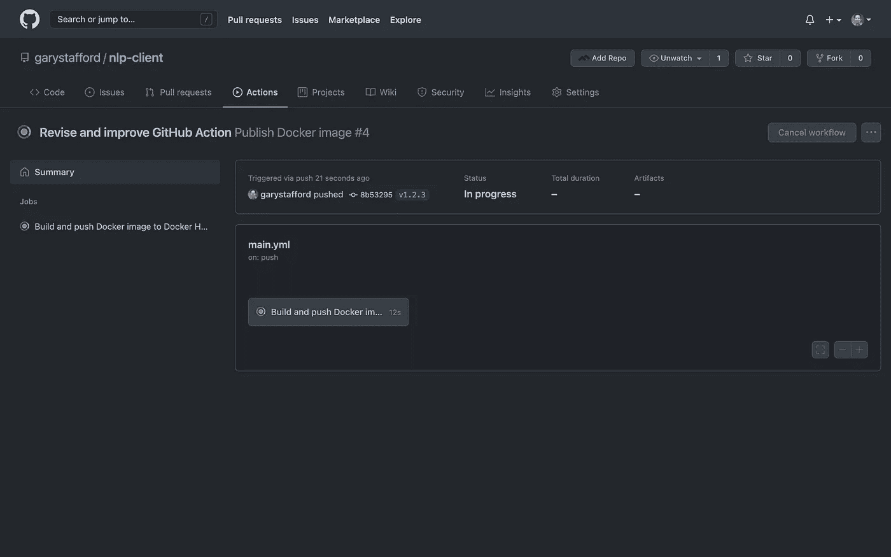

GitHub Actions 工作流运行，基于新的 git 标签的推送

详细的日志向您显示工作流中的每个步骤是如何处理的。


GitHub Actions 工作流运行，基于新的 git 标签的推送

下面的示例显示，工作流已经成功地为 NLP 客户端微服务构建了一个新的 Docker 映像并将其推送到 Docker Hub。

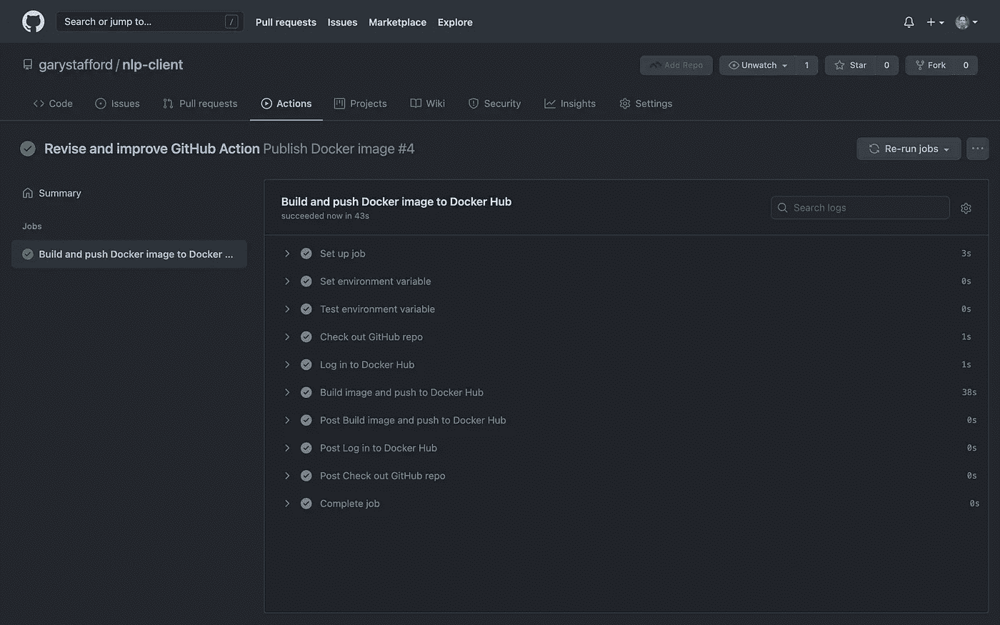

已完成 GitHub 操作工作流运行

## 失败通知

您可以选择在工作流失败时接收通知。GitHub 动作通知是一个[可配置选项](https://docs.github.com/en/github/managing-subscriptions-and-notifications-on-github/setting-up-notifications/configuring-notifications#github-actions-notification-options)，位于 GitHub 账户所有者的设置选项卡中。


工作流运行失败的电子邮件通知示例

## 状态徽章

您可以在存储库中显示一个[状态标记](https://docs.github.com/en/actions/managing-workflow-runs/adding-a-workflow-status-badge)来指示您的工作流的状态。徽章可以作为 Markdown 添加到您的自述文件中。

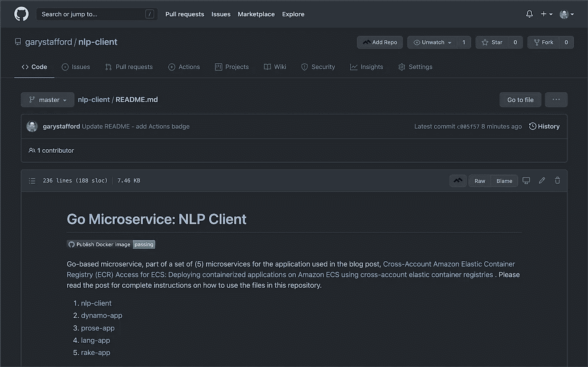

显示状态徽章的公共 NLP 客户端 GitHub 项目的自述文件

# 码头枢纽

由于工作流的成功完成，我们现在在 NLP 客户端 Docker Hub 存储库中有了一个标记为`1.2.3`的新图像:[garystafter/NLP 客户端](https://hub.docker.com/repository/docker/garystafford/nlp-client)。

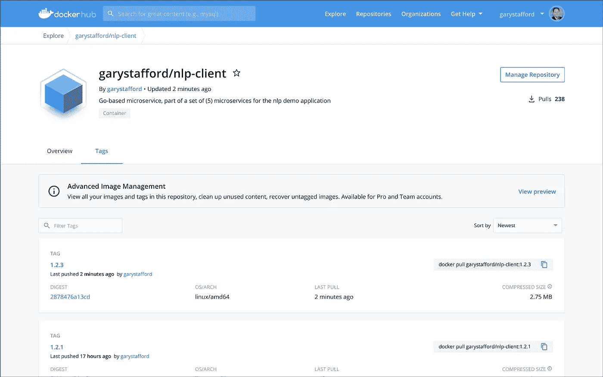

显示新图像标签的 NLP 客户端 Docker Hub 存储库

# 结论

在这篇简短的帖子中，我们看到了一个简单的例子，GitHub Actions 允许您在 GitHub 存储库中自动化、定制和执行您的软件开发工作流。我们可以很容易地扩展本文的 GitHub Actions 示例，将服务的 Kubernetes 部署资源文件更新为 Docker Hub 中的最新图像标签。此外，我们可以使用诸如 Weaveworks 的 [Flux](https://www.weave.works/oss/flux/) 或 [Argo CD](https://argoproj.github.io/argo-cd/) 之类的工具触发 [GitOps](https://www.weave.works/technologies/gitops/) 工作流，以将修改后的工作负载部署到 Kubernetes 集群。

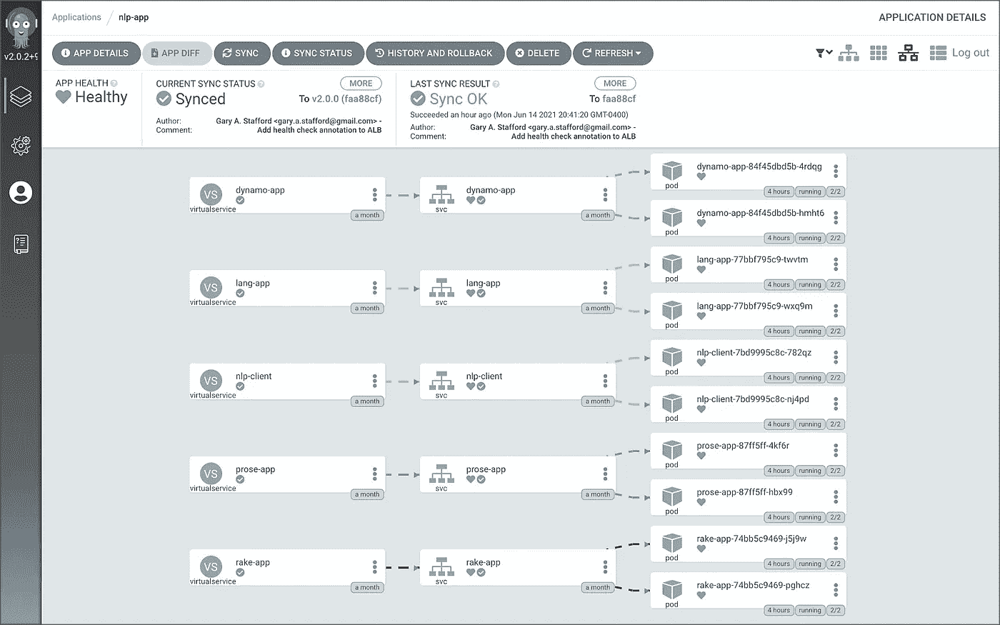

从 [Argo CD](https://argoproj.github.io/argo-cd/) 中可以看到部署的 NLP API

本博客代表我自己的观点，而非我的雇主亚马逊网络服务公司(AWS)的观点。所有产品名称、徽标和品牌都是其各自所有者的财产。