# 持续集成:Azure DevOps 上 iOS 的 CI/CD(第 1 部分)

> 原文：<https://itnext.io/continuous-integration-ci-cd-for-ios-on-azure-devops-part-1-7236d9b897f9?source=collection_archive---------1----------------------->

DevOps & CI/CD 已经流行了一段时间，它们已经证明了它们在当今快速发展的世界和敏捷开发过程中的价值。只有当他们真正经历了这一过程，亲眼看到它节省了大量的时间和令人头痛的事情时，他们才能理解真正的价值。

在 [Royale Cheese](https://www.royalecheese.com/) 最初我们通过微软的 Visual Studio 应用中心为 iOS 设置 CI/CD，但去年他们宣布 MBaas 在[退休，这让我们担心 VS 应用中心的整体未来。这是我们想放弃它的原因之一。其次，免费层每月为每个帐户提供大约 400 分钟的构建时间，这对于其他技术来说已经足够了，但是 iOS 需要大约 15 分钟来创建一个构建和部署。因此，在同一个账户中拥有多个应用程序(包括 iOS 和 Android)并不太好。](https://devblogs.microsoft.com/appcenter/app-center-mbaas-retirement/)

我们已经将 [Azure DevOps](https://dev.azure.com/) 用于其他技术的 CI/CD，这看起来很有前景。它的未来计划没有关闭的问题，它提供了大约 1800 分钟的免费构建时间。我们决定试一试，到目前为止没有任何抱怨。我们已经开始热爱和崇拜 Azure DevOps，并希望它保持这种状态。

好吧！问题已经说得够多了，让我们看看如何进行构建和部署。

## 先决条件

*   付费苹果开发者账户，一个添加到[appstoreconnect.apple.com](http://appstoreconnect.apple.com/)的应用一个添加到[开发者账户](https://developer.apple.com/account/resources/identifiers/list)的标识符。
*   Azure DevOps 帐户和 iOS 存储库已创建
*   [快速通道](https://fastlane.tools/)本地安装(用于生成会话令牌)

因为对于 iOS，CI 和 CD 是两个独立且漫长的过程，所以我们将本教程分为两部分。第 1 部分:持续集成，第 2 部分:持续部署

## 连续累计

先说 CI/CD 的 CI 部分。在本节中，我们将使用管道特性创建一个构建。出于演示的目的，我在 Azure DevOps 中创建了一个名为“iOS”的项目。打开您的项目并导航到左侧面板上的“Pipelines ”,如下图所示。

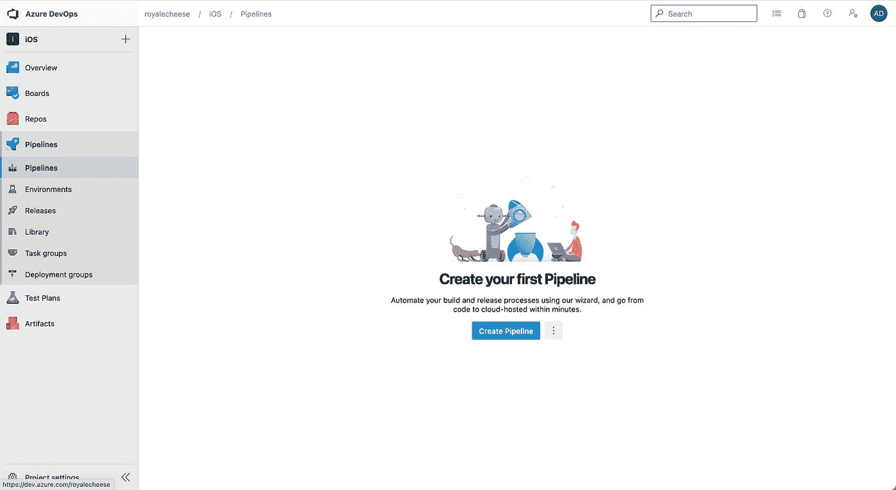

点击“创建管道”,这将打开下面的页面。

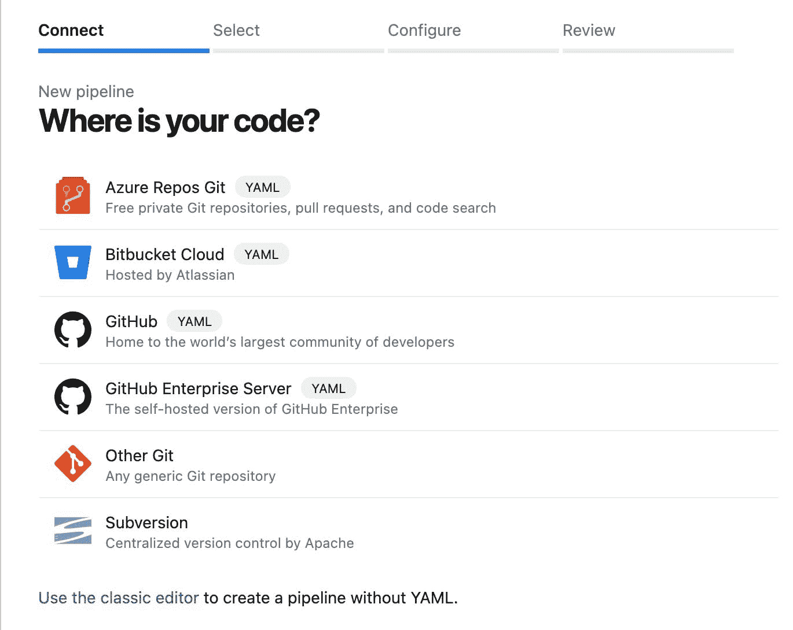

在这里，我们将选择“使用经典编辑器”，这比其他选项更容易。其他选项将最终导致编写用于配置管道的 yml 文件。

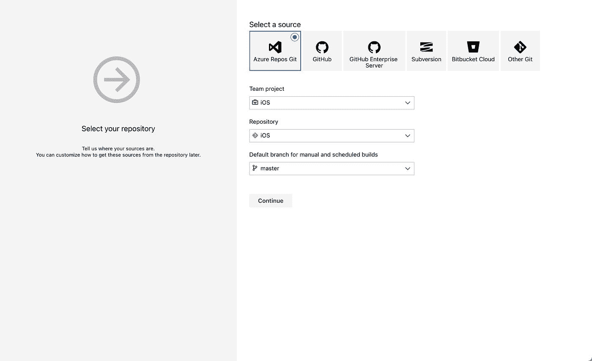

选择您想要运行构建的分支。

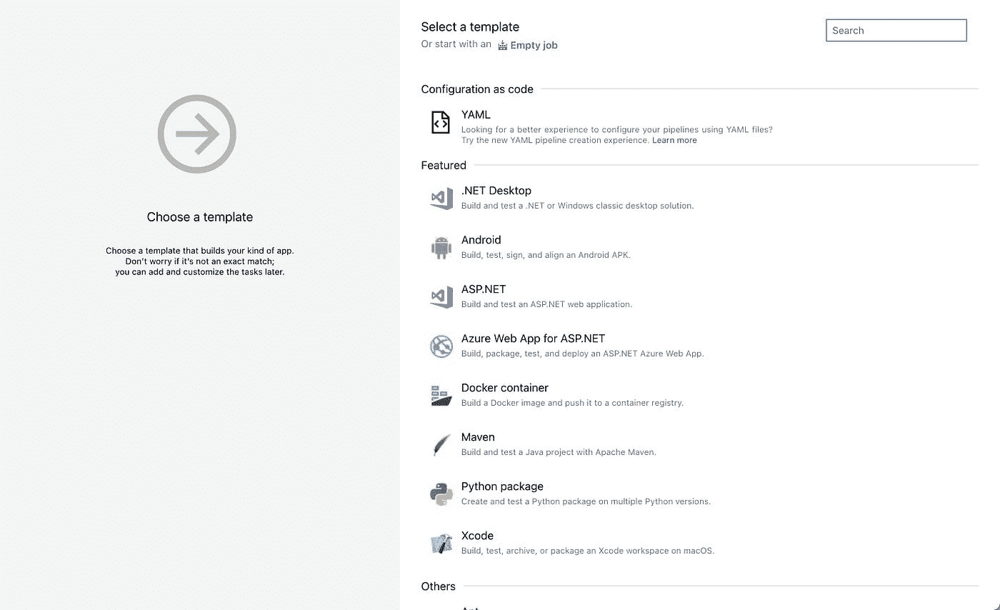

从特色项目列表中选择“Xcode”，然后点按“应用”。

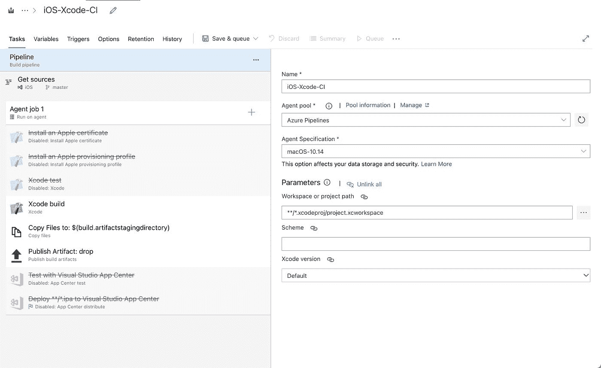

这将自动创建一个带有一些基本设置的构建配置，但是我们还有很长的路要走。为了简单起见，我们不打算使用“Xcode test ”,所以你可以右击它并选择“Remove selected tasks”。此外，由于我们不打算使用 VS App Center，您也可以删除这些任务。我们将在试飞中发布我们的应用程序。因此，启用 Apple 证书和 Apple 预置描述文件任务。它会显示一些错误，但我们会到达那里。我们的管道页面将如下所示。

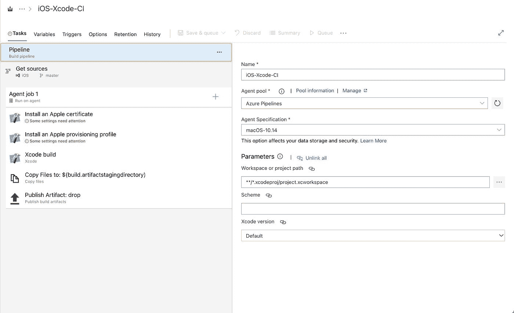

## 苹果证书

让我们获取用于签署构建的 Apple .p12 证书。在 Mac 上打开“钥匙串”应用程序，在顶部栏中选择“钥匙串访问”->“证书助理”->“向证书颁发机构申请证书”…输入证书信息，然后选择“存储到磁盘”并继续。它将要求您保存 certificatesigningrequest . certsigningrequest 文件。把它保存在你的机器上可以访问的地方。

我们现在将把上面生成的文件添加到你的苹果账户中。请访问此页面，我们将从这里添加证书。选择“苹果分销”并继续。接下来的两页是不言自明的(见下面的截图)。

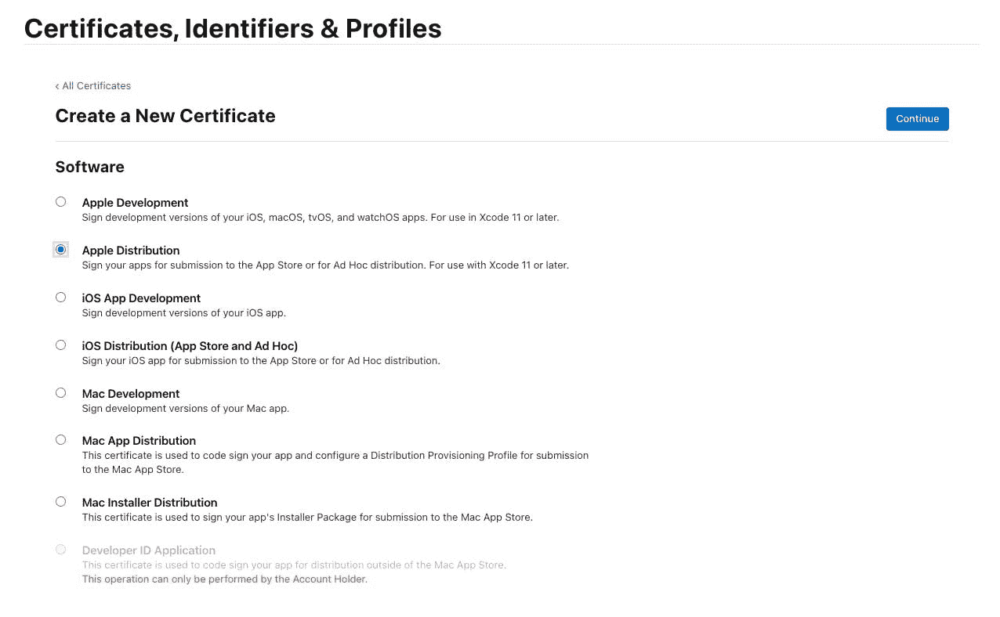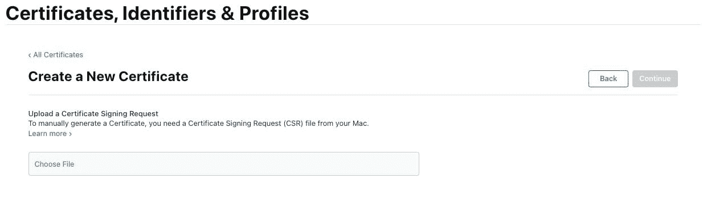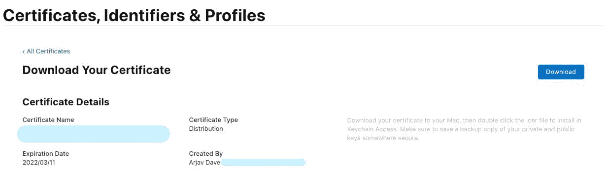

下载名为“distribution.cer”的证书文件。点按此文件将打开“钥匙串访问”并将证书文件添加到您的钥匙串中。您可以在钥匙串证书中找到条目“Apple Distribution:您的帐户名称”。

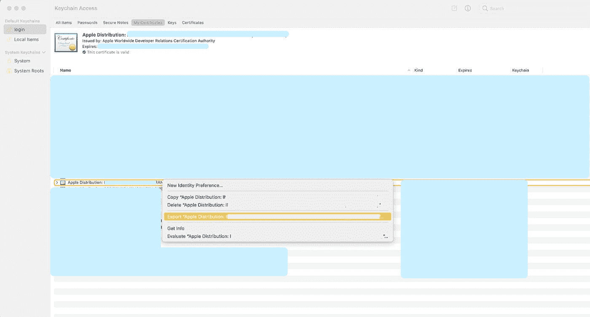

右键点击并选择“导出”苹果发行版:名称。用强密码将文件保存为. p12。我们已经成功地生成了签名构建所需的. p12 文件。

## Apple 预置描述文件

为此，您需要在您的开发者帐户中添加一个标识符。检查先决条件。访问[您的个人资料](https://developer.apple.com/account/resources/profiles/list)并创建新的个人资料。在分发部分选择 App Store 并继续。选择你的应用 ID 并继续。选择我们在上述步骤中上传的证书，然后单击继续。输入您的预置描述文件的名称，然后单击“生成”。这将在您的机器上下载预置描述文件。

## 回到 DevOps

唷！那是一个漫长的过程。好了，回到 DevOps 让我们把文件上传到各自的任务。选择“安装 Apple 证书”任务，并点击“证书(P12)”栏旁边右侧的齿轮图标。它会要求你上传我们上面生成的 p12 文件。一旦设置，它将如下所示。

从顶部选项卡中选择“变量”。当您想要安全地存储密钥、秘密或密码时，这些变量真的很方便。您的 p12 密码变量已经有一个条目。在 Value 中输入您的密码，并确保锁定图标，以便您或其他人在保存构建后看不到它。

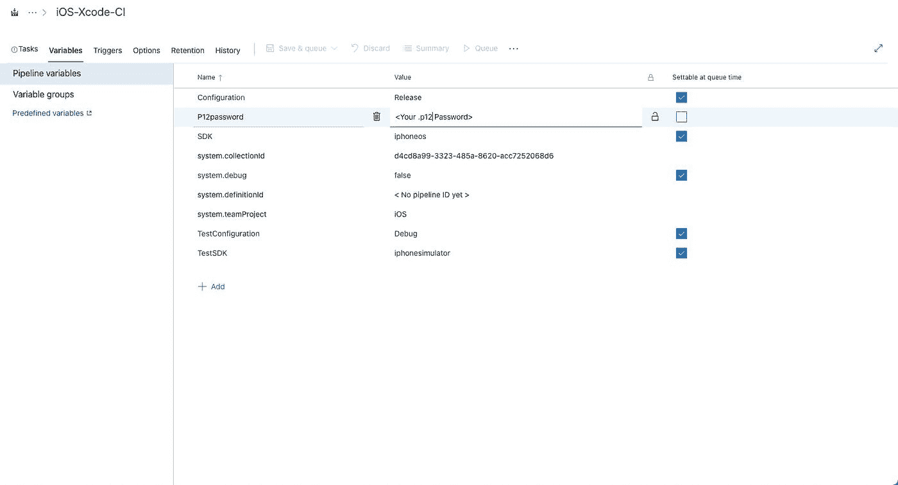

添加预置描述文件的时间到了。返回“任务”标签，选择“安装 Apple 预置描述文件任务”。上传您的预置描述文件，这将立即删除任何错误。

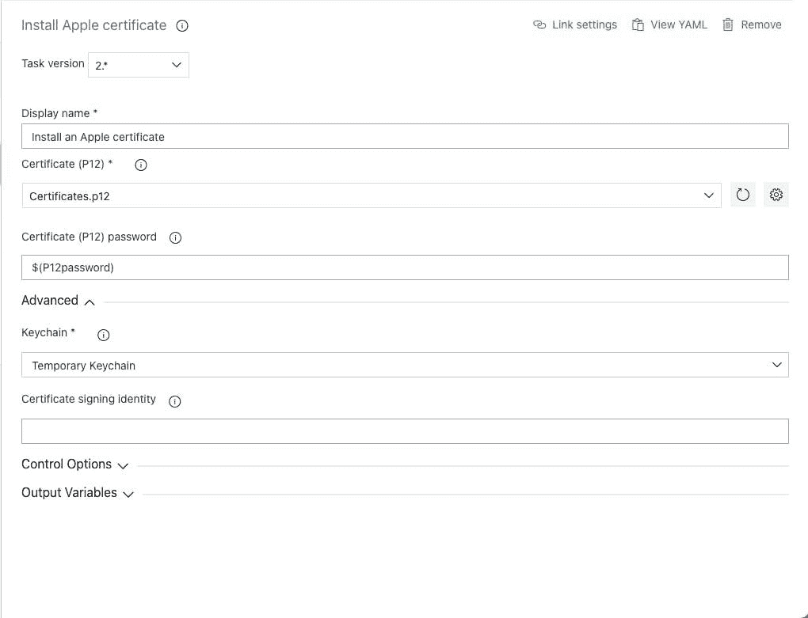

因为我们想要对构建进行签名，所以我们需要告诉“Xcode 构建”任务使用我们刚刚上传的证书和预置描述文件对其进行手动签名。为此，请选择“Xcode 构建”任务，并在“签名和供应”下选择“手动签名”。这将显示 3 个字段。在“签名身份”栏中输入$(APPLE _ CERTIFICATE _ SIGNING _ IDENTITY ),在“预置描述文件 UUID”栏中输入$(APPLE_PROV_PROFILE_UUID)。最后选择复选框“创建应用程序包”。

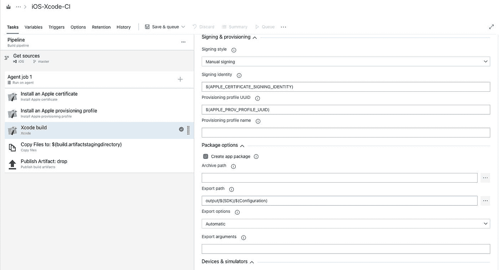

最后，如果您在项目中使用 pods，您需要在管道中添加一个 CocoaPods 任务。选择“代理作业 1”旁边的+图标以添加新任务。搜索 CocoaPods，然后单击添加。将任务拖到“安装 Apple 证书”上方，使其成为正在执行的第一个任务。

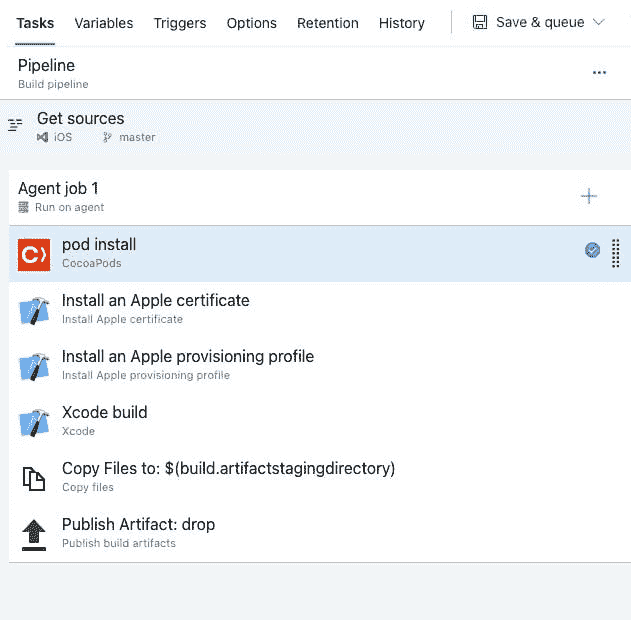

现在，您可以通过单击“保存并排队”按钮来保存和排队您的构建。确保在代理规范中选择 Mac OS，否则会出错。

在下一部分的[中，我们将看看如何使用发布管道设置试飞的连续部署。](https://arjavdave.com/2021/03/13/continuous-deployment-ci-cd-for-ios-on-azure-devops-part-2/)