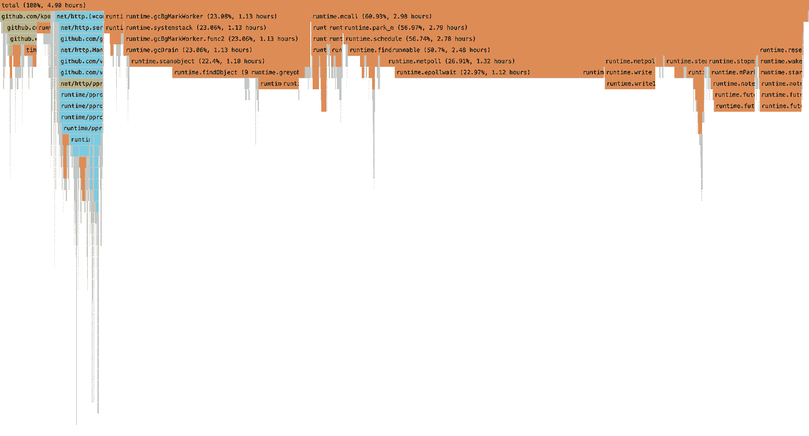
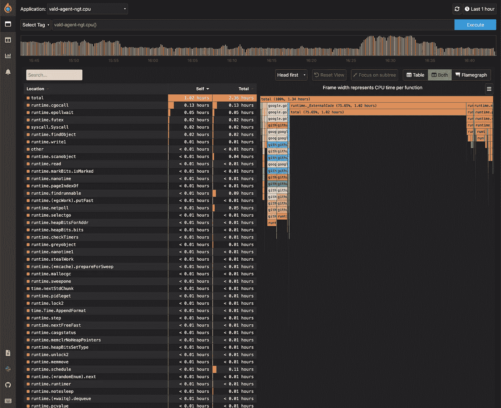
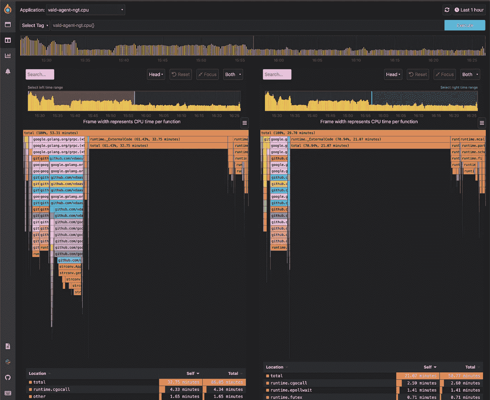
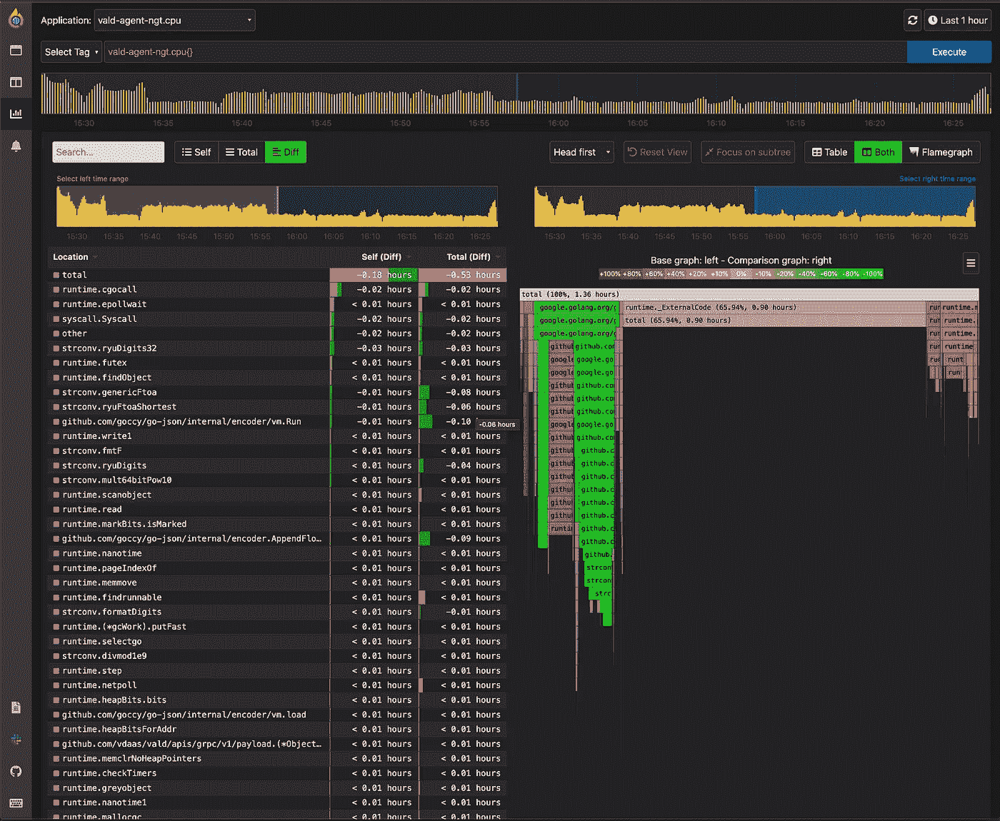

# Vald 中的 Pyroscope 支持连续分析

> 原文：<https://itnext.io/continuous-profiling-enabled-by-pyroscope-in-vald-c0ab3341de2e?source=collection_archive---------1----------------------->

[概要分析](https://en.wikipedia.org/wiki/Profiling_(computer_programming))是显示应用程序资源使用情况的方式。

持续分析是持续收集应用程序性能的过程。有助于开发者更深入的分析。

如今，对连续剖析的需求正在增加。Vald 还从 1.4 版开始使用焦镜进行连续分析。

这篇文章简单介绍了 Vald 中需要连续分析的背景下的火镜。

# 为什么我们需要持续的剖析？

当一些性能问题如低延迟、内存泄漏、CPU 性能等。，开发人员需要调查瓶颈并找出它们的根本原因。近年来，随着应用程序的复杂性，这种情况越来越多。

通常，开发人员在问题发生后开始对这些情况进行分析。然而，要解决根本原因需要很长时间，并且因为很难再现相同的问题而使开发人员疲惫不堪。不用说，Vald 小组已经遇到了一些情况。

持续侧写最终不是银弹，但能帮助我们。它将操作系统层的性能数据**存储到应用层**，可视化配置文件数据，使开发人员能够比较问题发生前后的性能状态。

# 与指标的差异

一个词类似于带有度量的剖析，但是两者之间有明显的区别。

概要分析只处理**预定义的参数** (CPU、RAM、线程等)。)，需要**很长时间对**进行采样(至少超过 10 分钟)，并可视化**相关的堆栈跟踪**。另一方面，处理**用户定义参数**的指标比通常的分析和**花费的时间**更少，并可视化为时间序列**。**

# 什么是火镜？

焦镜是一种连续剖面工具。

[](https://pyroscope.io/) [## 开源连续分析平台|将性能问题调试到一行代码…

### 找到代码中的瓶颈并修复性能问题

pyroscope.io](https://pyroscope.io/) 

它支持多种编程语言，如`Go`、`Python`、`Java`、`PHP`、`eBPF`等。

[](https://pyroscope.io/docs/agent-overview/) [## Pyroscope 代理|开源连续分析平台

### Pyroscope 代理记录并汇总您的应用程序一直在做什么，然后将数据发送到 Pyroscope…

pyroscope.io](https://pyroscope.io/docs/agent-overview/) 

可以看[火镜现场演示](https://demo.pyroscope.io/?name=hotrod.python.frontend%7B%7D)。

这一次，我们重点使用`Go`。用`Go`实现的应用程序进行概要分析时，需要`Go`和`Pyroscope server`实现的应用程序。

有两种类型的代理，称为`[Push](https://pyroscope.io/docs/golang/)`和`[Pull](https://pyroscope.io/docs/golang-pull-mode/)`，使用焦镜。当使用`Push`代理时，应用程序应该向 Pyroscope 服务器发送`[pprof](https://github.com/google/pprof)`数据。当`Pull`代理运行时，Pyroscope 服务器从应用程序中抓取`pprof`数据。

*注意:`pprof`是一个可视化和分析剖析数据的工具。

# 用火镜的瓦尔得之路

Vald 应用`Pull`代理进行分析，因为我们不会依赖于使用 Pyroscope 的应用程序代码。我们可以通过编辑 Kubernetes 清单轻松地进行侧写。

不仅分析应用程序，Vald 还应用`[eBPF](https://ebpf.io/)`在 Linux 内核级别进行分析。

建筑形象在这里。

```
+-----------------+  pull pprof
| vald components | <----+
+-----------------+      |     +------------------+
                         +-----+ Pyroscope server |
+-----------------+      |     +------------------+
|    eBPF-Agent   | <----+
+-----------------+  pull eBPF
```

我们可以通过以下方式轻松应用连续分析系统:

*   在`valdrelease.yaml`中为每个组件设置`pprof`启用模式。
*   为每个 Kubernetes 节点部署`eBFP Agent`。
*   展开`Pyroscope server`。

# 使用 k3d 的教程

## 部署

以下是使用 Pyroscope 在 k3d 上部署 Vald 集群的步骤。由于 eBPF 不可用，请在 v5.3.0 或更高版本中使用 k3d。

*   克隆 Vald 存储库

```
git clone https://github.com/vdaas/vald.git && cd vald
```

*   创建 k3d 集群

```
k3d cluster create -v "/lib/modules:/lib/modules" --host-pid-mode=true --agents=3
```

*   展开`vald-helm-operator`

当您想要在本地环境中部署 Vald 集群时，请将`rabc.create`设置为`true`。

```
helm install --values ./charts/vald-helm-operator/values.yaml vald-helm-operator vald/vald-helm-operator --set rbac.create=true
```

*   展开`vald-release`

```
helm install vald vald/vald --values example/helm/values-with-pyroscope.yaml
```

当每个 Vald 组件箱在`pprof`启用的情况下运行时，将为每个箱给出如下`pod annotation`。Pyroscope 服务器根据这些信息决定要刮哪个 pod。

```
pyroscope.io/application-name: vald-agent-ngt
pyroscope.io/port: "6060"
pyroscope.io/profile-cpu-enabled: "true"
pyroscope.io/profile-mem-enabled: "true"
pyroscope.io/scrape: "true"
```

*   部署 Pyroscope 服务器和 eBPF 代理

```
make k8s/metrics/pyroscope/deploy
```

你可以从下面的页面得到清单。

[](https://github.com/vdaas/vald/tree/master/k8s/metrics/pyroscope) [## 主 vdaas/vald 的 vald/k8s/metrics/pyroscope

### 这是部署内窥镜服务器和内窥镜代理的最大成本。pyroscope 服务器抓取 pprof 数据。哪个吊舱…

github.com](https://github.com/vdaas/vald/tree/master/k8s/metrics/pyroscope) 

## Pyroscope UI

当部署成功时，我们可以在浏览器上访问 Pyroscope UI。

我们可以看到 3 种类型的视图，单一视图、比较视图和差异视图。您可以根据自己的需求选择视图。每个视图都提供了表格视图和火焰图。



Flameglaph 示例(vald-agent-ngt CPU 使用率)

上图是火焰图的一个例子。此图中的横轴表示函数调用的 CPU 独占时间，纵轴是调用堆栈。我们可以理解为宽度大的那个用 CPU 时间长。

**单视图**

单一视图显示设定时间段内的分析数据。这是研究您的应用程序的主要视图。
左边的表格视图是一个可排序的视图，用于检查顶部利用率。右边的视图是上面描述的 FlameGraph 格式。表格视图的上方是一个搜索框，允许您搜索特定的概要分析。



单一视图示例(vald-agent-ngt.cpu)

**对比视图**

比较视图显示了指定的两个时间段的两个分析数据。它有助于比较两个不同时期的分析数据。例如，当在发布时比较两个不同的版本时，您可以比较部署前后 CPU 和内存指标的变化。



示例比较视图(vald-agent-ngt.cpu)

**差异视图**

diff 视图显示了基于旧时间段的指定两个时间段的不同分析。除了灰色、红色和绿色，你可以看到三种颜色。
灰色条表示性能分析前后结果相同的数据。在这种观点下，你不会把注意力放在灰色上。红色表示与旧的分析相比使用量增加了多少，而绿色与红色相反，表示使用量减少了多少。这对于比较新旧应用程序分析数据很有用，就像在比较视图中一样，但是更定量地说，它允许您检查百分比的增加或减少。



差异视图示例(vald-agent-ngt.cpu)

# 结论

这篇文章介绍了为什么 Vald 在 Vald 集群中使用 Pyroscope 和 Pyroscope 进行连续分析。使用后，我们可以得到它的有效性，我们会张贴出来。开始对您的应用程序进行连续分析怎么样？

# 其他员额

[](https://medium.com/geekculture/vald-a-highly-scalable-distributed-fast-approximate-nearest-neighbour-dense-vector-search-engine-af1946a4a37) [## 瓦尔德。一个高度可扩展的分布式快速近似最近邻密集向量搜索引擎。

### Vald 简介:云原生向量搜索引擎

medium.com](https://medium.com/geekculture/vald-a-highly-scalable-distributed-fast-approximate-nearest-neighbour-dense-vector-search-engine-af1946a4a37) [](https://vdaas-vald.medium.com/a-new-world-created-by-similar-search-cases-where-vald-can-be-used-15c768e49bb) [## 相似搜索创造的新世界:可以使用 Vald 的案例。

### 你用 Vald 做什么？:案例和案例研究

vdaas-vald.medium.com](https://vdaas-vald.medium.com/a-new-world-created-by-similar-search-cases-where-vald-can-be-used-15c768e49bb) [](https://vdaas-vald.medium.com/a-super-easy-way-to-try-similarity-search-using-vald-88fd7e8b87e9) [## 使用 Vald 尝试相似性搜索的一个超级简单的方法

### 如何在 5 分钟内在 k3d 上部署 Vald

vdaas-vald.medium.com](https://vdaas-vald.medium.com/a-super-easy-way-to-try-similarity-search-using-vald-88fd7e8b87e9) [](https://vdaas-vald.medium.com/release-announcement-v1-4-0-5c65a48aaa25) [## 发布公告:1.4.0 版

### 我们将在本周发布 1.4.0 版。

vdaas-vald.medium.com](https://vdaas-vald.medium.com/release-announcement-v1-4-0-5c65a48aaa25)