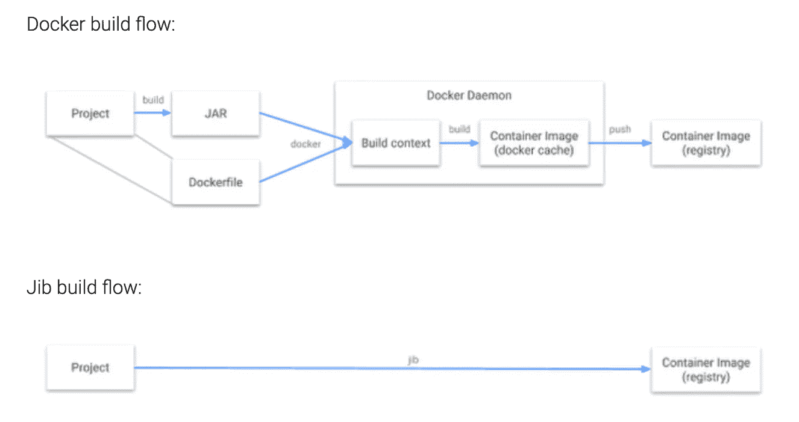
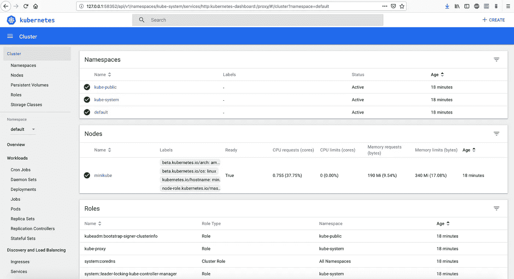
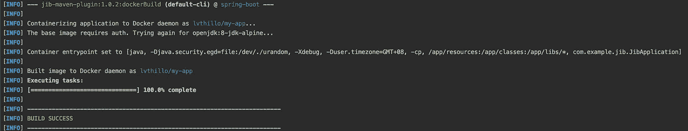
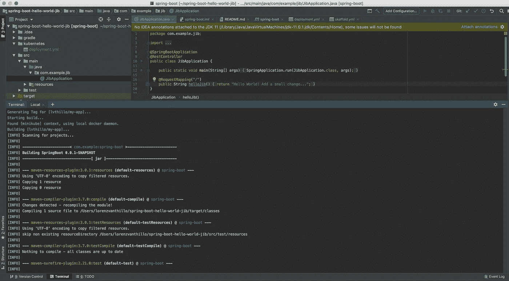
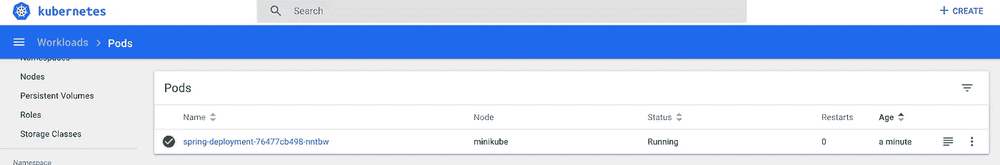

# 使用 Jib 和 Skaffold 在 Kubernetes 持续部署 Spring Boot

> 原文：<https://itnext.io/continuous-spring-boot-deployment-in-kubernetes-using-jib-and-skaffold-11fd3c71d941?source=collection_archive---------1----------------------->

> 在本教程中，我将解释如何在 Kubernetes 中实现连续的 Spring Boot 部署。一个小的代码更改将触发一个新的 Docker 映像构建，并在您的集群中即时部署一个新的 pod。本教程在 macOs 上执行。



Jib 是一个来自 Google 的开源、快速、简单的 Java 容器映像构建器，它处理将应用程序打包成容器映像的所有步骤。它不需要您编写 does 文件。

我们将使用 [jib-maven-plugin](https://github.com/GoogleContainerTools/jib/tree/master/jib-maven-plugin) 为我们的应用程序创建一个 Docker 映像。
接下来，我们将设置一个本地 [minikube](https://kubernetes.io/docs/setup/minikube/) 集群，并创建一个 Kubernetes 部署。斯卡福德将帮助使这一部署持续进行。

首先安装 minikube、kubectl 和 Skaffold 并启动您的 minikube 集群:

```
$ brew cask install minikube
$ minikube start
$ brew install skaffold
$ brew install kubernetes-cli
```

检查您的 minikube 实例的 IP，并验证您是否可以访问 minikube 仪表板:

```
$ minikube ip
192.168.99.101 # most of the time it's 192.168.99.100
$ minikube dashboard
```



现在创建您的 Spring Boot 项目。你可以使用[这个示例项目](https://github.com/lvthillo/spring-boot-hello-world-jib)来开始。在您最喜欢的 IDE 中打开项目，并尝试构建它:

```
$ mvn clean install
```

转到`pom.xml`并验证`jib-maven-plugin`的配置。我们将使用`registry.hub.docker.com/openjdk:8-jdk-alpine`作为基础图像。

访问 IDE 的终端并执行以下命令来指向 minikube 的远程 Docker 守护进程:

```
$ eval $(minikube docker-env)
```

我们将使用 minikube 守护进程，这样我们就可以构建我们的 Docker 映像，minikube 可以访问它，而不需要推送映像，或者从 Docker 注册表中提取映像。

使用 jib 插件构建 Docker 映像:

```
$ mvn compile jib:dockerBuild
```



这个 Docker 映像可以在我们的 minikube 节点上访问，因为我们使用了远程守护进程。我们将使用`kubernetes/deployment.yml`在 minikube 上创建一个部署

```
**apiVersion**: apps/v1
**kind**: Deployment
**metadata**:
  **name**: spring-deployment
**spec**:
  **replicas**: 1
  **selector**:
    **matchLabels**:
      **app**: spring-boot-jib
  **template**:
    **metadata**:
      **labels**:
        **app**: spring-boot-jib
    **spec**:
      **containers**:
        - **name**: spring-boot-jib-pod
          **image**: lvthillo/my-app
          **imagePullPolicy**: IfNotPresent
          **ports**:
            - **name**: http
              **containerPort**: 8080
---
**apiVersion**: v1
**kind**: Service
**metadata**:
  **name**: spring-boot-jib-service
**spec**:
  **type**: NodePort
  **ports**:
    - **protocol**: TCP
      **port**: 8080
      **nodePort**: 32321
  **selector**:
    **app**: spring-boot-jib
```

该模板将从我们的`lvthillo/my-app`映像部署一个 pod，pod 的端口 8080 将被暴露。该模板还将创建一个 NodePort 类型的服务，该服务将端口 8080 映射到 NodePort 32321。

```
$ kubectl create -f kubernetes/deployment.yml 
deployment.apps/spring-deployment created
service/spring-boot-jib-service created$ kubectl get pods
NAME                                 READY   STATUS    RESTARTS   AGE
spring-deployment679-rhmzn   1/1     Running   0          18s
```

访问 minikube ip 上的应用程序和我们定义为节点端口的端口:`192.168.99.101:32321`


我们已经在 minikube 中部署了我们的 Spring Boot 应用程序！我们将使用 Google 开发的另一个很棒的工具来自动化 minikube 的部署。这个工具叫做[斯卡福德](https://github.com/GoogleContainerTools/skaffold)。

在项目的根目录中写一个`skaffold.yml`。

```
**apiVersion**: skaffold/v1beta4
**kind**: Config
*# Enforce SKaffold to use Jib* **build**:
  **local**:
    **push**: false
*# Generated artifact* **artifacts**:
    - **image**: lvthillo/my-app
*# Use jibMaven* **jibMaven**: {}
*# Execute deployment.yml* **deploy**:
  **kubectl**:
    **manifests**:
      - kubernetes/deployment.yml
```

在开发模式下运行 Skaffold。这将建立我们的形象，并部署到 minikube 的每一个变化，我们在我们的项目。

```
$ skaffold dev --trigger notify
```

一个小的变化将被选中，Skaffold 将自动触发 Docker 映像的新构建:



创建了一个新的 pod:



并且部署了更改:


# 结论

我们使用了 Google 开发的两个非常酷的工具，这两个工具使得我们的项目能够持续部署到 minikube。您还可以使用 jib 自动将映像推送到 Docker 注册中心，甚至可以持续部署到云中托管的 Kubernetes 集群。

[](https://www.buymeacoffee.com/dZb8fLN)

如果真的对你有帮助…:)