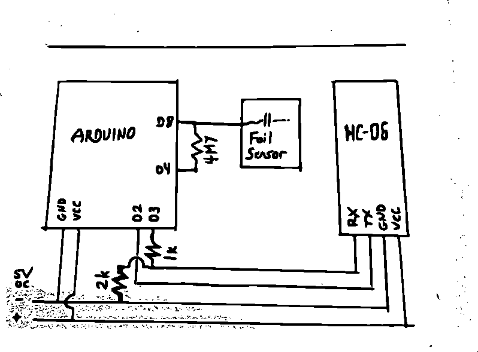
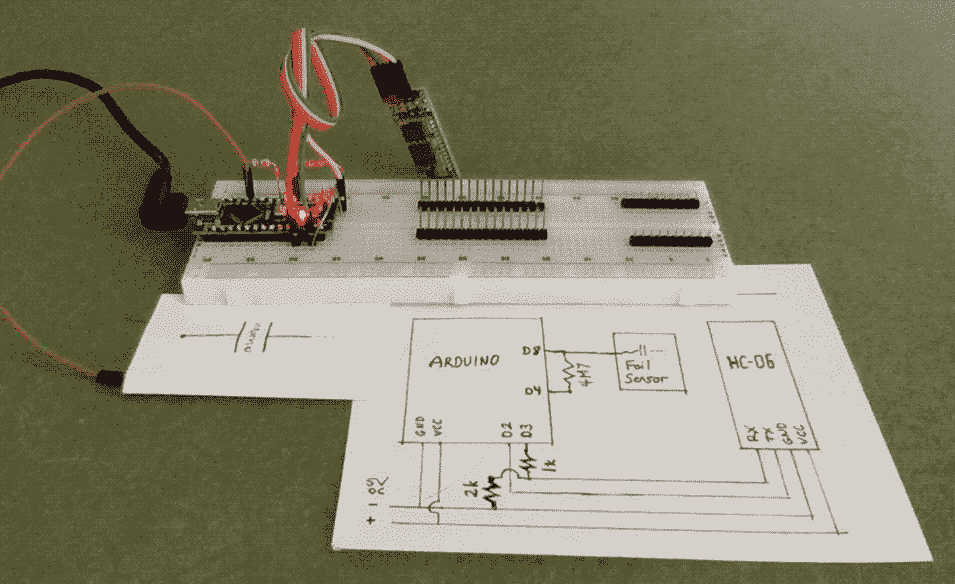
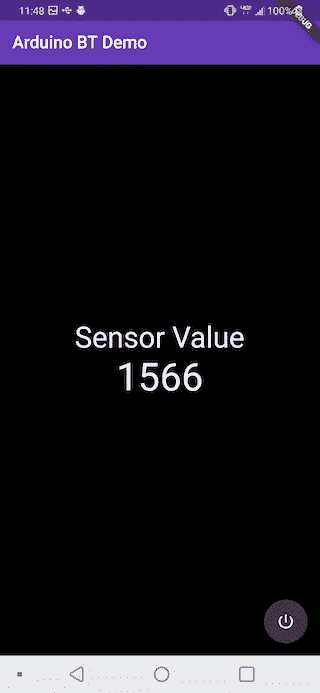
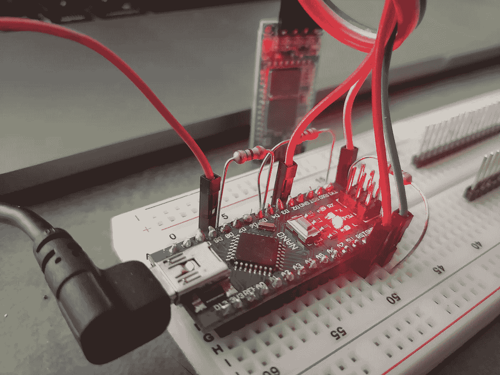

# 使用蓝牙控制 Arduino

> 原文：<https://itnext.io/control-an-arduino-with-bluetooth-baddbf2d47ba?source=collection_archive---------1----------------------->

## 如何使用配备蓝牙功能的 Arduino 设备

## 介绍

随着 DIY 爱好电子产品越来越受欢迎，制作酷的小工具变得比以往任何时候都容易。像 Arduino 这样的小型微型计算机对发烧友来说是一个真正的游戏规则改变者，因为它们比标准的微处理器开发板更便宜、更容易使用。在本文中，我们将了解如何将蓝牙模块连接到 Arduino，然后从一个用 Flutter 构建的简单 Android 应用程序中控制和监控它。

本文假设您具备一些电子学知识和基本的计算机编程技能，但是这些并不是必需的(可以通过参与和完成这样的演示项目来获得)。

## 材料清单

为了建造这个项目，你需要一些简单的电子零件，其中一些可以很容易地替换掉。只要 Arduino 和蓝牙模块之间的分压器由两个电阻组成，接地端电阻的值是另一个电阻的两倍，各种 Arduino 板都可以正常工作，电阻值并不重要。

以下是您需要的零件:

*   [Arduino 板](https://www.arduino.cc/en/Main/Boards)
*   [HC-06 BT 模块](https://www.google.com/search?q=arduino+hc-06)
*   (1) 1k 电阻器—分压器信号侧
*   (1) 2k 电阻—分压器接地侧
*   (1) 4.7M 电阻器—电容传感器负载
*   用纸包裹的小(~2 英寸 x 2 英寸)金属箔片
*   5v 直流电源、试验板、少量跳线
*   带蓝牙的 Android 设备，用于测试应用程序

## 连接起来

列出零件清单后，让我们看看如何将所有这些连接起来:

显示 Arduino、BT 模块、传感器和电阻的示意图

这里我们有一张 Arduino、HC-06 蓝牙模块、金属箔传感器和一些电阻的记事本草图。+5v 直流电压和 GND 按预期接线。Arduino 上的 D2 直接从模块上的 TX 引脚接收数据，而 D3 通过使用 1k 和 2k 电阻创建的简单分压器连接到 RX。针脚 D4 和 D8 通过一个 4.7 米*ω*电阻桥接，纸包金属箔传感器连接到 D8。

分压器允许利用 5V 逻辑电平的 Arduino 安全地驱动 HC-06 的输入引脚，HC-06 设计为使用 3.3V。我们只需在一个方向上调整电压，因为 5V 组件可以安全地处理 3.3V 输出。实际上，5V 不太可能损坏 HC-06 上的 3.3V 输入，但是，仅仅因为我们可以逃脱一两次，就开始这样做将是可怕的设计实践。在它们的预期范围之外操作东西基本上是在自找奇怪的 bug。

电容式传感器的工作原理是将 D4 的电平提高到高电平，等待 D8 上的电压达到与 D4 相同的电位需要多长时间，然后捕捉并处理每个传感器读数的输出。当有人触摸纸覆盖的箔传感器时，在箔、纸电介质和人的导电手之间形成一个电容器，当它充电时，从 D4-D8 电路中流出少量电流。一旦箔纸人体“电容器”完成充电，D4 和 D8 上的电压相对于地将是相同的，然后 Arduino CapactiveSensor 库进行一些数学运算以获得最终的传感器值结果。

除此之外，我们在 Arduino 上有内置的 LED，我们将根据移动测试应用程序的命令打开和关闭它。这就是硬件方面的内容，现在让我们来看看一些项目代码。

## Arduino 逻辑

Arduino 代码本身的设计非常简单，只有一个简短的 C++文件和两个库导入。我们来看看文件 **arduino/bt_demo.cpp** :

这是 Arduino 单页荣耀的全部程序。首先，包括库**软件 Serial** 和**电容传感器**，然后初始化以连接到原理图中之前概述的引脚。

接下来是 **setup()** 函数，当设备上电或复位时，该函数在初始化期间被调用一次。在设置期间，`LED_BUILTIN`引脚被置于`OUTPUT`模式，电容传感器被校准，标准和蓝牙串行端口都被初始化为 9600 [波特](https://en.wikipedia.org/wiki/Baud)。

主程序 **loop()** 是实际工作发生的地方。首先，指示传感器库获取 30 个样本平均值的原始值，该值存储为`current`，然后通过蓝牙串行传输。在短暂的延迟之后，蓝牙设备被检查以查看是否有任何数据进入线路。如果是，则从设备中读取一个 1 字节字符，如果该字符是*‘1’*，则`LED_BUILTIN`亮起，否则熄灭。

Arduino 就是这样。接下来，我们来看看控制 app。

## 演示 Android 应用程序

这个项目的演示应用程序是一个默认的 Flutter 应用程序，由`flutter create`创建，带有一些基本的 UX 和自定义本机代码，用于处理蓝牙连接本身。定制本机代码的原因是因为我在尝试使用社区包进行配对之前忘记了打开我的测试板，它无法工作。我认为这个包有问题，所以在意识到发生了什么之前，我很快就做了一个。圣生活。😆

让我们来看看应用程序入口点文件， **lib/main.dart** :

文件 **lib/main.dart** 包含应用程序 UX，它由标题栏、传感器读数和用于打开和关闭板上 LED 的电源按钮组成。在这个文件中，我们有一些对 [dart:async](https://www.dartlang.org/tutorials/language/futures) 和`bt-controller.dart`文件的导入，后者是本地桥的客户端实现。

当应用程序启动时，初始化 **BTController** 类，然后向它请求一个可用设备的列表，该列表又通过一个不可删除的对话框显示给用户。当选择一个设备时，控制器被指示连接到该设备，此时它将开始将从该设备读取的数据转发到传递到初始化方法中的处理程序。

当 **MainPage** 类从 **BTController** 接收数据时，它将使用触发屏幕刷新的 **setState()** 命令将数据存储在 *sensorValue* 中。当按下**浮动动作按钮**时，单个交替字符*‘0’*或*‘1’*被发送到 **BTController** 以传输到模块。

接下来我们将看一下文件 **lib/bt-controller.dart** :

**BTController** 类采用了 **MethodChannel** 来实现 Dart 中的 Flutter UX 代码和底层蓝牙逻辑的原生 Android 代码之间的通信。**init(***Function on data***)**方法初始化方法调用处理程序，并将对它的调用重定向到 *onData* 函数，以将消息向上游传回视图逻辑。为了方便和可读性，已经定义了方法来封装请求并将请求转发给平台本机代码。

我们不会详细讨论用于实现蓝牙逻辑本身的特定于平台的代码，因为这超出了本文的范围，因为这通常会通过使用预制的插件来处理，如 [flutter_blue](https://github.com/pauldemarco/flutter_blue) 或 [flutter_bluetooth_serial](https://github.com/edufolly/flutter_bluetooth_serial) 。如果你感兴趣并且想看看，MainActivity.java 文件可以在[这里](https://github.com/kenreilly/arduino-bluetooth-demo/blob/master/bt_demo/android/app/src/main/java/com/example/bt_demo/MainActivity.java)找到，或者你可以选择从[这里](https://github.com/kenreilly/arduino-bluetooth-demo)复制整个项目，看看或者试验一下。这就结束了这个项目的逻辑部分，所以现在是时候看看它是如何工作的了。

## 测试它

已完成项目，BT 模块已准备好配对

开发板通电，程序加载到 Arduino 后，硬件就完成了。HC-06 会闪烁，表示准备好配对。

Android 演示应用的屏幕截图

接下来，在手机上加载应用程序并启动它，它应该会显示可用蓝牙设备的列表。选择 HC-06，在短暂的连接之后，一切都准备就绪。运行时，该应用程序将显示电容传感器的原始值，以及一个用于打开/关闭 Arduino 内置 LED 的按钮。该按钮完全不知道 LED 的实际状态。没有任何类型的反馈逻辑，就没有办法确保按钮“开”和 LED“开”总是同步的。这是我们的简单演示的设计限制，可以通过将 LED 状态传回应用程序来解决。

我希望你像我喜欢写这篇文章一样喜欢它。当今可用的开源嵌入式工具和设计为任何具有基本阅读和数学技能的人打开了电子原型和实验的世界，并提供了一种随着时间推移学习更高级技能和概念的不可思议的途径，这是一种有趣和令人兴奋的方式，由个人的好奇心驱动，不需要大学学位课程或在职培训的大量前期投资(尽管这两者对于考虑全职从事工程职业的人来说都是极好的选择)。

感谢您的阅读，祝您的下一个电子项目好运！

> 肯尼斯·雷利( [8_bit_hacker](https://twitter.com/8_bit_hacker) )是 [LevelUP](https://lvl-up.tech/) 的 CTO

背景为 HC-06 的 Arduino Nano 细节图