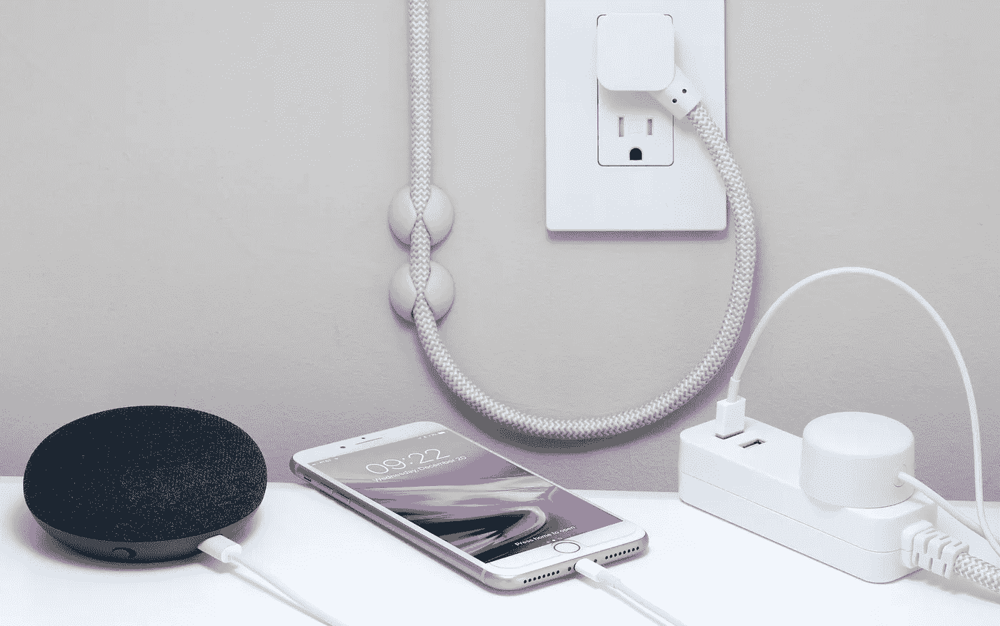

# 用 HomeKit 控制你的家

> 原文：<https://itnext.io/control-your-home-with-homekit-20e8791a2fd3?source=collection_archive---------5----------------------->

托马斯·科尔诺斯基在 [Unsplash](https://unsplash.com/s/photos/smart-home?utm_source=unsplash&utm_medium=referral&utm_content=creditCopyText) 上的照片

[HomeKit](https://developer.apple.com/homekit/) 现在已经有一段时间了。我每天都用它来控制我的灯或远程关闭我的前门。唯一的缺点是它的功能集非常有限。对于我的应用 Sensory，我正试图设计一个纯粹基于苹果新 SwiftUI 中的 Hue 运动传感器的警报系统。

在一次编码会议后，我发现可以从我的应用程序中访问/控制这些附件。有了 Homebridge 可以给你的扩展，我就可以再次控制我的 nest 恒温器了！

**想知道如何在 SwiftUI 中创建温度表盘吗？更多了解* [*这里*](/temperature-dial-in-swiftui-d2d113449a46) *。*

在这篇文章中，我将解释如何与 HomeKit 中的配件进行交互，并在 SwiftUI 中显示它们。主要的重点是让我的运动传感器在没有 Hue API 的情况下再次工作。

在开始之前，确保您已经向项目添加了正确的功能，并在 **Info.plist** 中添加了有效的条目。(隐私— HomeKit 使用说明)。

让我们创建一个可以利用 SDK 查询附件的类。

上面的视图模型让我们查询设备变得容易多了！

gist 利用了我在“SwiftUI 中的联网”中使用的**资源** enum 如果你以前没有读过，我建议你在这里读一读。

简而言之，我们初始化 ViewModel，设置委托，然后等待 HomeKit 通知我们已经加载了附件。我们根据型号标识符 *** 装载附件。当我们获得一种资源时，我们把它转化成我们所期望的。

**获取正确的标识符可能需要一些调试工作*

没有模型，上面的代码什么都不做；我们仍然需要一种方法来查询附件的属性，让我们继续努力。引入名为 **HomeKitAccessory** 的协议

这个协议帮助我们快速地读/写值。

现在，我们有了一个“标准化”的方法来查询我们的配件信息。我们仍然缺少一个模型，一个保存我们的运动传感器数据的模型。

除了这里列出的标识符之外，还有很多其他的标识符。

这个模型仍然是最基本的，因为我仍然在努力获取我的项目所需的所有值。这个模式有点特别；我们正在为自己设置附件委托。

这个委托有一个方法，当一个值改变时触发，并且每当一个值改变时自动更新模型，因为我们符合 **ObservableObject** 。只要确保我们的**视图**中的变量有注释“ *@ObservedObject* ”

我们准备在 SwiftUI 视图中显示它。您可以使用基本的 **ForEach** 或 **List** 来显示所有传感器，而不是使用 **GridStack** 。下面的列表显示了一个带有多个传感器视图的网格视图，假设您有多个传感器视图。

资源枚举使得基于视图的当前状态来显示视图变得很愉快！

AssetColor 是一个安全获取命名颜色的扩展。

*奖励:我已经附加了***视图修改器****EitherBackground****这样你就可以基于一个条件在一个视图上附加两种不同的背景(例如:颜色和渐变)。**

*这是一个总结；像往常一样，我将把基本设置作为实现留给读者。我很高兴这次我可以继续基于 HomeKit SDK 开发我的警报系统。*

*下一篇文章再见。*

**在这里的* [*捏*](https://pinch.nl/en) *，我们继续试验 SwiftUI，让我们的应用变得更好。你有任何问题或评论吗？请在评论中告诉我们。**