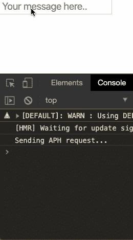

# React 中受控与非受控组件

> 原文：<https://itnext.io/controlled-vs-uncontrolled-components-in-react-5cd13b2075f9?source=collection_archive---------0----------------------->

## WTF 就是区别？


尼克·舒利亚欣在 [Unsplash](https://unsplash.com?utm_source=medium&utm_medium=referral) 上的照片

React 是一个用于构建用户界面的 JavaScript 库。如果你点击阅读了这篇文章，你可能已经知道 React 是关于组件的。组件是*反应过来的根本特征。*

*React 支持两种类型的组件:受控组件和非受控组件。React 文档声明:*

> *在大多数情况下，我们建议使用[受控组件](https://reactjs.org/docs/forms.html#controlled-components)来实现表单。在受控组件中，表单数据由 React 组件处理。另一种方法是不受控制的组件，表单数据由 DOM 本身处理。*

*让我们来看看每一个。*

## *受控组件*

*在受控组件中，表单数据由组件中的状态*处理。组件内的状态充当由组件呈现的输入元素的*“真实的单一来源】*。**

*让我们看一个代码示例。*

*这里我们有一个简单的组件，它在页面上呈现一个文本框，并回显用户在文本框中键入的任何内容。下面是它的使用情况:*

**

*运行中的受控组件！*

*如果我们看看这个组件的代码，在第 4 行我们创建了状态对象。它拥有一个名为*消息*的属性。这是文本框中输入的值的存储位置。*

*为了存储该值，我们需要一个当用户在文本框中键入时触发的事件。我们如何做到这一点？*

*如果您查看代码的第 19 行和第 20 行，您可以看到:*

1.  *textbox 有一个值属性绑定到状态中的 message 属性。*
2.  *我们声明了一个 onChange 事件处理程序。*

****这 2 点告诉你这是一个受控组件。****

****我们不需要页面上的表单元素来使组件成为受控组件。****

*当对任何具有*事件处理程序*的输入元素进行更改时，该处理程序将被触发。*

*处理程序调用 setState()，如上面第 9 行所示。这将更新组件内的状态。*

*您不应该像这样直接设置状态:*

```
*this.state.message = 'dont update state like this';*
```

*以这种方式更新状态不会导致组件的重新呈现，用户所做的更改也不会显示在 UI 中。*

*当通过 setState()进行状态更新时，它会导致组件重新呈现，新输入的值会显示在元素中。*

*数据流从组件状态到输入元素是单向的。*

*使用受控组件可能有点麻烦。如果页面上有大量的输入元素，每个元素都需要设置一个*值*属性和一个*事件处理程序*。*

## *不受控制的组件*

*不受控制的组件更像传统的 HTML 表单元素。每个输入元素的数据都存储在 DOM 中，而不是组件中。您不用为所有的状态更新编写事件处理程序，而是使用一个 ***ref*** 从 DOM 中检索值。*

*如果你想知道什么是 ***ref*** ，问得好！[来自 React 文档](https://reactjs.org/docs/refs-and-the-dom.html):*

> *Refs 提供了一种方法来访问在 render 方法中创建的 DOM 节点或 React 元素。*

*让我们看一个代码示例。*

*如果我们将上面的受控组件修改为非受控组件，我们会得到以下结果:*

*您可以看到，我们在第 4 行添加了一个构造函数，在其中我们设置了事件处理程序并创建了一个*ref*to*this . input .**

*我们在第 19 行再次引用 *this.input* ，在这里我们将它设置为 input 元素上的 *ref* 属性。有了这些部分，每次我们在文本框中输入时，值都会在控制台中回显。*

**

*我们行动中不受控制的部分！*

*关于*参考文献的几个要点:**

1.  *引用是使用 React.createRef()创建的。*
2.  *使用相关元素上的 *ref* 属性将引用附加到输入元素。*
3.  *参考通常用作元件的例证性质。ref 是在构造函数中设置的(如上所示),该值在整个组件中都可用。*
4.  *不能在 功能组件上使用 *ref* 属性 ***，因为没有创建实例。这里有一个例子:****

*5. ***但是*** ，你可以用一个 *ref* 属性 ***在*** 一个功能组件里面，就像这样:*

*[更多来自 React 文档:](https://reactjs.org/docs/refs-and-the-dom.html)*

> *有几个很好的参考用例:*
> 
> *管理焦点、文本选择或媒体播放。*
> 
> *触发命令式动画。*
> 
> *与第三方 DOM 库集成。*
> 
> *避免对任何可以声明完成的事情使用 refs。*

## *总结和要点*

1.  *尽可能使用受控部件。*
2.  *受控组件不需要表单元素即可被视为受控组件。*
3.  *如果一个组件有一个 input 元素，它的 value 属性绑定到 state，并且有一个事件处理程序来更新所述状态，那么它就是一个受控组件。*
4.  *对于具有大量输入元素的页面，使用受控组件可能会很麻烦。*
5.  *在受控组件中，数据流是单向的，组件中的状态充当唯一的真实来源。*
6.  *受控组件内的所有状态更改都应通过 setState 函数进行。*
7.  *不受控制的组件像传统的 HTML 输入元素一样将数据存储在 DOM 中。*
8.  *React.createRef()用于在不受控制的组件构造函数中创建实例变量。然后，这些变量通过 *ref* 属性与输入元素相关联。*
9.  *由于没有实例，引用不能用于 功能组件上的 ***。****
10.  *引用可以在 功能组件内使用 ***。****

*一如既往的感谢阅读！如果你喜欢这篇文章，请分享它，并查看我在 Medium 上的其他文章。*

*[](https://medium.com/@aritzcovan) [## 亚历克斯·里茨科万-中等

### 阅读 Alex Ritzcovan 在媒体上的文章。前 CTO 和软件开发人员。我热爱学习和分享…

medium.com](https://medium.com/@aritzcovan)*