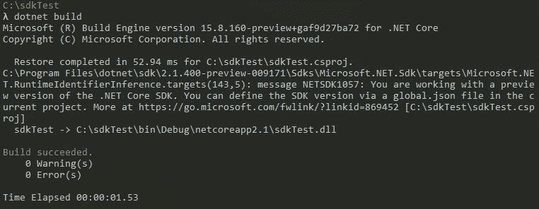
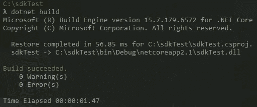

# 控制欲强。NET Core 的 SDK 版本

> 原文：<https://itnext.io/controlling-net-cores-sdk-version-5330c5472689?source=collection_archive---------2----------------------->

最近，我在构建一个示例应用程序时，注意到一个构建警告，说我正在使用。NET Core SDK。



您可以从屏幕显示中看到，构建显示零警告和零错误，但是如果您阅读完整的构建文本，您会注意到以下消息。

> NETSDK1057:您正在使用的是。NET Core SDK。您可以通过当前项目中的 global.json 文件来定义 SDK 版本。更多信息请访问[https://go.microsoft.com/fwlink/?linkid=869452](https://go.microsoft.com/fwlink/?linkid=869452)[C:\ SDK test \ SDK test . csproj]

这将教会我不要只看构建的最终结果。我没有明确安装我一直不小心使用的预览版，但我很确定它是和我安装的 [Visual Studio 预览版](https://docs.microsoft.com/en-us/visualstudio/releasenotes/vs2017-Preview-relnotes)一起安装的。

## 为项目设置 SDK 版本

点击上面消息中的链接，你将进入 [global.json](https://docs.microsoft.com/en-us/dotnet/core/tools/global-json) 的文档页面，在这里你可以指定你想要使用的 SDK 版本。使用下面的命令将给出您已经安装的 SDK 版本的列表。

```
dotnet --list-sdks
```

在我的机器上，我安装了以下 5 个 SDK。

```
2.1.201 [C:\Program Files\dotnet\sdk]
2.1.202 [C:\Program Files\dotnet\sdk]
2.1.302 [C:\Program Files\dotnet\sdk]
2.1.400-preview-009063 [C:\Program Files\dotnet\sdk]
2.1.400-preview-009171 [C:\Program Files\dotnet\sdk]
```

对于这个项目，我真的想使用版本 2.1.302，这是最新的非预览版本。使用以下内容。NET CLI 命令将创建一个针对我们想要的版本的 **global.json** 文件。

```
dotnet new globaljson --sdk-version 2.1.302
```

如果你打开新的 **global.json** 文件，你会看到下面的内容，其中 SDK 版本被设置为我们指定的值。如果您使用上述命令而没有指定版本，它将使用您计算机上安装的最新版本，包括预览版本。

```
{
  "sdk": {
    "version": "2.1.302"
  }
}
```

现在，如果您运行 build 命令，您将看到警告已经消失。



## global.json 位置

到目前为止，我们一直在项目目录中使用 **global.json** ,但这并不是其位置的唯一选项。例如，如果我将 **global.json** 从 **C:\sdkTest** 目录移动到 **C:\** 目录，那么 any。C 盘上的基于. NET Core 的应用程序将使用在那个顶级 **global.json** 中指定的版本，除非他们指定了他们自己的版本(或者在它到达 C 盘的根目录之前，在项目文件夹结构中有另一个 **global.json** )。

详情请参见正式文件中的[匹配规则](https://docs.microsoft.com/en-us/dotnet/core/tools/global-json#matching-rules)。

## 包扎

我不确定是否还有其他人在这条船上，但直到我看到上面的构建警告，我才意识到需要控制 SDK 版本。令人欣慰的是，微软团队已经使锁定 SDK 版本的能力变得简单。如果你被要求坚持使用 SDK 的[长期支持版本](https://www.microsoft.com/net/download/archives)，我可以看到这一点特别有用，目前需要你使用 1.0 或 1.1 版本。

*原载于*[](https://elanderson.net/2018/09/controlling-net-cores-sdk-version/)**。**