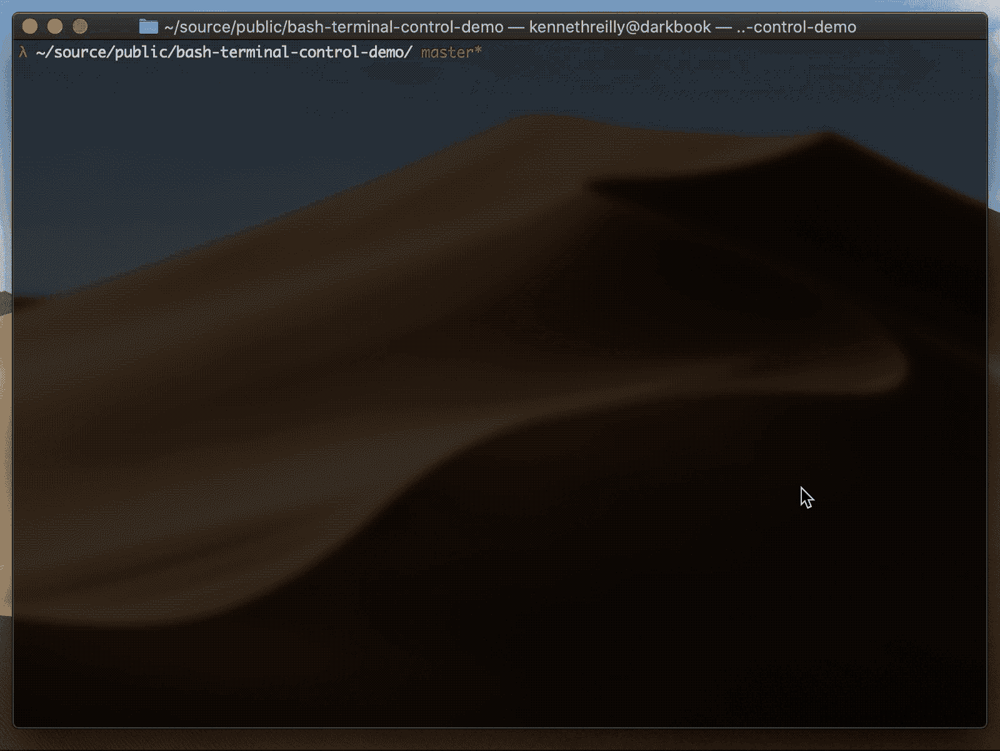

# 控制 Bash 终端屏幕

> 原文：<https://itnext.io/controlling-the-bash-terminal-screen-a50aa6121fdc?source=collection_archive---------2----------------------->

## 如何控制 CLI 终端创建基于文本的 GUI

在 MacOS 上运行的示例项目的屏幕记录

## 介绍

在图形用户界面广泛使用之前，开发人员依靠直接在终端上绘制 ASCII 字符来为系统工具、游戏和其他应用程序创建可视界面。

在本文中，我们将探索一些概念和技术，这些概念和技术可用于在纯 Bash 中直接对终端屏幕进行随机访问，而无需使用任何其他编程语言。

本文中示例项目的源代码可以在 GitHub 上的[处获得。](https://github.com/kenreilly/bash-terminal-control-demo)

运行该示例需要一个标准的 Bash 或兼容的环境。有关创建强大而高效的 Bash 脚本的介绍，请参阅本文，[Bash 脚本简介](/intro-to-bash-scripting-95c5fbc2dcef)。

## 概观

为了演示如何直接控制终端来构建定制界面，将使用以下关键概念:

*   将`.sh`资源组织成一个结构良好的项目
*   将顶层逻辑置于主程序无限循环中
*   定义输入键、输出颜色和其他变量
*   构建一个简单的渲染时钟和事件系统
*   从终端输入中读取并处理单个字符
*   在屏幕上特定的 x/y 坐标处书写字符

实际上，示例项目的操作如下:

1.  使用`source` 命令导入所需文件
2.  初始化输入和屏幕输出控制器
3.  从终端检索输入(作为方向键)
4.  根据输入移动光标字符的位置
5.  将光标(和调试信息)呈现到屏幕上

让我们来看看这个项目的源代码:

## 程序入口点

这个项目中的主文件是 **main.sh** :

首先，将一个`DEBUG`标志设置为`1`，稍后将使用它来决定是否在屏幕顶部打印一些调试信息。接下来，定义`_DIR`和`_ROOT`变量，将当前目录设置为项目根目录，然后使用`source` 命令导入程序库文件。我们将很快检查这些文件中的函数，但首先让我们看看它们在这个文件中是如何使用的:

在`main`函数中，调用`input_init`和`screen_init`函数分别初始化输入和屏幕控制器，然后主程序循环开始。

在主循环中，首先执行检查以确定屏幕是否已调整大小，如果是，则通过调用`screen_reset` 命令进行重置。接下来，`process_input`被调用来检索和处理来自终端的输入，`render_init`被调用来为绘图准备屏幕，而`render_cursor`被调用来在屏幕上绘制光标。

检查`DEBUG`变量，如果它已经被设置为`1`(在本程序中是默认的)，那么调用`print_debug`来获取调试信息。最后，调用`clock_cycle`函数，这将触发我们简单的内部计时器上的一个循环事件，我们稍后将对此进行检查。

现在让我们来看看代码库中的文件，这些文件定义了处理这个程序操作的函数和变量。

## 配置/助手功能

下一个要检查的文件是 **lib/base.sh** :

这个简单的文件定义了一个带有`delay`的 _config 变量，用于设置时钟暂停的时间长度(以秒为单位)。默认情况下，它被设置为 0.1 秒，这将导致主程序循环每秒运行(和屏幕刷新)10 次。

这里还定义了一个助手函数`str_length`，它使用内置的 shell 命令`sed`从传递给该函数的字符串中去除任何不可打印的字符，然后使用字符串操作语法`${#str}`计算并返回`str`中可打印字符的数量。

> 注:有关`sed`的更多信息，只需运行`man sed`或查看[手册页](https://www.gnu.org/software/sed/manual/sed.txt)。要了解更多关于字符串操作的信息，请参见[这本优秀的指南](https://www.tldp.org/LDP/abs/html/string-manipulation.html)。

## 定义控制台颜色

如果不在终端输出中添加一些颜色，这个例子是不完整的，这是通过使用转义序列指示终端以彩色打印下一个字符来实现的。

颜色定义以及用于设置颜色的函数都在文件 **lib/types/colors.sh** 中定义:

关联数组`color_map_16`用简单易用的名称为 16 色终端调色板的每种标准颜色定义了相应的转义序列。

颜色可以由程序的其他部分使用`set_color`函数来设置，它将为传递给函数的颜色名称打印所需的转义序列系列。如果没有提供颜色，则默认设置为白色。

## 定义输入键

接下来，让我们看看处理键输入的定义和辅助函数，它们可以在 **lib/types/keys.sh** 中找到:

这个示例项目只是在屏幕上画了一个可移动的光标，所以这里我们只关心方向键，它们被映射到带有`key_map`的转义序列，并在一个基本数组`_direction_keys`中定义(用于验证键输入)。

函数`get_key_name`获取由输入控制器检索的字符串(我们稍后将对此进行检查),并检查输入是否对应于`key_map` 中定义的键之一，如果是，则返回被按下的键的名称。类似地，`is_direction`函数接受一个键名，并根据键名是否是方向返回一个`1`或`0`。

> 注意:在这个例子中，所有可用的键名都是方向，但是在一个更复杂的项目中，这可以扩展到检查一个键是字母数字、圆括号、方括号，还是任何其他的一组键。

## 简单的时钟/事件系统

为了驱动 UI 呈现屏幕和闪烁光标的时间，需要一个简单的时钟/事件系统。这是在 **lib/services/clock.sh** 中:

`_clock_listeners`数组将存储一个对订阅了时钟事件的侦听器的引用。`_tick`变量是一个计数器，它将在每个周期递增，并在达到值 10 时复位。

程序的另一部分使用函数`clock_listen`来订阅时钟事件。这是通过传入一个函数名来实现的，这个函数名将存储在上面的`_clock_listeners`数组中。

在主程序循环的每次迭代中，都会调用`clock_cycle`函数，该函数会将`_tick`递增 1，然后在值为 10 时触发`_on_trigger`。这将把`_tick`的值重置为零，并调用作为监听器传递给`clock_listen`的每个函数。

这创建了一个非常基本的时钟和事件系统，用于驱动程序其余部分的计时。

## 处理输入

接下来，我们将检查用于检索和处理键盘输入的方法，这些方法位于文件 **lib/services/input.sh** 中:

这里我们有一个变量`_key_input`，它用来存储从终端的标准输入接收到的最后一个键，以及一个方便的转义符引用，它将用来从输入中过滤掉这些键。

`input_init`功能使用`stty`命令配置终端，以接收原始输入、回显输入字符、启用信号中断和控制流、将读取超时设置为`0`并将管道错误设置为`/dev/null`。

> 有关`stty`命令的更多信息，请参见[该资源](https://www.computerhope.com/unix/ustty.htm)。

`get_last_key`功能只是返回最后一次按下的键，而`process_input`则完全如此，并处理键盘输入，从终端读取按键，并确定它是否是用于移动光标的有效方向键。这是通过使用`read`命令从终端读取单个字符的`_read_key`函数和过滤掉空字符串和转义序列的`_parse_key`函数实现的，然后存储程序中其他控制器使用的最后一个按键 press _key_input，例如驱动光标方向，我们接下来将对此进行研究。

## 光标处理

用于管理屏幕光标的变量和函数可在文件 **lib/services/cursor.sh** 中找到:

首先，我们有两个变量用于存储光标的当前和先前位置，以及`visible`变量，该变量将在时钟周期内切换，以将光标从完全可见变为有些“透明”。

> 光标的位置已被放置在`5,5`的`x/y`坐标处，这将使其靠近屏幕的左上方(如果需要，可以更改)。

`cursor_init`函数(程序初始化时调用)将本地函数`_on_clock_tick`注册为程序时钟上的事件监听器。在每个时钟周期，光标将在两种可见性状态之间切换，产生标准的闪烁光标效果。

函数`render_cursor`从主程序循环中被调用，它将使用`_get_cursor_char`抓取光标的当前字符，并通过将字符传递到`_draw_cursor`而将其绘制在屏幕上，T6 又通过`_color_cursor`添加颜色，然后将彩色光标传递到`_draw_chars`，我们将在下一个文件中对其进行检查。

我们检查的程序的最后一部分(输入控制器)调用了函数`parse_direction` ,以确定光标移动的方向，并更新光标的本地 x/y 坐标。

## 屏幕控制器

示例项目中的最后一个文件是屏幕控制器，位于文件**lib/services/screen . sh:**中

该文件管理终端屏幕本身的各个方面，并包含几个用于跟踪屏幕当前状态的变量。变量`_screen_updated`是一个用来设置和检查屏幕是否已经更新的标志，而`_screen`是以行和列的形式存储屏幕的大小，将用来打印屏幕大小给用户。

第一次运行程序时调用`screen_init`函数，通过清除屏幕、存储当前屏幕尺寸的参考、初始化项目中使用的自定义光标，然后打印隐藏默认终端光标的转义序列`\033[?25l`来初始化屏幕。

使用`screen_resized`检查确定屏幕是否已调整大小，该检查将检查屏幕的当前行和列是否等于先前存储的值。`render_init`函数检查屏幕是否已经更新，并调用`clear`以便用新内容再次渲染。

函数`_draw_chars`由希望绘制到屏幕上的程序的其他部分使用(如本例中的光标)，通过打印一个带有直接写入转义序列`\033`的字符串，后跟所需的 x/y 坐标和要打印的字符。

如果设置了全局`DEBUG`标志，则在主程序循环中的每个渲染周期调用`print_debug`函数，并依次调用函数在右上角打印屏幕尺寸，在左上角打印程序 PID，在顶部中间打印最后一次按下的键。这些函数依靠助手`str_length`对屏幕大小和要打印的字符串长度进行计算，这样它们就会呈现在正确的位置。

## 结论

这个项目演示了如何使用简单的 Bash 脚本在终端中创建一个简单的类似 GUI 的界面，消除了在系统上安装额外的编译器或解释器的需要，并且是 Bash 脚本编写中的一个有趣的练习，演示了 Bash 脚本编写环境是多么强大。更多只使用 Bash 就能完成的任务示例，请参见[Bash 脚本简介](/intro-to-bash-scripting-95c5fbc2dcef)。

感谢您的阅读，祝您的下一个项目好运！

> 肯尼斯·雷利( [8_bit_hacker](https://twitter.com/8_bit_hacker) )是 [LevelUP](https://lvl-up.tech) 的 CTO