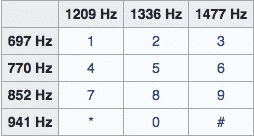
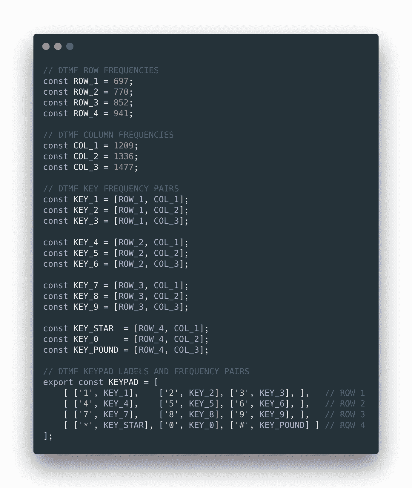
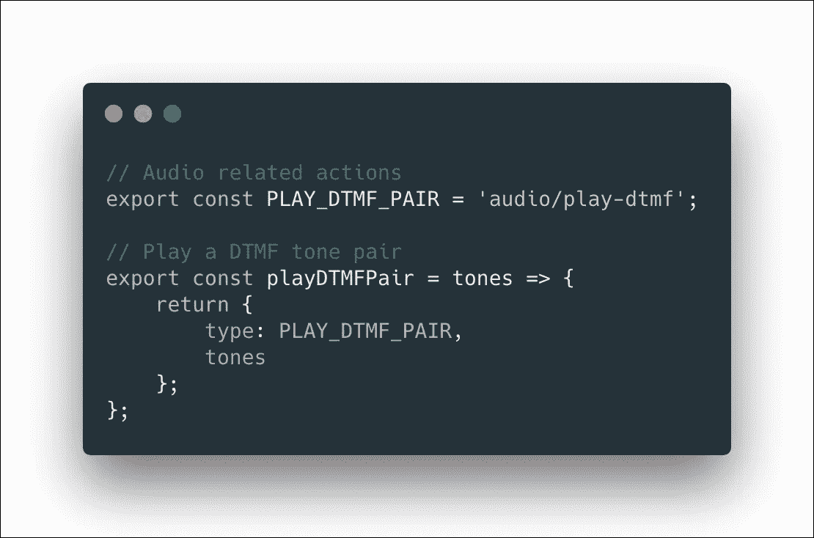
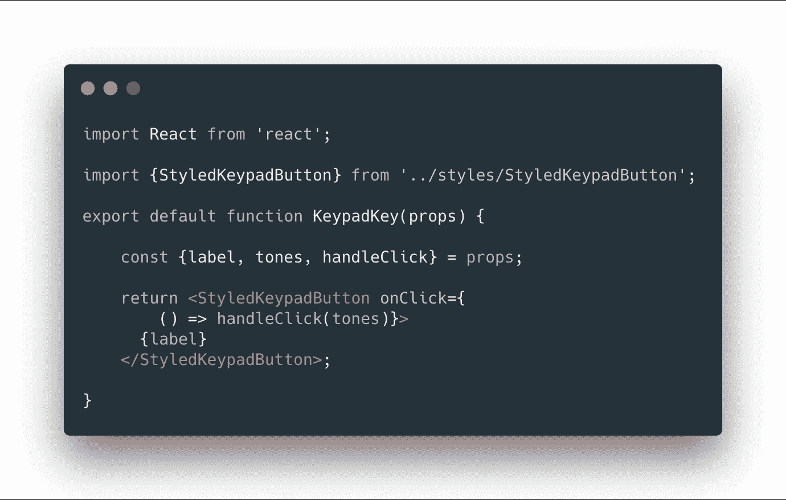
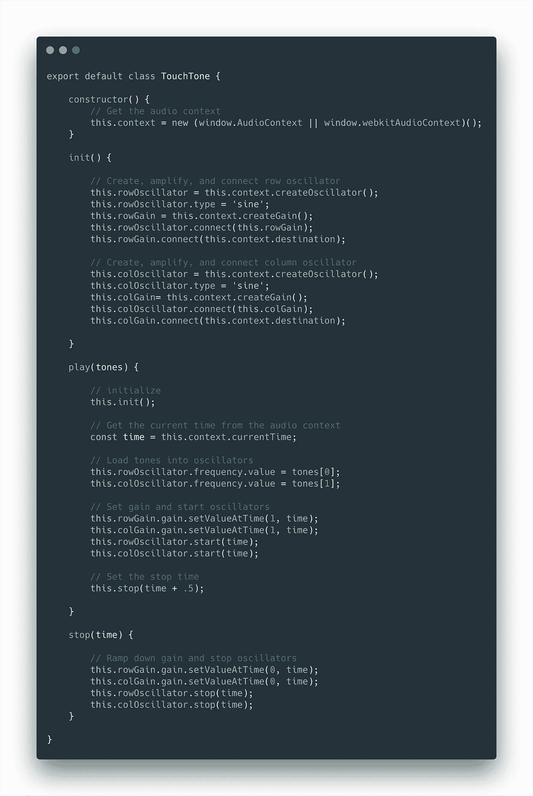
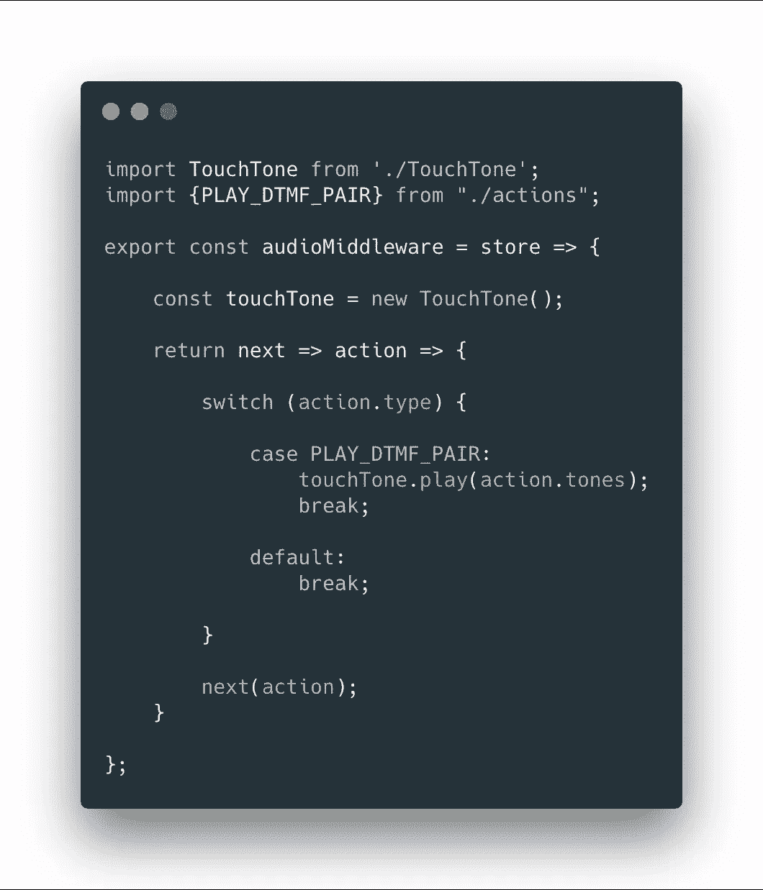

# 用 React 和 Redux 中间件控制网络音频

> 原文：<https://itnext.io/controlling-web-audio-with-react-and-redux-middleware-39b1a4b0c2ba?source=collection_archive---------0----------------------->

乔·豪普特在 Flickr 上拍摄的经典老款手机照片

# 让我们建立一个按键键盘！

如果您以前构建过 React/Redux 应用程序，您会知道单向数据流有一个标准模式。用户界面调度一个动作。一个 reducer 处理动作，返回一个新的应用程序状态。用户界面会相应地进行自我重组。

但是，如果您需要一个 Redux 动作来触发与复杂系统的交互，该怎么办呢？比如，用于创建或分析声音的网络音频组件的集合。这些不是可序列化的对象。它们不应该被减速器管理。UI 组件也不应该管理它们，因为它可能会在运行时被卸载，导致音频系统丢失。

相反，我们使用中间件，这是本文的重点。

中间件是长寿的，因此可以期望它在应用程序的生命周期内维护我们构建的任何音频系统。此外，它可以访问存储，因此它可以检查应用程序状态，响应于来自它所负责的事件(例如，Web 音频系统)分派动作，并且可以响应指示它与这样的系统交互的动作。

在这个演示中，我们将保持简单，只触发一些声音来响应一个动作。目标只是演示如何使用中间件将 Web Audio API 系统适配到 Redux 应用程序。

为了庆祝我在 12 年后于本月抛弃了我的固定电话，(将号码转移到令人敬畏的 openphone.co[在线服务)，我们将模拟一个电话按键键盘。](https://openphone.co)

如果你对此感兴趣，这里有一个快速视频教程…

# 研究问题领域

DTMF——神奇的频率

按键式电话使用一种叫做 [DTMF](https://en.wikipedia.org/wiki/Dual-tone_multi-frequency_signaling) (双音多频)的信号系统，当一个按键被按下时会触发两个独立的频率。

链接的维基百科文章包含了更多的琐事，比如“#”符号被最初的工程师称为“[八叉图](https://en.wikipedia.org/wiki/Octothorpe)”。但是，在大多数情况下，我们需要知道的信息都包含在您在这里看到的表格中。

在我们的应用程序中，一个小型 Web Audio API 系统中的两个振荡器可以产生这些频率，我们将使用一个 Redux 中间件函数作为中间人。

# 代表域

首先，我们只需要对这个神奇的频率表进行编码，这样我们就可以轻松地创建一个使用该信息的键盘。

强力方法是分别声明每个按钮，并在每个按钮的点击处理程序中硬编码适当的频率。然而，最佳的方法是整理数据，以便我们可以从中实际生成密钥板。不用说，我们在这里将选择后者。

我们首先定义行频率和列频率，然后用每个键的行和列位置的频率常数为每个键创建一个数组。最后，构建表示键盘行的数组，每个键由包含该键的标签和音调数组的数组表示。

**dtmf.js**

# UI 到中间件消息传递

在我们进入表示键盘的 UI 或播放 DTMF 音的中间件之前，让我们快速浏览一下将在两者之间发送的消息。

动作创建者`playDTMFPair`将接受上面`KEY_`常量中定义的一对音调，并返回一个`PLAY_DTMF_PAIR`类型的动作，每次按下一个键时，音调可以通过该动作从 UI 发送到中间件。

**actions.js**

# 创建用户界面

哔哔哔——哔哔哔哔

该演示是一个标准的 React/Redux 设置。此外，它使用 [React Bootstrap](https://react-bootstrap.github.io/) 和[风格的组件](https://www.styled-components.com/)来实现典型的按键键盘的外观和感觉，这些按键键盘具有紧密排列的大方形阴影按钮。您可以查看样式方面的[项目代码](https://github.com/cliffhall/react-dtmf-dialer)，但下面是用于呈现小键盘的两个主要 React 组件。

和往常一样，`App`组件是主容器。在它的`render`方法中，它创建了一个`StyledKeypad`，它基本上是一个柱状 flexbox，内容居中，有一些上边距。在里面，它为键盘的每一行呈现一个`StyledKeypadRow`容器(你猜对了，一个面向行的 flexbox)。最后，在其中的每一个中，它为行中的每个键呈现一个`KeypadKey`组件，传递一个标签、键需要触发的音调和一个动作调度器。

**App.js**

`KeypadKey`组件是一个简单的功能组件，它接受我们作为道具传递的`label`、`tones`和`handleClick`函数。它返回一个`StyledKeypadButton`，这只是一个没有轮廓的大方形引导按钮，一个可读的字体大小，以及一个调用`handleClick`函数的`onClick`处理程序，传递`tones`数组。

**KeypadKey.js**

# 网络音频 API

完整的复音合成器[已经使用网络音频 API 构建，这是其实现的惊人广度。为您的整个应用程序框架选择 React/Redux 是开始这样一个项目的好方法。相比之下，我们的演示将是微不足道的，架构可以很容易地适应这样一个宏伟的目标。](https://webaudiodemos.appspot.com/midi-synth/index.html)

如果你是新手，css-tricks 上有一个关于网络音频 API 的精彩介绍。事实上，它的一个部分构成了我们的类的基础。主要区别在于，我们在构造函数中获取音频上下文，而不是将其作为参数接受，我们创建两个振荡器，而不是一个，我们立即开始声音，而不是接受时间，我们在半秒钟后立即关闭声音，而不是以指数方式关闭。

因为我们的重点是使音频系统适应 Redux，所以我将让 css-tricks 文章描述这里提到的 Web 音频 API 的细节。

**touch one . js**

# Redux 中间件

当你第一次阅读 Redux 中间件的官方介绍时，它会很容易地扭曲你的瓜。这是因为他们在找到解决方案之前经历了一大堆“错误的方法”来做事。这就是为什么我认为有一个非常简单的例子来帮助你开始的原因。

真的一点都没那么复杂。一个简单的函数接受 Redux 存储，并返回一个接受链回调中的下一个中间件的函数。该回调接受一个动作。在该函数中，我们可以处理或忽略任何通过的动作，但是当我们完成时，我们需要调用中间件的下一个回调，将动作传递给它。

要记住的关键事情是，它将存在于应用程序的生命周期中，并且它将有机会处理任何分派的动作。这使得它成为与应用程序中不可序列化的部分(如套接字或音频组件)进行交互的完美中介。它将可以访问存储，因此您可以引用状态，并且如果需要的话，您可以从中调度操作。在我们的例子中，我们只对键盘发出的单个动作做出响应。

**middleware.js**

# 结论

显然，使用不同的接口和音频系统，这个应用程序可以实现一个音乐设备，触发比 DTMF 更令人愉快的音调。主要的焦点是如何适应这样一个系统。

在 React/Redux 应用程序中，使用中间件来控制 Web Audio API 非常容易，并且在架构上是正确的。因此，如果您从未构建过中间件，不要让 Redux 网站上令人费解的文档让您分心。

中间件中可能发生的更有雄心的事情是，它可以响应来自[音频监听器](https://developer.mozilla.org/en-US/docs/Web/API/AudioListener)或[脚本处理器节点](https://developer.mozilla.org/en-US/docs/Web/API/ScriptProcessorNode)的事件，并通过调用`store.dispatch()`来分派动作。这将允许应用程序执行音频空间化或可视化。

你可以从 GitHub 下载这个项目:[https://github.com/cliffhall/react-dtmf-dialer](https://github.com/cliffhall/react-dtmf-dialer)

*原载于 2018 年 12 月 28 日*[*cliffordhall.com*](http://cliffordhall.com/2018/12/controlling-web-audio-with-react-and-redux-middleware/)*。*