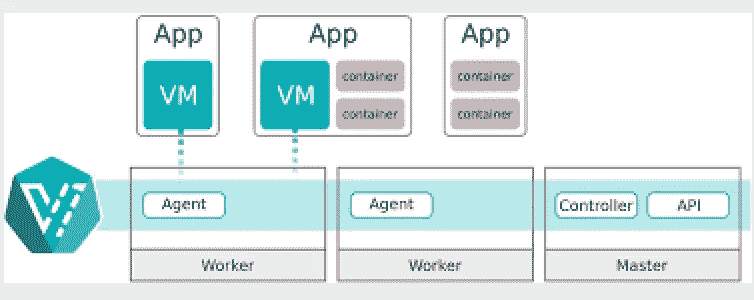
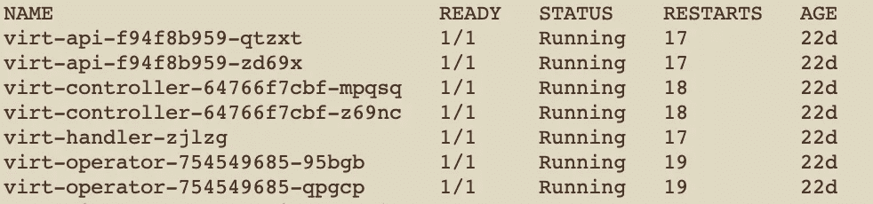
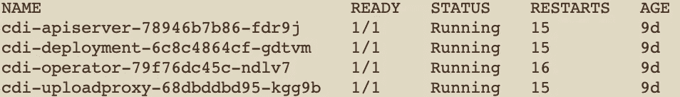
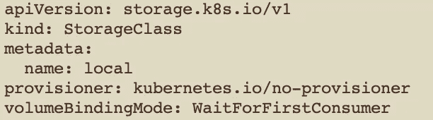
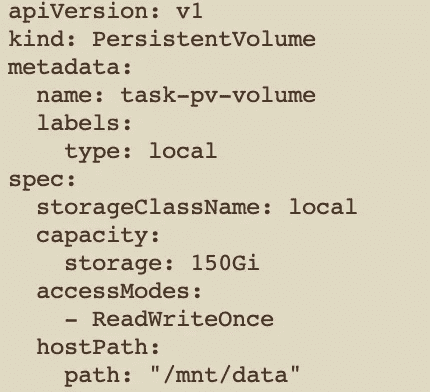
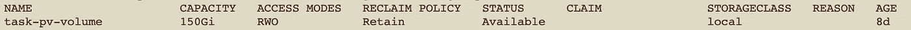
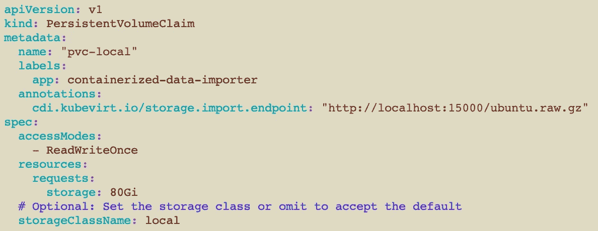
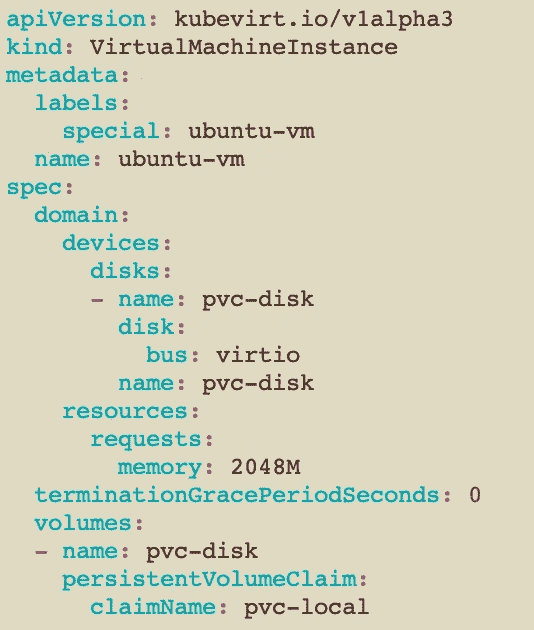

# 虚拟机和容器的融合平台？库伯维特之旅！

> 原文：<https://itnext.io/converged-platform-for-vms-and-containers-journey-to-kubevirt-be33b95e4282?source=collection_archive---------5----------------------->

在进入 KubeVirt 的细节之前，让我们了解一下对这类工具的需求。我想谈谈两个需要 KubeVirt 的场景。

首先，让我们来看一个案例，您将基于 monolith 架构的项目划分为多个微服务。在这种情况下，作为一种实践，我们不会一下子将 monolith 拆分成微服务！我们将通过在每次迭代中做一些服务来逐步实现。因此，您得到了需要两种不同平台的可部署映像的两种变体。即在某种虚拟化管理环境中运行现有的基于 monolith 的虚拟机。然后，您需要像 Kubernetes 这样的容器编排工具来部署您的微服务的提取服务。

其次，让我们来看一个案例，在不久的将来，您的项目功能无法实现容器化，例如，一些虚拟网络功能(VNF ),如负载平衡器、网关，但我们计划构建一些容器来管理或协调我们需要的 VNF。在这里，我们也需要两个平台来部署项目。

在这两个场景中，常见的问题都有成本和技能。您需要在两个不同的平台上花钱(如果您选择 vSphere 和 Kubernetes 的企业版)。那么您将需要这两个平台上的专业资源。在某些情况下，团队会发现很难采用两种不同的平台，并导致一些灵活性问题。如果我们可以在 Kubernetes 中部署和管理虚拟机，会怎么样？听起来很棒，对吧！这为专注于项目功能提供了宝贵的时间，而不是花时间去理解项目运行的平台。为了满足这些需求，KubeVirt 以救助者的身份出现。

> KubeVirt 是一个开源项目，它使得在 Kubernetes 托管的容器平台上运行虚拟机成为可能。 **KubeVirt** 通过在 Kubernetes 容器中利用 KVM(Linux 内核管理程序)来提供容器原生虚拟化。”—来自 RedHat。



融合平台:容器+虚拟机

让我们来看看在 Kubernetes 平台中启动虚拟机的过程。*我假设您已经在您的环境中部署了 Kubernetes*。要将虚拟机部署到 Kubernetes 中，您需要在 Kubernetes 平台上安装 *KubeVirt* 特定的 pod。比如，

*   KubeVirt 操作员相关 pod
*   KubeVirt 自定义资源(CRD)
*   CDI 操作员[这用于将虚拟机映像上传到您的 Kubernetes 持久卷中]
*   CDI 自定义资源(CRD 的)[您可以使用‘virtctl’命令直接上传，而不是 CDI]

要安装这些 pod，请遵循以下步骤:

```
kubectl apply -f [https://github.com/kubevirt/kubevirt/releases/download/v0.26.0/kubevirt-operator.yaml](https://github.com/kubevirt/kubevirt/releases/download/v0.26.0/kubevirt-operator.yaml)kubectl apply -f [https://github.com/kubevirt/kubevirt/releases/download/v0.26.0/kubevirt-cr.yaml](https://github.com/kubevirt/kubevirt/releases/download/v0.26.0/kubevirt-cr.yaml)kubectl apply -f [https://github.com/kubevirt/containerized-data-importer/releases/download/v1.18.2/cdi-operator.yaml](https://github.com/kubevirt/containerized-data-importer/releases/download/v1.18.2/cdi-operator.yaml)kubectl apply -f [https://github.com/kubevirt/containerized-data-importer/releases/download/v1.18.2/cdi-cr.yaml](https://github.com/kubevirt/containerized-data-importer/releases/download/v1.18.2/cdi-cr.yaml)
```

通过运行以下命令，验证所有 pod 是否正确安装，并应给出如图所示的输出。

```
kubectl get pods -n kubevirt
```



“KubeVirt”命名空间中的 kubevirt 相关窗格

```
kubectl get pods -n cdi
```



“cdi”命名空间中与 CDI 相关的窗格

现在，库伯维特起来了；将我们的虚拟机负载纳入 Kubernetes 平台。为此，我们需要 Kubernetes 端的更多配置。比如存储类、永久卷。我们知道虚拟机需要一个磁盘来启动。Kubernetes 的持久卷将充当虚拟机的磁盘。要在本地设置这个存储配置，请在您的 Kubernetes 平台上运行下面的 YAML 文件。使用' kubectl create -f<file-name-of-below-contents></file-name-of-below-contents>

要设置存储类:



通过运行以下命令进行验证:“kubectl get sc”


要设置永久卷:



通过运行“kubectl get pv”进行验证



现在，我们需要为将用作磁盘的虚拟机申请永久卷。要声明持久卷，运行以下命令，这将使用 CDI 将映像从文件主机导入到 Kubernetes 卷。源图像路径将在**cdi.kubevirt.io/storage.import.endpoint**字段中指定。



一旦映像被导入，我们就需要部署我们的虚拟机，对吗？为此，KubeVirt 公开了**kind:virtualmachine instance**。使用以下内容安装虚拟机。在我们的例子中，它将是 ubuntu 映像。



完成后，您可以使用以下命令验证正在运行的虚拟机的状态:

```
kubectl get vmi
```

您可以使用以下命令连接到虚拟机控制台:

```
virtctl console ubuntu-vm
```

> 注意:要安装 **virtctl** ，请从[https://github.com/kubevirt/kubevirt/releases](https://github.com/kubevirt/kubevirt/releases)下载插件

我们到了。我们已经设法在我们的 Kubernetes 平台上运行虚拟机，现在我们可以像往常一样在同一个平台上部署容器。希望这篇文章能为您的 KubeVirt 之旅提供一个更好的起点。

感谢马努·马修斯给我们的所有动力！:)