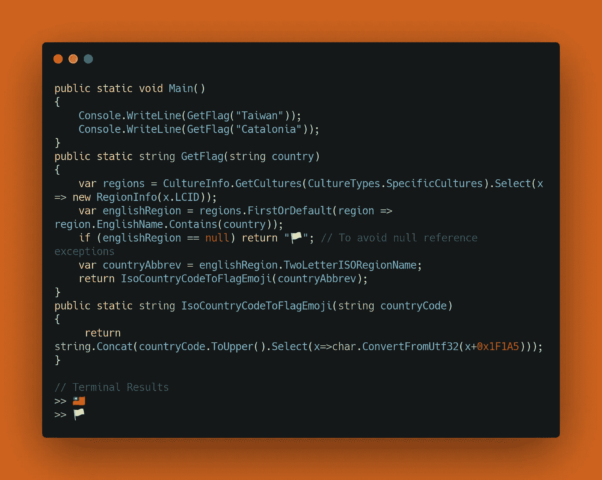
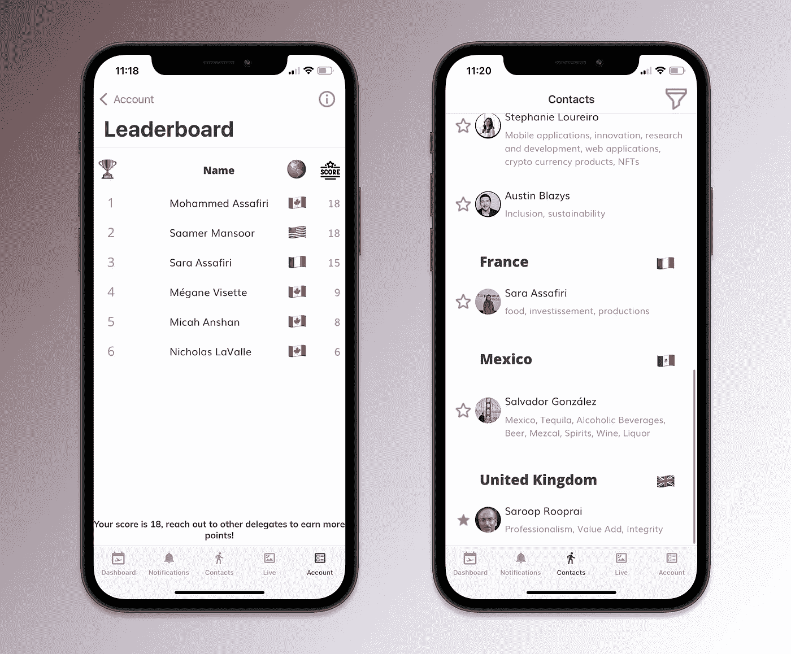

# 转换国名为国旗表情符号。网络生态系统

> 原文：<https://itnext.io/convert-country-name-to-flag-emoji-in-c-the-net-ecosystem-115f714d3ef9?source=collection_archive---------1----------------------->

## 对 CSharp 控制台使用相同的解决方案。NET Core、Blazor 或 Xamarin iOS 和 Android 应用程序

现在，让我们通过显示国旗表情符号来改善应用程序的用户体验，而不是简单的旧国名或国家代码。在国家图像文件上使用表情符号可以显著提高性能和开发效率。在您的应用程序中实现它非常容易和安全。

使用`System.Globalization`和`System.Linq`，下面是一个控制台应用程序的例子:



简单的控制台应用程序，您可以在其中测试此代码。加泰罗尼亚还不是注册国家

在关注一个 javascript 技巧论坛时，我发现了这个巧妙的技巧。但是在 C#/.NET 中找不到好的解决方案，但是在我快要放弃的 30 天后，我找到了一个非常好用的解决方案，觉得值得分享！如果您不想使用静态函数来运行它，您可以简单地调用`GetFlag()`并将国家名称传入函数:

```
public string GetFlag(string country)
{
  var regions = CultureInfo.GetCultures (CultureTypes. SpecificCultures).Select(x => new RegionInfo(x.LCID));
  var englishRegion = regions.FirstOrDefault(region => region.EnglishName.Contains(country));
  if (englishRegion == null) return "🏳";
  var countryAbbrev = englishRegion.TwoLetterISORegionName;
  return IsoCountryCodeToFlagEmoji(countryAbbrev);
}public string IsoCountryCodeToFlagEmoji(string countryCode) => string.Concat(countryCode.ToUpper().Select(x => char.ConvertFromUtf32(x + 0x1F1A5)));
```

如果你已经有了两位数的国家代码，你可以跳过`GetFlag()`，直接调用`IsoCountryCodeToFlagEmoji()`函数。

希望你觉得有用！

## 奖金 XAML 转换器代码:

对于任何喜欢转换器的人(如[Charlin](https://xamgirl.com/understanding-converters-in-xamarin-forms/)&[Ammar](https://www.c-sharpcorner.com/article/xaml-value-converter-with-simple-example/))，您可以使用这段代码将来自 ViewModel 属性的国家名称转换成表情符号:

```
public class CountryToFlagConverter : Xamarin.Forms.IValueConverter
{
    public object Convert(object value, Type targetType, object parameter, CultureInfo culture) => GetFlag((string)value);

    public object ConvertBack(object value, Type targetType, object parameter, CultureInfo culture) => value;

    private string GetFlag(string country)
    {
        var regions = CultureInfo.GetCultures(CultureTypes.SpecificCultures).Select(x => new RegionInfo(x.LCID));
        var englishRegion = regions.FirstOrDefault(region => region.EnglishName.Contains(country));
        if (englishRegion == null) return "🏳";
        var countryAbbrev = englishRegion.TwoLetterISORegionName;
        return IsoCountryCodeToFlagEmoji(countryAbbrev);
    }

    private string IsoCountryCodeToFlagEmoji(string countryCode)
        => string.Concat(countryCode.ToUpper().Select(x => char.ConvertFromUtf32(x + 0x1F1A5)));
}
```



使用[快速通道框架 it](/generating-beautiful-frames-for-your-ios-android-screenshots-instantly-5175d77a0493) 进行框架

创建转换器后，您可以[将它的键添加到任何页面的 ResourceDictionary](https://docs.microsoft.com/en-us/xamarin/xamarin-forms/app-fundamentals/data-binding/converters) 中，如下:
`<local:CountryToFlagConverter x:Key=”FlagDetermination”/>`

以下是你在 XAML 中使用它的方法:

```
<Label Text="{Binding GroupCountryName}"
       TextColor="#424242"
       HorizontalOptions="Start"
       FontFamily="OpenSansBoldFont"
       FontSize="22" />
<Label Text="{Binding GroupCountryName ,Converter={StaticResource FlagDetermination}}"
       HorizontalOptions="EndAndExpand"
       FontSize="30" />
```

有任何问题，请随时在 [Twitter](http://twitter.com/saamerm) 或 [Linkedin](http://linkedin.com/in/saamer) 联系我，并查看[我们的投资组合](https://thefirstprototype.com/mobile-app-development-windsor-ios-android.html)！此外，试试我们的测试版 [iOS BeAware 聋人应用](https://testflight.apple.com/join/3ixeJPSz)，或者我们的 YouTube 视频【Xamarin Native 入门！