# 使用 Google Vision API 将纸质笔记转换为 HTML 内容

> 原文：<https://itnext.io/convert-paper-based-notes-to-html-content-with-google-vision-api-e398fdb45cb9?source=collection_archive---------2----------------------->


照片由[晨酿](https://unsplash.com/@morningbrew?utm_source=medium&utm_medium=referral)在 [Unsplash](https://unsplash.com?utm_source=medium&utm_medium=referral) 拍摄

# 介绍

我们总是意识到几年前读到的几篇新闻文章，关于我们在电脑前花了多少时间，以及没有一个良好的文化是多么糟糕。
根据尼尔森公司 2018 年 2 月的一份[观众报告](https://sites.psu.edu/ist110pursel/2018/02/21/americans-devout-more-than-10-hours-a-day-to-screen-time-and-growing/)，美国人平均每天在屏幕前花费大约 10 小时 39 分钟，包括智能手机、电脑、视频游戏、平板电脑和电视的日常使用。与此同时，技术的更新足以帮助我们解决这个问题，至少是一步一步来。我在想怎么把这个问题和这个祝福结合起来，就想出了这个实验:在一张纸上写一篇博客文章(在外面可以很容易做到的)，拍一张照片，运行脚本转换成 HTML。其思想是使用符号和字母组合(如' #T# ')来检测什么应该是标题、副标题、图像或段落。

# 我们要建造什么

我们将构建一个程序，给定一个图像，生成一个 HTML 文件。该图像将是我们拍摄的照片，带有一些标记以解析带有一些 HTML 标签的文本。具体来说，我们将使用这种格式(请随意写自己的论文来测试您的手写书法，但您肯定可以使用下面的图像来跟进教程):

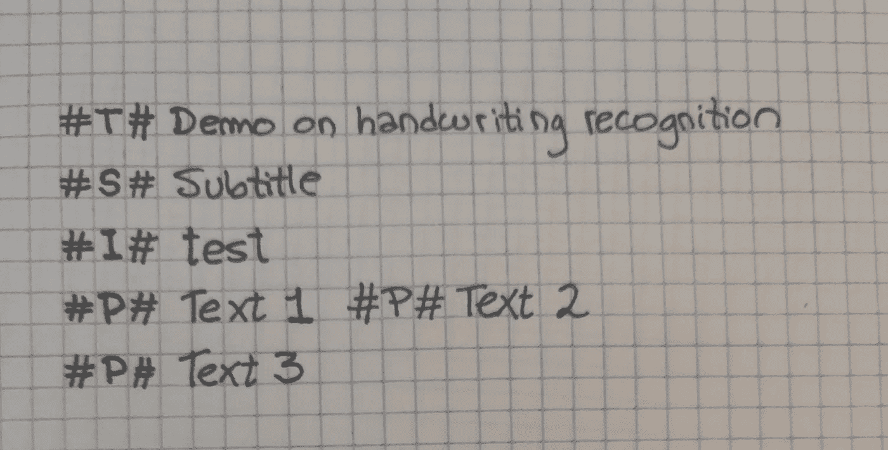

我们将转换成 HTML 的内容

因此，正如我们所看到的，我们将使用#X#符号来标识标题(#T#)、副标题(#S#)、图片(#I#)和段落(#P#)。对于图像，我们将写下我们将使用的图像的名称，而不指定格式-jpg、bmp、png-。在普通用户的用例中，在纸上书写时，他们可能还没有准备好图像来填充，所以我们将使用占位符名称。

我们将使用 Node.js 和 Google Cloud Vision 库来生成最终的 HTML 代码(跳到底部查看教程)

# 为什么选择 Google Vision API？—与宇宙魔方的比较:我的经验

老实说，谷歌的 Vision API 并不是我的第一选择。我不是简单地寻找一个工具来识别图像中的文本，而是一个识别手写单词的工具。我想先试试宇宙魔方，因为它已经有一段时间了，我从来没有机会使用它。与 Google 相反，我只需导入 Javascript 库并使用它，而无需创建云帐户、设置凭证等繁琐的任务。但是我们都知道这篇文章是关于谷歌视觉的，而不是宇宙魔方，所以…发生了什么？

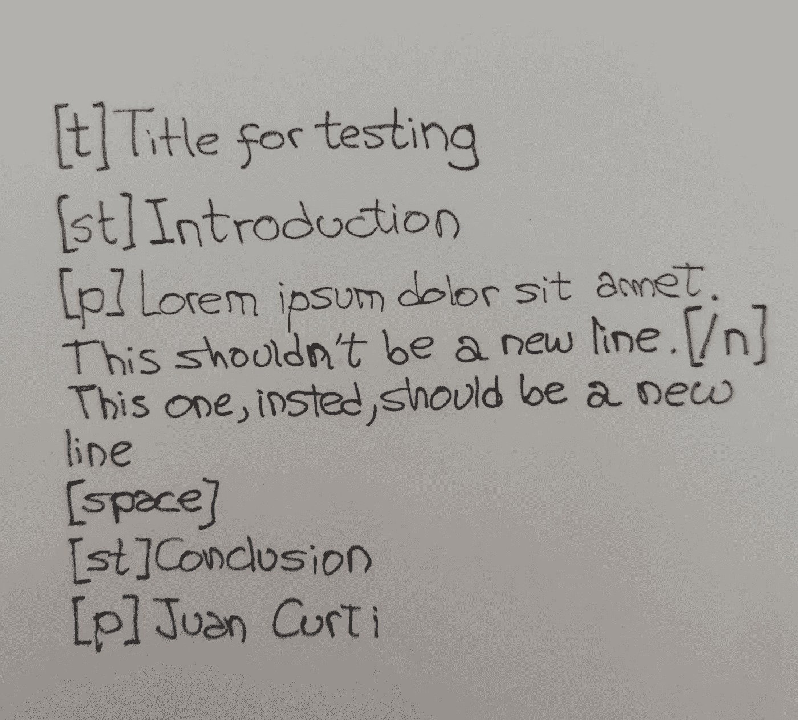

首先，我用这张图片(左)进行了尝试，使用 Node.js 的 Tesseract OCR。说实话，我超级乐观，所以我写下了几行来测试它的效果。我构建了一个 quick Node.js 应用程序来读取本地图像(本文下面的教程)，根据 Tesseract 网页上的启动和运行教程，将照片传输到我的计算机上，并进行测试。

结果如下:

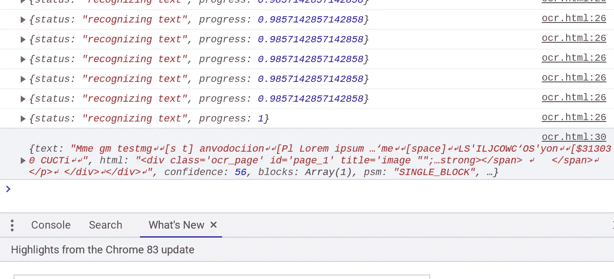

宇宙立方体识别的结果

在那个时候，我认为我的笔迹不够资格尝试，所以我写下了一系列新的线条，对字体更加小心，并再次尝试。我对一个错误感到惊讶(部分是因为内存数组)，可能是因为照片的大小(MB)，但我无法运行它。然后我开始谷歌…我带来了谷歌云视觉 API。我用新照片(左)建立了他们网站上提供的启动和运行教程(下面我会再写一个教程)

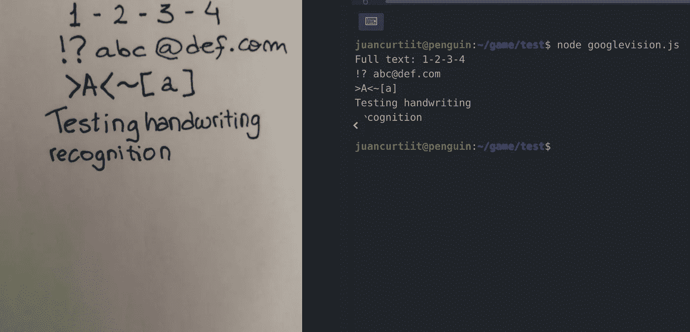

谷歌云平台愿景 API 的结果

完美！我不确定问题是出在我的电脑上(据我所知，Google analyzer 是基于云的，而不是 Tesseract)还是框架上，但在用不同种类的文字、符号、数字以及大写和非大写字母混合进行了几次测试后，我可以说它足够可靠，可以使用。

# 创建 Google 云帐户

为了开始使用谷歌服务，我们需要一个谷歌云账户。让我们打开 https://cloud.google.com/网站，点击“免费开始”:


谷歌云主页

然后，我们将被要求使用我们的谷歌(Gmail)帐户登录，选择我们的国家并接受服务条款。下一步是设置我们的客户信息，即账户类型(企业或个人)、姓名和地址以及支付方式(信用卡或借记卡)。在写这篇文章的时候，谷歌正在为在谷歌云平台上注册 12 个月的新用户免费提供 300 美元的信用。注意，谷歌使用信用卡来确保我们不是机器人，但它指定除非我们手动升级到付费帐户，否则我们不会被收费，所以好消息是我们不会醒来时收到谷歌的惊喜账单。

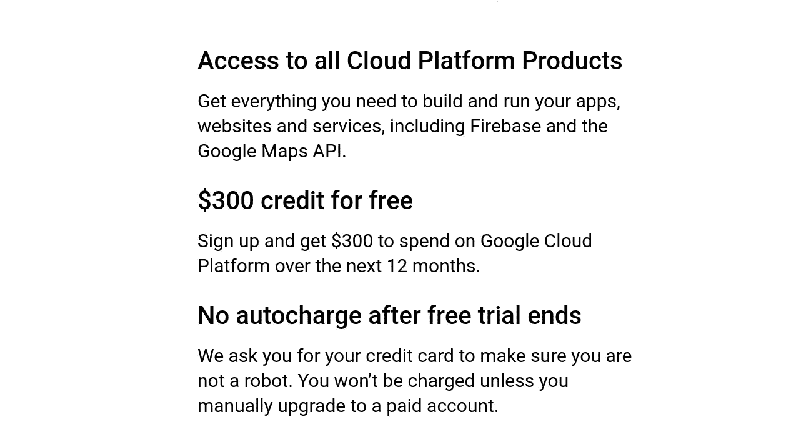

加入谷歌云平台的好处

注册后，我们可以创建一个新项目:

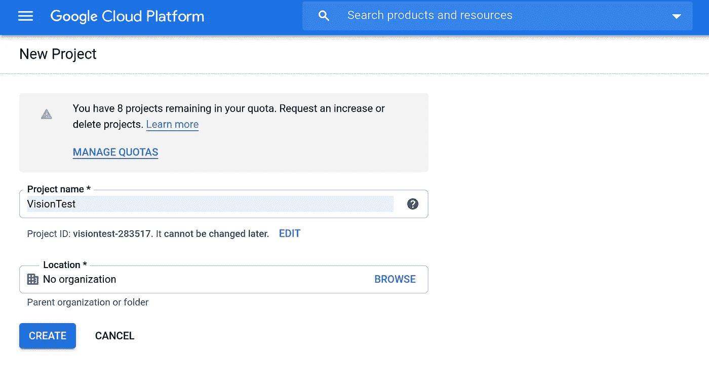

在谷歌云平台上创建新项目

创建项目后，我们需要为我们的项目激活 Google Vision API。为了更清楚地了解谷歌云提供的服务，我们点击位于屏幕左上角的汉堡菜单，就会显示一个菜单，上面列出了谷歌云提供的所有服务和工具。当我们向下滚动时，我们不仅会发现计算(例如云功能、Kubernetes、VMWare)、存储(例如 Firestore、SQL、Bigtable、Memorystore)、联网(例如 VPC 网络、网络安全)、运营(例如日志和监控)、云构建、部署管理器或云任务等工具、大数据(例如发布/订阅、数据流、物联网核心)、人工智能(例如 AI 平台、自然语言、建议 AI、**愿景**)的服务
要启用 Google Vision 的 API，我们在这里输入:[https://console . cloud . Google . com/APIs/API/Vision . Google APIs . com/overview](https://console.cloud.google.com/apis/api/vision.googleapis.com/overview)

在我们点击 **Enable API** 启用服务后，我们需要再做一步才能在我们的计算机上使用 Google Cloud services，这就是身份验证。为了实现这一点，我们将创建一个服务帐户，这是一个与我们正在建立的 Google 云项目相关联的 Google 帐户，而不是一个特定的用户。
我们将转到左上角的菜单，在 IAM & Admin 中搜索“服务账户”选项:

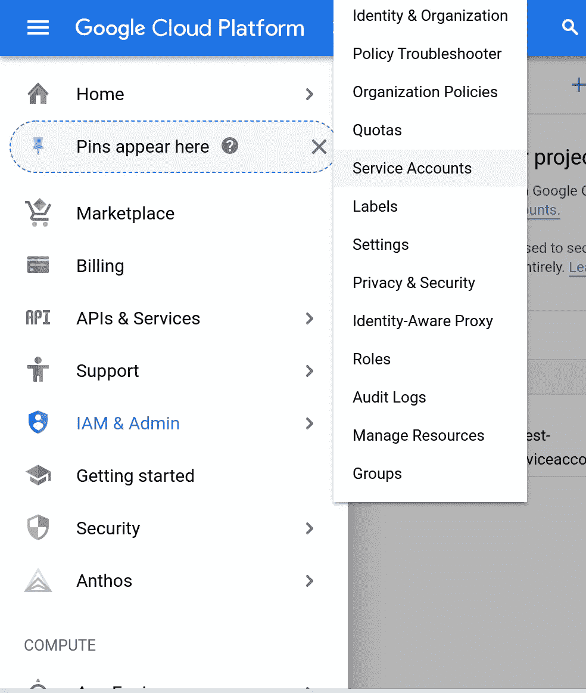

谷歌云平台菜单> IAM & Admin >服务账户

然后，我们单击“创建服务帐户”，将显示以下表单。唯一的必填字段是“服务帐户名”，它可以很容易地成为您的项目的名称:

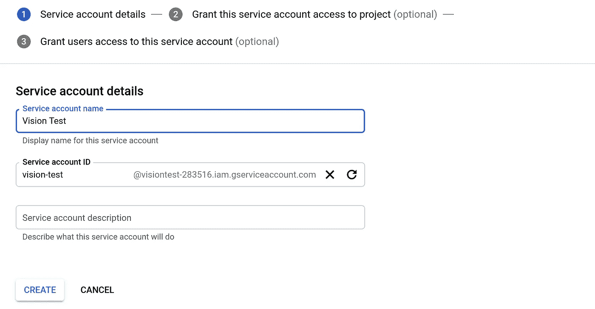

在 Google 云平台上创建服务帐户

创建服务帐户后，我们返回服务帐户列表(返回 IAM & Admin >服务帐户),并为凭据创建一个密钥:

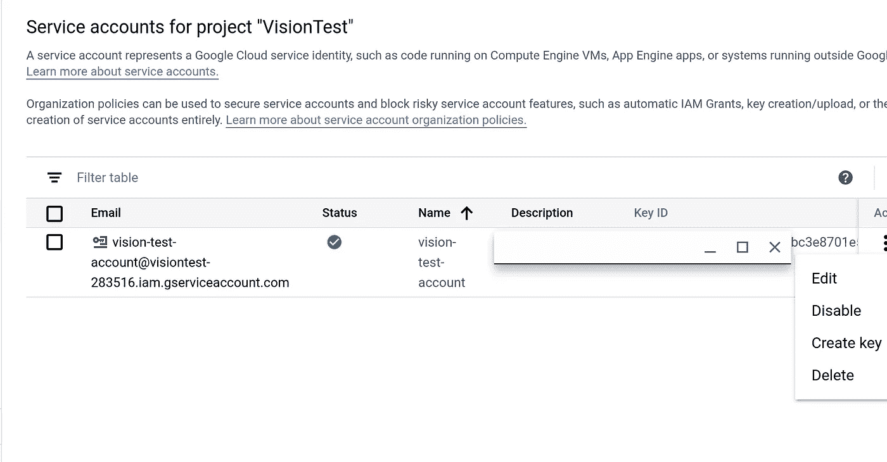

为服务帐户创建密钥选项

我们以 JSON 的形式下载密钥:

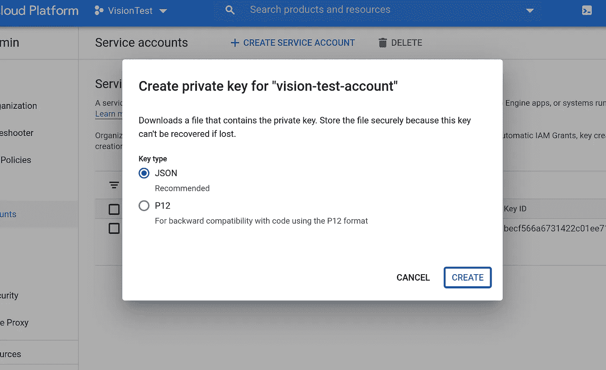

服务帐户的 JSON 下载

下一步是将私钥添加到 PATH 中，这样 Google Cloud SDK 就可以将它与我们的帐户关联起来。在我的例子中，我将该文件保存在我的软件/凭证文件夹中，因此为了引用它，我们将在~/的顶部添加。bashrc 文件:

```
export GOOGLE_APPLICATION_CREDENTIALS="/home/juancurtiit/software/credentials/visiontest-XXX-XXX.json"
```

# 安装 Google Cloud SDK

就我而言，我将跟进安装 Google Cloud SDK for Linux 的教程，因为我使用的是运行 chromeOS+Linux 的 Google Pixelbook 机器。对于其他用户，可在[https://cloud.google.com/sdk/docs/quickstarts](https://cloud.google.com/sdk/docs/quickstarts)上获得说明。

我们将打开终端并运行以下命令，从 [gcloud Debian quickstart](https://cloud.google.com/sdk/docs/quickstart-debian-ubuntu) 安装 SDK:

```
# Add the Cloud SDK distribution URI as a package source
echo "deb [signed-by=/usr/share/keyrings/cloud.google.gpg] http://packages.cloud.google.com/apt cloud-sdk main" | sudo tee -a /etc/apt/sources.list.d/google-cloud-sdk.list

# Import the Google Cloud Platform public key
curl https://packages.cloud.google.com/apt/doc/apt-key.gpg | sudo apt-key --keyring /usr/share/keyrings/cloud.google.gpg add -

# Update the package list and install the Cloud SDK
sudo apt-get update && sudo apt-get install google-cloud-sdksed -i '1iexport PATH="/usr/lib/google-cloud-sdk/bin:$PATH"' ~/.bashrc
```

现在我们可以初始化 SDK，运行 gcloud init 命令；此命令对于执行几个常见的 SDK 设置任务很有用。这些任务包括授权 SDK 工具使用您的用户帐户凭据访问谷歌云平台，并设置默认的 SDK 配置。

因此，让我们运行 init 命令:

```
gcloud init
```

我们将被要求使用您的谷歌用户帐户登录，这将打开我们的浏览器，让我们授予访问谷歌云平台资源的权限。

```
To continue, you must log in. Would you like to log in (Y/n)? Y
```

授权 GCP 后，回到终端，我们将被要求选择要使用的云项目，除非您只有一个项目:

```
Pick cloud project to use:
 [1] [my-project-1]
 [2] [my-project-2]
 ...
 Please enter your numeric choice:
```

# 编写实际代码

现在我们已经准备好编写实际的代码了！首先，需要安装 Node.js:

[](https://nodejs.org/en/download/) [## 下载| Node.js

### Node.js 是基于 Chrome 的 V8 JavaScript 引擎构建的 JavaScript 运行时。

nodejs.org](https://nodejs.org/en/download/) 

让我们创建一个文件夹:

```
mkdir googlevision
cd googlevision/
npm init --yes
```

现在我们需要导入谷歌视觉库

```
npm install @google-cloud/vision
```

构建节点应用程序的入口点:

```
touch googlevision.js
```

在同一个文件夹中，添加您为代码拍摄的照片(或下载下面的照片)。我的档案叫做 pic2.jpg


pic2.jpg

为了确保我们走的方向正确，我们将尝试获取该图像的纯文本。为了做到这一点，让我们在 googlevision.js 中添加以下代码:

```
const vision = require(‘[@google](http://twitter.com/google)-cloud/vision’);async function app(){
 const client = new vision.ImageAnnotatorClient();
 const fileName = ‘pic2.jpg’;const [result] = await client.documentTextDetection(fileName);
 const fullTextAnnotation = result.fullTextAnnotation;
 console.log(`Result: ${fullTextAnnotation.text}`);
}app();
```

运行该程序时，我们会得到以下结果:

```
node googlevision.js
```

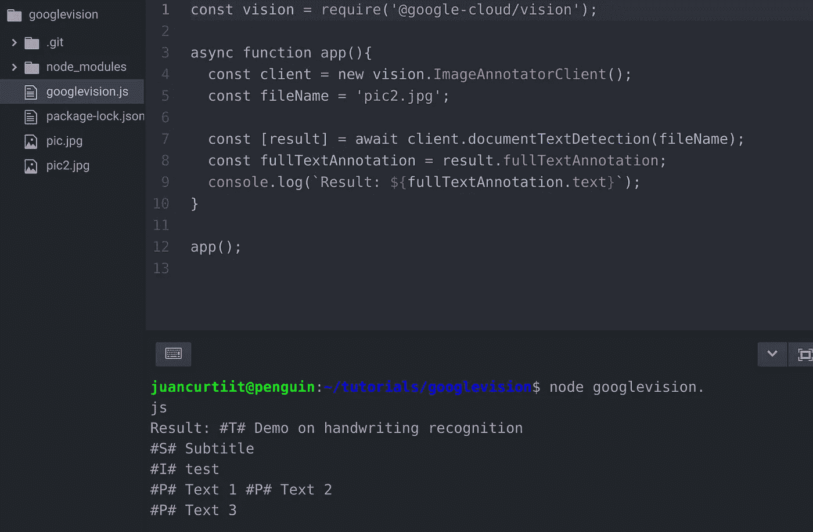

运行节点 googlevision.js 的结果

现在我们可以开始生成 HTML 了。为此，我们将创建一个助手函数(convertToHtml)。

为此，让我们替换 app 方法中的 console.log 行:

```
convertToHtml(fullTextAnnotation.text);
```

我们在 app()下面创建我们的方法:

```
function convertToHtml(text) {}
```

现在我们想澄清一些事情。在生成 HTML 之前，我们需要清理由 Google Vision API 生成的代码。例如，我(故意)添加了一行

```
#P# Text 1 #P# Text 2
```

目的是能够添加多行，在真实的纸上写一个独特的行，以便保存它，而不是浪费几页来写一篇文章。
在这种情况下，我们需要检测一行中出现不止一个符号的情况。因为我们将逐行遍历生成的文本，所以我们将利用换行符(' \n\ ')来分隔文本的各个部分。

然后，我们需要逐行迭代，并替换相应的 HTML 代码的符号。
我们将用#T#替换 H1，#S#替换 H2，#I#替换图片，#P#替换段落。您可以添加类、id、样式标签、JavaScript 调用，一切您需要的东西，以便生成更好的定制和个性化结果。

然后我们会做一个后期清理，也就是去掉开始和结束标签前后不需要的空格(比如:“”到“

”)。

我们将需要:

1.  一个名为“test”的图像，因为这是我在纸上#I# Image 标签旁边写的。我在 google 上寻找了一张随机的照片作为例子，你可以使用任何你想要的照片，只需将其重命名为 test.extension。
2.  我们需要安装 fs 模块来创建一个文件。为此，我们将安装它:

```
npm install fs — save
```

我们将其导入到 googlevision.js 文件的顶部:

```
const fs = require(‘fs’);
```

我们用以下内容填充 convertToHtml 函数:

```
function convertToHtml(text){
 //preclean
 var cleanText = text;
 [“#t#”, “#s#”, “#i#”, “#p#”].forEach((item, i) => {
 cleanText = cleanText.split(item).join(“\n”+item.toUpperCase());
 cleanText = cleanText.split(item.toUpperCase()).join(“\n”+item.toUpperCase());
 });
 cleanText = cleanText.split(“\n\n”).join(“\n”);var lines = cleanText.split(“\n”);
 var resultHTML = “<html><body>”
 var imageFormat = “.jpg”lines.forEach((line, i) => {
 var temp = line.substring(3);
 if(line.toUpperCase().includes(‘#T#’)) {
 resultHTML = resultHTML + “<h1>”+temp+”</h1>”
 }else if(line.toUpperCase().includes(‘#S#’)) {
 resultHTML = resultHTML + “<h2>”+temp+”</h2>”
 }else if(line.toUpperCase().includes(‘#I#’)) {
 resultHTML = resultHTML + “”
 }else if(line.toUpperCase().includes(‘#P#’)) {
 resultHTML = resultHTML + “<p>”+temp+”</p>”
 }
 });
 resultHTML = resultHTML + “</body></html>”//postclean
 var tags = [“<h1>”, “<h2>”, “<p>”];
 tags.forEach((tag, i) => {
 resultHTML = resultHTML.split(tag+” “).join(tag);
 var closingTag = tag.split(“<”).join(“</”);
 resultHTML = resultHTML.split(“ “+closingTag).join(closingTag);
 });
 resultHTML = resultHTML.split(“src=’ “).join(“src=’”);fs.writeFile(“test.html”, resultHTML, function(err) {
 if(err) {
 return console.log(err);
 }
 console.log(“The file was generated!”);
});
}
```

如果我们再次运行该脚本，将会生成一个 test.html 文件

```
node googlevision.js
```

结果如下:

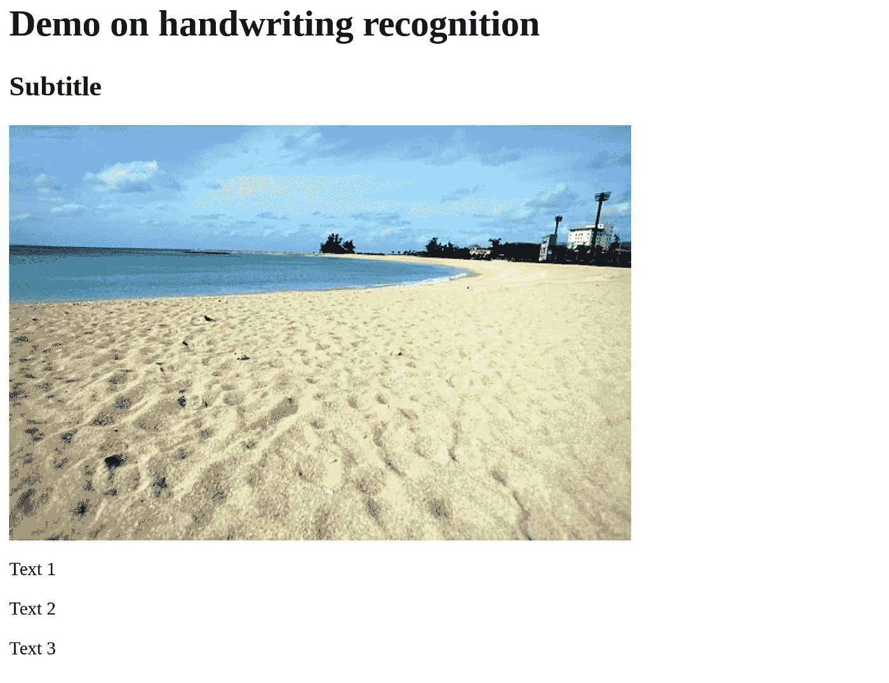

结果

# 源代码

github:[https://github.com/juancurti/tutorial_photo_to_html](https://github.com/juancurti/tutorial_photo_to_html)

# 结论

事实上，将 OCR 库(光学字符识别)与创造力相结合，最终会产生惊人的效果。如果我们修改 convert 方法，我们不仅可以生成静态数据，还可以在所有平台上自动发布，这不仅局限于设计，还可以发挥想象力。当然，我很快会做一个关于这个的教程。同时，用你自己的书法测试一下，看看这是否是你可以利用的东西。有了这个，你肯定会在屏幕前花更少的时间。