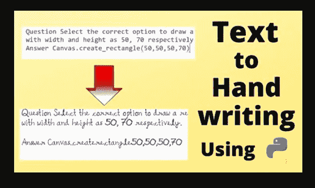
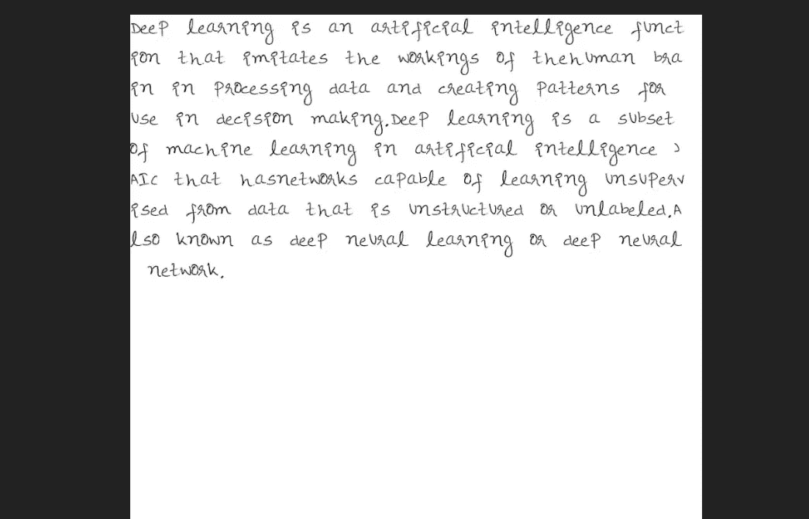
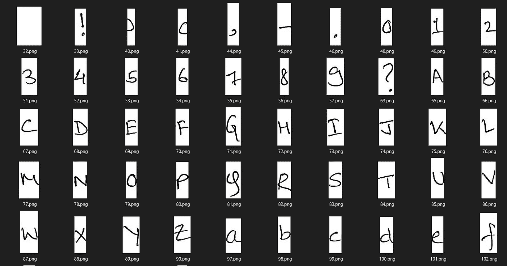

# 将文本转换为手写

> 原文：<https://itnext.io/convert-text-into-your-handwriting-91a1ed9aefd0?source=collection_archive---------2----------------------->

# 一个简单的 python 脚本将文本转换成您的笔迹



你曾经被无意义的大学/学校作业激怒过吗？太好了。！！让我们想象一下，你有一个 word 或 text 文件形式的学校写作作业，你必须自己手写完成。别担心，我会掩护你的。这个 python 脚本将把你的数字文本(写作或作业)转换成手写。

# **输入**

> 深度学习是一种人工智能功能，它模仿人脑在处理数据和创建用于决策的模式方面的工作。深度学习是人工智能(AI)中机器学习的一个子集，它具有能够从非结构化或无标签的数据中进行无监督学习的网络。也称为深度神经学习或深度神经网络。

# **输出**



输出(转换成手写的文本)

# 手写字符数据-

您必须手动创建自己的手写数据集。在纸上写字母、数字、标点符号。然后裁剪所有这些字符，并用它们各自的 [*Ascii 码*](https://www.cs.cmu.edu/~pattis/15-1XX/common/handouts/ascii.html) 保存



来源-我的电脑

# 简单的逻辑

脚本背后的逻辑非常简单明了。

*   我们只是根据我们输入的文本在一张白纸上依次粘贴角色的裁剪图像

# **代码**

通过下面的代码可以看出 Python 的强大。我们只需 25 行代码和内置模块 PIL (Python imaging library)的帮助，就可以将文本转换成我们自己的笔迹。现在让我们来看一下代码。

```
#Importing Library
from PIL import Image#Open the text file which you have to convert into handwritingtxt=open(“dummy.txt”) # path of your text file#path of page(background)photo (I have used blank page)
BG=Image.open(“myfont/bg.png”) 
sheet_width=BG.width
gap, ht = 0, 0 for i in txt.read().replace(“\n”,””):
    cases = Image.open(“myfont/{}.png”.format(str(ord(i))))
    BG.paste(cases, (gap, ht))
    size = cases.width
    height=cases.height
    #print(size)
    gap+=size
    if sheet_width < gap or len(i)*115 >(sheet_width-gap):
        gap,ht=0,ht+140print(gap)
print(sheet_width)
BG.show()
```

如你所知，我们只使用了一个名为 [PIL](https://en.wikipedia.org/wiki/Python_Imaging_Library) 的库。 **Python 图像库**是 Python 编程语言的免费开源库，增加了对打开、*操作*和保存许多不同图像文件格式的支持。通过使用内置的 *open* 方法，我们正在读取保存我们赋值的文本文件。整个过程取决于两个主要参数， *ht* 和 *gap。ht 是 y 位置，gap 是各自字符相对于原点的 x 位置(在我们的例子中是页面左上角的验尸官)*

然后我们使用 Image 类的 open 方法来读取背景图像。对于这个演示，我们使用普通的白纸，但是您可以通过添加适当的路径来使用您选择的任何其他图像。*。replace("\n "，"")方法用于移除输入文本中出现的换行符。*

现在转到循环部分，我们将遍历输入文本中的每个字符并读取相应的图像。这里是角色 ascii 码，记得我要求你保存手写字符图像和它们各自的 ascii 码。Ascii 码使得图像读取过程非常容易。函数 *ord(i)输出输入字符 i .* 的 ascii 码，其余代码简单易懂，我们只是更新变量 ht 和 gap 的值。把 *(gap，ht)* 作为游侠 *(x，y)* 的一个索引位。将每个输入字符的图像宽度加到一个*间隙变量*中。检查行宽是否超过页面宽度，如果是，则通过在 ht 变量中添加 *140 px 移动到下一行(注意宽度、高度的单位是像素)。这可能因您的情况而异，取决于手写字符和背景页面的大小。*

谢谢大家！

关注更多优秀博客:)

[请我喝杯咖啡](https://www.buymeacoffee.com/PranavK)

[*Git-Repo*](https://github.com/Pranav082001/Text-to-Handwriting)

[*Linkedin*](https://www.linkedin.com/in/pranav-kushare-ab217418a/)