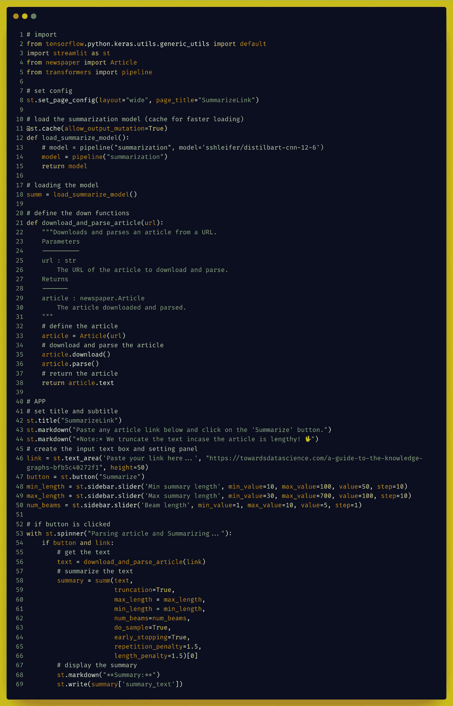
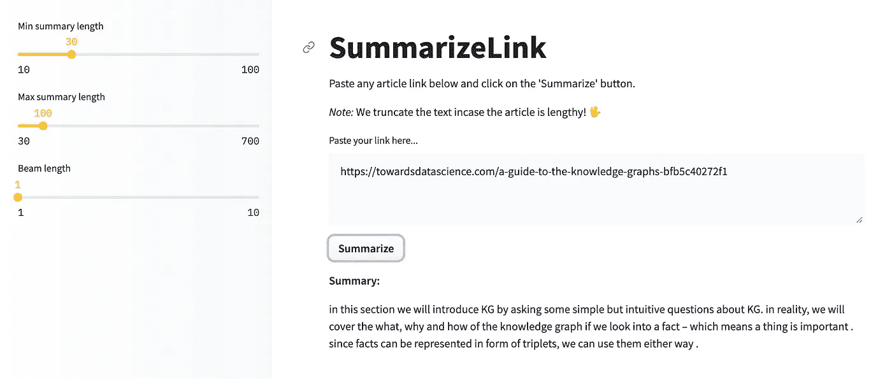
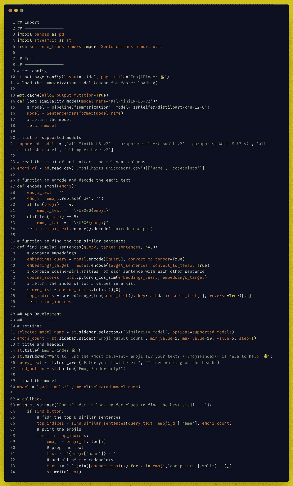
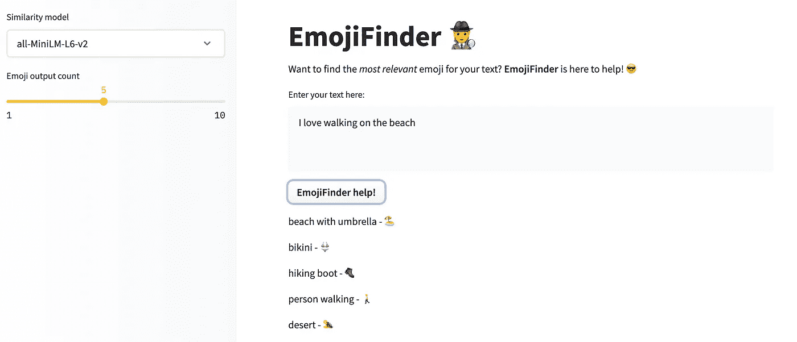

# 将你的人工智能想法转化为拥抱脸空间的工作演示

> 原文：<https://itnext.io/convert-your-ai-ideas-into-working-demos-on-hugging-face-spaces-2ba080482a16?source=collection_archive---------0----------------------->

## 拥抱脸空间是一个开源应用程序库，让你免费创建，托管和演示你的人工智能/人工智能应用程序！

照片由[米卡·鲍梅斯特](https://unsplash.com/@mbaumi?utm_source=medium&utm_medium=referral)在 [Unsplash](https://unsplash.com?utm_source=medium&utm_medium=referral) 上拍摄

# 介绍

展示您的人工智能技能从未如此简单！就在几年前，如果一个数据科学家有了一个想法，他(她)们必须从头开始工作，努力使它准确，然后以一定的价格将项目托管在云上。一个项目需要很多努力，更多的是团队努力，这是一个耗时的过程。现在呢？现在形势已经完全改变了，而且是朝着好的方向。整个过程可以在几个小时内完成！随着通用人工智能模型(如 NLP 中的语言模型和 CV 中的 CLIP)的出现以及免费应用托管平台(如[拥抱脸空间](https://huggingface.co/spaces/))的出现，所有这一切都有可能实现。

在这篇文章中，我将展示我将简单的想法转换成工作演示的旅程，并且全部在 75 行代码之内！为此，我们将介绍两个空间演示的构思和开发过程。我们开始吧！💨

# 概要链接

## 问题是

互联网是由网页链接组成的，因此许多文章、推文、LinkedIn 帖子等也包含其他网页的链接是公平的。但是打开并浏览你正在浏览的页面上的所有链接不是很繁琐吗？如果这个链接指向一篇长文章——祝你好运🤯

## 这个想法

怎么才能解决这个问题？理想情况下，如果我们有一个智能助手，可以神奇地为你总结一个链接的内容，那岂不是很棒？让我们创造一个这样的助手吧！

## 方法

为了实现这个想法，我们需要两样东西，

*   链接爬虫:打开链接(内部)并从中提取所有文本的工具。我们可以使用`newspaper3k` python 包来完成这个任务。
*   **文本摘要器:**一个 AI 模型，它将提取的文本作为输入，并生成一个小摘要。为此我们可以使用`transformers` python 包。

我们还需要为演示创建一个仪表板，为此我们可以使用`streamlit` python 包。

## 代码

完整的代码可在[这里](https://huggingface.co/spaces/mohitmayank/SummarizeLink/blob/main/app.py)获得。这也将在下面讨论，

代码[图片由作者提供]

让我们详细检查一下代码，

*   **第 1 到 5 行**:导入必要的库。
*   **第 8 行到第 18 行**:我们从设置页面标题和布局开始。然后，我们创建 transformers summarize pipeline 函数，并使用它来加载模型。
*   **第 20 行到第 38 行**:我们创建一个函数，将 URL 作为输入，将抓取的文本(链接内容)作为输出返回。
*   **第 42 行到第 50 行**:我们只是`streamlit`应用程序设计代码来放置文本，为几个设置滑块创建编辑文本框和侧栏。
*   **第 53 行到第 69 行**:这里是主要魔法发生的地方！我们首先检查是否点击了“Summarize”按钮。如果是，那么我们将编辑框的文本(包含 URL)传递给 URL 内容提取函数。我们获取内容输出，并在其上调用摘要管道。最后，我们在应用程序中打印摘要。

## 演示

带代码的工作演示可在[这里](https://huggingface.co/spaces/mohitmayank/SummarizeLink)获得。一定要去看看。此外，下面提供了一个示例图像，

概要链接演示可用[此处](https://huggingface.co/spaces/mohitmayank/SummarizeLink)[图片由作者提供]

# EmojiFinder

## 问题是

你是否曾经想用表情符号来完成你的文字，但却做不到，因为你不知道该选择哪个表情符号？我能理解，因为我们写的东西并不能明确表达我们的感受。这在我身上发生了很多，我希望有什么能帮助我。但是你知道就像他们说的，“天助自助者”⛪ *(有趣的事实:这个教堂表情符号是由 EmojiFinder 建议的，如果你引用的话！)*

## 这个想法

我们需要一个应用程序，它以文本为输入，并提供顶部“匹配”的表情符号作为输出。此外，这种“匹配”需要有一些语义相似的味道，而不是纯粹的关键字匹配*(来自上面的例子，上帝→教堂)*

## 方法

为了实现这个想法，我们需要两样东西，

*   **表情符号描述数据:**我们有一个大的表情符号集合，包含它们的名称和简短描述。UnicodeOrg 提供了这样一个列表[这里](https://unicode.org/emoji/charts/full-emoji-list.html)，这可能需要一些清理。此处提供了一个干净的 CSV 版本[。](https://huggingface.co/spaces/mohitmayank/EmojiFinder/blob/main/EmojiCharts_unicodeorg.csv)
*   **文本相似性模型:**将输入文本与表情符号的所有描述进行比较，并返回最匹配的描述。我们可以为此使用`sentence_transformers` python 包，因为他们有许多现成的模型可以执行句子相似性任务。有些型号是`all-MiniLM-L6-v2`、`paraphrase-albert-small-v2`、`paraphrase-MiniLM-L3-v2`、`all-distilroberta-v1`、`all-mpnet-base-v2`。此处提供了一个完整的列表[。](https://www.sbert.net/docs/pretrained_models.html)

我们还需要为演示创建一个仪表板，为此我们可以使用`streamlit` python 包。

## 代码

完整的代码可在[这里](https://huggingface.co/spaces/mohitmayank/EmojiFinder/tree/main)获得。这也将在下面讨论，

代码[图片由作者提供]

让我们详细检查一下代码，

*   **第 1 行到第 5 行**:加载必要的 python 包。
*   **第 7 行到第 24 行**:我们从设置页面标题和布局开始。接下来，我们定义加载句子相似度模型的函数。最后，我们加载表情符号描述 CSV，并只选择必要的列。
*   **第 27 行到第 34 行**:清理表情符号的功能，使其可以在应用程序中正常显示。
*   **第 37 到 46 行**:获取输入文本(查询)、目标句子(所有表情符号描述)，然后使用句子编码模型嵌入它们的函数。然后，使用余弦相似度为查询找到前 N 个(这里是 5 个)最相似的表情描述。它们的索引被返回。
*   **第 51 行到第 57 行**:应用设计行，包括标题、应用描述、侧边栏滑块等。
*   **第 60 行**:加载句子相似度模型。
*   **第 63 到 74 行**:我们检查按钮是否被点击。如果是，我们调用句子相似度函数，打印出最匹配的表情符号。

## 演示

带代码的工作演示可在[这里](https://huggingface.co/spaces/mohitmayank/EmojiFinder)获得。一定要去看看。此外，下面提供了一个示例图像，

EmojiFinder 演示可在此处获得[图片由作者提供]

# 结论

正如我们所见，通过创建人工智能解决方案并使用拥抱面部空间向全世界免费提供这些解决方案，解决您的日常生活问题是非常容易的*(至少是实现部分)*。两个例子都只有不到 75 行代码*(包括 UI 部分，慷慨的评论&格式)*！因此，如果你心中也有一个问题，你只需要清除制定方法的混乱，因为在那之后，人工智能社区及其庞大的开源模型和工具库已经覆盖了你！😃

你可以在 [LinkedIn](https://www.linkedin.com/in/imohitmayank) 或 [Twitter](https://twitter.com/imohitmayank) 上与我联系。更多此类文章，请访问我的[媒体主页](https://mohitmayank.medium.com/)或[个人网站](http://www.mohitmayank.com)。

干杯。