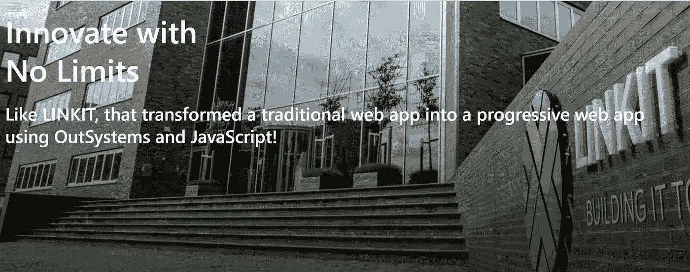

# 使用 OutSystems 和 JavaScript 将传统的 web 应用程序转换成 PWA！

> 原文：<https://itnext.io/converting-a-traditional-web-app-into-a-pwa-using-outsystems-and-javascript-f757b9dc3a06?source=collection_archive---------0----------------------->



演示:[https://simoessalvador.outsystemscloud.com/PWA/Home.aspx](https://simoessalvador.outsystemscloud.com/PWA/Home.aspx?_ts=637069171908097702)

渐进式网络应用程序(PWAs)如今不仅仅是一个时髦的词，它们是一种结合了网络和应用程序精华的令人敬畏的体验。服务工作者等现代 Web APIs 和应用外壳架构的组合，为 Web 应用提供本地应用体验。

在本教程中，我们将通过结合两种不同的技术 OutSystems(世界领先的低代码)和 JavaScript 来构建一个 PWA。为了将本教程放在上下文中，我们将从一个关于技术概念的简短解释开始。

# **低代码和外部系统**

简单地说，低级代码就是将现有代码的可视块拖放到工作流中以创建应用程序的过程。这项技术旨在为商业用户和专业开发人员服务。

对于商业用户或“公民开发人员”来说，OutSystems 能够在 IT 专业人员有经验的指导下创建有用的设计应用程序。

对于熟练的开发人员来说，它可以加快工作速度和更好的治理，从而使那些专业人员更加高效并专注于解决业务需求。

# **PWA**

它们可以被描述为离线优先的移动应用或网页的移动优化版本，类似于常规应用，但排除了必须从应用商店下载的不便。渐进式的含义来自于这样一个概念，即这些应用消除了 web 和移动中相同应用的体验之间的摩擦。

# 我们是怎么做到的？

所以我们从在 OutSystems 中创建一个非常简单的传统 web 应用程序开始，只有一个模块和一个屏幕，上面有一些显示文本的卡片……这里没什么特别的。

之后，我们创建了一个 manifest 文件(文件的格式/语言是 JSON，扩展名可以是。json 或者。manifest ),它包含诸如名称、显示类型、语言、开始 URL、图标等信息。正如您在下面看到的，这个文件中有两个图标。这些图标需要作为资源添加到您的 OutSystems 应用程序中，并部署到目标目录中，以便可以从这个文件中引用它们。

```
{
  "dir": "ltr",
  "lang": "en",
  "name": "OutSystems PWA is cool!",
  "scope": "/PWA",
  "display": "standalone",
  "start_url": "https://simoessalvador.outsystemscloud.com/PWA/Home.aspx",
  "short_name": "OutSystems PWA",
  "theme_color": "#039dfc",
  "description": "How to convert a traditional web app into a progressive web app using OutSystems and open source",
  "orientation": "any",
  "background_color": "transparent",
  "icons": [
    {
      "src": "/PWA/manifest-icon-192.png",
      "sizes": "192x192",
      "type": "image/png"
    },
    {
      "src": "/PWA/manifest-icon-512.png",
      "sizes": "512x512",
      "type": "image/png"
    }
  ],
  "generated": "true"
}
```

manifest 文件主要负责使应用程序独立，这意味着它定义了当它被添加到主屏幕时将如何启动。

下一步是生成启动图像和应用程序图标，并将其作为资源添加到 OutSystems 应用程序中。当您的应用程序打开时，将使用这些图像来增加与用户的互动。我们使用了一个生成器来自动创建这些图像；你可以在这里找到关于这个生成器的更多信息，这个生成器由 nder Ceylan 构建:[https://it next . io/pwa-splash-screen-and-icon-generator-a 74 ebb 8 a 130](/pwa-splash-screen-and-icon-generator-a74ebb8a130)

到目前为止，我们已经有了一个 OutSystems 传统 web 应用程序，它有一个屏幕、几个闪屏图像、一些图标和一个包含配置的清单文件。

一旦这些都准备好了，我们就可以将这些信息注入到 HTML 页面头中。我们发现最快捷的方法是在准备屏幕时使用名为“AddPostProcessingFilter”的 OutSystems 操作，并搜索标记“”并用以下内容替换它:

```
"</title>
<link rel='manifest' href='/PWA/Manifest.manifest'>

<link rel='apple-touch-icon' sizes='180x180' href='/PWA/apple-icon-180.png'>
<link rel='apple-touch-icon' sizes='167x167' href='/PWA/apple-icon-167.png'>
<link rel='apple-touch-icon' sizes='152x152' href='/PWA/apple-icon-152.png'>
<link rel='apple-touch-icon' sizes='120x120' href='/PWA/apple-icon-120.png'>

<meta name='apple-mobile-web-app-capable' content='yes'>
<link rel='apple-touch-startup-image'
    href='/PWA/apple-splash-2048-2732.png'
    media='(device-width: 1024px) and (device-height: 1366px) and (-webkit-device-pixel-ratio: 2) and (orientation: portrait)'>
<link rel='apple-touch-startup-image'
    href='/PWA/apple-splash-2732-2048.png'
    media='(device-width: 1024px) and (device-height: 1366px) and (-webkit-device-pixel-ratio: 2) and (orientation: landscape)'>
<link rel='apple-touch-startup-image'
    href='/PWA/apple-splash-1668-2388.png'
    media='(device-width: 834px) and (device-height: 1194px) and (-webkit-device-pixel-ratio: 2) and (orientation: portrait)'>
<link rel='apple-touch-startup-image'
    href='/PWA/apple-splash-2388-1668.png'
    media='(device-width: 834px) and (device-height: 1194px) and (-webkit-device-pixel-ratio: 2) and (orientation: landscape)'>
<link rel='apple-touch-startup-image'
    href='/PWA/apple-splash-1668-2224.png'
    media='(device-width: 834px) and (device-height: 1112px) and (-webkit-device-pixel-ratio: 2) and (orientation: portrait)'>
<link rel='apple-touch-startup-image'
    href='/PWA/apple-splash-2224-1668.png'
    media='(device-width: 834px) and (device-height: 1112px) and (-webkit-device-pixel-ratio: 2) and (orientation: landscape)'>
<link rel='apple-touch-startup-image'
    href='/PWA/apple-splash-1536-2048.png'
    media='(device-width: 768px) and (device-height: 1024px) and (-webkit-device-pixel-ratio: 2) and (orientation: portrait)'>
<link rel='apple-touch-startup-image'
    href='/PWA/apple-splash-2048-1536.png'
    media='(device-width: 768px) and (device-height: 1024px) and (-webkit-device-pixel-ratio: 2) and (orientation: landscape)'>
<link rel='apple-touch-startup-image'
    href='/PWA/apple-splash-1242-2688.png'
    media='(device-width: 414px) and (device-height: 896px) and (-webkit-device-pixel-ratio: 3) and (orientation: portrait)'>
<link rel='apple-touch-startup-image'
    href='/PWA/apple-splash-2688-1242.png'
    media='(device-width: 414px) and (device-height: 896px) and (-webkit-device-pixel-ratio: 3) and (orientation: landscape)'>
<link rel='apple-touch-startup-image'
    href='/PWA/apple-splash-1125-2436.png'
    media='(device-width: 375px) and (device-height: 812px) and (-webkit-device-pixel-ratio: 3) and (orientation: portrait)'>
<link rel='apple-touch-startup-image'
    href='/PWA/apple-splash-2436-1125.png'
    media='(device-width: 375px) and (device-height: 812px) and (-webkit-device-pixel-ratio: 3) and (orientation: landscape)'>
<link rel='apple-touch-startup-image'
    href='/PWA/apple-splash-828-1792.png'
    media='(device-width: 414px) and (device-height: 896px) and (-webkit-device-pixel-ratio: 2) and (orientation: portrait)'>
<link rel='apple-touch-startup-image'
    href='/PWA/apple-splash-1792-828.png'
    media='(device-width: 414px) and (device-height: 896px) and (-webkit-device-pixel-ratio: 2) and (orientation: landscape)'>
<link rel='apple-touch-startup-image'
    href='/PWA/apple-splash-1242-2208.png'
    media='(device-width: 414px) and (device-height: 736px) and (-webkit-device-pixel-ratio: 3) and (orientation: portrait)'>
<link rel='apple-touch-startup-image'
    href='/PWA/apple-splash-2208-1242.png'
    media='(device-width: 414px) and (device-height: 736px) and (-webkit-device-pixel-ratio: 3) and (orientation: landscape)'>
<link rel='apple-touch-startup-image'
    href='/PWA/apple-splash-750-1334.png'
    media='(device-width: 375px) and (device-height: 667px) and (-webkit-device-pixel-ratio: 2) and (orientation: portrait)'>
<link rel='apple-touch-startup-image'
    href='/PWA/apple-splash-1334-750.png'
    media='(device-width: 375px) and (device-height: 667px) and (-webkit-device-pixel-ratio: 2) and (orientation: landscape)'>
<link rel='apple-touch-startup-image'
    href='/PWA/apple-splash-640-1136.png'
    media='(device-width: 320px) and (device-height: 568px) and (-webkit-device-pixel-ratio: 2) and (orientation: portrait)'>
<link rel='apple-touch-startup-image'
    href='/PWA/apple-splash-1136-640.png'
    media='(device-width: 320px) and (device-height: 568px) and (-webkit-device-pixel-ratio: 2) and (orientation: landscape)'>"
```

通过这一步，我们完成了 PWA 的独立功能。

# 但是 PWA 不仅仅是你的网络应用程序的快捷方式

出于同样的原因，我们决定实现一个服务工作者来缓存信息，并使我们的应用程序加载更快。我们决定实现缓存，但我们也可以实现服务人员可用的任何其他 Web API，目的是实现一个作为示例。

因此，我们访问了[https://developers.google.com/web/tools/workbox/](https://developers.google.com/web/tools/workbox/)，并决定实施缓存优先战略。我们为服务工作者实现创建了一个新的 js 文件，其内容如下:

```
importScripts('https://storage.googleapis.com/workbox-cdn/releases/4.1.0/workbox-sw.js');

if (workbox) {
  console.log(`Yay! Workbox is loaded`);

  const shellHandler = new workbox.strategies.CacheFirst({
    cacheName: 'shell',
    plugins: [
      new workbox.cacheableResponse.Plugin({
        statuses: [0, 200]
      }),
      new workbox.expiration.Plugin({
        maxEntries: 60,
        maxAgeSeconds: 7 * 24 * 60 * 60, // 7 Days
      }),
    ]
  });

  const imageHandler = new workbox.strategies.CacheFirst({
    cacheName: 'images',
    plugins: [
      new workbox.expiration.Plugin({
        maxEntries: 60,
        maxAgeSeconds: 30 * 24 * 60 * 60, // 30 Days
      }),
    ],
  });  

  const fontHandler = new workbox.strategies.CacheFirst({
    cacheName: 'font',
    plugins: [
      new workbox.expiration.Plugin({
        maxEntries: 60,
        maxAgeSeconds: 365 * 24 * 60 * 60, // 365 Days
      }),
    ],
  });

  const htmlHandler = new workbox.strategies.StaleWhileRevalidate({
    cacheName: 'index',
    plugins: [
      new workbox.expiration.Plugin({
        maxEntries: 60,
        maxAgeSeconds: 10 * 60 * 60, // 10 Minutes
      }),
    ],
  });

  // image responses
  workbox.routing.registerRoute(
    /\.(?:png|gif|jpg|jpeg|svg)$/,
    imageHandler,
  );

  // html responses
  workbox.routing.registerRoute(
    /.*(?:aspx|html|htm)$/,
    htmlHandler,
  );

   workbox.precaching.precacheAndRoute([
    '/PWA/Theme.PWA.extra.css',
    '/PWA/Theme.PWA.css',
    '/EPA_Taskbox/Blocks/EPA_Taskbox/Inbox_Flow/Inbox.css',
    '/OutSystemsUIWeb/Theme.BaseTheme.css',
    { url: '/PWA/Home.aspx', revision: 'abcd1234' },
  ], {
    // Ignore all URL parameters.
    ignoreURLParametersMatching: [/.*/]
  });

  workbox.routing.registerRoute(
    new RegExp('.*(Theme.FontAwesome.css|Icon.css)|.*.(woff|woff2|eot|ttf).*'),
    fontHandler
  );

} else {
  console.log(`Boo! Workbox didn't load`);
}
```

这个脚本中有一个很小但非常重要的部分我们想强调一下；CSS 文件必须包含在服务工作者缓存策略中，作为应用程序外壳缓存的一部分，如果没有这个神奇的步骤，应用程序将无法按照您的预期呈现。

一旦我们的服务工作者文件准备好了，它就可以被上传，同样可以被包含在应用程序的资源中，并被部署到目标目录，就像我们对清单文件所做的那样。此服务工作者文件必须通过调用 navigator . service worker . register 注册到您的应用程序。这可以通过在页面的 HTML head 部分添加以下脚本块来完成:

```
<script type='text/javascript'> 
if ('serviceWorker' in navigator) {
  window.addEventListener('load', function() {
    navigator.serviceWorker.register('/PWA/sw.js');
  });
}
</script>
```

瞧啊！

这段经历是由 Ceylan 和 Ruben Bonito 共同完成的！

演示:[https://simoessalvador.outsystemscloud.com/PWA/Home.aspx](https://simoessalvador.outsystemscloud.com/PWA/Home.aspx?_ts=637069171908097702)