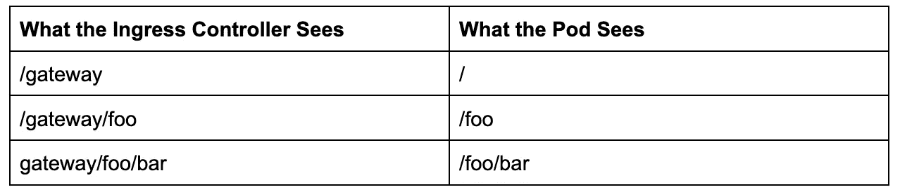
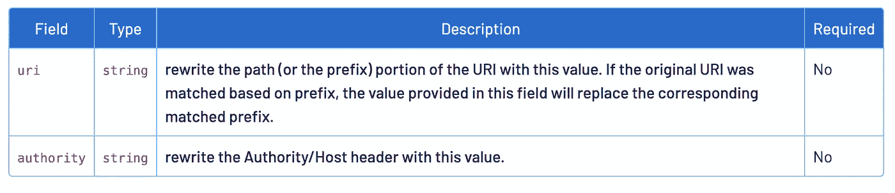

# 将入口对象转换为 Istio 虚拟服务 HTTP 路由

> 原文：<https://itnext.io/converting-ingress-objects-to-istio-virtual-service-http-routes-5461d3b2f928?source=collection_archive---------1----------------------->

# 介绍

本文将研究如何将普通入口对象转换成 Istio 虚拟服务 HTTP 路由。它不会深入研究为什么这可能是必要的，也不会深入研究 Istio 的任何特定特性。

# 问题描述

将只使用前缀的对象从 ingress 转换到 Istio 非常简单。当 Nginx 重写目标用于被转换的对象时，事情变得有点棘手。Istio 虚拟服务文档非常好，涵盖了流量如何通过网关转发。

# 提示、技巧和须知

根据 [Istio 文档](https://istio.io/latest/docs/reference/config/networking/virtual-service/#VirtualService)，HTTP 路由是“HTTP 流量的有序路由列表。将使用与传入请求匹配的第一个规则。Istio 将应用一个虚拟服务，它带有一个永远不会被命中的前缀，而且还会提供一条非常有用的消息，直接说明这一点。

下面的虚拟服务示例将用于触发错误:

关于这个虚拟服务，需要注意的重要一点是“/”被定义为“/api”之前的前缀，这意味着第一个 HTTP 路由将捕获每个请求，甚至是那些发往“/api”的请求。

不出所料，生成了一个警告。

```
[root@server:~]$ kubectl apply -f virtual-service-warning.yaml**Warning:** virtualService rule "slash-api" match #0 of prefix /api is not used (duplicate/overlapping match in rule #0 of prefix / on "slash")virtualservice.networking.istio.io/example-vs created[root@server:~]$
```

所以 Istio 会很乐意让你创建一个虚拟服务，有一个永远不会被击中的路线，就像…

# 重写目标

棘手的部分来自重写目标，使用重写目标是为了将 URL 从入口控制器看到的内容更改为 pod 期望看到的其他内容。

## Nginx

Nginx 重写目标的方式是通过入口对象上的注释。

Nginx 入口对象

这个入口物体是旧的，但它启发了这篇文章，所以我们继续使用它。入口 API 版本现在是 networking.k8s.io/v1.。另一个需要注意的关键是，从 [K8s 1.18](https://kubernetes.io/blog/2020/04/02/improvements-to-the-ingress-api-in-kubernetes-1.18/) 开始， [pathType](https://kubernetes.io/docs/concepts/services-networking/ingress/#path-types) 是一个必需的参数。

此规则的作用是捕获进入入口控制器的所有流量，匹配以“/gateway/”开头的任何内容，删除“/gateway/”，然后将请求传递到 pod。如果在“/gateway/”之后有 URI 的附加部分，则当请求被传递到 pod 时，该部分仍然是 URI 的一部分。希望一个例子能让事情更清楚。



重写目标示例

这个行为是通过要点第 6 行的注释来完成的，这个“/$2”是一个捕获组，它是正则表达式中的一个构造(进一步阅读[这里的](https://kubernetes.github.io/ingress-nginx/examples/rewrite/#rewrite-target))。在这个正则表达式位上放一个大头针，它会回来的。

## 伊斯迪奥

现在考虑如何在 Istio 中实现这一点，注意力转向 [Istio 虚拟服务](https://istio.io/latest/docs/reference/config/networking/virtual-service/)，因为这是控制流量如何路由的对象，特别是在虚拟服务定义的“http”部分。进一步查看虚拟服务文档,“http”部分中的每个流量路由条目都必须有“match”定义，它告诉 Istio 作为规则的一部分应该路由什么流量。“匹配”部分可以可选地包括“uri”部分，其中定义了要被路由的 URL 路径。用于 [URI 匹配的选项是 exact/prefix/regex](https://istio.io/latest/docs/reference/config/networking/virtual-service/#HTTPMatchRequest) ，如果您停止阅读这里的文档，您可能倾向于使用 regex 路径来转换本文中提到的初始入口对象。尝试谷歌如何像这样转换对象可能会导致自定义特使过滤器被创建的道路。有人甚至在 Istio repo 中打开了一个问题,要求内置该功能。

通读文档并不完全清楚的是，与 ingress 对象完全一样的路由这种流量的能力已经得到支持，而无需做任何太花哨的事情，实现这一点的 Istio 配置如下:

但是等等…只是一个前缀 URI 类型，URI 的其余部分是如何被捕获的？同样，文档对此并不完全清楚。这在某种程度上暗示了 URI 的其余部分在重写后被保留，而没有明确地声明它:



Istio 文档片段

比赛的类型是令人困惑的部分。在原始入口对象的匹配逻辑中使用了正则表达式，这可以理解地导致人们认为“regex”是这里使用的合适的 URI 匹配类型。这将潜在地引导我们了解如何在原始入口对象中复制注释的'/$2 '部分。同样，上面使用“前缀”的 URI 匹配的 Istio 虚拟服务定义将在没有任何正则表达式的情况下完成工作。

# 包裹

这里最重要的一点是，Istio 虚拟服务通过使用“前缀”URI 类型来支持 Nginx 入口对象的 regex 样式捕获组。为了在 Istio 中获得相同的功能，不需要正则表达式 URI 类型。

和乔丹·麦克林托克一起调试这个问题很有趣。