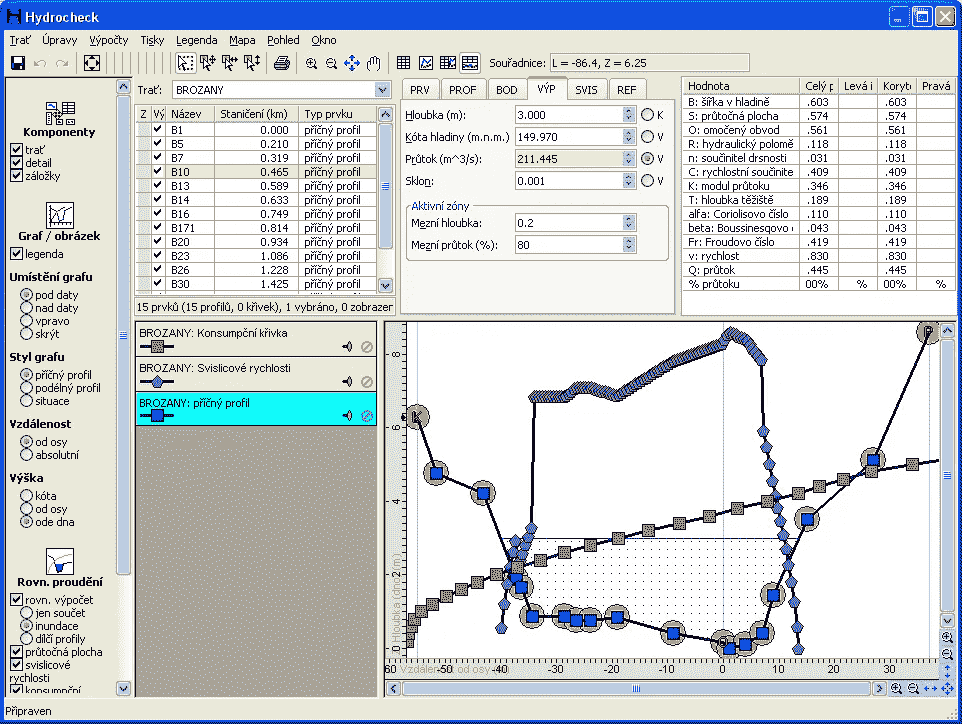
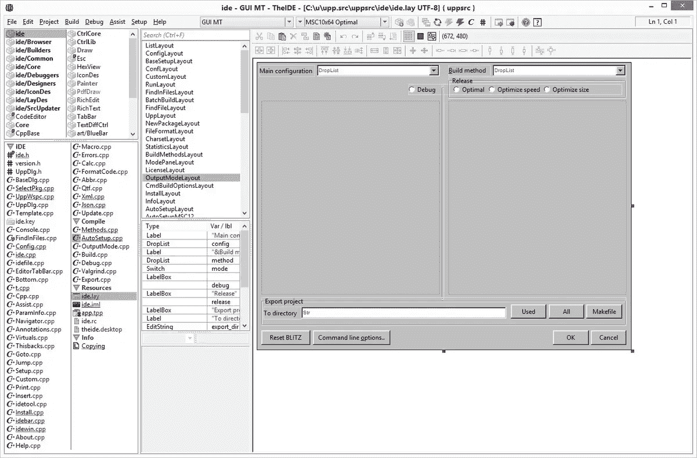

# 将 Ultimate++框架转换为介子构建系统，使其可供其他人外部使用

> 原文：<https://itnext.io/converting-ultimate-framework-to-meson-build-system-to-make-it-externally-consumable-by-others-99b54bc25598?source=collection_archive---------2----------------------->

大家好，

很长时间以来，我一直在关注 [Ultimate++ framework](https://www.ultimatepp.org/) 。

Ultimate++是一个框架，包括一个 GUI 和它自己的 IDE，称为*IDE*，允许你为主要的操作系统(Linux，Windows，MacOS)创建完整的多平台应用程序。对我来说，它是最受欢迎的框架之一。

IdE 包含了许多有助于提高工作效率的东西，从代码辅助到帮助、调试器和 GUI RAD 工具。

它可以制作如下所示的复杂应用程序，有数据库连接 API，包括 OpenGL 嵌入和所有可用的花哨东西。

在我看来，使 Ultimate++脱颖而出的是，它使用 C++的方式使编码风格非常高效:GUI RAD 工具发出可以嵌入的常规 C++，小部件只是具有正常范围的普通对象，它有助于非常直观的用户体验。SQL 和其他图像嵌入使用完全相同的策略。最终，代码中的所有内容都是直接从 RAD 工具中嵌入的。

Ultimate++中的 Ide RAD 工具

你可以通过查看它的应用页面[这里](https://www.ultimatepp.org/www$uppweb$apps$en-us.html)来了解这个框架允许的复杂程度。

# Ultimate++有什么问题？我想…

我渴望使用 Ultimate++已经有一段时间了，但我一直被一个问题困扰着:你必须使用他们的 IDE，所有的东西都以他们自己的方式打包。这给我的工作流程带来了很多摩擦，我猜对其他人来说也是如此。

你做的所有工作都落入他们自己的环境。我并不反对他们的环境，但是这个包生成了一个他们自己的定制包系统，使它成为自己的工作领域。

这与当今的其他构建系统并不兼容，例如 CMake/Meson/PreMake 和其他正在使用的构建系统，例如 MsBuild、XCode 等。

# 解决图书馆的消费问题(以及其他免费的东西)

我想知道如何解决包装消费的问题。我本可以添加一些`.pc`文件到里面，然后就完事了。但我认为这还不够。

由于我非常熟悉 Meson(实际上还有 CMake)，我尝试了一下将 Ultimate++转换成使用 Meson 需要多少时间。

当我转换它的时候，我可以得到一些额外的好处:

*   以多种模式编译:调试、发布、ASAN、静态/动态链接等。
*   **建立 Windows、Linux 和 Mac 之间的系统统一**
*   从其他操作系统交叉编译环境
*   **发出 pkg-config 和。cmake 文件供其库使用**
*   使项目外部的协作更加容易
*   一些嵌入的定制**依赖可以被提取出来，透明地使用介子包裹/柯南依赖或者系统依赖**。也就是说，由用户而不是由构建系统作者规定的正确的外部依赖项使用

# 将终极++转化为介子

我需要一个策略来开始。我决定在稳定的 2022.2 标签上进行转换。

我看了一下[单个的单片 Makefile](https://raw.githubusercontent.com/ultimatepp/ultimatepp/2022.2/Makefile) ，它可以编译所有需要的东西。这个 Makefile 似乎编译了足够多的内容来构建【TheIDE。我做的第一件事是拿出我的 Linux 笔记本电脑，从那里开始。

我使用原始构建系统进行编译，以便能够计算出输出并检查生成的库。我做了一些 grepping 来提取源文件，并为这个项目创建了一个顶级的介子文件。

因为我希望介子转换也能在 Windows 和 Mac 上编译，所以依赖处理非常关键。我决定提取内部打包的依赖项，将它们指向构建系统，构建系统的用户可以透明地选择使用什么，无论是 Ubuntu 库、Meson wraps 还是 Conan 下载的包。当我进行转换时，这对于能够在 Windows 中编译东西是很重要的，也提高了模块性。它还可以指向相同的依赖项。例如，如果某个包使用 zlib，而另一个完全不同的依赖项使用 zlib，您可以协调它，使它们指向相同的版本。

向介子的转换仍在进行中，但它已经在 Linux 中的静态库构建设置下工作了。它成功地编译了大量的库+*ide*，并且可以在 Ubuntu Linux 19.04 下正确运行。

# 是什么把它转化成介子的

基本上，转换是相对简单的，我对依赖性处理的深思熟虑以及它与命令行的良好结合印象深刻。您可以使用系统依赖项，避免下载它们，即使安装了系统依赖项，也可以回退到子项目依赖项，逐个覆盖它们。

除了在 Ultimate++框架中包含一些依赖项的方式上有一些问题之外，一切都很好。

我做了什么:

*   静态编译*ide*并通过 pkg-config 公开所有依赖项(库)。仍然需要添加对从 Meson 生成的 pkg 配置的调用，但这是一行程序，与添加用于消费的`.cmake`包相同
*   我提取并使用了最初嵌入在源代码中的包管理依赖项:liblzma、lzma sdk、zlib、xxhash、libpng、zstd 和 pcre。这些现在可以被构建系统中的介子逻辑检测到，并且可以根据用户的偏好被覆盖

项目声明和配置文件生成的处理如下所示:

这有几个作用。首先，它检测日期，主机名和 whoami 程序。之后，它运行一些命令来收集信息。它创建一个数据配置对象，并发出相应的配置文件。请注意，您不一定需要输入文件(但是您可以这样做并替换您自己的变量。在文件中)。文件将直接从配置中发出。当我使用 windows 时，我会找出使用什么程序来完成相同的任务，如果情况变得糟糕，我可以随时使用 python 脚本作为多平台程序。

# 图书馆汇编

基本上所有的库都是按照下面的模式编译的，并通过`subdir`调用遍历目录结构:

一些插件有一些外部依赖。而在这里介子可以帮上大忙。看看这个例子:

zlib、liblzma 和 lzmasdk 最初是嵌入式依赖项，在 repo 内部编译了自定义源代码。包含指向内部目录。

现在他们只是使用介子逻辑来检测依赖性。这意味着它们可能来自系统，来自另一个包管理器，比如 Conan，或者来自一个包装器，并且和你的代码一起被编译。这是非常灵活的，使你的生活，尤其是在 Windows 中，变得更好。

介子是如何工作的，我必须做些什么来处理依赖性？

# 介子包裹拯救

[*包裹*](https://mesonbuild.com/Wrap-dependency-system-manual.html) 是介子使用的包管理系统。这个想法是，你可以把`yoursubproject.wrap`文件放在你的`subprojects`目录中，然后介子会处理剩下的。这里有一些现成的包装供你选择。包裹可用的条件是包裹支持介子构建系统。由于大多数包不支持，因此有办法提供相应的补丁来添加介子支持，并从包装文件中指向这些补丁文件，这些文件将在下载/解包您的项目源代码后应用。在包装的情况下，子项目中的所有包都将从源代码与您的项目一起编译。

在 Meson 中，你应该展平所有的依赖项，使它们可见，因为在不同的子项目中，不同版本的依赖项嵌套在一起会导致各种各样的问题。如果您对两个子项目有一些依赖关系，它们应该都指向同一个版本(依赖关系(' somedep ')将自动为所有流程指向同一个依赖关系)。这避免了令人厌恶的错误，如意外违反 ODR。

文件可以来自档案库，来自 *git* ， *svn* ， *hg* 或者可以指向一个本地目录。支持修补文件。这很方便，因为大多数项目不提供介子构建系统。你可以在它们上面覆盖一层或几片。`patch_*`文件实际上是覆盖图。对于真正的补丁文件，在你的`.wrap`文件中使用`diff_files`指令。

包装将下载，如果必要的话，提取，应用补丁/覆盖和编译依赖，虽然有开关，以避免下载和其他。

例如，如果您已经在系统中安装了那些依赖项，您可以使用`--force-fallback=libpng,zstd`强制 Meson 使用选定的子项目依赖项，而不是系统依赖项。

该系统是非常可定制的。

对于 liblzma，有一个可用的包装:

这个想法是你把。将文件包装在子项目目录中。在此之后，如果没有检测到系统依赖项，将默认使用这些选项。

`liblzma`包装文件基本上说明了从哪里下载原始归档文件、覆盖文件(patch_url)以及它提供的依赖关系。如果在系统中找不到`liblzma`，这个`.wrap`文件将提供`dependency('liblzma')`，并继续将它与您的项目一起编译。这由`[provide]`部分指示。上面包装中的`[provide]`部分列出了`meson.build`文件中依赖变量的内部名称，以及调用`dependency`时它映射到的名称。如果您有一些想要检测的可执行文件，您也可以提供`program_names`。注意这只是一个过渡机制，更新的方法是从你的`meson.build`文件中调用`meson.override_dependency('depname', lib_dep)`。

如果需要，你也可以用语法`-Dmyproject:option=value`单独设置一些子项目选项，如果事情变得更复杂，也可以在[机器文件](https://mesonbuild.com/Native-environments.html)中设置。

对于`lzmasdk`,我就没那么幸运了，因为没有可用的包装文件:我从他们的网站下载文件，将它们解压到一个目录中，将几个`meson.build`添加到包装文件指向的目录中，并将相应的包装文件添加到我的子项目中，以模仿已经嵌入到`plugin/lib/`目录中的文件，该目录包含直接嵌入到构建系统中的`lzmasdk`。

注意现在在`[provide]`部分的不同之处:我使用了依赖项的名称，而没有命名任何内部的`meson.build`变量。这是因为在内部构建系统中使用了它`meson.override_dependency('liblzmasdk', liblzmasdk_dep)`，介子会找到它。你可以对`program_names`做同样的事情

这些基本上是我为每个目录将 Ultimate++转换成 Meson 构建系统所遵循的步骤。

编译时还有一些其他的注意事项。例如，缺省情况下，Meson 包括目标的源目录和构建目录。这引发了一些`#include`冲突，因为 Ultimate++中的 include 被精确地命名为它们的库，例如`#include < png.h >`,它指向它们自己的内部`png`,在那里进行编译。解决方案是用于碰撞的目标`implicit_include_directories: false`去除意外夹杂物。

注意，Meson 能做的远不止这些，比如交叉编译，当你通过许多命令支持的`native:bool`标志来编译一个要被`host`或`build`机器使用的程序时，这是非常清楚的。你可以只在一个环境中添加标志，而不会弄不清它会出现在哪里，语法几乎是 Python 化的，非常直观。

它还有诸如[特性对象](https://mesonbuild.com/Build-options.html#features)和[禁用器](https://mesonbuild.com/Disabler.html)之类的东西，可以大大减少条件样板文件。例如，您可以通过使用禁用器来简化依赖于未检测到的依赖项的所有依赖项的构建，而无需更改构建代码的任何其他部分。

# 后续步骤

接下来的步骤是:

*   让介子构建系统在 Windows 下工作
*   让介子构建系统在 Linux 下工作
*   添加`.pc`和`.cmake`文件直接从介子中消耗
*   创建一个从介子构建系统编译的柯南配方，这样就可以使用更多的生成器

我还将明确区分公共依赖和私有依赖。仍然在计算它们是否排列正确，肯定有一些错误。

# 最后的话

我花了大约 8-9 个小时完成全部转换，直到能够运行`TheIde`并找出所有依赖项，等等。

Linux 已经编译的正在进行的工作可以在[这里](https://github.com/germandiagogomez/ultimatepp/tree/feature/meson-build-system-based-on-2022.2)找到。请注意，这是实验性的，它可能会在您的机器上失败，因为它没有经过彻底的测试。

很抱歉有任何打字错误/糟糕的写作，我匆忙写了这篇文章，只是为了能够揭露它，以防有人觉得它有趣/有用。

感谢阅读！

注意:请注意，除了对构建系统的改进感兴趣之外，我与 Ultimate++项目没有任何关系，这里显示的所有内容都是出于我自己的兴趣，而不是其他。