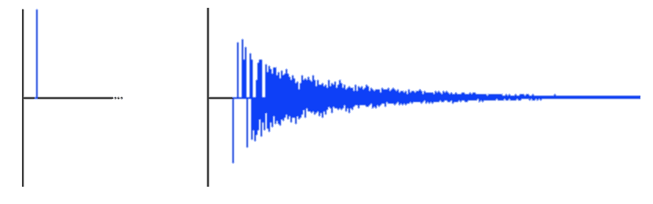

# 卷积混响和网络音频 API

> 原文：<https://itnext.io/convolution-reverb-and-web-audio-api-8ee65108f4ae?source=collection_archive---------1----------------------->

**“混响和网络音频 API”系列的第 1 部分**

本文是“混响系列”的第一部分，将涵盖在浏览器中实现**卷积** **混响**的**理论**和**实践**。要理解这一点，你应该熟悉 JavaScript，至少对数字音频的工作原理有一点了解，或者随时准备在维基百科上做一些研究。

更新:[第二部分:算法混响和网络音频 API](/algorithmic-reverb-and-web-audio-api-e1ccec94621a)

**简介**

DSP 一直远离 Web。主要是因为所有的 Daw、VST 插件和嵌入式数字合成器软件都是用 C/C++编写的。此外，web 开发人员经常害怕卷积、FFT 和积分之类的东西。然而时代在变化，这些天没有什么能阻止我们使用 Web Audio API 构建完整的 synths 副本，这抽象了很多数学。与此同时，我觉得缺乏针对 web 开发人员的文章，这些文章深入 DSP 理论，而不仅仅是将一些音频节点连接在一起。这是一个遗憾，因为做 DSP 而不理解合成是没有乐趣的。

作为免责声明，我绝不是 DSP 专家，我只是一个对 DSP 感兴趣的网络开发人员，喜欢摆弄合成器和其他音乐相关的东西。

**什么是混响**

[混响](https://en.wikipedia.org/wiki/Reverberation)是一种效果，使您的乐器听起来好像是在某个空间演奏的，比如在桥下、在大音乐厅里或者可能是在铁罐里。每个空间都有自己的音响效果，所以同样的声音在每个空间都会有不同的感受。这是因为声波会根据墙壁的材质、房间的大小以及地板上波斯地毯的厚度而发生不同的反射。

现在我们如何让一个干燥的合成器音符听起来像是在莫斯科大剧院演奏的？嗯……让我们来看看。

**拍手和回声**

卷积混响是基于**脉冲响应**的概念——房间对**脉冲**的响应方式，例如对短暂的拍手声。每个房间对拍手声的反应都不一样，房间的音响效果完全可以用它的脉冲响应来表征。理想情况下，脉冲与一个[样本](https://en.wikipedia.org/wiki/Sampling_(signal_processing))一样短，并且所有频率相等。从图形上看，可能是这样的:

脉冲(左)和脉冲响应(右)，[来源](http://www.earlevel.com/main/1997/01/19/a-bit-about-reverb/)

换句话说，如果一个人在一个空荡荡的大房间里拍手，这可以被认为是一种**冲动。**和**脉冲响应**是房间对这种脉冲的反应——鼓掌声消失时你听到的回声和回响。现在，如果我们将声音的每个样本(比如说吉他和弦)乘以音乐会呼叫的脉冲响应，然后对其求和，基本上就可以得到吉他的声音，就好像它是在这个音乐厅演奏的一样。

脉冲响应示例

JavaScript 中卷积混响最基本的简单实现如下所示(但没人这么做):

然而，实际上这太慢了。想象一下你的声音每秒钟有 41000 个样本。在一个有很多回声的房间里，脉冲响应可能是 2 秒，因此有 82000 个样本长。因此，为了应用卷积混响效果，我们需要进行 41000 * 82000 = 3362 百万次运算来处理 1 秒钟的声音。当然，这使得该选项不可能用于实时音频处理。如果我们在频域而不是时域中进行计算，这种计算将变得更加高效。因此，我们首先对输入信号和脉冲响应执行 [FFT](https://en.wikipedia.org/wiki/Fourier_transform) ，将它们相乘，然后执行反向 FFT。

如果卷积对你来说仍然没有任何意义，或者如果你只是想了解更多，我建议看看这本[书](http://www.dspguide.com/ch6.htm)，这是我迄今为止遇到的最好的卷积解释。

幸运的是，Web Audio API 提供了一个[卷积器节点](https://developer.mozilla.org/en-US/docs/Web/API/ConvolverNode)，所以我们不必自己实现卷积算法。

[演示](http://amiselaytes.com/convolution-reverb/) [GitHub](https://github.com/miselaytes-anton/web-audio-experiments/tree/master/packages/convolution-reverb-app)

**下一步是什么**

不幸的是，当应用于实时输入时，即使使用本地卷积器节点也会导致一些*延迟*(在我的例子中，我将模拟合成器连接到线路输入)。除此之外，卷积混响的一个很大的缺点是我们*不容易实时调整混响参数*。因此，如果我们想要调整房间大小，就必须用不同的脉冲响应进行卷积。由于这些原因，在某些情况下，我们需要卷积的替代方案。

在这个系列的下一部分，我们将会看到*算法*混响、*延迟线*、*音频小工具*和 Shroeder 先生的*自由动词。*

更新:[第二部分:算法混响和网络音频 API](/algorithmic-reverb-and-web-audio-api-e1ccec94621a)