# 菜谱:Java-> Maven-> Docker-> AWS ECR-> AWS ECS(Fargate)

> 原文：<https://itnext.io/cookbook-java-maven-docker-aws-ecr-aws-ecs-fargate-e12cfc126050?source=collection_archive---------4----------------------->

## 实用开发工具

## 如何将 Java 应用程序自动部署到无服务器容器

## TL；DR；

在这篇文章中，我将展示如何在 Jenkins 中建立一个管道来构建一个 Java 应用程序的 Docker 映像，并将其上传到您的(私有)AWS ECR 存储库中，然后部署到 AWS Fargate 上

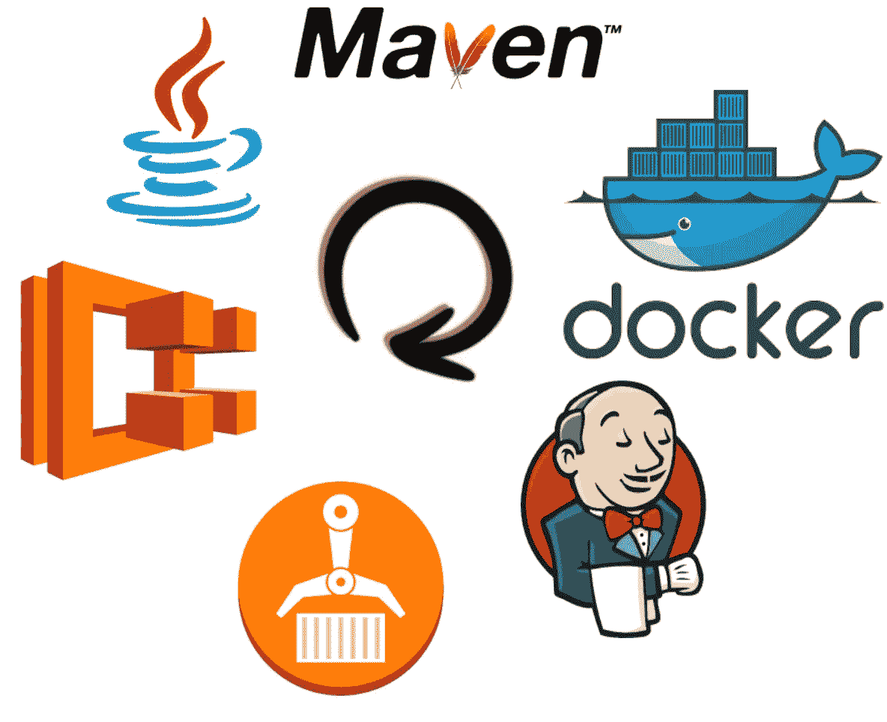

## 背景

我四处寻找一些关于如何建立一个管道的资料，这个管道将我从 IntelliJ IDEA 中的 Java 代码带到 Amazon Web Services (AWS)上正在运行的 docker 容器。而且有很多信息是过时的、不完整的或者很难找到的。所以我想分享一下我的概念验证的设置，以及一些如何让它工作的脚本。

警告:这个管道对我正在进行的一个小型概念验证非常有用。对于一个大规模的管道，你可能想要更多的自动化，也许对你的 SCM 中的事件作出反应，自动开始构建，而不是在本地运行 Jenkins 等等。

所有代码/示例都可以从[gitlab.com/NiclasG/cookbook](https://gitlab.com/NiclasG/cookbook/tree/master/jenkins-ecr)下载


我们将经历几个步骤。首先，我将提到一些必要的先决条件。然后，我们将进行一些 AWS 配置，这将允许我们远程访问我们的存储库。接下来是主要部分:设置 Jenkins 和助手脚本来完成实际工作。最后，我们将看看一旦我们使用新的 AWS Fargate 特性将 docker 容器上传到 AWS，如何启动它。

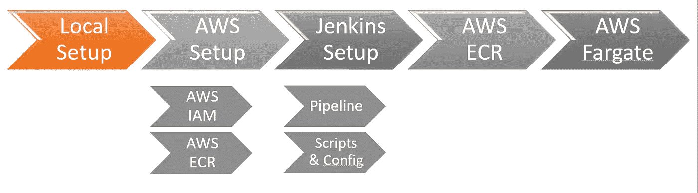

## 本地环境先决条件和设置

我用的是 Macbook Pro，但我相信在 Win/Linux 环境下做这些应该没有问题。路径和其他细节当然可能不同。请在下面的评论中告诉我你是否成功地尝试过(或者失败得很惨)。

*   Docker——我们都将使用 docker 来创建图像，并旋转容器来进行实际的编译。 [Docker 可在此获得。](https://docs.docker.com/install/)
*   AWS CLI 工具，[可从 AWS](https://docs.aws.amazon.com/cli/latest/userguide/cli-install-macos.html) 获得。
*   Java 项目:不用说，您将需要一些 Java 源代码来运行这个项目。—我不会提供它，所以带你最喜欢的 GitHub 项目出去转转吧。我们将进一步配置 Jenkins 的 SCM 部分，以检查代码并构建它。

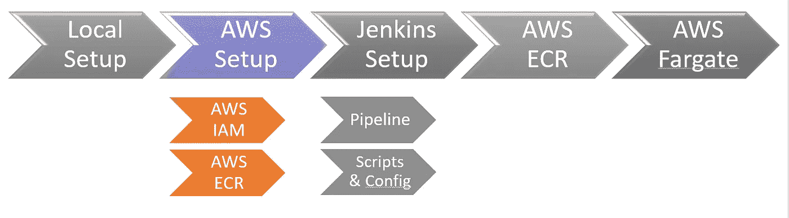

# AWS 设置

## IAM 访问

为了能够将图像推送到 AWS，我们将设置一个具有受限访问权限的新 IAM 用户。对于生产系统，您可能希望启用 2FA (MFA ),但现在我们将禁用它。如果您使用多个 ECR 存储库，您可能还需要限制用户可以访问哪个 ECR 存储库。

*   登录您的 AWS 管理控制台，前往 [AWS IAM 部分](https://console.aws.amazon.com/iam/home)并创建一个新用户，我将我的用户命名为“ecr-remote-pusher”。确保勾选标有*“程序化访问”的方框。*

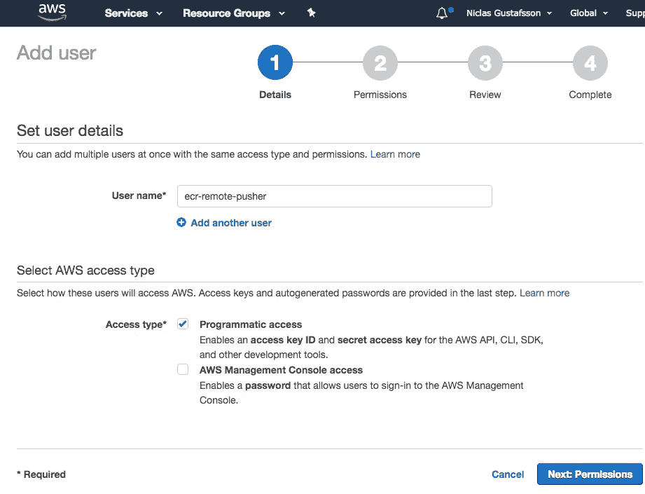

*   将**ContainerRegistryPowerUser**策略附加到 IAM 用户。

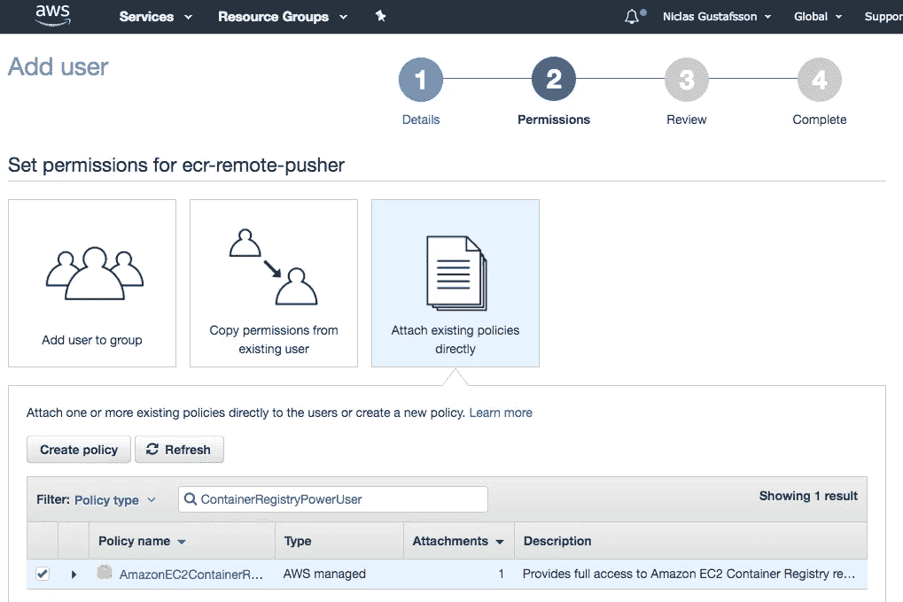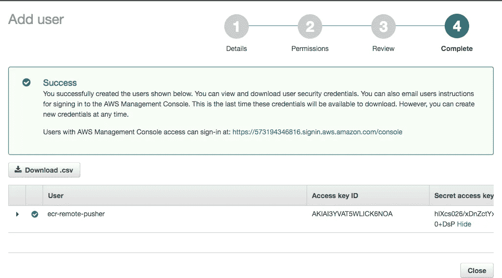

将访问 ID/密钥对以及您选择的地区添加到您的~/中。AWS/凭据文件。为了我自己的健康，我将使用与 IAM 用户同名的概要文件。

```
[ecr-remote-pusher]aws_access_key_id = AKIAIXXXXXXXXXXXXXaws_secret_access_key = jPXXXXXbErVkw+ZfU6XXXXXrregion=us-east-1
```

## 创建 AWS ECR 存储库


**注意:Fargate 功能目前仅在 us-east-1 地区可用。如果你想尝试一下，我建议在同一个地区建立 ECR 库。**

转到 **AWS 弹性容器服务**，选择存储库链接并创建一个新的存储库:

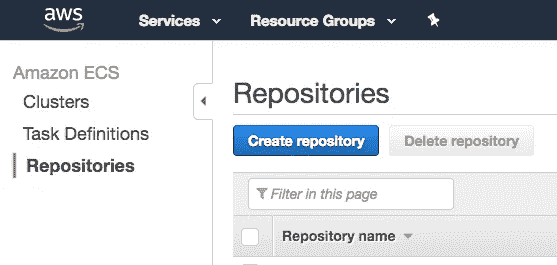

给你的存储库起一个有意义的名字，并记下**存储库 URI。**

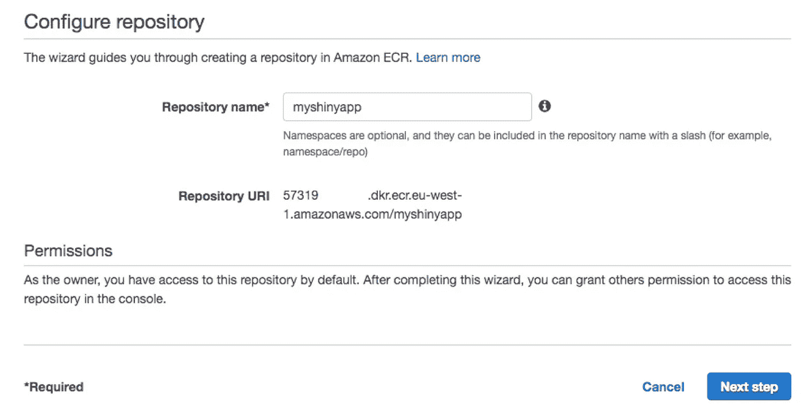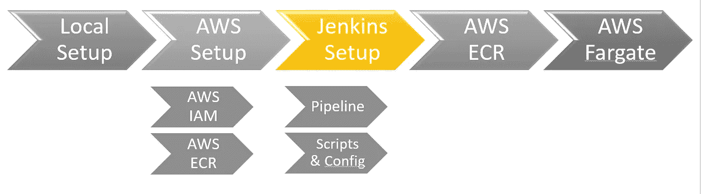

# 詹金斯

## 设置 Jenkins 环境

对于本指南，我们将使用运行 Jenkins 的 docker 容器。我使用的版本是我写作时的最新版本(2.109)。我使用 alpine 映像(jenkins/jenkins-2.109-alpine)作为基础，并通过添加 AWS CLI 工具和 Docker 对其进行“修补”，然后我[将完成的映像上传到 Docker Hub。](https://hub.docker.com/r/ngmg/jaws/)

要下载图像，请使用以下内容:

```
**$** docker pull ngmg/jaws:2.109-alpine
```

或者从 [Dockerfile](https://gitlab.com/NiclasG/cookbook/blob/master/jaws/Dockerfile) 构建自己的:

```
FROM jenkins/jenkins:2.109-alpineMAINTAINER Niclas Gustafsson <hiniclas@gmail.com>USER rootRUN apk add --update python py-pip docker && \pip install awscli && \rm -rf /var/cache/apk/*
```

要开始，请运行以下命令:

```
**$** docker run \
   -p 8080:8080 \ 
   -v jenkins_home:/var/jenkins_home \
   -v $HOME:/home \
   -v /var/run/docker.sock:/var/run/docker.sock \
   ngmg/jaws:2.109-alpine
```

这将设置 docker 将端口 8080 转发到容器，并公开三个目录/文件:

*   容器中的/var/jenkins_home 映射到一个卷“jenkins ”,以保持数据的持久性，而不管容器发生了什么。
*   /home 映射到您的主目录，用于存储运行之间的信息和访问您的 AWS 凭证(~/。AWS/凭证)
*   /var/run/docker.sock 用于在 jenkins 内部的 docker 客户端与您的主机上运行的 docker 守护进程之间进行通信。

启动后，[使用推荐的插件进行初始配置。](https://jenkins.io/doc/book/installing/#setup-wizard)


## 添加 Jenkins 插件

一旦启动并运行，用你的管理员帐户登录并启用我们需要的几个插件。 [Jenkins - >管理 Jenkins - >管理插件](http://127.0.0.1:8080/pluginManager/)

添加以下插件:

https://plugins.jenkins.io/docker-plugin

Docker 步骤插件:[https://wiki . JENKINS . io/display/JENKINS/Docker+build+step+插件](https://wiki.jenkins.io/display/JENKINS/Docker+build+step+plugin)

如果你打算使用 GitLab，你可能需要 GitLab 插件:【https://wiki.jenkins-ci.org/display/JENKINS/GitLab+Plugin】T2

## 建设管道

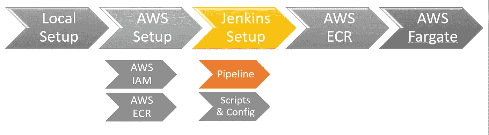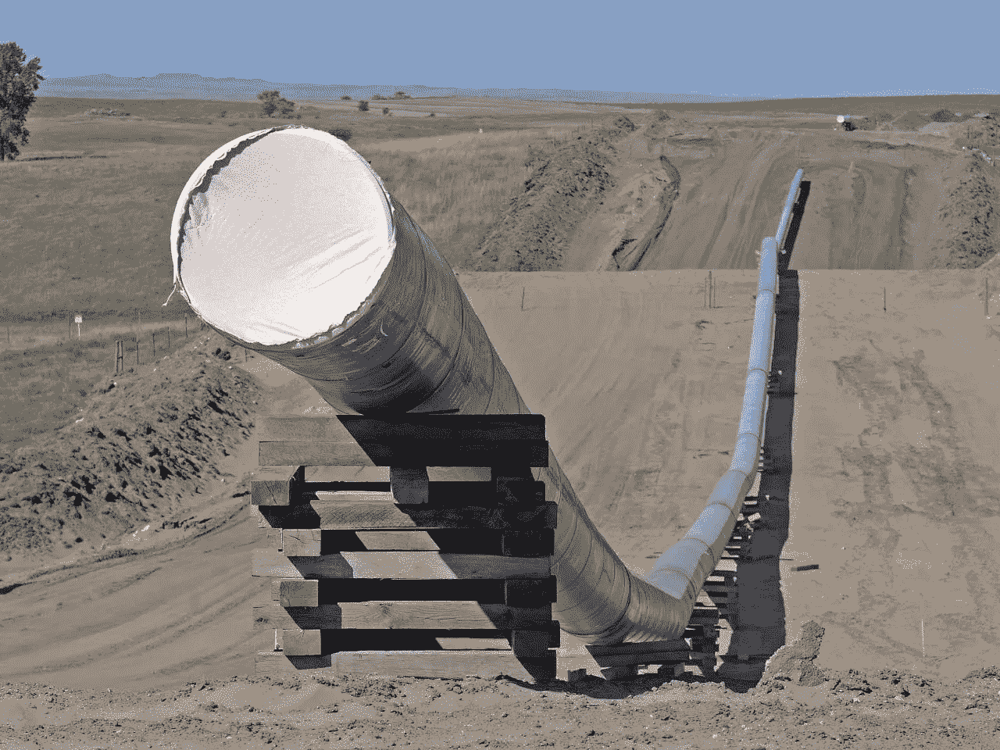

我们将构建一个 docker 映像，它将被标记上 Jenkins 条目/项目的名称和构建号，所以选择一个小写**的名称**，否则 docker 构建将会失败。在一个更现实的场景中，图像的名称可能是其他的，但是对于这个练习来说，它就可以了。

创建新项目时选择管道选项。

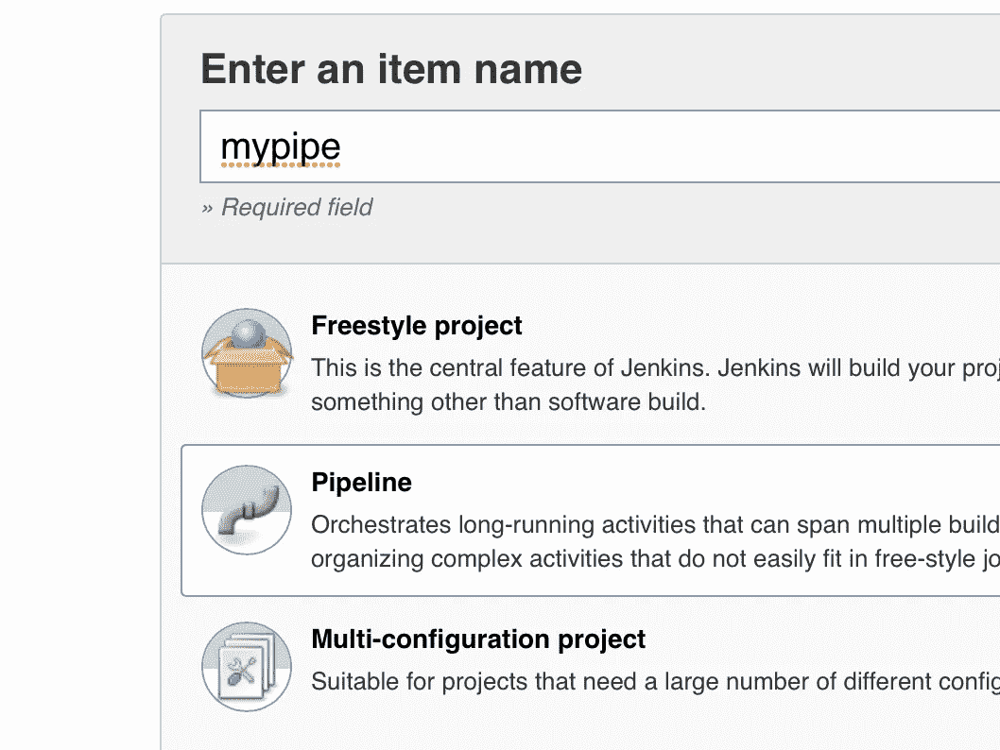

接下来要做的是将 Jenkins 作业设置为一个*参数化项目*。这使我们能够在 Jenkins 内部提供一些(特定于作业的)配置，而不必修改脚本，然后我们可以重用这些脚本。

*   检查顶部中的*“该项目已参数化”*

首先，我们添加一个**字符串**参数，它定义了我们希望将图像推送到哪个 AWS 存储库。格式如下(替换为您在上一步中的具体信息)。

```
Name:          aws_repository
Default Value: <AWS Account Id>.dkr.ecr.<Region>.amazonaws.com/<your repo>
```

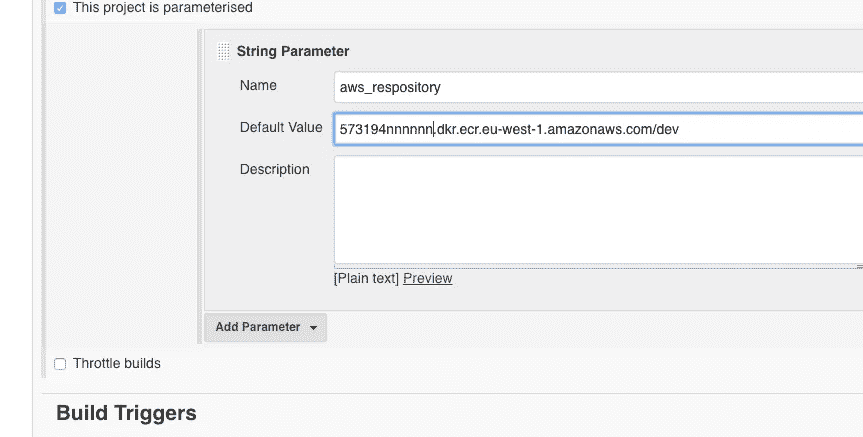

我们将添加的第二个参数是 AWS 凭据配置文件，Jenkins 将使用它通过 AWS CLI 访问 AWS ECR。

```
Name:          aws_profile
Default Value: <id from credentials file>
```

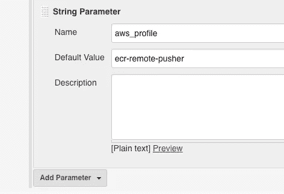

接下来，设置 your Jenkins 项目，像平常一样获取源代码。我使用了一个像这样的[设置来使用我个人的 Gitlab 库。然而，由于我们不会在本指南中使用 web 挂钩或任何外部触发器，请确保您不会使用 *${gitlabSourceBranch}* 参数，因为这些参数不会被正确计算。](https://medium.com/@teeks99/continuous-integration-with-jenkins-and-gitlab-fa770c62e88a)

简而言之，要访问 GitLab repo，您需要设置 Jenkins 系统，然后才能配置实际的项目/物品:

1.  设置 SSH 密钥([凭证](http://127.0.0.1:8080/credentials/store/system/domain/_/))
2.  设置登录令牌([凭证](http://127.0.0.1:8080/credentials/store/system/domain/_/))
3.  配置 GitLab 连接([管理 Jenkins /配置系统](http://127.0.0.1:8080/configure)

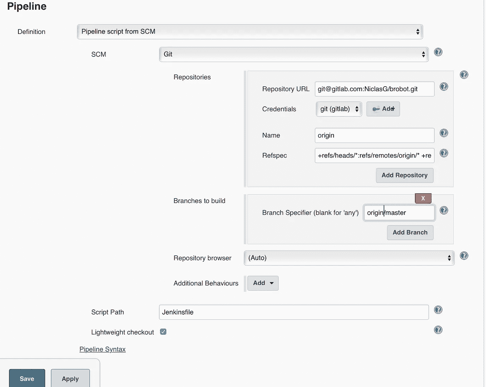

要么直接指向您的在线(Github/Gitlab)存储库，要么提供一个到磁盘上的项目的本地路径，如果您正在进行尝试时不想提交的更改。请记住，提供路径是 Jenkins docker 映像中的路径。即以/home 开始路径(如果您的 repo 在主机上的＄HOME 中)。(记住上面 docker rum 的-v 选项)

## 脚本和配置

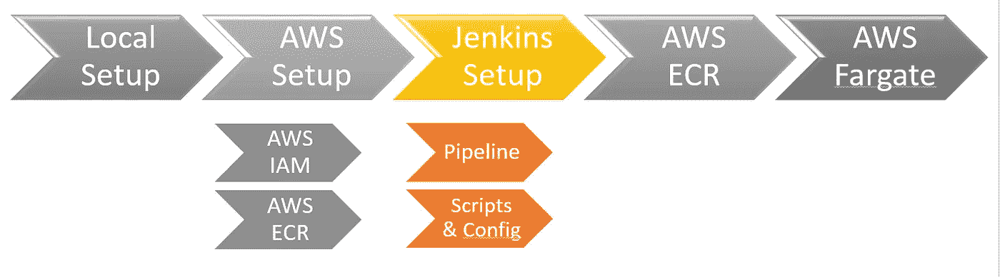

接下来的事情包括在你的项目中设置一些脚本。我在这里提供了例子:[https://gitlab.com/NiclasG/cookbook](https://gitlab.com/NiclasG/cookbook/tree/master/jenkins-ecr/scripts)

*   。/Jenkinsfile —描述管道中的步骤
*   。/POM . XML—maven 配置文件。
*   。/Dockerfile —描述如何构建 docker 映像
*   。/scripts/build-maven.sh —运行 mvn 命令进行编译和打包。
*   。/scripts/aws-ecr-push.sh —处理 AWS ECR 登录并将映像推送到 AWS ECR 存储库的脚本。

首先是上面 Jenkins 配置中引用的文件，**Jenkins file**——它描述了管道。将它添加到项目的根目录中。

([下载链接](https://gitlab.com/NiclasG/cookbook/blob/master/jenkins-ecr/Jenkinsfile))

```
node {
    checkout scm
    stage('Build Maven') {
        docker.image('maven:3-alpine').inside('-v $HOME/.m2:/root/.m2') {
            sh './scripts/build-maven.sh'
        }
    }
    stage('Build Docker Image') {
        docker.build("${env.JOB_NAME}:${env.BUILD_NUMBER}")
    }
    stage('Push to AWS'){
        sh "./scripts/aws-ecr-push.sh ${env.JOB_NAME}:${env.BUILD_NUMBER} /home/.aws/credentials"
    }
}
```

我们有一个包含三个步骤的小管道:

1.  构建 Java 代码
2.  构建 Docker 映像
3.  将其发送至 AWS ECR

其次是 Maven **pom.xml** 文件，它描述了您的依赖项和构建过程。这些脚本需要的关键元素包括如下:

```
.
.
.
<**build**>
    <**plugins**>
        <**plugin**>
            <**groupId**>org.apache.maven.plugins</**groupId**>
            <**artifactId**>maven-jar-plugin</**artifactId**>
            <**version**>3.0.2</**version**>
            <**configuration**>
                <**archive**>
                    <**manifest**>
                        <**addClasspath**>true</**addClasspath**>
                        <**classpathPrefix**>lib/</**classpathPrefix**>
                        <**mainClass**>YOUR-CLASS-HERE</**mainClass**>       
                        <**useUniqueVersions**>false</**useUniqueVersions**>
                    </**manifest**>
                </**archive**>
            </**configuration**>
        </**plugin**>
        <**plugin**>
            <**groupId**>org.apache.maven.plugins</**groupId**>
            <**artifactId**>maven-dependency-plugin</**artifactId**>
            <**version**>3.0.2</**version**>
            <**executions**>
                <**execution**>
                    <**id**>copy-dependencies</**id**>
                    <**phase**>package</**phase**>
                    <**goals**>
                        <**goal**>copy-dependencies</**goal**>
                    </**goals**>
                    <**configuration**>
                        <**outputDirectory**>${project.build.directory}/lib</**outputDirectory**>
                        <**overWriteReleases**>false</**overWriteReleases**>
                        <**overWriteSnapshots**>false</**overWriteSnapshots**>
                        <**overWriteIfNewer**>true</**overWriteIfNewer**>
                    </**configuration**>
                </**execution**>
            </**executions**>
        </**plugin**>
    </**plugins**>
</**build**>
.
.
.
```

本质上，它创建了一个执行我们在 docker 文件的入口点中指定的方式所需的清单文件，并将所需的库依赖项的副本安装到 lib/目录中。

第三，在 **build-maven.sh** 中，我们执行 Maven (mvn)来进行实际的 Java 编译，并将结果 jar 重命名为我们在下一步中选择的名称。

```
.
.
.
mvn -B clean package -DskipTestsecho 'Install into the local Maven repository'
mvn jar:jar install:install

NAME=`mvn help:evaluate -Dexpression=project.name | grep "^[^\[]"`
VERSION=`mvn help:evaluate -Dexpression=project.version | grep "^[^\[]"`

mv  target/${NAME}-${VERSION}.jar **target/entrypoint.jar**
```

第四个是描述如何构建 docker 映像的**docker 文件**，我们将使用一个公开可用的映像 **openjdk:8-jre** 并将我们的 JAR 和库安装到。

```
**FROM** openjdk:8-jre

**ENTRYPOINT** [**"/usr/bin/java"**, **"-jar"**, **"/usr/local/javapkg/entrypoint.jar"**]

**ADD** target**/**lib **/**usr**/**local**/**javapkg**/**lib**/
ADD** target**/**entrypoint.jar **/**usr**/**local**/**javapkg**/**entrypoint.jar
```

最后一个是将图像发送到 AWS ECR 的逻辑，即 aws-ecr-push.sh 脚本。我不会在这里包括整个长的东西，但它可以在上面的 gitlab 链接上找到。

```
.
.
.
#  Set up paths
AWS="/usr/bin/aws --profile $aws_profile"

DOCKER_IMAGE=$1

# Step 1 Get login  snippet from AWS
DOCKER_LOGIN=$($AWS **ecr get-login** --no-include-email)

# Disable output as we have passwords here
set +x

# Step 2 Execute docker login against AWS.
eval $DOCKER_LOGIN

# Step 3 Tag image with AWS Specifics
docker **tag $DOCKER_IMAGE $aws_reposito**ry

# Tag with Maven build release so we can track it
docker tag $DOCKER_IMAGE $aws_repository:$JOB_NAME.$BUILD_NUMBER

# Step 4 Push docker image to ECR
docker **push** $aws_repository
```

基本上，它执行以下操作:

1.  从 AWS 获取登录命令(aws ecr get-login 命令)
2.  然后它执行命令，类似于“docker log in-u AWS-p XXXXX[https://YOUR-AWS-ACCOUNT-id . dkr . ECR . YOUR-region . Amazon AWS . com’](https://YOUR-AWS-ACCOUNT-ID.dkr.ecr.your-region.amazonaws.com')
3.  然后，它用存储库的名称标记新创建的 docker 映像。
4.  此外，我们用构建的名称和编号标记图像，以便能够更容易地跟踪它。您可以在此处添加其他标签，一些对您的环境有意义的标签。提交散列等。每个图像可能有多个标签。
5.  然后，我们执行 docker push 命令，将图像实际发送到 AWS ECR。

就是这样。如果需要，提交文件，然后前往 Jenkins，使用参数进行构建:

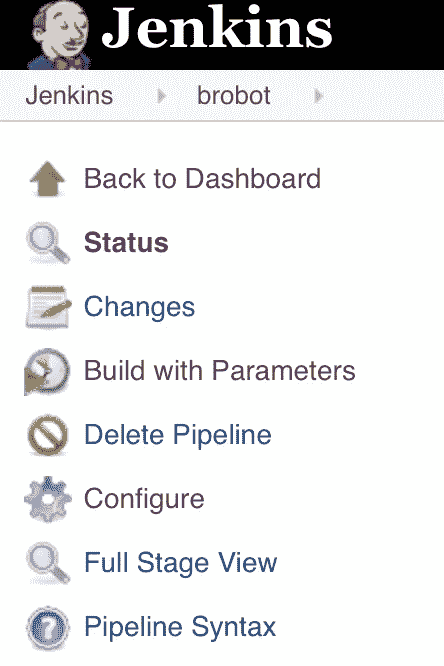

验证 aws_repository 和 aws_profile 参数是否正确，然后按“构建”。

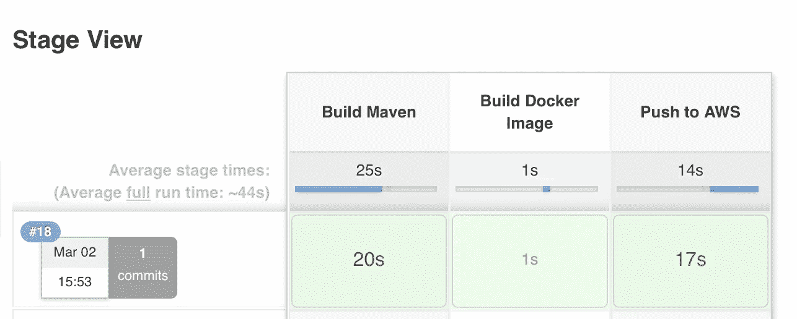

就是这样。现在，我们已经将图像上传到 AWS。

# AWS ECR

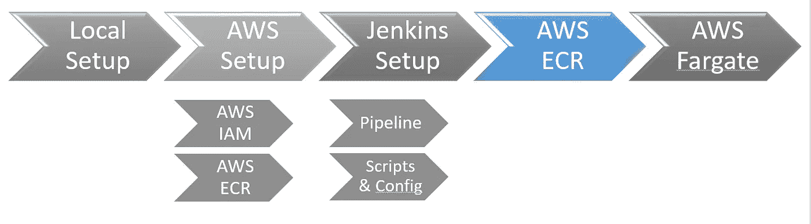

前往 AWS ECS / Repository 部分，验证您的图像是否已被推过并被相应标记。

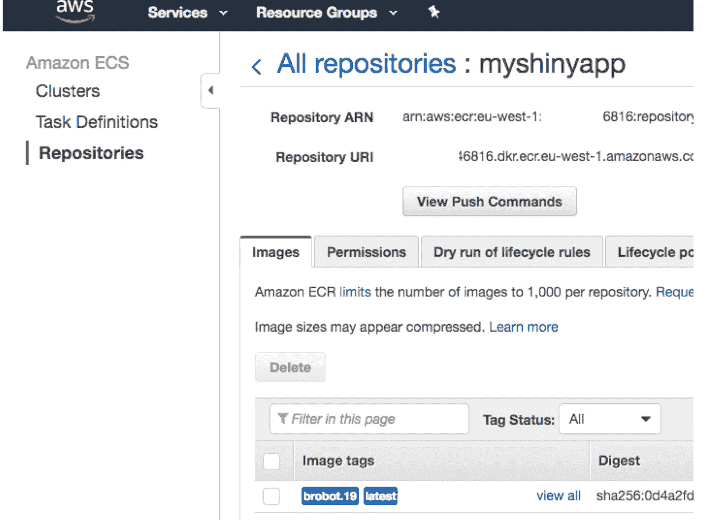

当流程自动运行时，有时似乎会产生无穷无尽的素材，如工件和图像。因为我们在亚马逊是按字节付费的，所以他们引入了一个叫做生命周期政策的功能。使用此生命周期策略，您可以根据图像数量、图像年龄和标签定义清除哪些图像的简单规则。

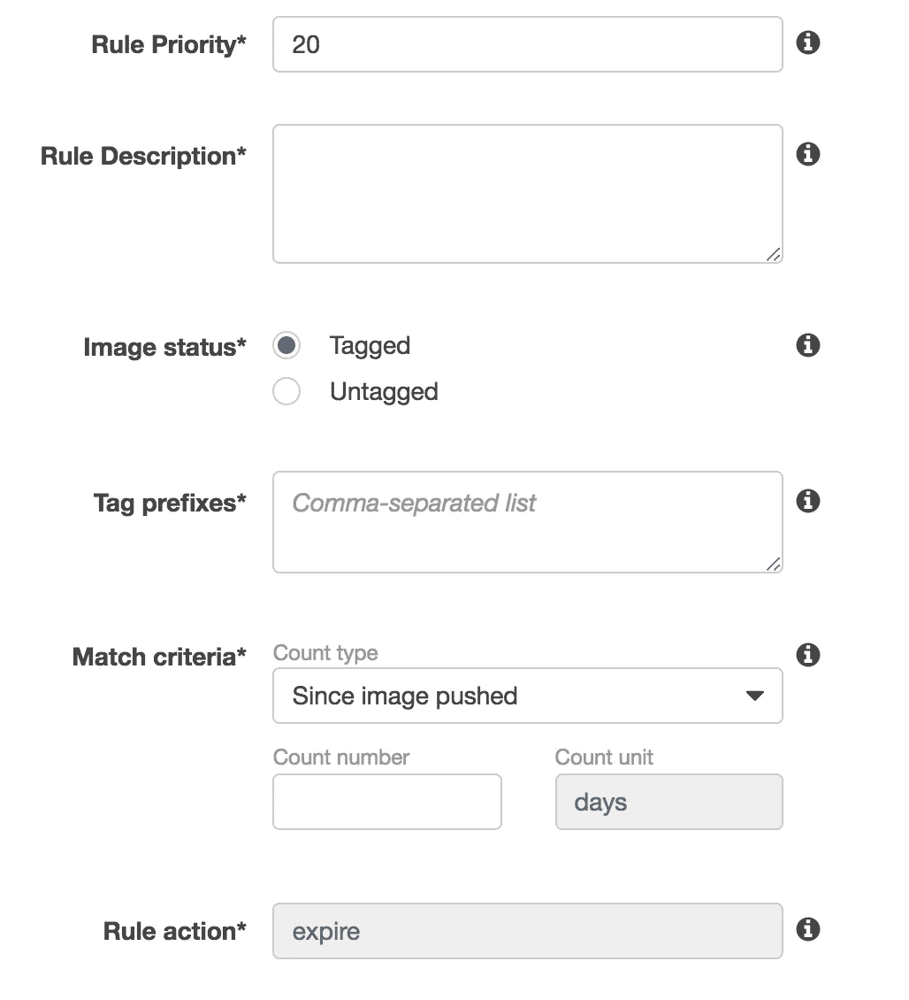

因为我们在这篇文章中并没有很好的利用标签，所以除了“保留 X 张最新图片”之外，做其他事情就没有什么意义了。但是在更高级的设置中，给每张图片加上对你的项目有意义的东西，失败的测试等等，可能是个好主意。

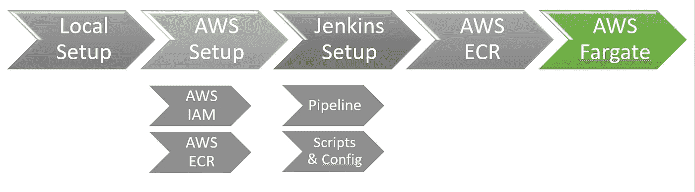

# AWS Fargate

亚马逊最近宣布了 Fargate 的可用性，这有可能在运行容器时去除一层管理。尽管这也带来了一些限制，但是您不再能够访问运行 Docker 守护进程的主机，因此对您的应用程序进行故障排除可能会有点棘手。

> AWS Fargate 是一种部署和管理容器的技术，无需管理任何底层基础设施。Fargate 使您的应用程序易于扩展。您不再需要担心为您的容器应用程序提供足够的计算资源。你可以在几秒钟内发射几万或几万个集装箱。
> 
> 使用 Fargate，计费是以每秒的粒度进行的，您只需为您使用的内容付费。您需要为您的容器化应用程序请求的 vCPU 和内存资源量付费。vCPU 和内存资源是从提取容器映像开始计算的，直到 Amazon ECS 任务终止，四舍五入到最近的秒。

目前，Fargate 仅在美国东部 1 区可用，但我猜它不会很快推广到你附近的地区。

使用 Fargate 在 AWS ECS 上部署相当简单。您确实需要在容器运行之前设置一些边界。您需要指定一个集群来运行它，创建任务定义，并确保您拥有有效的 VPC/子网结构来支持您的应用程序。

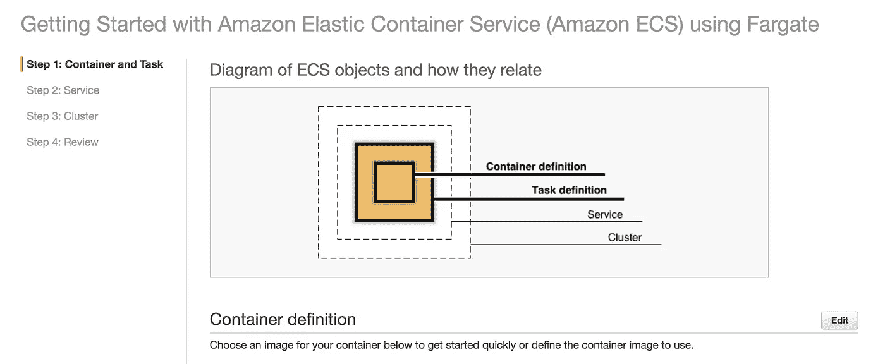

为了这篇文章的目的，我创建了一个基本的 VPC 和一个子网。(任何远程生产状态都需要比这更强大的设置。)我还创建了一个 Internet 网关，并设置了默认路由(0.0.0.0/0)来访问这个 IG，以便我的应用程序可以访问 Internet。

下面是为这篇文章设置环境的脚本。如果你不熟悉 Terraform，我真的可以推荐它来处理你的基础设施代码。

```
provider "aws" {
  access_key = ""
  secret_key = ""
  region = "us-east-1"
}

resource "aws_vpc" "vpc" {
  cidr_block           = "172.22.0.0/16"
  enable_dns_support   = true
  enable_dns_hostnames = true
}

resource "aws_subnet" "subnet_a" {
  vpc_id            = "${aws_vpc.vpc.id}"
  cidr_block        = "172.22.0.0/24"
  availability_zone = "us-east-1a"
}

resource "aws_internet_gateway" "ig" {
  vpc_id = "${aws_vpc.vpc.id}"
}

resource "aws_route_table" "public_routetable" {
  vpc_id = "${aws_vpc.vpc.id}"
  route {
    cidr_block = "0.0.0.0/0"
    gateway_id = "${aws_internet_gateway.ig.id}"
  }
}

resource "aws_route_table_association" "subnet_a" {
  subnet_id      = "${aws_subnet.subnet_a.id}"
  route_table_id = "${aws_route_table.public_routetable.id}"
}
```

VPC 就绪后，转向弹性容器服务并创建一个集群(仅限网络)

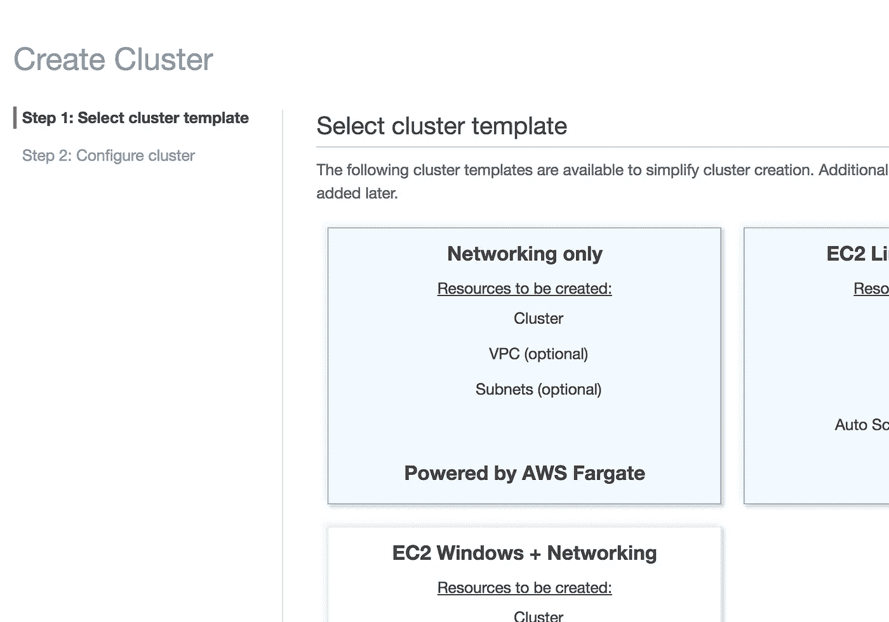

集群只需要一个名称作为参数。

接下来要做的事情是为 docker 映像创建任务定义。您可以在这里指定想要使用 Fargate。

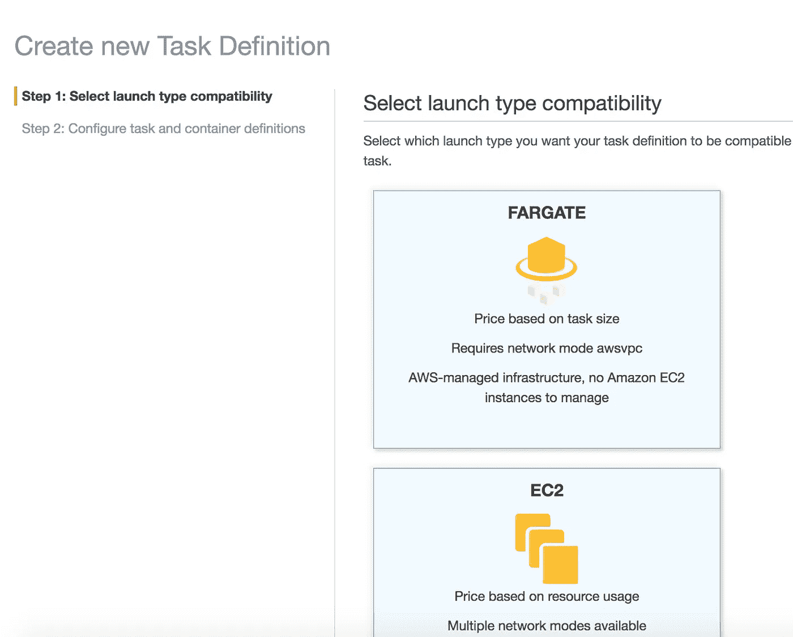

在下一步中，您将指定启动容器所需的细节。首先，您指定外层，即任务。默认的 ecsTaskExecutionRole 支持将容器输出记录到 Cloudwatch 以及访问 ECR。

在这里，您还可以指定该任务处理的所有容器所需的总内存和 vCPU 单元数量。这是为 AWS Fargate 计算成本的基础。

> 定价基于任务所需的 vCPU 和内存资源。这两个维度可以独立配置。
> 
> 对于 Amazon ECS，AWS Fargate 定价是根据从您开始下载容器映像(docker pull)到 Amazon ECS Task*终止所使用的 vCPU 和内存资源计算的，四舍五入到最近的秒。最低收费为 1 分钟。
> 
> 每个 vCPU 的价格为每秒 0.00001406 美元(每小时 0.0506 美元)，每 GB 内存的价格为每秒 0.00000353 美元(每小时 0.0127 美元)。
> 
> *任务是作为应用程序一起运行的容器的集合。

在任务定义中，您还可以指定可用于容器的持久存储或容器间共享存储的卷。

最后一步是实际添加一个或多个容器定义，这是要执行的 Docker 映像的实际规范。

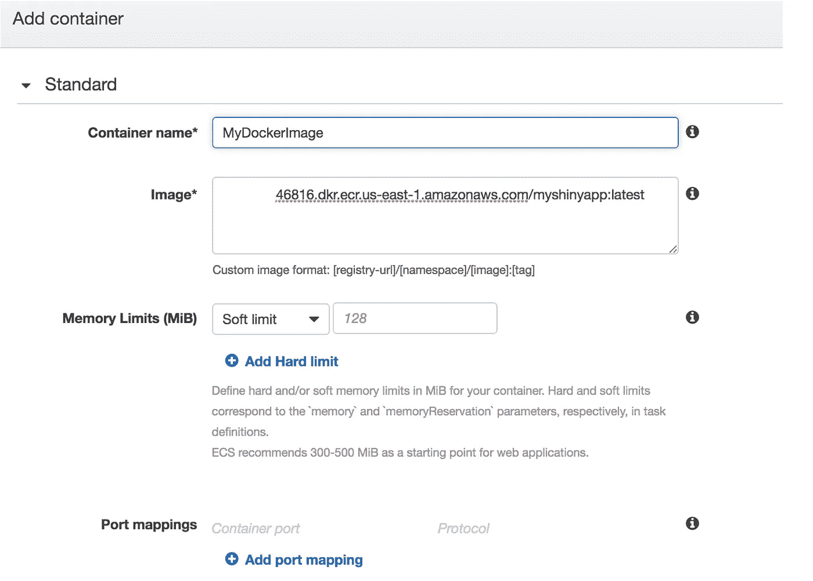

一旦任务定义完成，您就可以把容器拿出来兜一圈了。转到 Amazon ECS / Clusters 并选择 Task 选项卡。

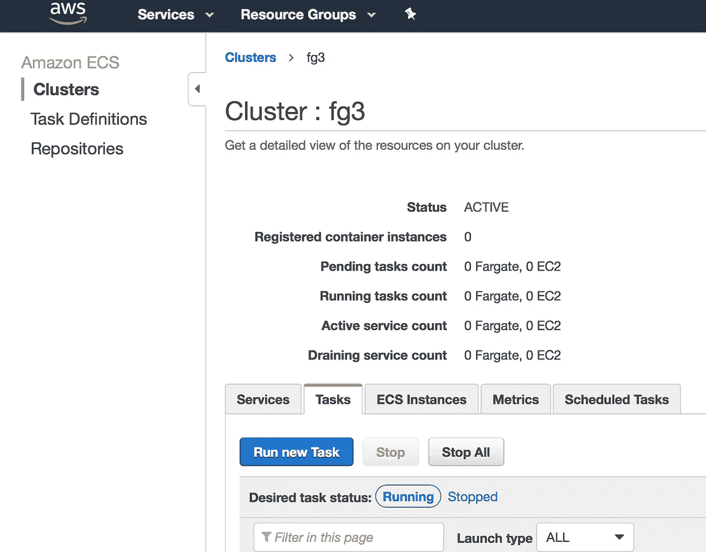

选择运行新任务，然后选择新创建的任务定义和集群。

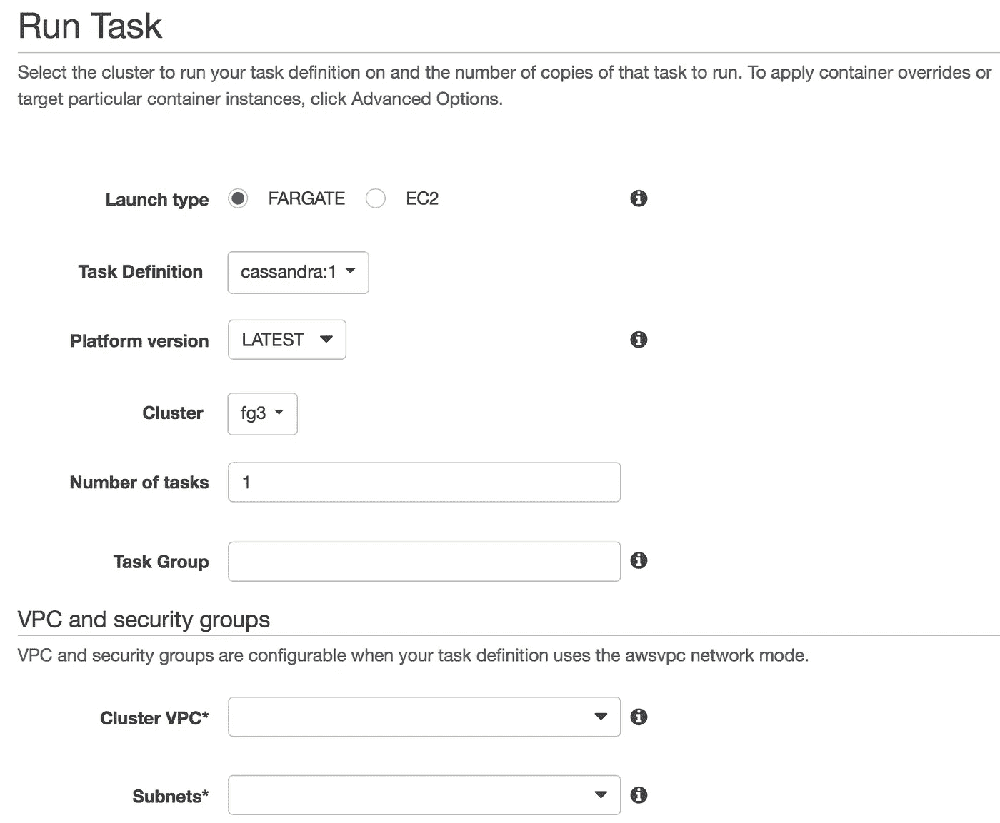

提供您的 VPC，子网和安全组，并按下运行任务，瞧！您的 docker 映像应该正在启动。默认情况下，日志会发送到 CloudWatch。

运行任务只启动任务中指定的容器，并运行它们，直到它们完成或由于某种原因终止。如果您希望保持容器运行，并且可能随着工作负载的增加而扩展，那么您需要使用 ECS 服务，但这是另一个故事了。