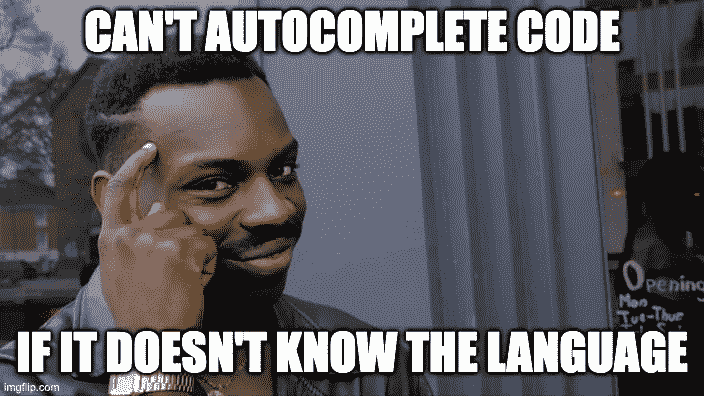

# 应对副驾驶

> 原文：<https://itnext.io/coping-with-copilot-b2b59671e516?source=collection_archive---------0----------------------->

## CS 教育者:基于人工智能的开发工具正在瞄准你的任务。反抗是徒劳的


副驾驶:乐意向你的学生伸出援手。(图片 AI-由 [DALL-E](https://openai.com/dall-e-2/) 从提示“一个穿着毕业礼服的学生，驾驶着一架商用飞机坐在驾驶舱里，旁边是一个机器人副驾驶，3d 渲染”中生成。)

G itHub 基于人工智能的[副驾驶工具](https://github.com/features/copilot)今年夏天[上市](https://github.blog/2022-06-21-github-copilot-is-generally-available-to-all-developers/)。对于软件开发人员来说，这是一个令人惊奇的工具。但是拥有它的学生将会带着乌兹冲锋枪去决斗。

使用 Copilot，学生可以立即生成自动完成的代码解决方案，*只要给出问题陈述*或甚至*只要函数名*或甚至*通过非常努力地集中注意力并盯着屏幕，*好吧，实际上不是最后一个，但我希望该功能*随时可用*。

(如果你还没有用过 Copilot，你可能还没有意识到事态的严重性。继续，[安装它](https://github.blog/2022-03-29-github-copilot-now-available-for-visual-studio-2022/#:~:text=Once%20you%20have%20received%20an,install%20the%20GitHub%20Copilot%20extension.)。我会等的。试举几个例子。哦，嘿，现在，吸气…呼气。就是这样。也许喝一大口烈性酒——某个地方总是下午 3 点！一切都会好的。(我可能在撒谎。))

好了，我们回来了。假设你让你的 CS 入门学生写一个迭代 Python 程序，输出从 1 到 N 的所有数字之和，因为，嘿，我们计算机科学家讨厌 O(1)封闭形式的解(斐波那契，我看着你呢)。得让那些 CPU 忙起来——气候不会自己变热！

现在，通常情况下(除非你班上有卡尔·弗里德里希·高斯那种自作聪明的人)，你的学生必须坐下来写一些代码，甚至可能思考一下。

没有苦差事，为我们的学生配备了副驾驶！他们只是将问题语句作为注释复制粘贴到他们的 IDE 中，键入函数定义“def output_sum(N):”，然后*击碎那个 Tab 键*就可以得到剩下的部分(黑体字中的一切**都是由 Copilot 生成的)。**

```
# A Python program that outputs the sum of all the numbers from 1 to N.
def output_sum(N):
  **sum = 0
  for i in range(1, N + 1):
    sum += i
return sum**
```

封闭形式的解决方案怎么样？Copilot 支持您—只需重命名该功能！

```
def output_sum_closed_form(N):
  **return N * (N + 1) / 2**
```

接招吧，高斯！

为了更好地衡量，让我们做封闭形式的斐波那契，同样的技巧:

```
def fibonacci_closed_form(N):
  **# recursion, schmecursion
  return ((1 + 5 ** 0.5) / 2) ** N / 5 ** 0.5**
```

(好吧，副驾驶并没有*实际上*插入刻薄的评论，但这并没有错。斐波那契的递归版本需要指数时间，结果是，指数时间真的不好。有一次，我和一个农民打赌，赌棋盘上的小麦会翻倍，我差点被输光，所以我得到了教训，那就是(a)不要和农民打赌，(b)指数是不好的。但是我跑题了。)

据我所知，副驾驶*接受过所有入门编程作业的专门培训*。副驾驶*喜欢介绍编程作业。*每次你再给副驾驶一个，它都会高兴地流口水，喃喃自语:“哦，我知道那个，mmmm 美味可口的点心，这是解决办法，请再来一个”。(老实说，他们需要禁用语音功能，这太令人毛骨悚然了。)

让您的学生使用 Copilot，您也可以制定您的课程目标*“学生将因按 Tab 键而产生重复性压力损伤”*，因为……您在下面看到的所有粗体代码都是自动生成的。我只是输入了函数名和参数(有时我甚至没有做到那一步！):

```
def depth_first_search(t**ree, node, visited):
  visited.add(node)
  for child in tree[node]:
    if child not in visited:
      depth_first_search(tree, child, visited)**def quicksort_random_pivot(l):
  **if len(l) <= 1:
    return l
  pivot = random.choice(l)
  left = [x for x in l if x < pivot]
  middle = [x for x in l if x == pivot]
  right = [x for x in l if x > pivot]
  return quicksort_random_pivot(left) + middle + quicksort_random_pivot(right)**def dijkstra(g):
  **dist = {}
  for v in g:
    dist[v] = float(‘inf’)
    dist[g[0]] = 0** **while True:
    u = min(dist, key=dist.get)
    if dist[u] == float(‘inf’):
      break** **for v in g[u]:
      if dist[v] > dist[u] + g[u][v]:
        dist[v] = dist[u] + g[u][v]** **return dist**
```

(从好的方面来说，也许副驾驶也会杀码面试，所以也不全是坏消息！)

```
def fizz_buzz(n):
  **if n % 15 == 0:
    return “FizzBuzz”
  if n % 3 == 0:
    return “Fizz”
  if n % 5 == 0:
    return “Buzz”
  return str(n)**
```

哦，我有没有提到副驾驶对学生是免费的？ Yep， [*副驾驶对学生免费*](https://docs.github.com/en/education/explore-the-benefits-of-teaching-and-learning-with-github-education/use-github-for-your-schoolwork/apply-for-a-student-developer-pack) *。它很有帮助地集成了他们最喜欢的 IDEs。*

当然，大喊“啦啦啦，我不会读你关于副驾驶的文章，这意味着它不存在不是问题”是一种宣泄，但这不会有帮助。放松，呼吸，就这样。

我本来想补充一些关于 Copilot 如何匹配现有的变量名和参数，如何在上下文中结合函数名，以及哦不，请不要再尖叫了，对不起，我的错！

所以，是的，CS 的教育者们，Copilot 比我们更强。但是我有一些想法！其中一些可能有用！

*   首先，我们都可以引导自己内心的南希·里根，告诉孩子们对副驾驶说不。它对药物有效，所以我很确定，等等，我现在被告知，它对药物有效*而不是*，重复，对药物有效*而不是*。哼。


只需说不:对 Copilot 的效果应该和对毒品的效果差不多

*   好吧，我们告诉他们说不，但是我们*也*引导我们的内心*罗纳德*里根和*信任但核实*，公开化，用剽窃检测器抓住他们。如果每个人都在使用 Copilot，那么我们应该看到相同的解决方案，然后，等等，我现在被告知 Copilot *将其解决方案随机化*，所以解决方案每次都可能不同，没关系。
*   那么，我们只是在考试中更重视分数，让学生用纸笔或者锁定的电脑来参加考试，怎么样？我谷歌了一下安装在你的笔 " 上的 [" *副驾驶，没有找到匹配的，所以看起来很有希望。(我的意思是，你可以为 Vim*](https://www.google.com/search?q=%22CoPilot+installed+on+your+pen%22) 得到它[，它是如此的低技术，以至于*实际上*就像在钢笔上，所以你可以明白我为什么检查了)。听着:我刚刚检查了安装在你嘴里的](https://github.com/github/copilot.vim) [" *副驾驶* "](https://www.google.com/search?q=%22Copilot+installed+in+your+mouth%22) ，它*也*没有命中，所以我认为让学生们实际上*解释*他们的代码，可能会奏效！
*   哦！坚持住！我有另一个想法。我看到 GitHub 提供了其他服务，而不仅仅是这个神奇的“标签作弊”的东西:“ [GitHub 教室](https://classroom.github.com/)”。是的，真的，GitHub 肯定会带走，但有时它也会给予。我被告知，到目前为止，副驾驶不能伪造一个可信的犯罪历史。哦 snap，现在它可能在他们即将推出的功能列表中，对不起大家。



*   这里有一个肯定有效的方法:使用一些 Copilot 并不真正了解的编程语言，让我们称之为*替代*。不能自动完成你不知道的语言，amirite？我听到所有的函数式程序员都在喊*就是这样，各位，终于到了我们闪亮的时刻了*！可悲的是，我有一个消息:副驾驶对编程语言的热爱是无止境的！[球拍](https://racket-lang.org/)！哈斯克尔！ [ML](https://www.deeplearningbook.org/) ！(不，不是那个，我是说那个*其他的* [ML](https://ocaml.org/) ，那个……哦，没关系。)Copilot 是一只贪婪的野兽:如果任何语言的任何代码找到了进入 GitHub repo 的途径，它已经把它吞掉了，并渴望更多，nom nom nom。
*   不，我们必须跳出框框。下面是我们如何打败 Copilot: *我们用根本不存在的编程语言教学。*一举两得:编程语言设计师的终身就业计划*和*CS 过度招生问题的解决方案！一定要带着一叠转专业申请表来上第一堂课——你会需要的！

你知道，现在回想起来，也许这里的*右移不是玩*。我们就承认吧。我们武器不足。我们放弃吧！我个人欢迎我们新的人工智能霸主。当然，那些介绍作业，写斐波那契，孩子们喜欢做这些事情！但是是时候把那些作业拖进垃圾桶了。相反，让学生们疯狂地使用副驾驶*，就像他们在课外所做的一样。Copilot 可以填充所有的样板文件和他们在现实生活中只会查找的东西，相反，我们可以创建更复杂、更丰富、更有趣、更令人满意的任务，这些任务实际上会做让他们参与的真实事情！*

或者，你知道，一切照旧，对副驾驶说不。你选择。

附注:这篇文章的一位读者提醒我注意一篇标题非常准确的学术文章——“机器人来了”——这篇文章提出了上面的许多观点，但附有图表和数据(很好！)但是没有《终结者》的插画(难过！).看完就哭(再来点)！

[***埃莫里伯杰***](https://emeryberger.com)**是麻省大学曼宁信息与计算机科学学院*[](https://www.cics.umass.edu/)**的教授，在那里他共同领导了* [*等离子@ UMass 实验室*](https://plasma-umass.org/) *。例如，他欢迎我们新的人工智能霸主。***