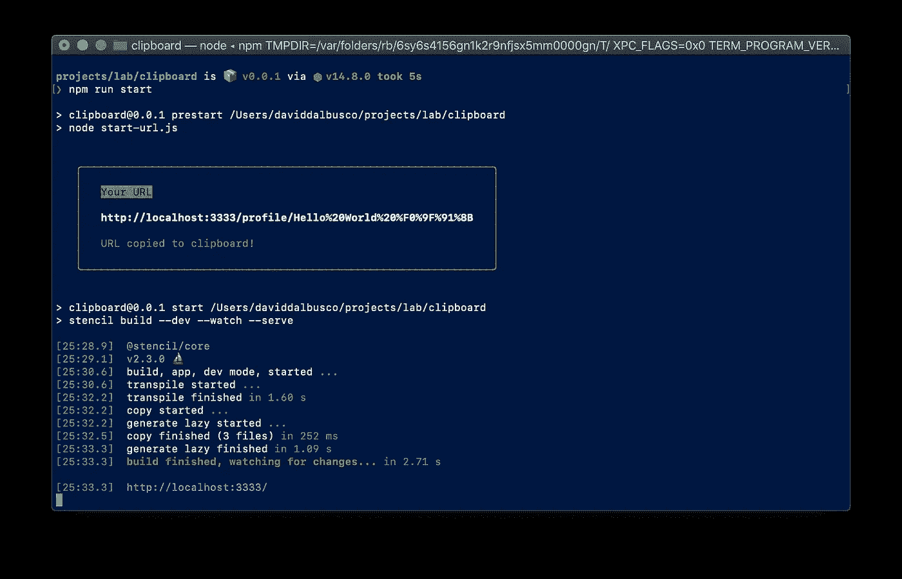
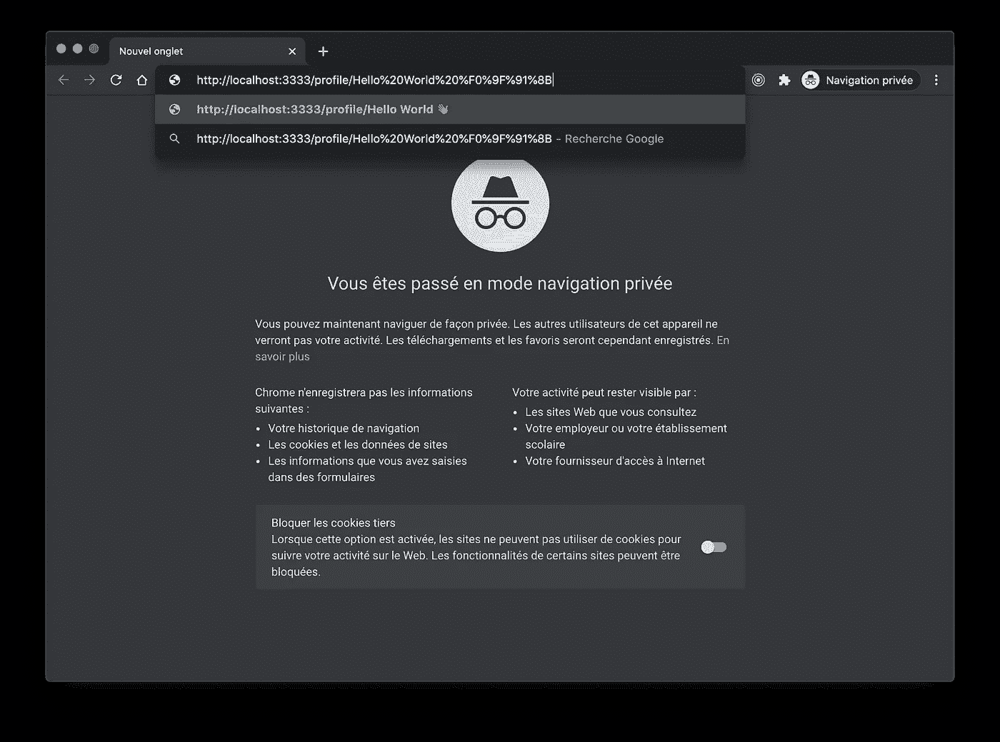
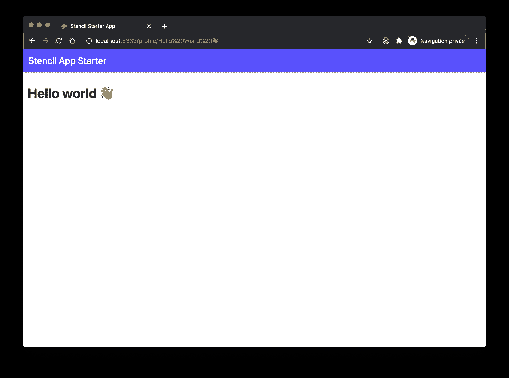

# 在 Npm 运行开始时将 URL 复制到剪贴板

> 原文：<https://itnext.io/copy-url-to-clipboard-on-npm-run-start-f07c57e8d2e?source=collection_archive---------2----------------------->

## 如何在本地启动应用程序时将它的启动 URL 和参数复制到剪贴板。


照片由 [Gia Oris](https://unsplash.com/@giabyte?utm_source=unsplash&utm_medium=referral&utm_content=creditCopyText) 在 [Unsplash](https://unsplash.com/?utm_source=unsplash&utm_medium=referral&utm_content=creditCopyText) 上拍摄

我不确定是否有人会需要下面的技巧，但是在我的客户那里，我们有一个只能通过包含动态 base64 参数的 URL 访问的应用程序。不用说，这让它在当地的发展有点不方便。

此外，我不得不承认，我不是一个大风扇的 CLI 的选项，可以自动打开浏览器。尽管我主要使用 Chrome 隐姓埋名模式进行开发，但我喜欢经常在浏览器之间切换，尝试我开发的东西。

最后，我不使用书签(不要评价我)并且，我经常在技术之间切换。因此，在没有配置的情况下，每次都必须使用另一个端口(`:3333`或`:4200`或`:8000`或`:8100`等)。).

这就是为什么我想给应用程序添加一个预启动脚本，它应该将应用程序的开始 URL 复制到我的剪贴板。这样做，我就可以选择一个浏览器，粘贴 URI，我就可以走了。

# 属国

为了从 NodeJS 脚本向剪贴板复制或读取值，我使用了库 [clipboardy](https://github.com/sindresorhus/clipboardy) ，它实现了这样一个跨平台特性。

此外，我还添加了[粉笔](https://github.com/chalk/chalk)和 [boxen](https://github.com/sindresorhus/boxen) 以时尚的方式打印出控制台的 URL。

您可能会注意到，所有这些依赖项都是开源的，并且是由同一个人开发的， [Sindre Sorhus](https://twitter.com/sindresorhus) ，他的贡献和工作绝对值得称赞👍。

```
npm i clipboardy chalk boxen --save-dev
```

# 脚本

获取依赖项后，我创建了预启动脚本本身。在这个例子中，我在项目的根目录下创建了一个文件`start-url.js`。

该脚本主要生成我希望复制到我的剪贴板中的`url`。我特意使用了一个`Hello World 👋`字符串来演示对复杂参数进行编码是可能的。

为了打印出漂亮的信息，我使用了带有颜色的`chalk`，在 for-和 background 中，还有粗体选项。我使用`\n\n`来创建换行符。值得注意的是，该库提供了许多选项，如组合或嵌套样式。

使用`clipboardy`将 URL 复制到剪贴板实际上很简单，可以通过调用函数`copy`将 all URL 作为输入参数来解决。

最后，在一个`console.log`中，我打印出了用`boxen`生成的一个框中的消息。

```
const { write: copy } = require('clipboardy');
const chalk = require('chalk');
const boxen = require('boxen');

const params = encodeURIComponent('Hello World 👋');

const url = `http://localhost:3333/profile/${params}`;

(async () => {
    let message = chalk.yellow.inverse('Your URL');

    message += `\n\n${chalk.bold(`${url}`)}`;

    try {
        await copy(url); message += `\n\n${chalk.grey('Copied local address to clipboard!')}`;
    } catch (err) {
        message = chalk.red.bold(`Cannot copy ${url} to clipboard 🥺\n\n${err.message}`);
    }

    console.log(
        boxen(message, {
            borderStyle: 'round',
            padding: 1,
            borderColor: 'yellow',
            margin: 1
        })
    );
})();
```

# 生命周期

多亏了 [npm](https://docs.npmjs.com/cli/v6/using-npm/scripts) ，可以在不同的生命周期执行脚本。因为我在本地启动应用程序时希望复制 URL，所以我将它作为一个`prestart`脚本添加到我的`package.json`中。

```
"scripts": {
  "prestart": "node start-url.js"
}
```

您可能会问“但是 David，为什么是预启动而不是后启动？”对此我的回答是`prestart`肯定会执行。相反，`poststart`也确实被执行，但仅当`start`生命周期被释放时。如果您的本地服务器像往常一样保持活动以观察变化，`poststart`将只在您取消本地服务器时才会解决。

# 演示

一切就绪后，当我在控制台中点击`npm run start`时，URL 被生成并复制到剪贴板，我注意到以下输出。



如果我打开一个浏览器，我可以将结果粘贴到导航栏中。



最后，点击`enter`并使用生成的参数访问我的 URL。



# 摘要

正如在这篇文章的介绍中所强调的，我真的不确定是否有人会需要这个解决方案😅。无论如何，我希望这是一个有趣的阅读，让我知道你是否会改善任何东西。

到无限和更远的地方！

大卫

你可以在推特上联系我，为什么不试着在你的下一次演讲中联系我。

[](https://deckdeckgo.com)