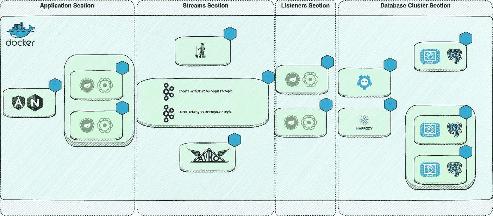
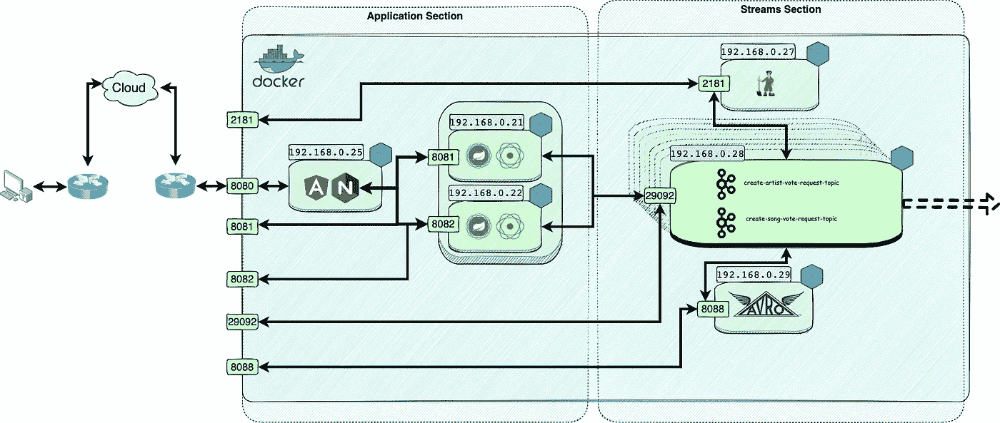
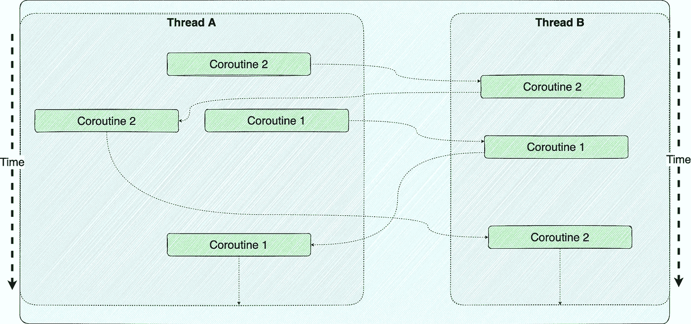
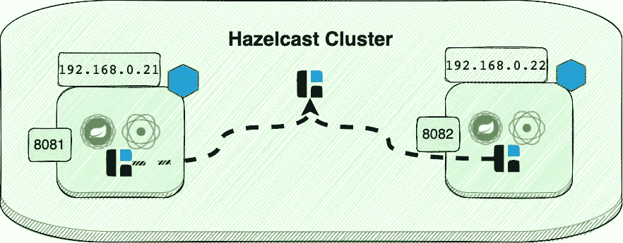
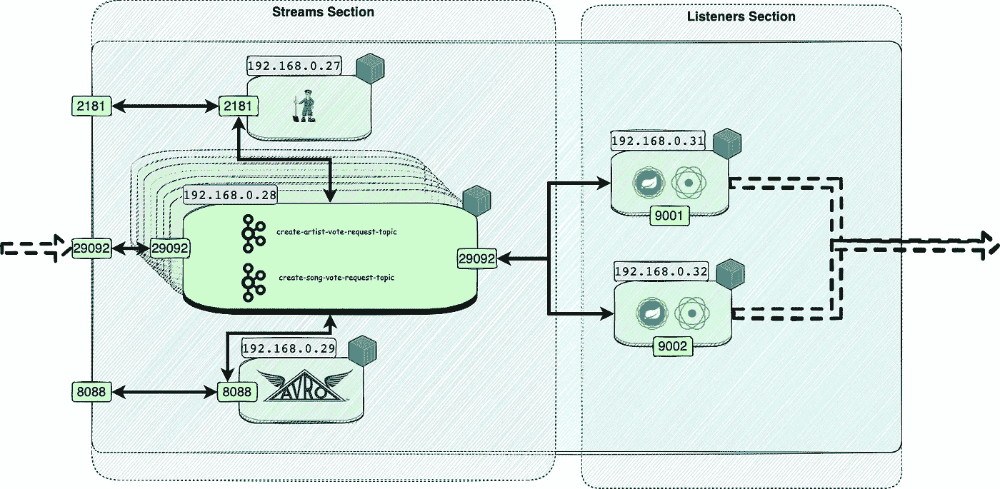
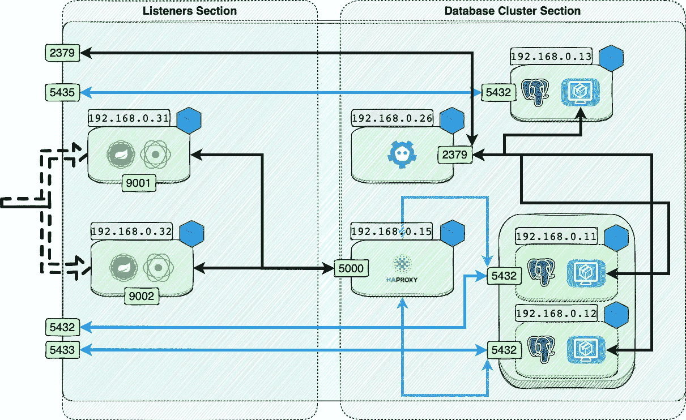
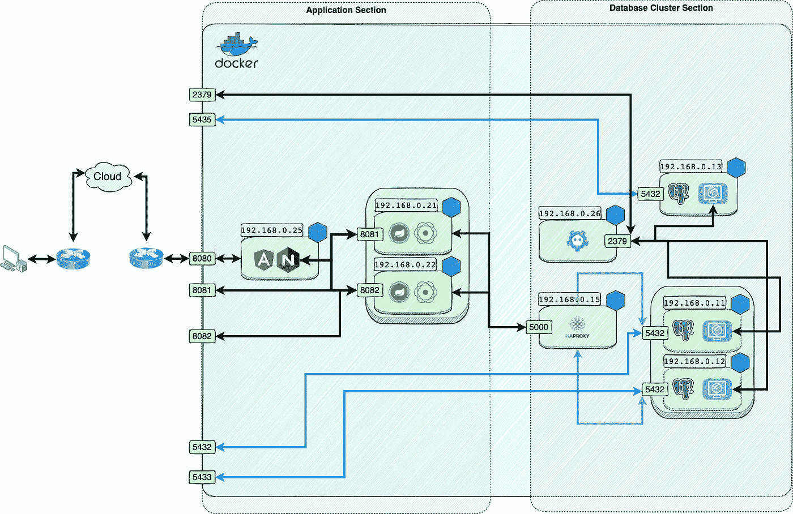
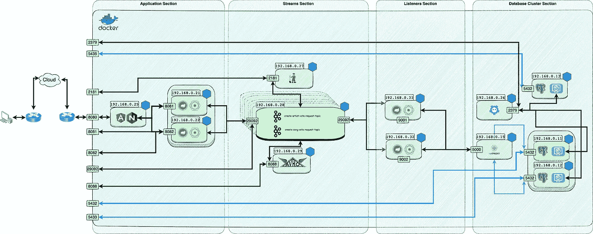

# Kotlin 中的协程、分布式缓存、弹性和复制——制作 VMA 的应用程序

> 原文：<https://itnext.io/coroutines-distributed-cache-resilience-and-replication-in-kotlin-making-a-vmas-application-df563edf8fe8?source=collection_archive---------1----------------------->


**协程**是一个至少从 1958 年就已经存在的概念。它是由 Melvin Conway 提出的，本质上意味着我们可以从一个线程中创建并执行协程。**协程**可以像线程一样暂停和恢复，但最重要的区别是线程创建自己的上下文，而协程**使用线程上下文**并可以与其他线程同时运行。从技术上讲，这不是并行运行。相反，他们被视为只是免费运行。协同程序还可以在运行时切换上下文，并使用另一个**线程上下文**。这被称为**协同多任务**。虽然这是一个非常古老的概念，但它目前与我们如何进行反应式编程非常相关。原因在于，通过允许协程利用上下文并同时从一个上下文切换到另一个上下文，系统可以在运行时执行更好的优化。这反过来意味着更有效地使用内存和 CPU。

从大约 4 年前开始，Kotlinx 的团队就一直忙于重新引入这种范式。

在像往常一样进入[示例](https://github.com/jesperancinha/vma-archiver)之前，我想先讨论一下我们要看的概念。我们构建应用程序的方式必须考虑诸如**可伸缩性**、**弹性**、**反应性**、**容量**和**性能、**等等概念。

协程非常神奇，但并不是万能的。因此，我们需要意识到，当我们决定使用它们时，我们知道我们在谈论什么。

在我们将要看到的[项目](https://github.com/jesperancinha/vma-archiver)中，我尽了最大努力**不发明轮子，**但是我也必须确保有足够的逻辑来解释在**现实世界项目**中使用**协程**的重要概念。现在，让我们简短地分析一下我们想要调查什么以及期望什么。

# 1.一个解决方案

当考虑可伸缩性时，我们希望确保我们的应用程序能够支持我们系统的弹性，能够支持我们原始资源的任何扩展。我们应该能够增加**内存**和 **CPU** ，而不必对我们的应用程序进行修改。否则，我们的应用程序就会被认为是僵化的，很难维护。容器允许我们定义可以给应用程序多少资源。

现在我们使用**容器**和一些应用技巧来最大化资源用户的效率。**反应式编程**在这方面很有帮助，我们将会看到它如何与**协程**相结合来获得更好的结果。

对于像我们将要看到的这样的应用程序，我们需要提供一种方法来扩大我们可以支持的流量。每个容器只能支持这么多流量。通常，市场上实现更好的系统升级的一个很好的解决方案是使用**负载平衡器**。它们的伟大之处在于，它们不仅可以分配负载，而且如果我们的应用程序的一个实例失败了，它可以立即切换到下一个可用的实例。通过这样做，我们确保我们的应用程序变得不可用的可能性大大降低，直到它变得完全不重要。这样，我们就接近了一个高度可用的应用程序。这些通常被称为**高可用性负载平衡器**。

想到这一点后，我们立即面临的另一件事是，如果我们想使用**缓存**，我们会受到这种方式的限制。引入**缓存**意味着我们引入状态，如果我们引入状态，意味着我们所有的副本需要共享相同的状态。这就是分布式缓存系统如 **Hazelcast** 和 **Reddis** 发挥作用的地方。如果我们在每台机器上创建一个缓存实例，并允许它将自己绑定到一个由所有缓存实例组成的集群，我们就可以保证在每次更新时在所有实例之间共享该状态。就像负载平衡器一样，我们可以微调分布式缓存系统来满足我们的日常需求。

同样，我们有应用程序负载平衡器，也可以有数据库负载平衡器。在这种情况下，我们可以设计一个只读数据库集群和一个只写数据库集群。如果我们实现了写和读操作的完全分离，那么对数据库的请求进行负载平衡并确保避免不一致就变得容易多了。我们可以实现一个 **CQRS** (命令查询请求分离)一样的实现。

在我们的例子中，我们还会看到在某个时候我们需要高可用性。尽管使用协同程序和 **R2DBC** 反应式库的反应式编程确实有助于使我们的应用程序更加**反应式**，并且通过这种方式**变得更加快速可用**，但是正如前面提到的，这并不是解决所有问题的方法。如果我们收到大量的请求，反应式系统仍然会面临容量问题。也就是说，**正在进行的进程**的数量可能会迅速增加，因此我们希望确保在某些情况下不会处理任何东西。在这些情况下，我们只想注册一个请求，让系统在后台处理它们。我们仍然让我们的应用程序是反应式的，但是用户将得到一个不同于典型的 **ok** 的响应。相反，用户得到请求正在进行的响应。

# 2.案例解释

在我们进入图表之前，让我们先看看我们的目标。想要创建一个投票系统来支持 **VMA 的** ( **MTV 的音乐录影带大奖**)。任何一种 VMA 氏症。像这样的奖项总是不同的，每年，类别可能会发生变化。例如，2020 年首次出现了与流行病相关的奖项。我们希望能够使奖项类别尽可能地动态化。对于 **MVP** ( **最低可行产品**)或 **POC** ( **概念验证**)，无论我们能尽快做出什么**，我们都希望投票者能够在不同的类别中为他们最喜爱的艺术家或歌曲投票。对于我们的需求列表，我们希望进一步了解**

*   **投票应该被计算在内，并且应该按照用户 Id 在一个表格上进行登记。**
*   **每个用户只能注册**一次投票。****
*   ****异常处理，在这种情况下，**并不重要，只要相关异常出现在**日志**中。**
*   **艺术家和歌曲可能会获得**额外投票**，但这一票将只给予类别中的艺术家，而不管用户投票。**
*   **额外的投票将根据**乐观锁定算法**给出。实际上，为了获得额外的投票，协程将从数据库中读取数据，添加一票并尝试保存它。如果在此期间发生了来自另一个用户的保存，那么应该抛出一个异常。**
*   **在投票过程结束时，甚至在投票过程中，总票数应计为投票表中的行数和成功给出的额外票数的**之和。****
*   **获胜者应该很容易在**结果页面**上查看**
*   **为了让 **PO** ( **产品负责人**)理解**背景**，应该构建一个**前端页面**来给出每个用户会发生什么的感觉**
*   ****安全**对于演示来说**不是必需的****
*   ****演示需要高可用性**。除了**落选的多余票**外，其他票都不应丢失。**
*   **整个系统应该支持高投票率。最终产品设定为**全球通用**。**

**就像我们得到的任何第一个需求列表一样，这些需求中的一些一开始可能很难理解或阅读，但是有这样的背景是很重要的。正是基于这种特殊的投票系统及其工作方式，我们将实施我们的解决方案。**

# ****3。第一张草图和示意图****

**为了理解我们将要实现的内容，让我们先来看看下面的图表，并花几分钟时间来理解它。仔细看看所有被描述和描绘的东西。然后，我们将从左到右对每一个架构部分进行分析。**

****

**一般系统概述**

**从左到右，我们可以看到我们的应用程序需要 4 个部分。我所创建的组是基于我们系统所必需的 4 个元素。**

**如上所述，我们需要一个应用程序和一个面向前端的应用程序。在我们的示例中，我们使用一个角度应用程序和两个反应式服务来实现这一点。Ngnix 为两个反应式应用程序副本提供角度应用程序和负载平衡请求。我们将进一步看到添加了一个名为 **Hazelcast** 的额外元素，这是创建分布式缓存集群的一种非常方便快捷的方式。这包括**应用部分**。**

**为了注册我们的投票，但不处理它们，我们需要某种流框架。在这种情况下，我选择了卡夫卡。不仅如此，在这种情况下，我们还将使用 **Avro 串行器。**我们将进一步了解这是如何使用的，以及当我们希望通过流序列化对象时，这可能会有什么帮助。这是**流媒体部分。****

**在**监听器部分**，我们将使用 2 个 spring boot 反应服务。反应式流程不是作为一个集群工作的。相反，他们只是信息流的两个消费者。有两个会有帮助。这样，我们可以更快地处理流上的请求，并且它提供了一个**故障安全机制**。**

**最后，为了提供**数据库集群部分**，纯粹因为我们想在本地运行所有这些，我们将利用 **Patroni** ，以便允许我们的数据库启动通过 **Etcd** 加入两个 **PostgreSQL** 集群。**

# **4.关注这些部分**

**正如我们在上面看到的，我们有不同的部分，它们的实现非常详细。通过概述，我们已经看到了构建该架构所涉及的所有部分。现在，我们将详细了解一下这些实现。我们将看到代码，它是如何实现的，以及它提供了什么。这个项目的所有参与者都可以通过端口映射到外部，但是我们只对通过端口 **8080** 发送请求感兴趣，然后这些请求被 **NGINX** 重新路由到适当的服务。**

**理解这一点也很重要，尽管本文包含了很多技术，但重点是展示一些使用带有协程的反应式编程的应用程序。因此，提到我们将要使用的库也是非常重要的。**

**对于协程，我们使用:**

```
<dependency>
    <groupId>org.jetbrains.kotlinx</groupId>
    <artifactId>kotlinx-coroutines-reactor</artifactId>
</dependency>
<dependency>
    <groupId>org.jetbrains.kotlinx</groupId>
    <artifactId>kotlinx-coroutines-core</artifactId>
</dependency>
<dependency>
    <groupId>org.jetbrains.kotlinx</groupId>
    <artifactId>kotlinx-coroutines-core-jvm</artifactId>
</dependency>
```

**对于卡夫卡，我们使用:**

```
<dependency>
    <groupId>io.projectreactor.kafka</groupId>
    <artifactId>reactor-kafka</artifactId>
</dependency>
```

**对于我们正在使用的 Avro 串行器:**

```
<dependency>
    <groupId>io.confluent</groupId>
    <artifactId>kafka-avro-serializer</artifactId>
</dependency>
<dependency>
    <groupId>org.apache.avro</groupId>
    <artifactId>avro</artifactId>
</dependency>
```

**对于 Hazelcast，我们使用:**

```
<dependency>
    <groupId>com.hazelcast</groupId>
    <artifactId>hazelcast</artifactId>
</dependency>
```

**还有运行 Spring Boot 所需的所有库、存储库、rest 方法和服务等等。这些都是标准，超出了本文的范围。**

# **4.1.应用部分**

****

**应用程序与流部分的交互**

**在应用中我们将看到一个前端应用在 **Angular** 中。该应用程序通过 **NGINX** 直接提供服务。此外，我们将 **NGINX** 配置为在另外两个弹簧引导进程之间进行负载平衡。这是通过以下方式实现 inf NGINX 来实现的:**

```
server {
    listen 8080;
    listen [::]:8080;

    root /usr/share/nginx/html;

    server_name _;

    location / {
        root   /usr/share/nginx/html;
        try_files $uri $uri/ /index.html?$args;
    }

    location /result {
        root   /usr/share/nginx/html;
        try_files $uri $uri/ /index.html?$args;
    }

    location /api/vma/ {
     proxy_pass http://apps;
    }

    location /api/vma/broker {
      proxy_pass http://apps;
      proxy_http_version 1.1;
      proxy_set_header Upgrade $http_upgrade;
      proxy_set_header Connection "upgrade";
      proxy_set_header Host $http_host;
      proxy_set_header Access-Control-Allow-Origin 192.168.0.120;
      proxy_set_header X-Real-IP $remote_addr;
      proxy_set_header X-Forwarded-For $proxy_add_x_forwarded_for;
      proxy_set_header X-NginX-Proxy true;
    }

}
```

**在这个实现中，我们看到了一些重要的配置。所有根流量都被重定向到 **/usr/share/nginx** 文件夹。我们应用程序的所有代码都将驻留在那里。对于所有的 API 路由，我们使用一个 **proxy_pass** ，它负责将流量转移到 **http//:apps** 。这个网址不是一个真正的普通网址。而是被 NGINX 认定为上游。我们有两条重新路由路径。一个重路由 **/api/vma** ，另一个重路由 **/api/vma/broker** 。第一个为 **REST** 服务调用将流量重定向到一个实例。后者将入站和出站重新路由到实例 **websockets** 。这就是我们在前端不断更新应用程序的方式:**

```
http {

    upstream apps {
        server 192.168.0.21:8081;
        server 192.168.0.22:8082; }
...}
```

**既然我们已经了解了负载平衡是如何在应用程序级别上使用 **NGINX** 工作的，那么现在让我们来看看协程实际上是如何工作的。在继续之前，回顾一下协程到底是什么和不是什么可能是个好主意。协程不是线程。它们使用并可以共享线程上下文。**

****

**协程过于简单**

**上图与代码没有直接关系。我想展示的是协程是通过使用一个协程上下文来工作的，这个上下文是由我们决定它应该运行的线程给出的。我们可以用 ***launch*** 以编程方式启动一个协同计算，并为它决定一个在第一个参数上运行的上下文。我们经常想决定哪个线程对完成这项工作是重要的。我们也可以决定一个新的上下文来运行代码块，例如 ***和*** 上下文。但是上下文是不变的。这意味着我们不能改变协程最初运行的上下文。我们可以让它切换上下文，但是协程仍然依赖于创建它的原始上下文，并且可以从该上下文中取消。**

**我们的应用程序有很多以被动方式实现的 REST 方法。投票是通过使用 POST 请求来完成的，这些请求确保选票进入 Kafka 流。我们还有一个 websocket 代理，如前所述，它确保我们的应用程序得到实时更新。解释所有这些方法和实现投票系统背后的完整逻辑不是本文的目的。我们想了解协程是如何工作的，所以让我们开始吧。**

**一个很好的例子是***registry controller***类中的方法***getCurrentVma***:**

```
@GetMapping("/current")
fun getCurrentVma(@CookieValue("votingId") votingKey: String?): Flow<CategoryDto> =
    categoryService.findAll(votingKey)
```

**在这个例子中我们使用了协程 ***流*** 类。这个 ***流*** 是实现 ***类别到*** 的流动流的抽象。这是一个**数据传输对象** (DTO)，代表奖项的类别。它包含类别的名称，候选人名单，投票完成后的获胜者，以及是否已被某个用户投票淘汰。在任何情况下，它提供了一个连续的流动。它 ***利用 ***发射器*** 收集*** 传入的数据。如果我们查看原始源代码，我们会发现:**

```
package kotlinx.coroutines.flow

public interface FlowCollector<in T> {
    public abstract suspend fun emit(value: T): kotlin.Unit
}
```

**这里要认识到的重要一点是 ***emit*** 是一个暂停函数抽象。单独使用 ***suspend*** 意味着代码将作为协程运行，当前线程作为其线程上下文。在我们的例子中，我们让流中的这些协程在*主线程上下文中运行*。****

****一个很好的例子是位于***port controller***类中的协程。这是***getWelcomeMessage***的功能:****

```
**@GetMapping
suspend fun getWelcomeMessage() =
    "Welcome to the VMA Voting System Test App! This one is running on port $port"**
```

****我们简单地返回一个 ***字符串。我创建这个方法只是为了验证 **NGINX** 的**负载平衡**功能。*******

********

****黑兹尔卡斯特星团****

****在这个应用程序中，正如引言中提到的，我们需要缓存投票过程的进度。复制实例中的缓存也必须复制。一方必须知道另一方给予了什么，反之亦然。最简单的方法是使用一个带有 ***自动发现*** 的分布式缓存系统。在我们的示例中，我们使用了 Hazelcast。我们使用 Java 实现替代方案，甚至不需要启动容器。为此，我们在两个实例上创建一个***HazelcastInstance***bean:****

```
**@Bean
fun hazelcastInstance(): HazelcastInstance {
    val worldConfig = Config();
    worldConfig.*clusterName* = "vma-world";
    return Hazelcast.newHazelcastInstance(worldConfig)
}**
```

****然后我们可以在下面的例子中使用它:****

```
**private val cache: MutableMap<String, VotingStatus> = hazelcastInstance.getMap("vma-cache")**
```

****最后，我们通过以下方法将数据发送给 kafka:****

```
**suspend fun publishArtistVote(key: String, artistVotingDto: ArtistVotingDto): Mono<Void> {
     val producerRecord: ProducerRecord<String, ArtistVotingDto> =
         ProducerRecord(kafkaConfigProperties.createArtistVoteRequestTopic, key, artistVotingDto)

     return voteArtistRequestRequestKafkaSender.createOutbound()
         .send(Mono.just(producerRecord))
         .then()
         .doOnSuccess **{** logger.info("Vote Created with id $key") **}** }**
```

****这也是一种挂起方法。即使只是将物体放入**卡夫卡**流中，我们也希望以**反应**的方式完成。也许我们不会在一些请求上看到明显的差异，但是当同时发出许多请求时，我们应该会看到更多的请求被同时处理。在流中，我们将使用***artistvodingto***和***songvodingto***类型。我们 aso 使用一个 ***单声道*** 作为返回值。我们使用库 ***反应器——卡夫卡*** 进行所有**卡夫卡**的互动。****

****这个项目的所有方法要么是 ***暂停*** 要么是返回一个 ***流<>***对象。这两者都保证了应用程序尽可能地可用，并且可以继续接收到来的请求。我们的应用程序变得无阻塞，负载均衡器的使用保证了我们获得良好的容错能力和弹性。负载平衡器与应用程序分离。如果担心负载平衡器本身的可用性，我们可以通过在系统中引入备份负载平衡器来轻松应对。因为缓存也是分布式的，所以这意味着所有的实例都必须关闭才能删除缓存。这意味着我们可以说在**应用程序部分**上可以有**容错**到**负载平衡故障**、**应用程序故障**和**缓存故障**。****

# ****4.2.溪流部分****

********

****流与监听器部分的交互****

****在应用程序的这一部分，我们使用了 3 个不同的播放器。一个是端口 **2181** 上的 **Zookeeper** ，另一个是端口 **8088** 上的 **Avro 可序列化对象**的**模式注册表**，最后是端口 **29092** 上的 **Kafka broker** 或 **Kafka 流**。我们在听众开始时创建两个主题，名称分别为**create-artist-vote-request-topic**和**create-song-vote-request-topic**。一个接收艺术家的投票，另一个接收歌曲的投票。Avro 序列化器本身并不是一个需求，但是我发现加入它很有趣。Avro 对象的示例可以在类的公共模块中找到:****

```
**data class ArtistVotingDto(
    val userId: String,
    val idC: String,
    val idA: String
) : IndexedRecord {
    override fun getSchema(): Schema =
        SchemaBuilder.record("ArtistVotingDto")
            .namespace("org.jesperancinha.vma.common.dto")
            .fields()
            .requiredString("userId")
            .requiredString("idC")
            .requiredString("idA")
            .endRecord();

    override fun put(i: Int, v: Any?) {
        *println*("$i + $v")
    }

    override fun get(i: Int) = when (i) {
        0 -> userId
        1 -> idC
        2 -> idA
        else -> ""
    }
}**
```

****这是我们创建一个简单的 Avro 对象的方法。乍看起来，这样做的好处是，我们不需要共享流中运行的类型。参数被索引并通过流发送。在接收端，我们会发现我们并不是在真正地选角。我们将最终只对给定的值进行转换。这非常类似于拆卸家具，用卡车装运，然后在目的地重新组装。结构不被维护，但值被维护。我们可以在最后重组元数据和数据。需要**模式** **注册中心** **服务**来保存主题模式，以保证发送消息的一致性。****

****在图中，我们看到被跟踪的卡夫卡经纪人。本地 **Kafka** 消耗大量资源，所以我只使用了一个单独的 **Kafka** **broker** ，但是我们可以并且应该在生产中使用更多。****

# ****4.3.听众部分****

********

****监听器与数据库集群的交互****

****听众部分由两个 Spring Boot 服务部门组成。如前所述，他们是卡夫卡流的消费者，默认情况下，他们属于同一个消费者群体。它们在端口 **9001** 和端口 **9002** 上运行。这不是必要的要求。我使用这些端口进行了一些测试。一旦数据被使用，它就会被重新创建并保存到数据库中。这是登记选票的地方。****

****在开始研究监听器数据模型如何工作之前，我们首先应该看看集群是如何实现的。对于这个集群，我使用了 5 个重要的参与者。我们需要一个端口 **5000** 上的 **HAProxy** ，一个端口 **2379** 上的 Etdc 服务器， **Patroni** 启动模式应用于端口 **5432** 上的三个数据库 **PostgreSQL** 容器。 **Etdc** 服务器作为集群管理工作。HAProxy 对此毫不知情。数据库通过 **Patroni** 连接到 **Etdc** ，通过 HAProxy 连接到数据库的连接由 Etdc 管理。如果你喜欢这种方式， **Etdc** 是被 **Patroni 屏蔽的数据库的协调器。******

****在监听器实现中，我们创建了一个监听器:****

```
**@Bean
private fun votingRequestListener(): Disposable {
    return KafkaReceiver.create(receiverOptions)
        .receive()
        .concatMap **{** record **->** createVoteRequestHandler
                .handleCreateVoteRequest(record.value())
                .then(record.receiverOffset().commit())
                .doOnError **{** logger.error(
                        "Error while creating Vote",
                        **it** )
                **}
        }** .subscribe()
}**
```

****对于这个特定的例子，我们没有使用暂停功能。我们只是创建一个 ***Bean*** ，它将在后台运行。由于我们使用的是 **reactor-kafka** 库，我们需要确保 out ***事件处理程序*** 返回 **Flux** 相关的反应对象:****

```
**fun handleCreateVoteRequest(request: Record): Mono<Job> {
    return *mono* **{** request.*schema*.*name*.*let* **{** name **->** *CoroutineScope*(*IO*).*launch* **{** when (name) {
                    "ArtistVotingDto" -> {
                        val vote = VoteCategoryArtist(
                            userId = request.get(0).toString(),
                            idC = request.get(1).toString(),
                            idA = request.get(2).toString()
                        )
                        votingCategoryArtistRepository.save(vote)
                        val category = categoryArtistRepository.findByCategoryIdAndArtistId(vote.idC, vote.idA)
                        categoryArtistRepository.save(
                            category.copy(
                                votes = category.votes + 1,
                                updates = category.updates + 1
                            )
                        )
                    }
                    else -> {
                        val vote = VoteCategorySong(
                            userId = request.get(0).toString(),
                            idC = request.get(1).toString(),
                            idS = request.get(2).toString()
                        )
                        votingCategorySongRepository.save(vote)
                        val category = categorySongRepository.findByCategoryIdAndSongId(vote.idC, vote.idS)
                        categorySongRepository.save(
                            category.copy(
                                votes = category.votes + 1,
                                updates = category.updates + 1
                            )
                        )

                    }
                }
            **}
        }
    }**.doOnError **{** logger.error("Exception while trying to create a new user", **it**) **}** }**
```

****在这个例子中，我们原则上不需要在 IO 线程上下文中启动协程。我把它作为一个例子添加进来，说明如何从我们选择的特定上下文中启动协程。在这种情况下，我们已经在**发布者**的**反应上下文**中运行我们的代码。在我们的例子中，这个发布者是 ***单声道<作业>* 。作业**，是在 ***启动期间创建的对象。下面是一个例子，说明我们如何在接收到事件时重新构造元数据和数据:*******

```
**val vote = VoteCategoryArtist(
    userId = request.get(0).toString(),
    idC = request.get(1).toString(),
    idA = request.get(2).toString()
)
votingCategoryArtistRepository.save(vote)**
```

****在收到事件后，我们还尝试给予额外的投票:****

```
**val category = categoryArtistRepository.findByCategoryIdAndArtistId(vote.idC, vote.idA)
categoryArtistRepository.save(
    category.copy(
        votes = category.votes + 1,
        updates = category.updates + 1
    )
)**
```

****这是一个尝试的原因，因为表实体是通过以下方式实现的:****

```
**@Table
data class CategoryArtist(
    @field: Id
    val idCA: String = UUID.randomUUID().toString(),
    val idC: String? = null,
    val idA: String? = null,
    val updates: Int = -1,
    val votes: Long = 0,
    val voteCount: Long = 0,
    @field: Version
    val version: Long? = null,
) : Persistable<String> {
    override fun getId(): String = idCA
    override fun isNew(): Boolean = updates < 0
}**
```

****这样做时，我们要确保在读取数据和将数据写入数据库的特定行之间不会发生更新。这仅通过使用***@ field:Version***注释来保证。这样做可以保证我上面提到的优化锁定机制处于活动状态。****

****以这种方式实现的监听器是被动的，在我们的例子中，我们还使用了协程和 R2DBC。换句话说，这意味着大量的解耦，这意味着我们系统的所有运动部分都是相互独立的，根本不会相互阻碍。****

# ****4.4.数据库集群部分****

********

****应用部分直接数据库集群交互****

****没有这最后一部分，这个项目就不会有意思。这是我们与数据库交互的地方。在投票之前、期间和之后，查阅数据库中的数据极其重要。系统必须有足够的弹性来支持投票检查，并允许用户跟踪投票的进展。在真实的情况下，我们看不到正在进行的投票。通常会定期更新，我们实际上是从网站上读取投票总数。为了我们的练习，让我们假设我们真的想时不时地检查一下过载的数据库。我们不仅想让我们自己使用，也想让全世界同时使用这个应用程序的所有用户使用。为此，我们需要几个方法。我们将只检查一个用于 ***通量*** 和一个用于 ***暂停*** ，并看看它在 **MVC** **设计** **模式**的不同层中是如何工作的。****

****我们在代码中有一个 ***GET*** 方法，它为我们提供了填充 VMA 投票页面所需的完整数据，位于***registry controller***:****

```
**@GetMapping("/current")
fun getCurrentVma(@CookieValue("votingId") votingKey: String?): Flow<CategoryDto> =
    categoryService.findAll(votingKey)**
```

****这个方法返回一个 ***类别到*** 的列表。这方面的代码是:****

```
**data class CategoryDto(
    val id: String? = null,
    val category: String,
    val type: CategoryType?,
    val capacity: Int,
    val artists: List<ArtistDto> = *emptyList*(),
    val songs: List<SongDto> = *emptyList*(),
    val voted: Boolean
)**
```

****在这个数据传输对象中，就像在许多其他对象中一样，我们可以找到许多转换扩展函数:****

```
**fun CategoryDto.toData(): Category = Category(
    name = this.category,
    capacity = this.capacity,
    type = this.type
)

val CategoryDto.*toNewData*: Category
    get() = Category(
        name = this.category,
        capacity = this.capacity,
        updates = 0,
        type = this.type
    )

fun Category.toDto(): CategoryDto = CategoryDto(
    id = this.*id*,
    category = this.name,
    capacity = this.capacity,
    type = this.type,
    voted = false
)

fun Category.toDtoWithArtistsAndVote(artists: List<ArtistDto>, voted: Boolean): CategoryDto = CategoryDto(
    id = this.*id*,
    category = this.name,
    capacity = this.capacity,
    type = this.type,
    artists = artists,
    voted = voted
)

fun Category.toDtoWithSongsAndVote(songs: List<SongDto>, voted: Boolean): CategoryDto = CategoryDto(
    id = this.*id*,
    category = this.name,
    capacity = this.capacity,
    type = this.type,
    songs = songs,
    voted = voted
)

fun Category.toDtoWithArtists(artists: List<ArtistDto>): CategoryDto = CategoryDto(
    id = this.*id*,
    category = this.name,
    capacity = this.capacity,
    type = this.type,
    artists = artists,
    voted = false
)

fun Category.toDtoWithSongs(songs: List<SongDto>): CategoryDto = CategoryDto(
    id = this.*id*,
    category = this.name,
    capacity = this.capacity,
    type = this.type,
    songs = songs,
    voted = false
)**
```

****在我们的例子中，不一定需要转换，但重要的是要记住，在**生产** **环境**中，显示的数据不一定总是与数据库中的**域**模型匹配。我们也可能会发现**混淆** **Id 的**的系统。一般来说，最好不要将**数据模型**与**表示层混合在一起。******

****顺着控制器方法的线索，我们在位于 ***Services.kt*** 脚本中的***category service***实现中找到了它的实现:****

```
**fun findAll(votingKey: String?): Flow<CategoryDto> {
    return categoryRepository.findAll().*map* **{** category **->** when (category.type) {
            *ARTIST* -> category.*toDtoWithArtistsAndVote*(
                artistService.findAll(
                    categoryArtistRepository.findByCategoryId(category.*id*).*map* **{** e **->** e.idA **}**.*filterNotNull*()
                        .toList()
                ).toList(), votingKey?.*let* **{** cache[votingKey]?.votedOff?.contains(category.*id*) **}** ?: false
            )
            else -> category.*toDtoWithSongsAndVote*(
                songService.findAll(
                    categorySongRepository.findByCategoryId(category.*id*).*map* **{** e **->** e.idS **}**.*filterNotNull*().toList()
                ).toList(), votingKey?.*let* **{** cache[votingKey]?.votedOff?.contains(category.*id*) **}** ?: false
            )
        }
    **}** }**
```

****实现本身有点复杂，因为它包含了前面提到的与 ***Hazelcast*** 管理的状态相关联的业务逻辑。这里需要注意的是，我们使用了两个**库**和几个**扩展函数**。我们将重点介绍 ***类别和*** :****

```
**@Repository
interface CategoryArtistRepository : CoroutineCrudRepository<CategoryArtist, String> {
    @Query("Select * from category_artist ca where ca.id_c=:idc")
    fun findByCategoryId(@Param("idc") categoryId: String): Flow<CategoryArtist>

    @Query("Select * from category_artist ca where ca.id_c=:idc and ca.id_a=:ida")
    suspend fun findByCategoryIdAndArtistId(
        @Param("idc") categoryId: String,
        @Param("ida") artistId: String
    ): CategoryArtist
}**
```

****我们可以看到两个声明的抽象，它们将给出两个本地查询的结果。对于本文，查询本身并不重要。它们的结果是。我们谈了一点关于**发射器**和它们对 ***通量*** 物体的意义。 ***findByCategoryId*** 返回一个***category artist***列表。因为这是一个包含许多结果的结果集，所以挂起这个函数没有意义，因为对每个元素的访问都是以挂起的方式完成的。这意味着访问是在协程内完成的。函数***findByCategoryIdAndArtistId***只返回(我们希望)一个结果。返回一个结果意味着我们应该使用关键字*。如前所述，这个关键字立即使我们的函数在协程中运行，从而符合反应式编程的要求。*****

*****最后，我们还应该快速查看一个负责获取特定类别和艺术家的投票计数的方法。它位于***voting controller***:*****

```
**@GetMapping("/artist/{idc}/{ida}")
suspend fun getArtistVotingResults(
    @PathVariable idc:String,
    @PathVariable ida:String
) = votingService.getArtistVotingResults(idc, ida)**
```

****这将导致它在***voting service***类的 ***Services.kt*** 脚本中的实现:****

```
**suspend fun getArtistVotingResults(idc: String, ida: String): Long =
    categoryArtistRepository.findByCategoryIdAndArtistId(idc, ida).votes**
```

****这是我们之前评估的方法。这结束了我们的闪电贯穿我们的项目。以下是投票开始时整个项目的完整概述:****

********

****完整的投票图****

# ****5.运行演示****

****为了运行演示，请确保您已经安装了 Docker 和 JDK 17。然后，您可以从根目录运行此命令:****

```
**make docker-clean-build-start**
```

****等待几分钟，也许 10 分钟，只是为了确定。然后你可以运行蝗虫测试:****

```
**make locust**
```

****同时你可以跳转到 [http://localhost:8080](http://localhost:8080) 上的投票页面。在那里你可以选择投票。结果可以在以下网站看到:[http://localhost:8080/result](http://localhost:8080/result)****

****继续检查蝗虫进程。一旦完成，投票仍然没有完成。你必须让这个过程运行一段时间。或者，您可以运行:****

```
**make count-votes**
```

****如果您得到一个异常，很可能是因为乐观锁定算法。这样做是为了让你看到它的作用。当投票完全停止时，您应该能够运行它而不会出错。****

****我们应该看到的重要日志是来自应用程序的日志和来自侦听器的日志。在这里，我们应该可以找到乐观锁定实现和 Hazelcast 启动的例外情况:****

```
**docker logs jofisaes_vma_listener_1
docker logs jofisaes_vma_backend_img_1**
```

****在后端应该会看到类似这样的异常:****

```
**2021-11-17 16:55:22.810 ERROR 8 --- [io-8081-exec-10] o.a.c.c.C.[.[.[.[dispatcherServlet]      : Servlet.service() for servlet [dispatcherServlet] threw exceptionorg.springframework.dao.OptimisticLockingFailureException: Failed to update table [category_artist]. Version does not match for row with Id [9cf34b5a-37f9-444c-8518-b778d2fa4a3b].
 at org.springframework.data.r2dbc.core.R2dbcEntityTemplate.lambda$doUpdate$14(R2dbcEntityTemplate.java:704) ~[spring-data-r2dbc-1.3.6.jar!/:1.3.6]
 at reactor.core.publisher.FluxHandle$HandleSubscriber.onNext(FluxHandle.java:103) ~[reactor-core-3.4.11.jar!/:3.4.11]
 at reactor.core.publisher.FluxOnErrorResume$ResumeSubscriber.onNext(FluxOnErrorResume.java:79) ~[reactor-core-3.4.11.jar!/:3.4.11]
 at reactor.core.publisher.MonoUsingWhen$MonoUsingWhenSubscriber.deferredComplete(MonoUsingWhen.java:278) ~[reactor-core-3.4.11.jar!/:3.4.11]**
```

****在听者看来是这样的:****

```
**Exception in thread "DefaultDispatcher-worker-3" org.springframework.dao.OptimisticLockingFailureException: Failed to update table [category_song]. Version does not match for row with Id [8eb3cdde-0771-49b3-a031-9b011cb48ef0].
 at org.springframework.data.r2dbc.core.R2dbcEntityTemplate.lambda$doUpdate$14(R2dbcEntityTemplate.java:704)
 at reactor.core.publisher.FluxHandle$HandleSubscriber.onNext(FluxHandle.java:103)
 at reactor.core.publisher.FluxOnErrorResume$ResumeSubscriber.onNext(FluxOnErrorResume.java:79)
 at reactor.core.publisher.MonoUsingWhen$MonoUsingWhenSubscriber.deferredComplete(MonoUsingWhen.java:278)**
```

****本文对完整的堆栈跟踪不感兴趣，但是您会发现它非常广泛。****

****我制作了一个视频来引导您完成开始演示的步骤。请看看它，看看它到底是如何工作的。既然录了，应该没有已知的“演示效果”:****

****科特林演示中的协同程序、分布式缓存、弹性和复制——VMA 的应用****

# ****6.结论****

****我希望通过这篇篇幅很长、内容广泛的文章和项目，我能够分享一些你感兴趣的和/或你作为一名**软件工程师能够在日常生活中使用的知识**。我对协程的探索向我展示了非常重要的东西。总的来说，如果我们认为协程正在回到我们的日常工作中，那么它们是一个相对较新的主题。这是有充分理由的。可观察到的模式实现起来非常困难和麻烦。Spring WebFlux 确实支持反应式编程实现，但这也让实现变得更加困难。协程确实涵盖了这一点。我们可以认为这是用 ***暂停*** 而不是用 ***单声道< T >*** 。至少我知道。而我们也可以这样认为，用 ***流量<>***代替 ***流量<>***。流动和流动似乎没有太大的区别。从编程的角度来看，它们似乎非常相似。不使用 ***Mono < T >* ，**让我想起了过去的实现，在这些实现中，我别无选择，只能使用 **WebFlux** 的 **Zip** 函数，以确保我会创建一个非阻塞的进程来加入不同查询的结果。****

****但是所有这些中最重要的部分实际上是协程如何工作的。通过允许多个线程在我们喜欢的线程上独立运行，我们也允许多个不同的计算在同一个 ***线程*** 中同时发生！。这个概念使得反应式编程更容易，因此也更有趣。****

****这篇文章根本没有说反应式**协程**比 ***WebFlux*** 好。发表那份声明并不是它的目的。然而，在编程层面上有一个明显的结论，那就是用这种方式构建项目更容易。这也是我加入 ***反应器——卡夫卡*** 的部分原因。我们可以提出的另一个问题是，他们中的哪一个更具反应性？它们都与 R2DBC 实现耦合得很好，而且从协程及其语法来看，它们可以单独测试。但是这可能是另一篇文章要探讨的内容。****

****我已经把这个应用程序的所有源代码放在了 GitHub 上****

****我希望你能像我喜欢写这篇文章一样喜欢它。我尽量让它简洁明了，并省略了许多小细节。****

****我很想听听你的想法，所以请在下面留下你的评论。****

****提前感谢阅读！****

# ****6.参考****

 ****[## 协同程序-维基百科

### 协程是计算机程序组件，它通过允许…

en.wikipedia.org](https://en.wikipedia.org/wiki/Coroutine)****  ****[## 合作多任务-维基百科

### 协作式多任务处理，也称为非抢占式多任务处理，是计算机多任务处理的一种形式

en.wikipedia.org](https://en.wikipedia.org/wiki/Cooperative_multitasking)**** ****[](https://en.wikipedia.org/wiki/Preemption_%28computing%29) [## 抢占(计算)-维基百科

### 在计算中，抢占是暂时中断一个正在执行的任务的行为，目的是在某一时刻恢复它

en.wikipedia.org](https://en.wikipedia.org/wiki/Preemption_%28computing%29) [](https://en.wikipedia.org/wiki/Real-time_computing#Hard) [## 实时计算-维基百科

### 实时计算(RTC)是计算机科学术语，指受“实时”控制的硬件和软件系统

en.wikipedia.org](https://en.wikipedia.org/wiki/Real-time_computing#Hard)****