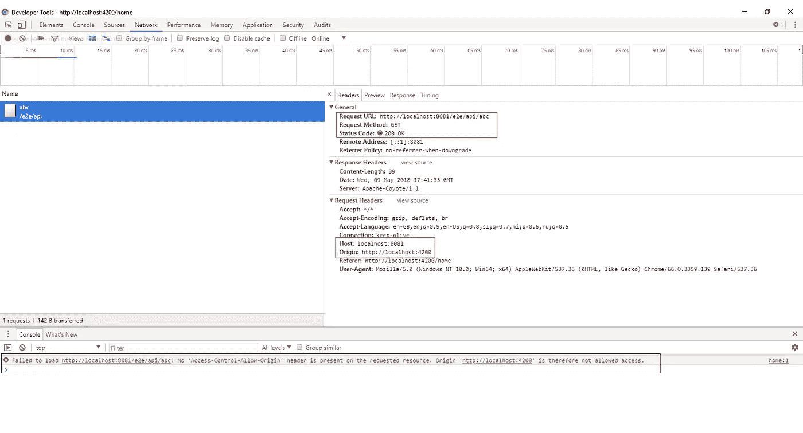
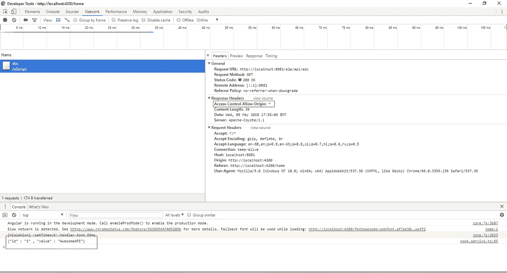
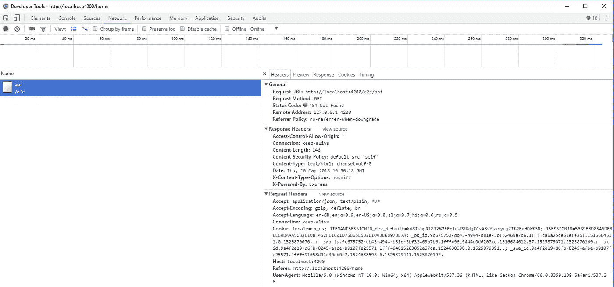
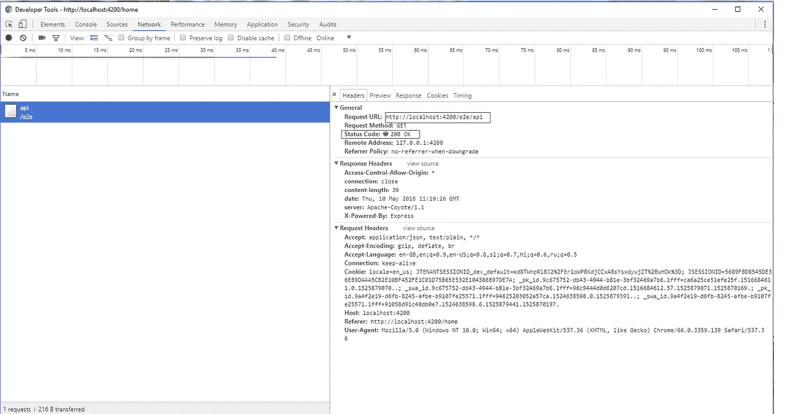
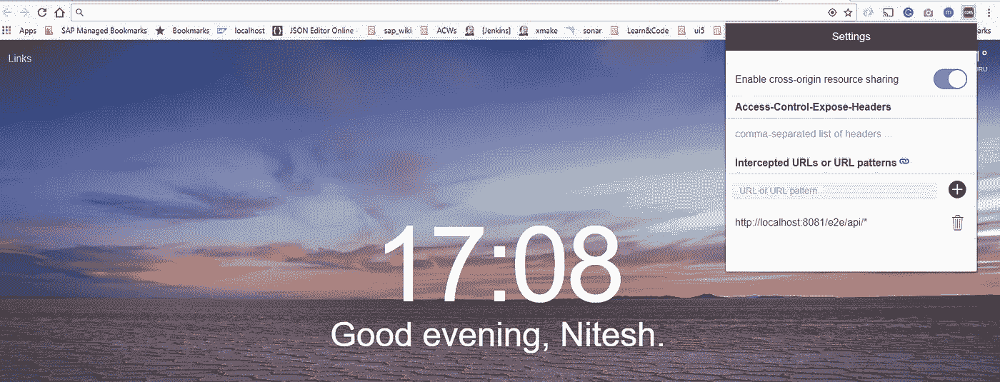
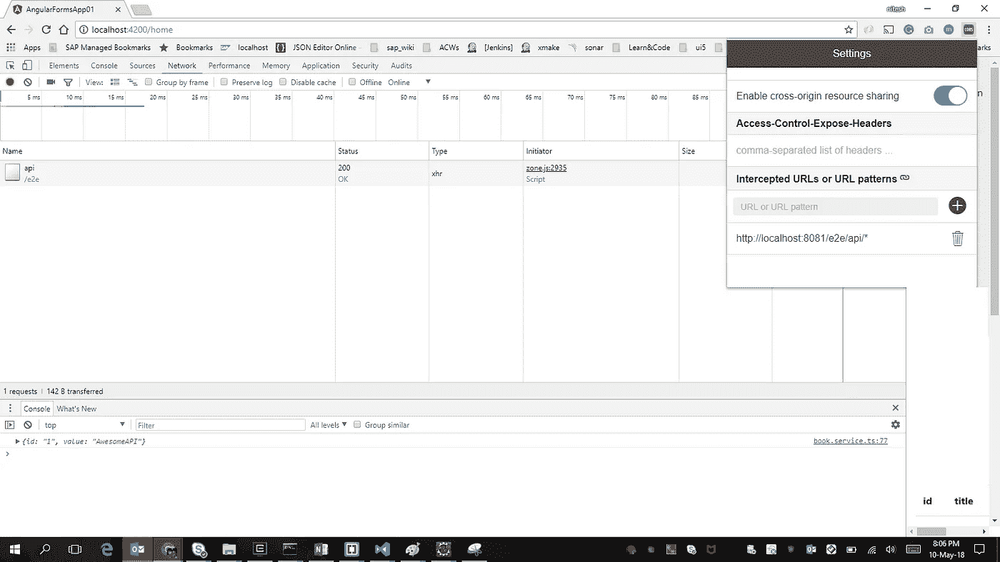

# CORS——从实际出发理解它

> 原文：<https://itnext.io/cors-understanding-it-practically-9c401ed818cd?source=collection_archive---------1----------------------->


资源共享…

跨源资源共享( [CORS](https://developer.mozilla.org/en-US/docs/Glossary/CORS) )是一种机制，它使用额外的 [HTTP](https://developer.mozilla.org/en-US/docs/Glossary/HTTP) 报头，让[用户代理](https://developer.mozilla.org/en-US/docs/Glossary/user_agent)获得从不同源(域)的服务器访问选定资源的许可，而不是当前使用的站点。(资料来源:MDN)

关于 CORS 的美丽描述请访问@ MDN。[https://developer.mozilla.org/en-US/docs/Web/HTTP/CORS](https://developer.mozilla.org/en-US/docs/Web/HTTP/CORS)

我对跨源资源共享实际上是如何工作的有很多困惑。是浏览器停止了 XMLHttpRequest 调用吗？是服务器来停止通话吗？跨源请求到达服务器了吗？如果服务器不支持 CORS，我们实际上可以用什么方法继续开发呢？

在这篇文章中，我们想以一种实用的方式来回答这些问题。此外，本文假设您对 CORS 有一个基本的了解。

**设置:**

我在本地 Tomcat 上运行了一个非常基本的 J2EE 应用程序。这个应用程序公开了一个非常简单的 API，它返回一个 JSON 数据。[http://localhost:8081/e2e/API/](http://localhost:8081/e2e/api/)

以上 API 返回:{"id" : "1 "，" value" : "AwesomeAPI"}

对于客户端应用程序，我有一个使用 angular CLI 创建的 Angular 5 应用程序，运行在 [http://localhost:4200 上。](http://localhost:4200.)

为了看到 CORS 的行动，我们将从 *Angular app* 调用 *J2EE app* 。

1.  使用 XMLHttpRequest 对象。

在 angular 应用程序中，以下代码片段用于从 j2EE 应用程序访问资源。

```
*var* xhttp = new XMLHttpRequest();xhttp.onreadystatechange = *function* () {if (this.readyState == 4 && this.status == 200) {*console*.log(xhttp.responseText);}};xhttp.open("GET", "http://localhost:8081/e2e/api/", true);xhttp.send();
```

java 应用程序在 servlet 的 doGet()方法中有以下代码。

```
protected void doGet(HttpServletRequest request, HttpServletResponse response) throws ServletException, IOException {response.getWriter().println("{\"id\" : \"1\" , \"value\" : \"AwesomeAPI\"}");}
```

上面的角代码在被触发时击中位于 localhost:8081 的服务器，并且在 chrome developer tool 的网络选项卡中，我们观察到以下请求和响应:



CORS 未启用时的请求-响应。

这里需要注意的重要一点是请求头。

主机指的是托管 API 的服务器，而源指的是为客户端提供服务的服务器。

*尽管调用到达 API* 并且响应包含状态为 200 OK 的预期数据，*浏览器仍然不允许响应数据*到达调用者代码。浏览器将抄袭声明:

无法加载[http://localhost:8081/e2e/API/](http://localhost:8081/e2e/api/abc):请求的资源上不存在“Access-Control-Allow-Origin”标头。原点' [http://localhost:4200'](http://localhost:4200') 因此不允许访问。

> 来解决这个问题

在响应中添加具有适当值的“Access-Control-Allow-Origin”标头。

随着这一变化，API 代码将:

```
protected void doGet(HttpServletRequest request, HttpServletResponse response) throws ServletException, IOException {response.addHeader("Access-Control-Allow-Origin", "*");response.getWriter().println("{\"id\" : \"1\" , \"value\" : \"AwesomeAPI\"}");}
```

这里*表示允许从任何来源访问该 API。这也可以是特定的原始值，但现在我们继续使用*。

再次从位于 localhost:4200 的客户端启动相同的 API，观察到以下请求响应:



启用 CORS 时的请求-响应

因为响应包含 Access-Control-Allow-Origin: *，所以浏览器接受响应并允许代码读取相同的内容。参见控制台。

2.在 Angular 中使用 [HttpClinet](https://angular.io/guide/http) 库

我们可以在 Angular 应用程序中使用 [HttpClient](https://angular.io/guide/http) 库，而不是使用普通的 XMLHttpRequest API。这个 API 返回 RxJs 可观察值。

代码:

```
this.httpClient.get("[http://localhost:8081/e2e/api/abc](http://localhost:8081/e2e/api/abc)").subscribe(data => { console.log(data);});
```

因为 HttpClient 在内部使用 XMLHttpRequest web APIs，所以当启用/禁用 CORS 时，我们会得到相同的行为。

3.当服务器不支持 CORS 时。

如前所述，当服务器在响应中添加所需的“Access-Control-Allow-Origin”报头时，CORS 开始工作。在我们无法控制服务器响应的情况下，我们需要一个*代理*来访问跨源资源。

3.1 角支撑

Angular 应用开发推荐 Node.js 开发方式。这意味着我们安装 angular CLI 作为节点模块，并通过 package.json 维护依赖关系。

节点服务器用于服务客户端文件，包括 angular 框架。

默认情况下，节点服务器从 [http://localhost:4200 开始。](http://localhost:4200.)

为了创建可以将呼叫重定向到其他来源(以支持 CORS)的代理，web pack(Angular 使用的模块捆绑器)开发服务器提供了支持。

关于这一点的细节可以在这篇文章中读到:

[https://github . com/angular/angular-CLI/blob/master/docs/documentation/stories/proxy . MD](https://github.com/angular/angular-cli/blob/master/docs/documentation/stories/proxy.md)

基本上，我们希望从 angular 客户端发出的所有 CORS 调用都将通过运行在 [http://localhost:4200](http://localhost:4200) 的节点服务器，服务器将代理调用并返回响应。

*首先:*

3.1.1 位于[http://localhost:8081/e2e/API/](http://localhost:8081/e2e/api/)的 API 不支持 CORS，不在响应头中添加“Access-Control-Allow-Origin”。

```
protected void doGet(HttpServletRequest request, HttpServletResponse response) throws ServletException, IOException {response.getWriter().println("{\"id\" : \"1\" , \"value\" : \"AwesomeAPI\"}");}
```

客户代码

```
this.httpClient.get("/[e2e/api](http://localhost:8081/e2e/api/abc)").subscribe(data => {console.log(data);});
```

服务器响应 404，因为 API 不是通过 [http://localhost:4200](http://localhost:4200) 提供的



3.1.3 定义一个名为 proxy.conf.json 的文件，并将其放在 package.json 旁边

```
{
  "/e2e/api": {
    "target": "http://localhost:8081",
    "secure": false,
    "changeOrigin": true
  }
}
```

3.1.4 使用代理配置选项启动服务器

```
ng serve --proxy-config proxy.conf.json
```



现在我们得到了回应。观察请求头。Origin 不可用，API 将通过我们在[的代理 http://localhost:4200](http://localhost:4200)

当服务器端对 CORS 的支持不可用时，这实际上是一个通用的 API 代理解决方案。

4.无法设置代理时实现 CORS。(仅在开发/测试阶段——非生产场景)

假设我们有一个场景，我们不能设置服务器代理，只想检查一个 API 是否符合我们的目的。无论 API 是否发送正确的数据，在开发阶段，我们都可以使用浏览器插件，将“访问控制允许来源”添加到所有响应中。

只需为你的浏览器搜索 CORS 插件。

我添加了[https://chrome . Google . com/web store/detail/allow-control-allow-origi/nlfbmbojpeacfghkpbjhddihlkkiljbi？hl=en](https://chrome.google.com/webstore/detail/allow-control-allow-origi/nlfbmbojpeacfghkpbjhddihlkkiljbi?hl=en) 用于测试目的。

我已经重置了我的角度代码，这样它就可以直接调用[http://localhost:8081/e2e/API](http://localhost:8081/e2e/api)

api 没有发送“Access-Control-Allow-Origin”作为响应，因此调用失败。

新增的插件在 chrome 中提供了以下选项:



如设置所示，我已经给出了[http://localhost:8081/e2e/API/*](http://localhost:8081/e2e/api/*)作为要拦截的 URL 模式。

现在，当客户端在 [http://localhost:4200](http://localhost:4200) 发出一个调用时，我们得到正确的响应，如下所示:



通过浏览器插件添加“访问控制允许来源”标题

## 摘要

**总结一下**跨原点资源共享是浏览器出于安全原因而停止的事情。

**浏览器**期望托管 API 的服务器返回带有适当值的“Access-Control-Allow-Origin”头作为响应。

**在**的情况下，服务器不发送所需的报头——可以设置一个代理，该代理最终将是源服务器到主机(api)服务器的调用。Angular 通过代理配置文件(proxy.conf.json)提供简单的支持。

**如果** API 只需要测试(不在生产场景中)，可以使用浏览器插件在响应中添加所需的访问控制头。

感谢阅读:)