# 企业 OpenShift 的成本可见性

> 原文：<https://itnext.io/cost-visibility-for-enterprise-openshift-e74f709e0abc?source=collection_archive---------2----------------------->

照片由 [Unsplash](https://unsplash.com?utm_source=medium&utm_medium=referral) 上的 [Jp Valery](https://unsplash.com/@jpvalery?utm_source=medium&utm_medium=referral)

云计算预计将从 2015 年的 670 亿美元增长到 2020 年的 1620 亿美元，但是在将工作负载转移到云的过程中会遇到一些陷阱。60%使用或评估云计算服务的公司担心成本失控的风险。然而，其他公司由于[云供应商锁定而犹豫不决，并在寻找避免它们的方法](https://medium.com/ibm-garage/i-want-to-build-in-an-open-way-and-avoid-lock-in-1ff2cef1b30)。

一个很好的开始是选择 [OpenShift 容器平台](https://www.openshift.com/products/container-platform)在云无关部署中运行您的工作负载。 ***OpenShift*** 支持混合云部署，可降低供应商锁定风险，因为您可以在各种公共云或内部部署，并且您的容器将按预期运行。最新发布的 [OpenShift (OCP 4)](https://www.redhat.com/en/openshift-4) 提供了具有**企业**品质的最新 [Kubernetes](https://kubernetes.io/) 特性。

技术选择只是避免上述缺陷的一个组成部分。在企业部署中，您可能要处理多云足迹、业务线所有权、影子 IT、多集群部署，以及对您足迹的独立项目部署。在这个领域中，很难收集所有这些成本的单一视图，更重要的是，很难允许其他人只查看与他们的工作负载部分相关的成本。 ***OpenShift 4*** 现已在*技术预览版*中[提供了一项费用管理功能](https://blog.openshift.com/tech-preview-get-visibility-into-your-openshift-costs-across-your-hybrid-infrastructure/)包含在订阅中，无需额外付费。

# 成本管理功能

那么你能用 OpenShift 4 的这个新特性做什么呢？

## 基础设施概述

您可以了解底层云基础架构的成本。目前，成本管理功能支持[亚马逊网络服务(AWS)](https://aws.amazon.com/) 和[微软 Azure](https://azure.microsoft.com/en-us/) ，更多公共云提供商将紧随其后。

查看您的亚马逊成本一目了然

从应用程序中，您可以查看多个 ***亚马逊*** 主账户的费用，并查看相关的子账户。您可以按服务、客户或地区查看最高成本，以及您的月环比成本。通过突出显示常见成本驱动因素的辅助图表，您可以更深入地了解关键成本驱动因素。

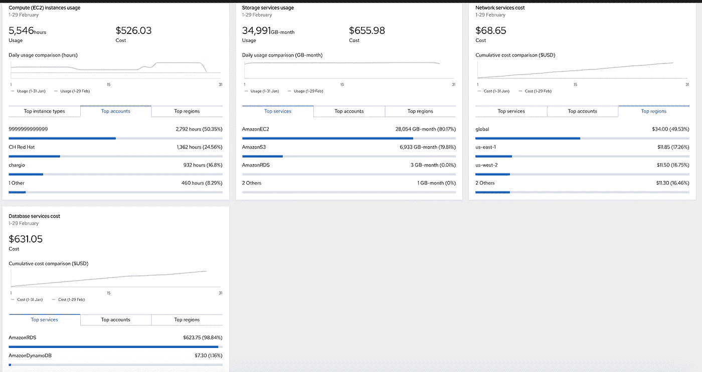

突出关键成本驱动因素

同样，您可以在概览表格中查看您的 ***Azure*** 订阅费用。

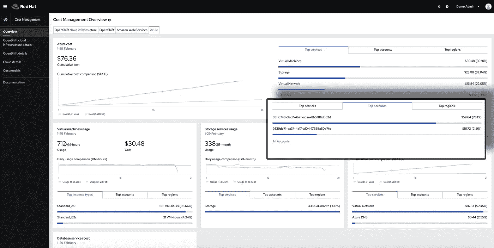

快速查看您的 Azure 成本

该应用程序支持这些基础架构的一致视图，以查看公共云占用空间的基础成本。

## OpenShift 概述

下一层数据是查看您的 ***OpenShift*** 成本。有两种成本方案可供用户选择；将云基础架构的成本与 ***OpenShift*** 成本相关联，并使用 ***成本模型*** 定义您的私有云成本。

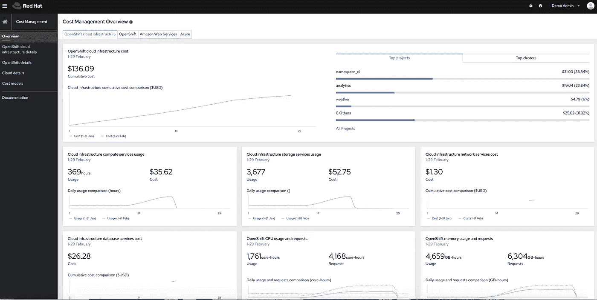

快速查看与公共云成本相关的 OpenShift 成本

***OpenShift*** 由公共云成本相关性驱动的成本使用与 ***OpenShift 指标相关联的云提供商的计费信息。*** 一种机制是将节点与云实例成本关联起来。另一种机制是利用针对云提供商资源的标记。标记功能可以让您表达云服务的成本，这些成本不是直接的 ***OpenShift*** 运行时成本，而是相关的项目成本(例如数据库服务)。

***OpenShift*** 还可以利用 ***OpenShift*** 指标和成本模型查看内部部署的成本。

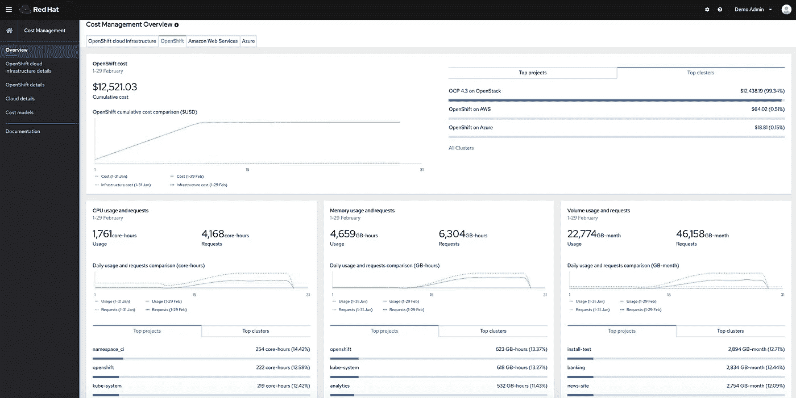

查看 OpenShift 成本一览

同样，您可以查看云提供商可用的 ***OpenShift*** 的类似月度视图。显示了收集的使用指标，这些指标是使用成本模型时的成本驱动因素。该应用程序有一个向导，可以帮助您轻松地为集群创建成本模型。

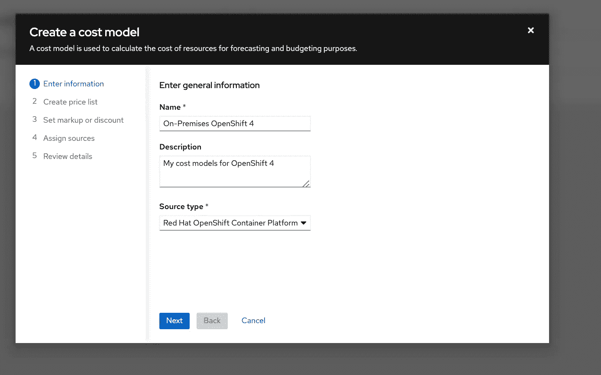

成本模型向导

在这里，您可以定义指标比率，如每核心小时成本、内存小时成本等。以便计算内部部署的成本。

## 深入细节

概述是很好的，但是在某一点上你需要的数据在细节中。你不一定只对最重要的几个项目感兴趣，而是你没有意识到的意外成本，或者可能是没有正确标记的成本。

以下是你如何将 ***亚马逊*** 数据切片、分组并按关键因素过滤的几种观点。

Amazon 详细信息—按客户分组，包含成本明细

您可以获得数据的表格视图，以及排序和查看更多维度的细分的能力。

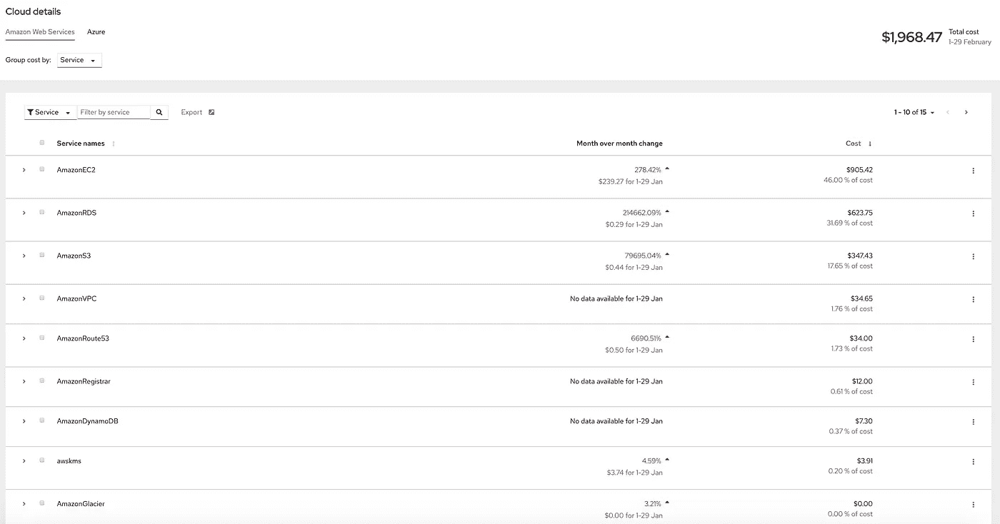

亚马逊详情—按服务分组

这些汇总数据可以直接导出，用于电子表格和其他业务报告工具。

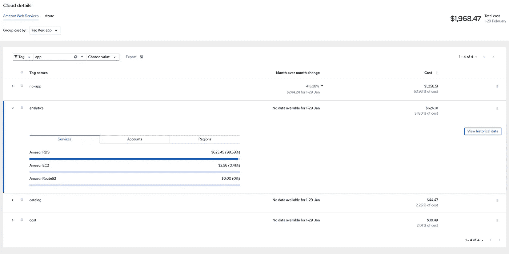

亚马逊详情——按标签键分组，含成本明细

甚至可以查看应用了标记的数据，这也有助于突出显示未标记的资源成本。

类似的细节视图还有 ***微软 Azure*** 。您可以看到按服务分类的详细信息。

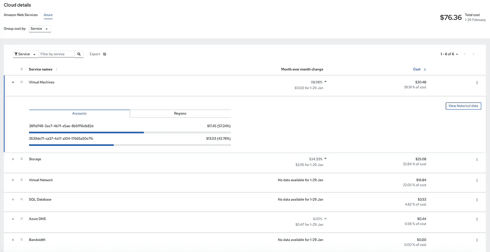

Azure 详细信息—按服务分组，包含成本明细

此外，您可以在分页视图中查看您所有的 ***Microsoft Azure*** 订阅费用，或者深入了解每个订阅的详细信息。

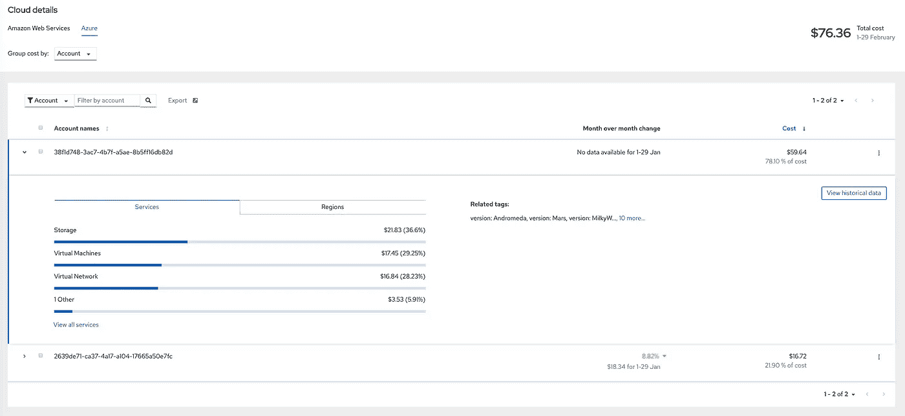

Azure 详细信息—按订阅分组，包含费用明细

了解您的基础设施成本可以让您确定应该与您的 ***OpenShift*** 部署相关联的成本。就像您的云细节一样，您可以从多个维度探索您的 ***OpenShift*** 成本。

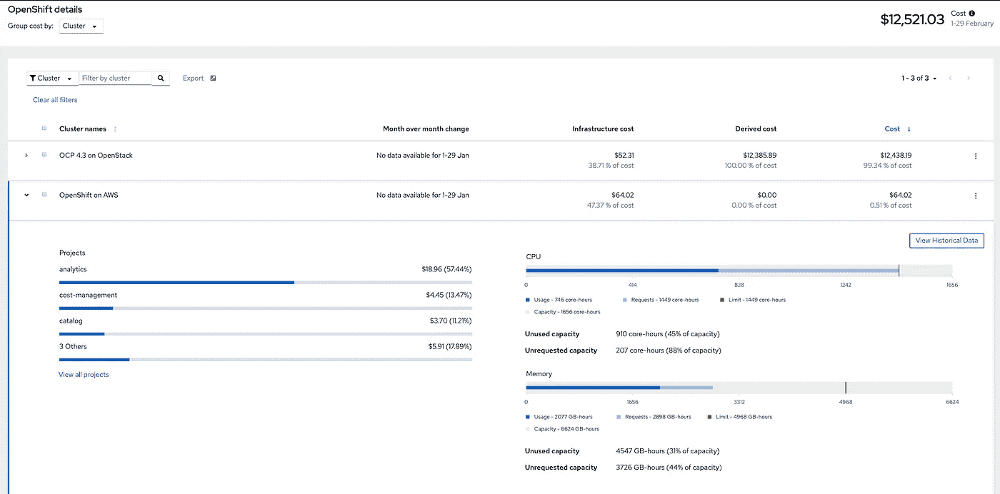

OpenShift 详细信息—按集群分组，包含成本细分

在这里，您可以看到如何查看每个 ***OpenShift*** 集群的成本，然后进一步了解该集群的成本。该应用程序突出显示了该集群最昂贵的项目，并显示了总体利用率，潜在地提供了容量可见性，这可能表明需要或选择扩大或缩小集群规模(或改变底层云实例或虚拟机的规模)。

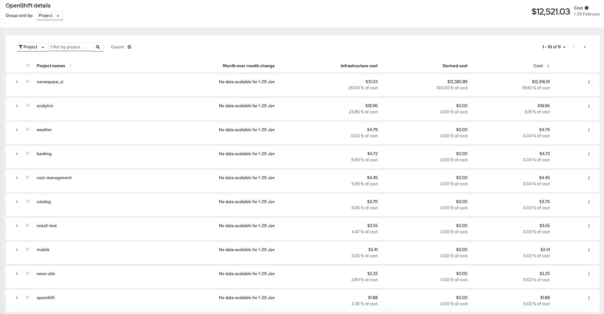

OpenShift 详细信息-按项目分组

你也可以看到你最昂贵的项目。此视图允许您查看多个集群的聚合。允许您了解在部署到多个集群进行开发、测试、试运行和生产时的项目成本。

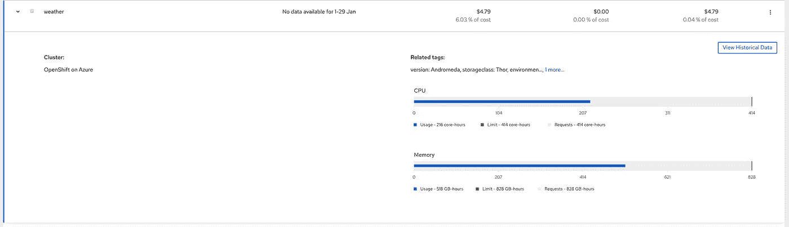

OpenShift 详细信息-按项目分组，包含使用信息

这些数据可以进一步分解到您的项目中，以了解它们在哪里运行，它们的使用情况与请求情况如何，这有可能让您解决过度请求资源的项目，从而允许更大的群集容量，并再次允许您选择缩减群集规模。

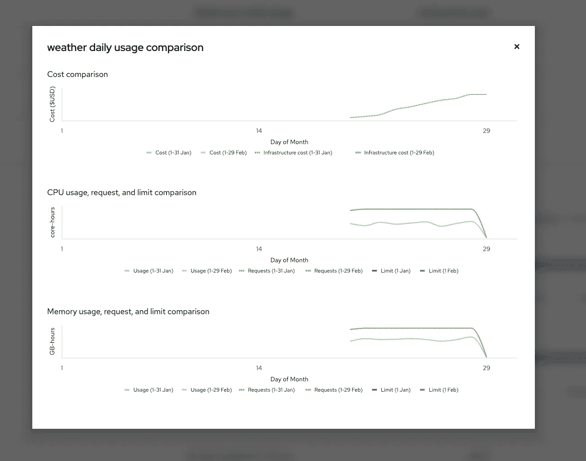

您可以查看指标的历史逐月比较，以直观显示异常值。

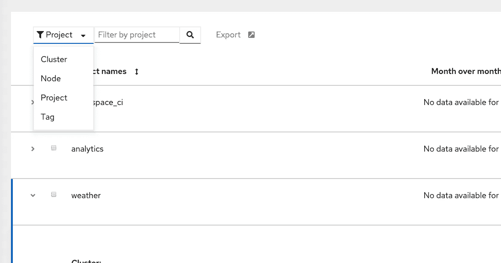

详细信息视图—过滤器选项

这些分组依据视图中的每一个都允许您在除当前分组之外的其他维度上进行筛选，因此可以在不改变您的视角的情况下获得成本的可见性。例如，您可以查看按项目分组的成本，但只过滤那些带有*环境=生产*标签的成本；这些过滤器支持 AND 和 OR 条件。

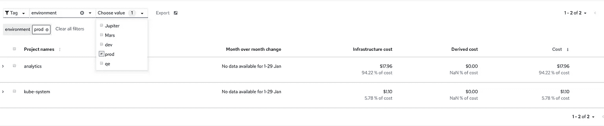

OpenShift 详细信息—按项目分组并按环境筛选=生产

## 极限能见度

而获得这种级别的成本可见性可以极大地帮助避免成本失控，甚至让您找到成本节约。实际上，您需要更进一步，让业务线和项目负责人能够自己查看和跟踪这些数据。

成本管理功能通过利用基于角色的访问控制来实现这一功能。

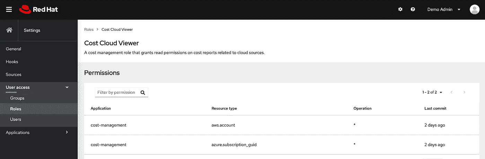

角色管理—定义资源的可见性

通过角色，您可以定义可见性的范围，以便允许用户查看 ***亚马逊*** 账户或 ***微软 Azure*** 订阅或 ***OpenShift*** 集群的子集；甚至在角色定义中限制集群上可见的项目。

# 成本管理功能

那么成本管理是如何运作的呢？

## 软件即服务

成本管理是您可以在[cloud.redhat.com/beta/](https://cloud.redhat.com/beta/)上找到的一项功能，是您的 ***OpenShift*** 订阅的一部分。从这里你可以创建数据源，比如你的 ***OpenShift*** 集群和你的云提供商。

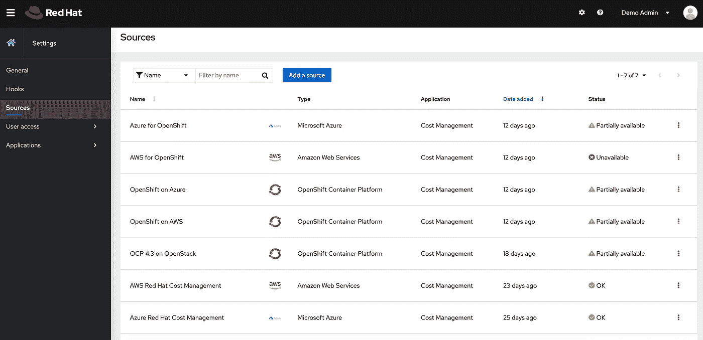

来源管理—配置成本管理

像 ***AWS*** 和 ***Azure*** 这样的云提供商都有一个成本报告机制，每天将数据写入对象存储。成本管理配置有对对象存储的读取权限，以读取和汇总上面显示的数据。

***OpenShift*** 依靠收集度量数据，并使用与 [insights-operator](https://github.com/openshift/insights-operator) 用于[远程健康监控](https://docs.openshift.com/container-platform/4.3/support/remote_health_monitoring/about-remote-health-monitoring.html)相同的机制将其发送到***【cloud.redhat.com】***。为了收集每小时的指标，成本管理利用了[操作员计量](https://github.com/operator-framework/operator-metering)的报告功能，该功能从集群上的 [Prometheus](https://prometheus.io/) 收集数据。

# 摘要

在云中运行工作负载非常复杂。在采用云原生实践的敏捷企业环境中，成本管理正成为企业财务偿付能力的关键因素。 ***OpenShift 4*** 的成本管理功能是一个令人兴奋的工具，有助于应对这一具有挑战性的任务，提供对基础架构、多集群和基于标签的成本的洞察，同时通过限制可见性赋予所有权。如果你有兴趣了解更多，请查看[技术预览博客](https://blog.openshift.com/tech-preview-get-visibility-into-your-openshift-costs-across-your-hybrid-infrastructure/)，并进一步查看[产品文档](https://access.redhat.com/documentation/en-us/openshift_container_platform/)。