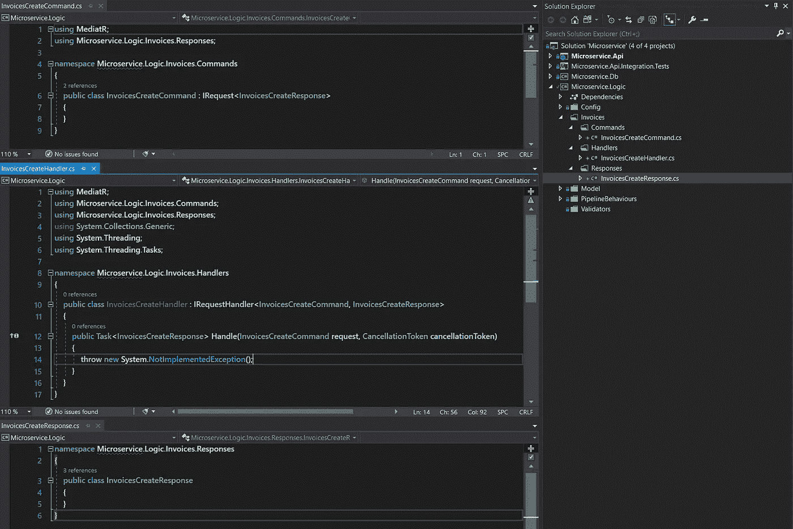
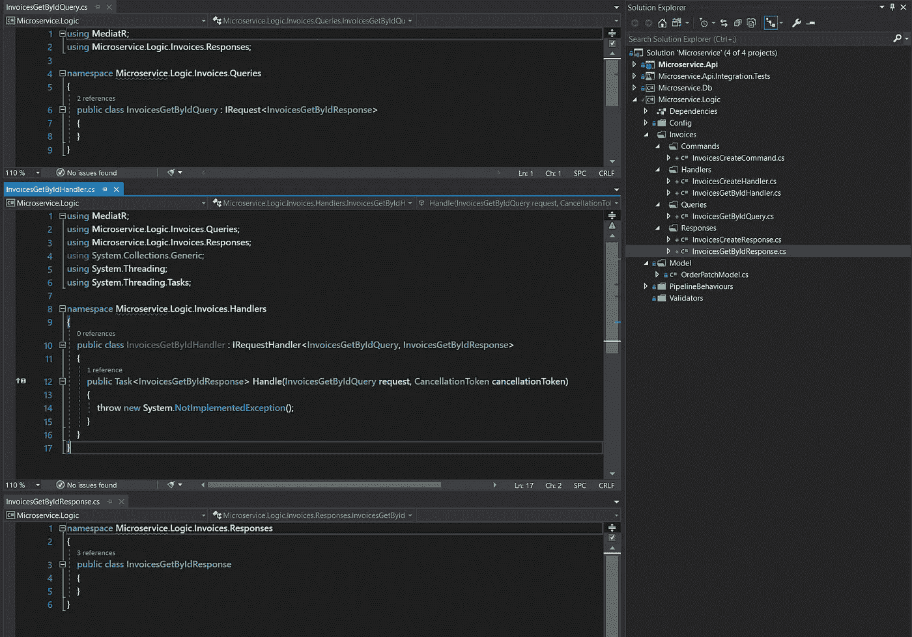
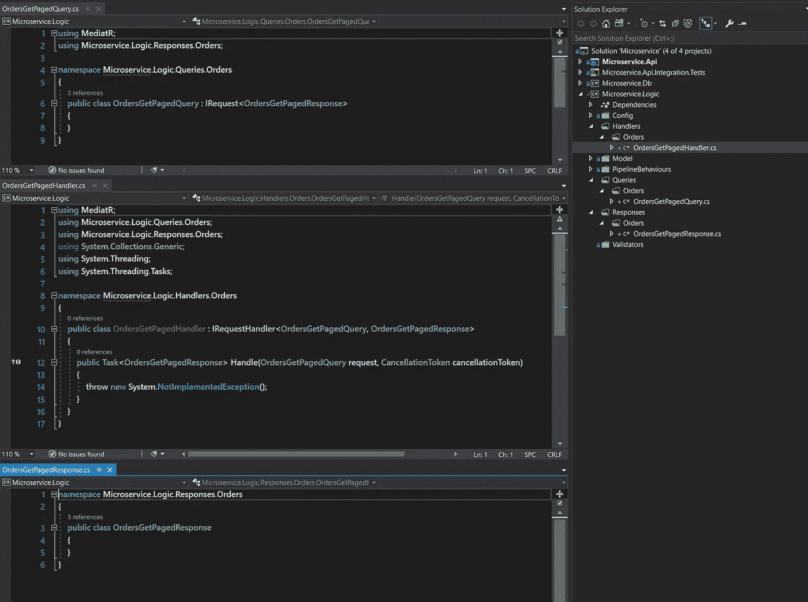
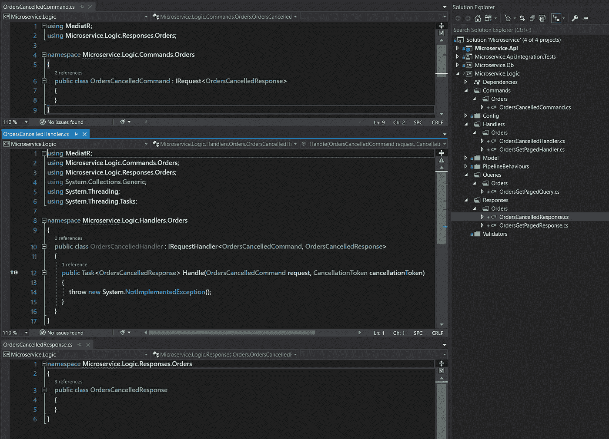
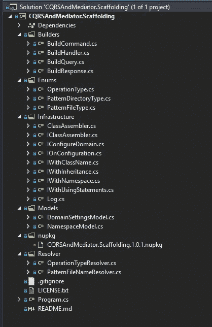

# CQRS 和仲裁者第 2 部分:用 Roslyn API 和 Dotnet CLI 搭建域

> 原文：<https://itnext.io/cqrs-mediator-part-2-domain-scaffolding-with-roslyn-api-and-dotnet-cli-7c99b5b011f?source=collection_archive---------3----------------------->


新加坡樟宜宝石瀑布

> 在第 2 部分中，我们将构建一个 dotnet CLI 工具，它遵循 CQRS 和中介器模式，使用 Roslyn API 在域层自动生成命令、查询、响应和处理程序来生成代码。 [Git 回购](https://github.com/ArmandJ77/CQRSAndMediator-Scaffolding)

# 系列

*   [CQRS &中介器第 1 部分:
    为什么以及如何在微服务中实现 CQRS 和中介器模式](/why-and-how-i-implemented-cqrs-and-mediator-patterns-in-a-microservice-b07034592b6d)
*   [CQRS &中介器第 2 部分:
    使用罗斯林 API 和 Dotnet CLI 的领域搭建](https://medium.com/@armandjordaan6/cqrs-mediator-part-2-domain-scaffolding-with-roslyn-api-and-dotnet-cli-7c99b5b011f)

# 问题

CQRS 模式最突出的挑战是克服开发人员需要创建的类的数量，当不断创建查询、命令、处理程序和响应对象时，这些类会变得很麻烦。

为了解决这个问题，本文将带您完成创建命令行搭建工具的过程，该工具可以接受诸如模式类型、关注点和操作之类的参数。解析我们在其中执行 CLI 命令的目录的域的路径和名称。它不仅应该创建相应的 CQRS 类，还应该添加类继承，并使用正确的方法签名实现 IRequestHandler 接口的 handle 函数。

该工具将在创建对象时减少摩擦和上下文切换，并使用正确的命名约定正确执行方法连接，从而为开发人员提供跨领域的一致性，并使他们能够专注于实现而不是抽象。

总之。使开发人员能够自动化重复工作，并在未知领域进行创新。

# 工具作业

如果您已经熟悉下面的概念和工具，请跳到代码分解的解决方案部分。

**什么是 Dotnet CLI？**

> 的。NET Core 命令行界面(CLI)是一个用于开发的跨平台工具链。NET 应用程序。CLI 是集成开发环境(ide)、编辑器和构建流程编排器等高级工具的基础。— [MSDN](https://docs.microsoft.com/en-us/dotnet/core/tools/?tabs=netcore2x)

观点:我更喜欢 UI 而不是命令行，但是 Dotnet CLI 是一个非常强大的工具，对 Visual Studio 用户(包括我自己)来说，IDE 是强大的，具有丰富的功能集和高级工具支持，但是在编写 windows 上的 VS 时，它仍然不能很好地处理多项目解决方案，当谈到加载和构建速度时——每次用 VS 打开一个整体时，它的内部都会有点死:(

**什么是 NuGet？**

> 任何现代开发平台的基本工具都是一种机制，开发人员可以通过这种机制创建、共享和使用有用的代码。通常，这些代码被捆绑到“包”中，包中包含编译后的代码(作为 dll)以及使用这些包的项目中所需的其他内容。— [MSDN](https://docs.microsoft.com/en-us/nuget/what-is-nuget)

**罗斯林是什么？**

它是。NET 编译器平台 AKA Roslyn，它为 C#/ Visual basic 开发人员提供了访问。Net 编译器和丰富的代码分析 API。像大多数网络世界一样，这是开源的，可以在 GitHub 上找到。

我们将使用的 API 是*微软。CodeAnalysis* 和*Microsoft . code analysis . cs harp .*像大多数 API/库一样，有一个学习曲线，当您第一次开始时，这是非常令人生畏的，但是在查看了一些实现示例和经典 RTFM 之后，它像任何其他具有其概念和工作方式的 API 一样工作。

# 模式

## 流畅的界面模式

简而言之，它是一种构建器模式，允许通过使用方法链接指定对象上的函数列表来收集数据。

这可以通过以下方式实现:

用法:

实现 fluent 接口模式的类的示例

实施:

如何实现流畅接口模式的示例

这种模式的突出之处在于，您可以使用接口返回类型来定义特定的逻辑路径，因此我建议您首先定义接口以及逻辑将如何流动，并回顾每种可能性。

关于这种模式更详细的分解，我推荐 Dimitrie Tataru 的文章[如何在 C#中设计和实现流畅的接口模式](https://assist-software.net/blog/design-and-implement-fluent-interface-pattern-c)

# 使用

**安装:**

```
dotnet tool install --global CQRSAndMediator.Scaffolding
```

**概念和命令的分解:**

显示帮助信息:

```
scaffold -h
```

## 命令参数:

关注点:您正在工作的领域的名称，即订单、人员、发票等。

```
-c|--concern <NAME>
```

操作:您在关注中采取的操作的名称，即查询的 GetById、GetPagedResult 或命令的 Create、Patch、Update。

```
-c|--concern <NAME>
```

OperationType:您正在搭建的 CQRS 操作的类型，即命令或查询

```
-ot|--operationtype <TYPE>
```

GroupBy:指定如何对域操作进行分组。通过*关注点*或*操作*:通过【C】关注点或【O】操作对域对象进行分组，默认为关注点

```
-g|--groupBy <TYPE>
```

按关注点:即当参数为-c Orders -o GetById 时按关注点分组

-ot 查询

```
| YourDomainLayer
    | Orders
        | Handlers
            | OrdersGetByIdHandler.cs
        | Responses
            | OrdersGetByIdResponse.cs
        | Queries
            | OrderGetByIdQuery.cs
```

按操作，即当参数为-c Orders -o GetById -ot query -g O 时按操作分组

```
| YourDomainLayer
    | Handler
        | OrdersGetByIdHandler.cs
    | Responses
        | OrdersGetByIdResponse.cs
    | Queries
        | OrderGetByIdQuery.cs
```

**注意:** 该工具要求项目已经建立，并且在你的领域层目录所在的顶层目录中执行动作。

**命令示例:**
用例支架出一张发票的 CRUD 域:

按关注点分组时的创建命令

```
scaffold -c Invoices -o Create -ot command
```



脚手架发票创建命令

按关注分组时的 get by id 查询

```
scaffold -c Invoices -o GetById -ot query
```



搭建 OrdersGetByIdQuery

按操作分组时的 GetPaged 查询

```
scaffold -c Orders -o GetPaged -ot query -g o
```



绞刑架

按操作分组时的 OrderCancelledCommand

```
scaffold -c Orders -o Cancelled -ot command -g o
```



脚手架订单取消命令

使用 CRUD 操作只是一个例子，不需要解释特定领域语言的复杂性和规则。归根结底，CQRS 模式不在乎它是一个 CRUD 操作还是一个复杂的领域规则，它都归结为一个命令或一个查询。

# 解决办法

我们将看看 NuGet 包的项目以及它是如何实现的。该工具将在第 1 部分的解决方案结构中执行，因此将只关注输出，而不会深入目标解决方案的域层的域设置。参见[第 1 部分](/why-and-how-i-implemented-cqrs-and-mediator-patterns-in-a-microservice-b07034592b6d)。

## 结构:

我没有选择将项目分成多层库，而是选择了更简单的子目录结构。



Dotnet CLI 项目结构

*   **Program.cs:** 应用入口点。
*   **Builders:** 包含 ClassAssembler.cs 的流畅接口模式的实现
*   **基础设施:**包含了 fluent 接口模式的定义，该模式包装了我们的 Roslyn API 实现。
*   **模型:**包含应用程序中使用的通用对象结构
*   **枚举:**包含应用程序中使用的通用类型
*   **nupkg:** 包含为每个版本生成的 NuGet 包信息，并上传到 NuGet 以将包更新到最新版本——以后可能会使用 Github 操作自动构建项目。

## **代码深潜:**

Startup.cs

第 14–39 行:命令输入参数的初始化。

第 43–77 行:输入参数验证

第 79 行:调用一个响应构建器类来构建目标域中的响应目录和支持类。

第 81–95 行:在操作类型上添加逻辑分割，然后调用查询构建器对象来构建查询目录和目标域中的支持对象。

第 97 行:调用 Handler builder 对象为我们的目标域组装和创建处理程序类。

**注意** : *Log* 是一个静态对象，包含 *Error(string)* 和 *Info(string)* 函数，在整个应用程序中用来标准化日志消息。

## **建设者:**

这一层的想法是将 Roslyn API 实现从其使用中抽象出来。所有 4 个建筑者都有相同的模式。

BuildHandler.cs

这是 ClassAssembler.cs 最复杂的用例，需要注意的是，第 24–43 行是我们使用 fluent 接口模式的地方。这被复制到其他 3 个构建器中，每个构建器根据用例将参数传递给 ClassAssembler。

第 12–16 行:构建第 39 行使用的命令/查询对象的名称的逻辑分割。

第 18–22 行:建立命令/查询名称空间的逻辑分割，该名称空间需要添加到处理程序类的顶部。使用第 46–51 行的效用函数。

第 25 行:提供基本的配置细节和类组装器的实例化。

第 26 行:传递一个名称空间列表，添加到 Handler.cs 类的顶部，即按照 Roslyn API 使用指令导入。

第 35 行:创建名称空间声明。一个类似的例子相当于第 6 行，但是带有生成的名称空间名称。

第 36 行:创建一个类声明。

第 37 行:指定从哪个接口继承。

第 41 行:指示 ClassAssembler 实现 IRequestHandler 的 handle 函数。

第 42 行:指示 ClassAssembler 将类元数据添加到名称空间，然后将名称空间元数据添加到 Roslyn 的 SyntaxFactory。然后将 syntaxFactory 节点转换为一个字符串，根据操作类型创建指定的目录，并将 C#对象写出到磁盘。

## **ClassAssembler:**

**初始化:**

ClassAssembler.cs 的入口点和初始化

第 7 行:从构建者处调用以启动流程。

第 1–5 行:ClassAssembler 的唯一构造函数。

第 3 行:为 private _settings 属性创建/分配一个新的 DomainSettingsModel 实例。这个 DomainSettingsModel 构建了关于目标域的项目绝对路径、域名、域绝对路径等的所有目录和元数据。

**名称空间添加和创建:**

ClassAssembelr.cs 中的命名空间添加和创建摘录

第 1–9 行:负责添加/导入我们试图创建的类将使用的所有名称空间。即*使用系统*或使用您的域名.订单.处理程序

第 14–27 行:将为当前正在生成的类创建名称空间。

**类创建:**

ClassAssembler.cs 中的类创建摘录

第 4–5 行:创建一个新的公共类。

ClassAssembler.cs 的继承提取

第 8–9 行:添加从类声明继承的类型。

*ImplementMediatorHandler* 函数特定于处理程序构建器。

第 16 行:在函数语法中声明并添加应该抛出一个未实现的异常。这当然是您添加处理程序的实现细节的地方。

第 17–21 行:创建一个数组，包含方法签名的参数列表以及参数名和类型。

第 23–26 行:用我们指定的参数列表(17–21)和方法体语法(第 16 行)声明一个名为“Handle”的公共方法。

第 28 行:将方法声明添加到我们正在构建的类中。

ClassAssembler.cs 的生成摘录

第 3 行:将生成的类添加到名称空间。

第 5 行:将名称空间添加到 SyntaxFactory 中。

第 7 行:以字符串形式获取 Syntaxfactory。

第 11–23 行:根据操作类型和分组策略建立目录结构。

第 25 行:用第 7 行的字符串将 C#文件写到目录中。

第 28 行:将 _class、_namespace 和 _syntaxfactory 重置为 null。

# 结论

用 Roslyn API 构建代码生成工具是一个梦想，不再有 T4 模板的怪异和糟糕的代码编辑器支持。—如果你没有使用过 T4 模板，你应该感到幸运。如果您发现自己偶尔使用这些模式构建一个 API，那么这个工具就有些多余了，但是当您需要输出大量的特性并构建各种将受益于这些模式的微服务时，代码生成工具可能会有很大帮助。

这个工具的未来还不得而知。然而，潜力是存在的。比如将 scaffolding 命令指向一个 DB 实体，将整个 CRUD 操作搭建到控制器层的堆栈，将过滤器添加到处理程序的 CLI 命令，或者从消息队列中搭建发布/订阅所需的对象。

# 资源

[如何在 C#中设计并实现流畅的界面模式——Dimitri e Tataru](https://assist-software.net/blog/design-and-implement-fluent-interface-pattern-c)

[命令行工具](https://github.com/natemcmaster/CommandLineUtils/blob/master/README.md)

使用创建一个类。网芯和罗斯林

[使用。NET 核心模板引擎创建自定义模板和项目](https://www.infoq.com/articles/dotnet-core-template-engine/) — [马特·埃利斯](https://www.infoq.com/profile/Matt-Ellis/)

[。NET 核心命令行界面(CLI)工具](https://docs.microsoft.com/en-us/dotnet/core/tools/?tabs=netcore2x)

[nu get 简介](https://docs.microsoft.com/en-us/nuget/what-is-nuget)