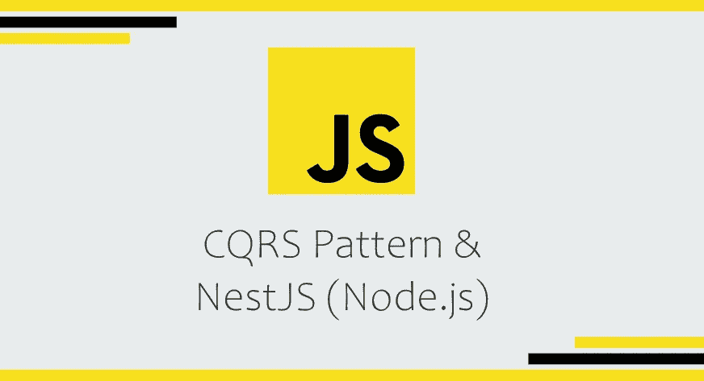
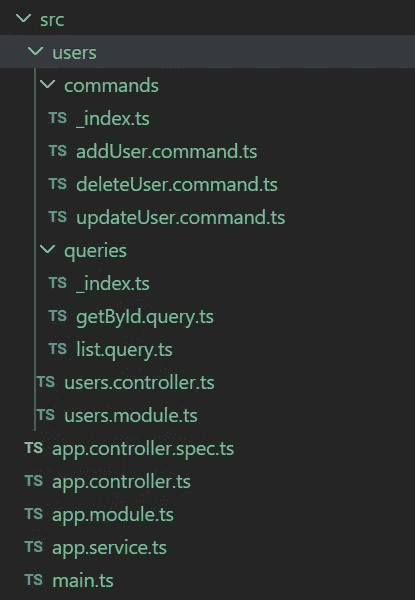

# CQRS 模式& NestJS (Node.js)

> 原文：<https://itnext.io/cqrs-pattern-nestjs-node-js-cf20fd9bb07?source=collection_archive---------0----------------------->

## 有指导的介绍



当设计一个遵循传统架构的应用程序时，读和写操作经常使用相同的数据模型。尽管它可能在小型应用程序或依赖简单逻辑的应用程序上工作得很好，但是当我们有一个更复杂的环境时，我们最终需要更复杂的解决方案。

在这篇文章中，我们将探索 CQRS *设计模式*的基础，它的优点和缺点。此外，我们将深入探讨如何通过使用 Node.js 的 [NestJS 框架](https://nestjs.com/)来实现这种模式

*obs:如果你还没有检查过* [*NestJS 框架*](https://docs.nestjs.com/) *的话，我会全力推荐它。受 Angular 架构的启发，它是一个简单、高效且可扩展的 Node.js 框架。*

# CQRS 模式

> “在大多数情况下，没有理由让中小型应用程序变得更复杂。然而，有时这还不够，当我们的需求变得更加复杂时，我们希望拥有具有简单数据流的可扩展系统。”
> **内斯特·CQRS**

当从服务器请求数据时，应用程序可能会执行多个查询，并根据请求的数据使用 dto(数据传输对象)。此外，当需要更改数据或向数据库添加数据时，也可以使用 d to 执行一些操作。

在更大的应用程序中，映射这些对象并掌握其不同的格式会成为一个真正的问题。当执行一个写操作时，您可能还会得到实现多个验证和业务逻辑的复杂模型。

读取和写入操作之间的数据表示经常不匹配，这也使得控制在每个上下文中公开什么数据变得更加困难。因此，这种方法可能会对应用程序的性能、复杂性和安全性产生负面影响。

CQRS 模式地址将读取和写入分离到不同的模型中，使用**命令**更新数据，使用**查询**读取数据。

命令应该面向它们应该完成的任务。
**命令**可能被放入队列进行异步处理。

**查询**从不修改数据库。
**查询**返回*没有任何领域知识的 dto*。

## *优点*

**离析。通过分离关注点——读(查询)和写(命令)操作——它有助于拥有更灵活的模型，有助于开发速度和便于维护。**

**可扩展性**。它允许您的查询和命令独立伸缩，从而减少锁争用。

**优化模式**。读写操作的模式针对其目的进行了优化，也更容易理解和维护。

**安全**。更容易确保只有正确上下文中的正确实体能够访问数据的读写操作。

## 面向连接的网络服务(Connection Oriented Network Service)

**复杂**。CQRS 的 mais 问题是，尽管 CQRS 的基本原则很简单，但其实施可能很复杂，而且成本很高。所以，应该只有在有意义的时候才使用；当可伸缩性是应用程序的一个重要问题时，当您处理复杂的模型和业务逻辑时，等等。否则，你实际上不是在简化，而是给应用程序带来了不必要的复杂性。

**一致性。**通过对查询和命令使用不同的模型，保持它们之间的一致性可能会变得更加困难，尤其是在处理复杂数据时。

# 在 NestJS 中实施 CQRS 模式

好了，现在让我们深入研究如何实现这个模式，以便更好地理解它是如何工作的。我们将通过使用 NestJS 框架来实现它。NestJS 为我们提供了一个**预建的 CQRS 模块**，为了在 NestJS 中使用这种模式，这将使我们的生活变得更加容易。

首先，让我们安装 NestJS 的 CLI，用它创建一个新项目，并将 Nest 的 CQRS 模块添加到我们的项目中。

```
npm install -g @nestjs/cli
nest new project-cqrs
cd project-cqrs
npm install @nestjs/cqrs --save
npm run start
```

为了演示，我们将实现一个简单的用户 CRUD 特性。我们将创建一个用户控制器，其中我们将使用 CQRS 模式。让我们把*用户*分离出来作为一个特性，为它创建一个*模块*，这个*控制器*本身和两个文件夹:*命令*和*查询*。然后，我们将创建我们需要的每个*查询*和*命令*。

下面是我们的项目结构和文件将如何。
我们将深入研究所有的*用户*特性。



## 问题

让我们以逐步构建我们的 *ListUsersQuery* 为例。
首先，我们定义一个类作为我们的*查询*，它将包含其*处理程序*所需的信息。因为我们要列出用户，所以知道请求的页码和页面大小很重要。

```
export class ListUsersQuery {
  constructor(
    public page: number = 1,
    public pageSize: number = 10
  ) { }
}
```

接下来，我们创建我们的处理程序，当这个*查询*在*查询总线中被调用时，它将被触发。*

*QueryBus* 是一个查询流。当被请求时，它将查询委托给它的对等处理程序。每个*查询*必须有其对应的*处理程序*。这种关联是通过使用 *@QueryHandler* 装饰器来实现的。

```
@QueryHandler(ListUsersQuery)
export class ListHandler implements IQueryHandler<ListUsersQuery> {}
```

我们现在已经创建了 *ListHandler，*，它将处理我们之前创建的查询 *ListUsersQuery* 。稍后我们将看到这个*查询*如何被*查询总线调用。*

现在我们要做的是在我们的*处理程序*中包含我们的逻辑。当*查询*被调用时，它将调用*处理程序的* ***执行*** 方法。我们的*处理程序*逻辑将驻留在那里。

```
@QueryHandler(ListUsersQuery)
export class ListHandler implements IQueryHandler<ListUsersQuery> { constructor(
    // Here we would inject what is necessary to retrieve our data
  ) { } public async execute(query: ListUsersQuery): Promise<User[]> {
    // Here we are going to have any necessary logic related
    // to that Query and return the requested information
    // such as a service method call
  }
}
```

最后，这就是我们的*列表用户查询*的样子:

```
export class ListQuery {
  constructor(
    public page: number = 1,
    public pageSize: number = 10
  ) { }
}@QueryHandler(ListUsersQuery)
export class ListHandler implements IQueryHandler<ListUsersQuery> { constructor(
    // Here we would inject what is necessary to retrieve our data
  ) { } public async execute(query: ListUsersQuery): Promise<User[]> {
    // Here we are going to have any necessary logic related
    // to that Query and return the request information
    // such as a service method call
  }
}
```

下面是我们的另一个查询， *GetUserById* one，的样子；现在添加一些示例代码[，使用 TypeORM 访问*存储库来检索数据。*](https://docs.nestjs.com/techniques/database)

```
// All we need is the id of the user we want to retrieve the data
export class GetUserByIdQuery {
  constructor(
    public id: number
  ) { }
}@QueryHandler(GetUserByIdQuery)
export class GetUserByIdHandler implements
  IQueryHandler<GetUserByIdQuery> { // We inject our TypeORM repository to fetch the user data
  constructor(
    @InjectRepository(User)
    private readonly _repository: Repository<User>
  ) { } public async execute(query: GetUserByIdQuery): Promise<User> {
    // We fetch user data and return it on the execute method       
    return await this._repository.findOne(query.id);
  }
}
```

## 命令

让我们以逐步构建我们的 *AddUserCommand* 为例。
这与我们如何创建*查询*非常相似。
首先，我们将一个类定义为我们的*命令*，它将包含其*处理程序*所需的信息。这里我们需要添加新的用户信息。

```
export class AddUserCommand {
  constructor(
    public name: string,
    public email: string,
    public birthdate: Date
  ) { }
}
```

接下来，我们创建我们的*处理程序*，它将在*命令总线中调用*命令*时被触发。*

*命令总线*是一串命令。当被请求时，它将命令委托给它的对等处理程序。每个*命令*必须有对应的*处理程序*。这种关联是通过使用 *@CommandHandler* 装饰器来实现的。

```
@CommandHandler(AddUserCommand)
export class AddUserHandler implements IQueryHandler<AddUserCommand> {}
```

我们现在已经创建了 *AddUserHandler，*，它将处理我们之前创建的命令 *AddUserCommand* 。稍后我们将看到*命令*如何被*命令总线调用。*

现在我们要做的是在我们的*处理程序*中包含我们的逻辑。当*命令*被调用时，它将调用*处理程序的* ***执行*** 方法。我们的*处理程序*逻辑将驻留在那里。

```
@CommandHandler(AddUserCommand)
export class AddUserHandler implements IQueryHandler<AddUserCommand> {
    constructor(
      // Here we would inject what is necessary to persist our data
    ) { } public async execute(query: ListUsersQuery): Promise<User> {
      // Here we are going to have any necessary logic related
      // to that Command and do any change operations
    }
}
```

最后，这就是我们的 *AddUserCommand* 的样子:

```
export class AddUserCommand {
  constructor(
    public name: string,
    public email: string,
    public birthdate: Date
  ) { }
}@CommandHandler(AddUserCommand)
export class AddUserHandler implements IQueryHandler<AddUserCommand> {
    constructor(
      // Here we would inject what is necessary to persist our data
    ) { } public async execute(query: ListUsersQuery): Promise<User> {
      // Here we are going to have any necessary logic related
      // to that Command and do any change operations
    }
}
```

下面是我们的其他*命令*、 *UpdateUser* 和 *DeleteUser、*的样子，现在添加一些示例代码[来访问一个*库，使用 TypeORM* 对数据库进行更改。](https://docs.nestjs.com/techniques/database)

***更新用户命令***

```
export class UpdateUserCommand {
  constructor(
    public id: number,
    public name?: string,
    public email?: string,
    public birthdate?: Date
  ) { }
}@CommandHandler(UpdateUserCommand)
export class UpdateUserHandler implements IQueryHandler<UpdateUserCommand>
{
    constructor(
      @InjectRepository(User)
      private readonly _repository: Repository<User>
    ) { } public async execute(request: UpdateUserCommand): Promise<User>
    {
      const user = await this._repository.findOne(request.id); if (!user)
        throw new NotFoundException('User does not exist'); user.name = request.name || user.name;
      user.email = request.email || user.email;
      user.birthdate = request.birthdate|| user.birthdate; return await this._repository.save( user );
    }
}
```

***删除用户命令***

```
export class DeleteUserCommand {
  constructor(
    public id: number
  ) { }
}@CommandHandler(DeleteUserCommand)
export class DeleteUserHandler implements IQueryHandler<DeleteUserCommand>
{
    constructor(
      @InjectRepository(User)
      private readonly _repository: Repository<User>
    ) { } public async execute(request: DeleteUserCommand):
      Promise<DeleteResult>
    {
      return await this._repository.delete({
        'id': request.id
      });
    }
}
```

## 控制器

既然我们已经构建了我们的查询和命令，我们需要把它们放在一起，为我们的用户 CRUD 端点创建我们的 *UserController* 。

首先，我们创建我们的 *UserController* 类，使用 **@Controller decorator** 并为我们的控制器指定我们的***‘user’*路由前缀**。然后，我们**在**构造器**上为**提供**查询总线**和**命令总线**。

```
@Controller('user')
export class UserController { constructor(
    private readonly commandBus: CommandBus,
    private readonly queryBus: QueryBus
  ) { }}
```

现在我们能够创建我们的端点，它们将相应地调用 *QueryBus* 和 *CommandBus* 。

```
@Controller('user')
export class UserController { constructor(
    private readonly commandBus: CommandBus,
    private readonly queryBus: QueryBus
  ) { } @Get()
  public async getAllOngs(
    @Query() request: ListUsersQuery,
    @Res() response
  ) {

    const users = await this.queryBus.execute(
      new ListUsersQuery(
        request.page,
        request.pageSize
      )
    ); response.status(HttpStatus.OK).json(users);
  }}
```

我们已经定义了@Get、@Post、@Put 和@Delete 装饰器来指定所需的 HTTP 请求方法。同样，我们使用了 **@Query** decorator 从请求中检索**查询参数**，使用 **@Param** decorator 从请求中检索**路由参数**，使用 **@Body** decorator 检索**请求体。**

然后，我们所要做的就是根据端点目的调用 **QueryBus** 或 **CommandBus** ，调用其 **execute** 方法，**向**提供所需的**查询或命令**，并传递必要的信息。有了操作结果，我们就可以返回一个**响应**，其中包含操作结果和任何需要的数据。我们完了。

## 组件

现在，剩下要做的就是在用户模块中注册它。首先我们为*命令*创建一个 ***索引文件*** ，为*查询*创建另一个。这将使它更容易可视化并在模块中提供。*索引*文件将如下所示:

```
// commands > _index.ts
export const CommandHandlers = [
  AddUserHandler,
  UpdateUserHandler,
  DeleteUserHandler
];// queries > _index.ts
export const QueryHandlers = [
  ListHandler,
  GetUserByIdHandler
];
```

现在我们可以创建我们的*用户模块*，声明我们的*用户控制器*，并提供我们的*查询*和*命令*。然后，我们将它导入到我们的 *AppModule* 中，我们就可以开始了！

```
@Module({
  imports: [
    CqrsModule,
    ...
    // Here might be included other Modules, such as
    // the TypeOrmModule
  ],
  controllers: [
    UserController
  ],
  providers: [
    ...QueryHandlers,
    ...CommandHandlers
  ]
})
export class UserModule { }
```

# 活动采购和 CQRS

CQRS 的一些实现使用了[事件源模式](https://docs.microsoft.com/en-us/azure/architecture/patterns/event-sourcing)。在这种模式下，应用程序的**状态**被**存储**为**事件**的**序列**，其中每个事件**代表**对数据的一组**变化**。通过使用事件流，它**避免了更新冲突**和**最大化了性能**和**可伸缩性**。然而，事件源**给应用程序设计增加了**甚至**更多的复杂性**，应用程序设计在这种模式下已经很复杂了。

值得注意的是，基于事件源模式的应用程序只有**最终与**一致，因为在发生的**事件**和正在更新的**数据存储**之间有一些**延迟**。此外，持续处理特定实体或实体集合的事件可能需要**大量处理时间**和**资源使用**。

像 CQRS 这样的设计模式在正确应用时可以帮助我们在应用程序中编写和维护高质量的代码。这是一个非常有用的模式，了解它的基本原理非常重要。此外，正如我们所探讨的，NestJS 使实现这种模式变得非常容易，允许我们创建可伸缩的高效应用程序。

希望有帮助！😉

## 参考资料:

[](https://docs.microsoft.com/en-us/azure/architecture/patterns/cqrs) [## 命令和查询责任分离(CQRS)模式——云设计模式

### 通过使用不同的接口，将读取数据的操作与更新数据的操作分开。这样可以最大化…

docs.microsoft.com](https://docs.microsoft.com/en-us/azure/architecture/patterns/cqrs) [](https://docs.nestjs.com/recipes/cqrs) [## 文档| NestJS——一个渐进的 Node.js web 框架

### 最简单的 CRUD 应用程序的流程可以使用以下步骤来描述:控制器层句柄 HTTP…

docs.nestjs.co](https://docs.nestjs.com/recipes/cqrs)