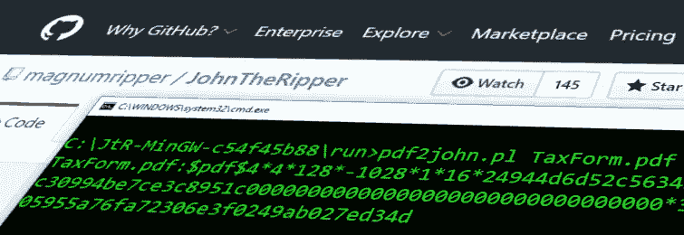
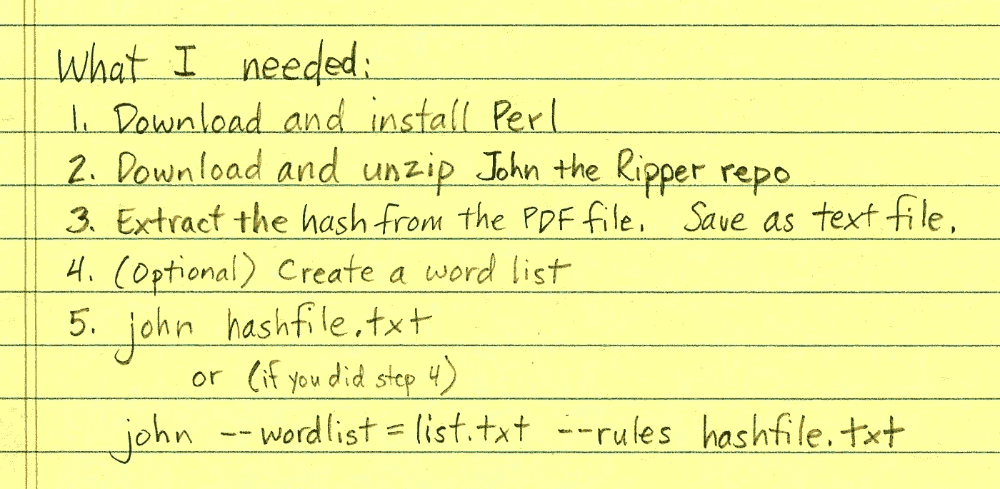
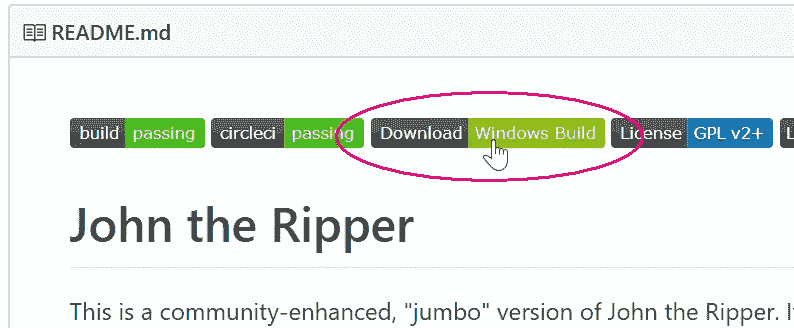
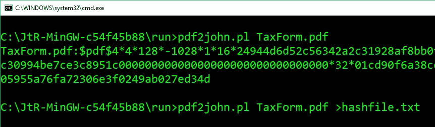
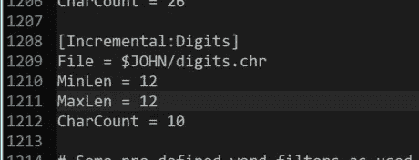
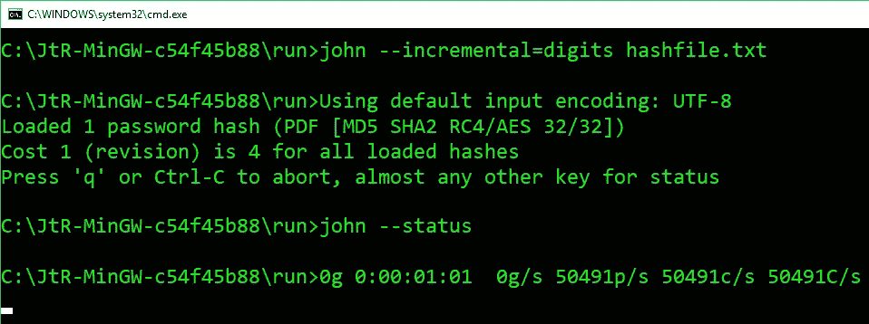
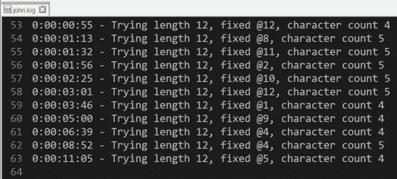
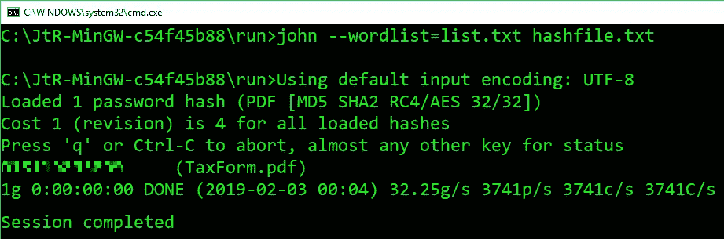

# 破解我的第一个密码

> 原文：<https://itnext.io/cracking-my-first-password-8df292fc71c5?source=collection_archive---------0----------------------->

我女儿的雇主通过电子邮件给她发了一份加密的 PDF 格式的税单。邮件中写道，“打开这份文件的密码是你的出生日期，格式为 MMDDYYYY 和你的 SS 号码的最后 4 位。”我打开文档，按照提示输入密码。

但是没有用。

我仔细检查了我女儿的社会安全号码和她的出生日期(有时我们会把这些东西搞混)。我尝试了这样的方法，比如把她社交网站的最后四位放在第一位，然后是格式化的日期。我尝试了十几种不同的日期格式。我试着在她的 SSN 里调换了几个数字。什么都没用。

我给她的雇主发了邮件:

> 我们无法使用 MMDDYYYY 后跟她的 SS 号的最后 4 位数字来打开<daughter>的表单。你收到过其他人打不开的报告吗？</daughter>

回应:

> 不，我没有听说其他人遇到过这种问题。我可以打印和邮寄，或者她来取，看哪个更方便。

在过去的六年里，我已经完全实现了税收无纸化。我把我们所有的税单都数字化储存起来，按年份分类。与纸质文档相比，我更喜欢管理数字文档，纸质文档会积累多年，需要(物理地)存储、组织和移动。

当然，我可以等待邮件中的文件到达，然后扫描它，但是这有什么意思呢？所以我开始使用谷歌:

“暴力破解”密码意味着尝试所有可能的字符组合，直到您最终猜出正确的密码。就我而言，我确信我女儿税单的密码由 12 位数字组成。在这个计算机时代，这不会太难破解，是吗？

第一步是从 PDF 文档中提取密码散列。如果“hash”让你想到“hash browns”，那你就离事实不远了。密码散列甚至被“加盐”以使其更难破解。

要做土豆泥，你需要把土豆磨碎成小丝。让我们称这个光栅工具为“哈希算法”继续类比，为了破解我们的密码，我们需要通过哈希算法一个接一个地输入土豆，直到我们找到一个与原始哈希完全一样的土豆。你可以想象，那需要很多土豆。

你饿了吗？

我也是。这是我的食谱:

在未来，只有酷小孩才会写作。看着吧。

首先，[下载并安装 Perl](https://www.perl.org/get.html) 。Perl 是一种超级极客的编程语言，我希望我知道。我用的是微软的 Windows(嘿，友好点)，所以我尝试了 Perl 的 ActiveState 和 Strawberry 风格。它们都可以工作，关键的部分是确保 Windows 关联。使用 Perl 的 pl 文件扩展名。

接下来，我为开膛手约翰下载了 GitHub repo。开膛手约翰是另一个有着悠久历史的极客工具。它的主要目的是尽可能快地把我们的土豆磨碎，直到我们找到匹配的。我下载了 Windows 版本并将其解压缩。它不需要安装。

点击什么来下载构建不是很明显，所以这里有一个截图。

我在 JtR 目录中找到了“run”文件夹，并复制了我试图破解的 PDF 文件(“TaxForm.pdf”)。我在准备我的工作空间。

然后我打开 Windows Command Prompt 并导航到 JtR“run”目录，在那里有无数的——没有一个*多余的—*—Perl 和 Python 脚本可以用来从所有不同类型的文件中提取密码哈希:7z2john.pl、cisco2john.pl、itunes_backup2john.pl 等。我需要的那个叫做 **pdf2john.pl** 。

运行`pdf2john.pl TaxForm.pdf`在屏幕上输出来自 PDF 文件的散列。但是 JtR 需要文本文件中的散列。所以我通过添加`>hashfile.txt`将输出重定向到一个文本文件。

(这个散列实际上并不是我女儿的出生日期和 SSN 的散列。)

我几乎准备好开始破解。我只需要弄清楚如何告诉 JtR 只尝试长度为 12 个字符的数字 0-9 的组合。告诉 JtR 只使用数字的选项是`--incremental=digits`，但是指定 12 个字符的长度需要编辑 john.conf 文件(方便地位于“run”目录中)。

普通的 Windows 记事本不会检测到 john.conf 文件中的换行符，所以我用 Notepad++打开了它。这是一个很大的文件，但是我在第 1210 行找到了我要找的参数。我设置了`MinLen = 12`和`MaxLen = 12`。

我用`john --incremental=digits hashfile.txt`点燃了 JtR

JtR 开始运行——在我的机器上——通过它的哈希算法，每秒超过 50，000 个组合，试图找到一个与我们从 TaxForm.pdf 提取的哈希匹配的哈希。JtR 在屏幕上显示的输出并不多，但是会一直在后台运行，直到按下 Ctrl-C。关于它在做什么的更多细节，我需要反复检查 john.log 文件:

我让它运行了一整夜，直到第二天。然后我想到:12 位数有 9000 亿种不同的组合。以每秒 50，000 次尝试的速度，全部尝试需要 6 个多月的时间。当然，如果运气好的话，我可能只需要几个星期就能找到正确的散列，但这仍然是一段很长的时间。如果我女儿的雇主几天后就把表格邮寄给我们，那就不值得了。

[我应该注意到，我的机器有一个酷睿 i5 处理器。我听说有人能够将一堆 PlayStation 处理器以菊花链形式连接在一起。他们可能比我的小 CPU 快 100 倍以上。]

我开始想是否有更好的方法。

JtR 破解密码的另一种方法是通过**字典攻击**。我们不是让 JtR 尝试所有可能的随机字符组合，而是为它提供一个预先生成的密码列表，让它可以尝试。

在[以 MMDDYYYY 表示的出生日期+SSN 的最后四位数字]的模式中，我发现只使用了大约六位唯一的数字，如果我假设前三位(MMD 部分)是正确的，我可以减少到五位。所以我拼凑了下面的 Powershell 代码来生成最后九个数字的所有可能排列的列表，以我希望正确的前三个数字为前缀。

这个脚本花了大约 15 分钟完成，但当它完成时，我有一个超过 60 万排列的列表，我可以用它来尝试破解 TaxForm.pdf 的密码散列。

我把我的 list.txt 文件复制到 JtR 的运行目录下，尝试了
`john --wordlist=list.txt hashfile.txt`

JtR 只用了几秒钟就轻松找到了密码。它显示在我的屏幕上，如上所示，但这可能是因为我对 john.conf 文件做了一些进一步的调整。无论如何，JtR 把破解的密码存储在一个名为 john.pot 的文件中。

我发现我女儿的雇主把她的社会安全号码弄错了。它甚至在我现在终于能够打开的税单上也是不正确的。幸运的是，他们用这样一种方式弄错了它，它被我的单词表中的一个有限的排列抓住了。

**最后一点:**对于字典攻击，JtR 对我给它的单词列表文件的编码非常挑剔。当文件编码为 UTF-8 时效果最好。