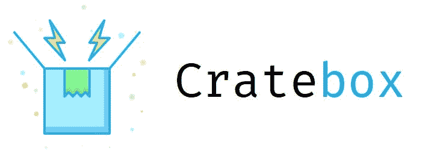

# Cratebox.io —状态管理

> 原文：<https://itnext.io/cratebox-io-state-management-c568a8ffe401?source=collection_archive---------3----------------------->


“大型档案馆架子上的活页夹和盒子”，作者:塞缪尔·泽勒(T0)在 [Unsplash](https://unsplash.com?utm_source=medium&utm_medium=referral) 上发表

谈到国家管理，这些天你有几个选择；可以选择 [MobX、](https://github.com/mobxjs/mobx) [MobX 状态树](https://github.com/mobxjs/mobx-state-tree/)或者 [Redux](https://github.com/reduxjs/redux) 。你选择哪个库并不重要，它们都能完成任务，每一个都有自己的方式，但是它们做的每一件事都像预期的那样。

无论您是将它们与 React、Vue 或 Angular 一起使用，还是仅仅与普通的 vanila JavaScript 一起使用，这些库都设计得很好，可以在任何环境中使用它们自己的 UI 库/框架绑定。

*免责声明:我不想在这个话题上挑拨离间，因为这不是我的本意。*

作为上述所有库的替代，来玩一个新的库: **Cratebox** 。



# 动机

我开始开发 **Cratebox** 来证明自己能够以顶尖开发人员为榜样构建一个强大的状态管理库，这些开发人员包括[*Michel west strate*](https://github.com/mweststrate)[*Dan abra mov*](https://github.com/gaearon)[*Jam*es*Kyle*](https://github.com/jamiebuilds)等等。我想要像 *MobX 状态树*一样健壮和类型化的东西，但也想要一些清晰和易于使用的东西，这就是为什么我构建了 **Cratebox** ，作为 *MobX 状态树*和 *Redux* 之间的一个中间点，健壮并带有一个声明性和简单的 API，总是能完成工作。

# 特征

这些是使 **Cratebox** 成为你的好工具的一些关键特征:

## 简单的

考虑到极简主义，公开的 API 将为您提供您需要的一切，而不会有任何麻烦。

## 打字

构建时考虑到类型，您将能够通过类型安全检查来创建坚如磐石的模型。

## 固执己见的

你不必担心如何构建和处理复杂的东西，我们已经设置了一些简单的规则和方法，所以我们确保一切都可以开箱即用。

# 类型系统

让我们来谈谈与**弹匣**一起提供的**型系统**。

类型系统是为你建立的，以确保一切都应该按照预期工作；例如，如果您声明模型的某个属性是 string 类型的，并且您试图为它设置一个不同的类型(无论是不是偶然的)(有一个小的例外，我们将在后面解释)，比如说一个数字，它将抱怨收到的类型与预期的不同。

让我们更深入地了解一下**型系统**。我们现在将解释我们在**盒**中的两种不同类型。

## **基本类型**

基本类型是任何(几乎所有)编程语言的核心类型。我们使用这种类型为我们的数据构建一个可靠的结构。这些类型如下:

*   **字符串类型—** 此类型可以包含字符串和 null 类型的任何值。
*   **数字类型—** 此类型可以包含数字类型的任何值和空值。
*   **布尔类型—** 该类型可以包含布尔类型的任何值。
*   **Null 类型—** 此类型可以包含任何 Null 类型的值。
*   **未定义类型—** 该类型可以包含任何未定义类型的值。
*   **日期类型—** 此类型可以包含日期类型的任何值。

有了这些基本类型，您就可以用类型安全检查构建一个简单的数据结构。让我们看看如何在一个最小的例子中使用它:

```
{
    name: types.string,
    lastName: types.string,
    email: types.string,
    age: types.number,
    birthDate: types.date,
    admin: types.boolean,
}
```

让我们检查一下前面的结构，你现在看到的这个物体就是我们所说的**模型物体**。一个**模型对象**是一个属性和类型的结构，我们将把它声明为某个商店的结构。

我们可以看到它有几个属性，在这个例子中，有六个，每个都是按照我们想要的方式键入的。

*姓名*、*姓氏*和*电子邮件*属性必须包含一个字符串或 null 类型的值。*年龄*属性必须包含一个 number 或 null 类型的值。*出生日期*属性必须包含日期类型的值(不要与格式化的类似日期的字符串混淆，那是无效的)或 null。

## **高级类型**

*   **数组类型—** 该类型可以包含一个特定基本类型或高级类型(如冻结)的数组，通过使用最后一个，我们将拥有一个**复杂类型**。
*   **文字类型—** 这种类型只能包含一个字符串文字，并且会根据这个文字检查所有内容，以确保它是指定的那个。
*   **枚举类型—** 该类型可以包含一个文字字符串数组，它将作为您所需目的的枚举(例如，通常用于 UI 视图路由)。**枚举类型**是**文字类型**的**数组类型**的示例复杂类型。它是为您开箱即用而内置的。
*   **冻结类型—** 该类型将包含一个**模型对象**结构(就像我们之前展示的那个),该结构将对您在创建该类型时声明的每个属性进行所有类型检查。

```
// Declare a TODO type
const todo = types.frozen({
  id: types.number,
  title: types.string,
  description: types.string,
  done: types.boolean
});// Describe the TODOS store
crate.describeStore({
  identifier: "todoStore",
  model: {
    todos: types.array(todo)
  }
});
```

正如你在上面的例子中看到的，我们已经通过使用**冻结类型**声明了一个 **Todo 类型**。之后，我们描述一个商店(如果你不能理解，不要担心，我保证我们一会儿就会看到它，一切都会很清楚)并且模型包含一个名为 *todos* 的属性，该属性是一个**复杂类型**(正如我们之前所学的)，因为它是一个**冻结类型的**数组类型**。**

# 描述商店

在 **Cratebox** 中，声明你的商店结构的方法是用 **describeStore** exposed 方法描述它。

**describeStore** 方法将**商店模型**对象作为具有以下属性的单个参数:

1.  标识符:你描述的商店的标识符。
2.  模型:这个商店的描述，它被表示为一个**模型对象**，就像我们上面描述的那个。你不能用一个不包含至少一个类型化属性的**模型对象**来描述一个商店。

```
const crate = cratebox();crate.describeStore({
  identifier: 'user',
  model: {
    name: types.string,
    lastName: types.string
});
```

在上面的例子中，我们描述了一个简单的*用户商店。*现在，我们可以继续将更改发送到该存储，这样它就会充满您的数据。

注意:不能用相同的标识符描述两个商店。

# 将更改分派到存储

在 **Cratebox** 中，很容易将变更发送到某个商店。我们已经为你展示了一个简单的方法来处理这个问题，这个方法叫做 **dispatch** (显然……)

**分派**方法将**商店模型**对象作为具有以下属性的单个参数:

1.  Identifier:要将更改发送到的存储的标识符。
2.  Model:您希望在商店中更改的属性值。

```
crate.dispatch({
  identifier: 'user',
  model: {
    name: 'Alex',
    lastName: 'Casillas',
  }
});
```

上面的例子将把模型中给定的变更发送到商店。

请注意，这不会返回任何内容，因为这不是预期的行为。要获得我们刚才所做的更改，您必须获得商店的当前状态。

# 获取商店的状态

在 **Cratebox** 中获取商店的状态是小菜一碟，我们已经为您准备好了，我们已经为您展示了一个简单的方法，它将让您检索特定商店的状态，这个方法被称为 **getState** (显然……)

**getState** 方法将商店标识符作为单个参数，并将返回当前的**模型**状态。

```
const user = crate.getState('user');
console.log(user);
// Outputs { name: 'Alex', lastName: 'Casillas' }
```

如果存储中没有数据，它将返回一个空值**。**

# 订阅存储更改

从您的存储中自动获取更改的一种方式是订阅它，这样，每次您向存储分派新的更改时，它都会自动为您提供最新的数据模型。

```
const unsubscribe = crate.subscribe('user', model => {
  console.log('User Changes: ', model);
  // Outputs at dispatch: { name: 'Alex', lastName: 'Casillas' }
}crate.dispatch({
  identifier: 'user',
  model: {
    name: 'Alex',
    lastName: 'Casillas',
  }
});
```

# 取消订阅商店更改

如果您想删除每次调度更改时触发您的订阅的侦听器，您可以通过调用由 **subscribe** 方法返回的函数来实现。

```
const unsubscribe = crate.subscribe('user', model => {
  console.log('User Changes: ', model);
  // Outputs at dispatch: { name: 'Alex', lastName: 'Casillas' }
}crate.dispatch({
  identifier: 'user',
  model: {
    name: 'Alex',
    lastName: 'Casillas',
  }
});unsubscribe(); // Calling this will make the subscription stop
```

# 时间旅行

**Cratebox** 通过两种简单的方法为你的时间旅行提供开箱即用，分别是:**向前旅行**和**向后旅行**。

## 向前和向后移动

为了及时向前移动，你只需要调用 **travelForwards** 方法，它将给定商店的当前状态向前移动一步。

如果没有前进的步骤，你就不能向前进行时间旅行。每次调用 **travelForwards** 方法时，将会调用您对正在进行时间旅行的商店的所有订阅。

要回到过去，你只需要调用 **travelBackwards** 方法，它会将给定商店的当前状态向后移动。

如果没有后退的方法，你就不能回到过去。每次调用**travel backward**方法时，都会调用您对正在进行时间旅行的商店的所有订阅。

```
const unsubscribe = crate.subscribe('user', model => {
  console.log('User Changes: ', model);
  // Outputs at first dispatch
  // { name: 'Alex', lastName: 'Casillas' }
  // Outputs at second dispatch
  // { name: 'Antonio', lastName: 'Cobos' }
  // Outputs at traveling backwards
  // { name: 'Alex', lastName: 'Casillas' }
  // Outputs at traveling forwards
  // { name: 'Antonio', lastName: 'Cobos' }
}crate.dispatch({
  identifier: 'user',
  model: {
    name: 'Alex',
    lastName: 'Casillas',
  }
});crate.dispatch({
  identifier: 'user',
  model: {
    name: 'Antonio',
    lastName: 'Cobos',
  }
});crate.travelBackwards('user');
crate.travelForwards('user');
```

# 演示时间🙌

现在我们要展示一个我们准备好的小演示。这是一个 ToDo 应用程序(是的，一个 ToDo App，另一个，简单但有效的展示)

这个演示使用了**盒反应**，官方*反应*绑定**盒反应**。请随意使用演示，尝试新事物，并给我们一些反馈。那真是太感谢了:)

希望你喜欢这个阅读，它很好，很有趣，如果你有任何其他问题，你可以在 twitter 和 Github 上通过 [@alexvcasillas](https://twitter.com/alexvcasillas) 联系我:)