# CRD 只是库伯内特斯的一张桌子

> 原文：<https://itnext.io/crd-is-just-a-table-in-kubernetes-13e15367bbe4?source=collection_archive---------3----------------------->

## 尝试对 CRD 最简单的解释。

# CRD 听起来很难..为了什么？又如何创造？

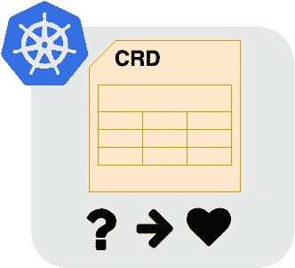

**CRD** ，自定义资源定义是 Kubernetes 中的一个特殊资源。当您以常规方式使用 Kubernetes 时，您不必创建那种资源。所以这对于很多用户来说并不是那么重要。但有时，CRD 会出现在前沿博客、kubernetes.io 的文档和讨论中。然后很多用户很苦恼，不得不花点时间去理解，比如我！

那是什么？我们什么时候使用它？一旦我们需要它，我们如何创造它？

别担心。我已经走过这条路了。我想尽可能简单地解释一下 CRD。

# 为了什么？

CRD 只是数据库的一个表**。
例如，我们可以在数据库中创建一个名为“水果”的**表**。该表可以包含许多**记录**，如“苹果”、“香蕉”和“橙子”。这些记录有**列**，如“甜度”、“风味”和“重量”，显示水果的特征。**

**CRD 就像一桌**“水果”。

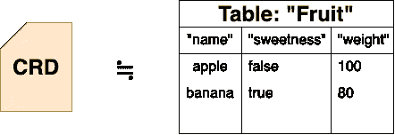

**CR(自定义资源)是每个记录**像“苹果”。

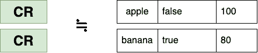

创建 CRD(表)后，您可以添加或删除 CRs(记录)。

为什么需要 CRD？这是因为越来越多的用户习惯了 Kubernetes，知道了 Kubernetes 的用处，他们希望更广泛地使用它。他们希望向 Kubernetes 输入更多数据供自己使用。数据格式互不相同。这些在 Kubernetes out of the box 中没有定义。所以他们必须在 Kubernetes 中创建一种表格，他们必须设置自己的列名或类型来定义类似于数据库中的表格。这是 CRD 复活的时刻。

例如，IT 经理想用 CRD 来组织用户列表。在其他情况下，他们希望组织一个部门列表、计划时间表等等。他们可能会照顾水果清单，但我猜这是罕见的。

# 我们怎样才能创造 CRD？

如前所述，CRD 是一张桌子。当我们创建一个表格时，我们需要定义表格的格式，比如**列名和类型**。这些元素在 YAML 或 JSON 格式的 CRD 文件中描述。

CR 还以 YAML 或 JSON 格式描述记录的每个值**。**

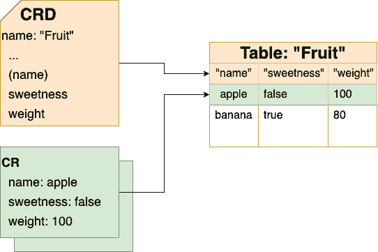

下面是 CRD 的详细内幕。

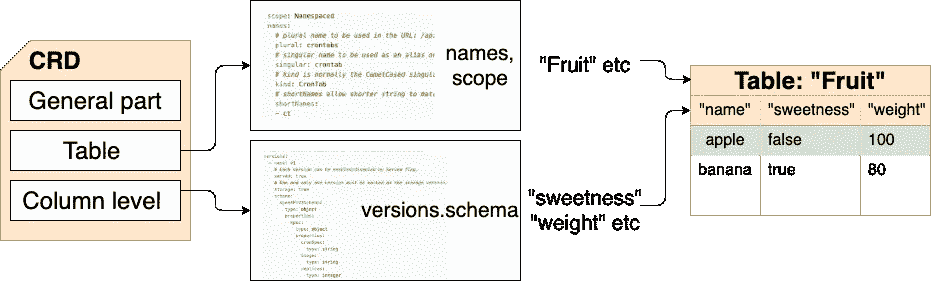

CRD 格式分为三部分。(但是我一直记不住每一个细节。我每次需要的时候都会查阅官方文件。)

*   一般部分
    与其他 Kubernetes 资源相同。元数据包括 CRD 的名字本身(`name: “fruit-crd`"等)。`apiVersion`和`kind`也是必填项。
*   **表格级别信息**
    表格名称(`kind: “Fruit”`)，命令行的简单小写名称(`simpler: “fruit”`)，复数形式(`plural: “fruits”`)
*   **列级信息**
    列名(`“sweetness”`)、列类型(`“boolean”`、`“string”`、`“integer”`、`“object”`)、嵌套对象(`props: <child object name and columns>`)。这些遵循 OpenAPISpecification 版本 3 的格式。
*   更多细节在下面的官方文件中。
    [https://kubernetes . io/docs/tasks/extend-kubernetes/custom-resources/custom-resource-definitions/# create-a-customresourcediation](https://kubernetes.io/docs/tasks/extend-kubernetes/custom-resources/custom-resource-definitions/#create-a-customresourcedefinition)

# 检查 CRD 功能

CRD 真的是一张桌子吗？让我们确保。

我不记得 CRD 的格式了。所以我想介绍更简单的方法来创建 CRD。即使我不写 CRD，我只写一个“表”的定义，然后我有一个操作符(自动 CRD 创建工具)生成 CRD。

桌子很简单。`columns`只包括成对的列名和类型。

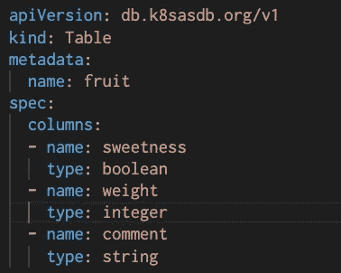

更简单的定义“表格”示例

在将这个表安装到 Kubernetes 之后，[我的操作员](https://github.com/onelittlenightmusic/k8sasdb)会自动生成下面的 CRD。当然，你不需要这个运算符。可以自己生成。如果你想安装我的操作器，请运行这个命令。

```
kubectl apply -f https://raw.githubusercontent.com/onelittlenightmusic/k8sasdb/master/install.yaml
```

成功安装操作器后，使用该命令检查 pod 是否正在运行。

```
kubectl get pod -n k8sasdb-system
NAME                                         READY   STATUS    RESTARTS   AGE
k8sasdb-controller-manager-9dbf54b4f-hzrt9   2/2     Running   0          8s
```

您可以从[这里](https://github.com/onelittlenightmusic/k8sasdb/tree/master/test)下载样表和每个 CR 文件。

生成的 CRD

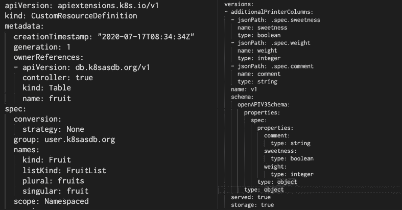

CRD(左:通用部件和表格级信息，右:列级信息)

然后我加了下面的 CR (YAML 换一个水果)。

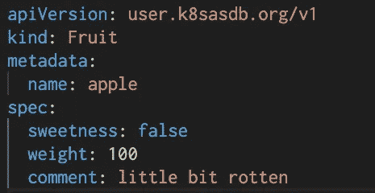

CR“水果”示例

让我们检查表和记录操作的结果。

## 创建表格

```
kubectl create -f fruit.yaml
```

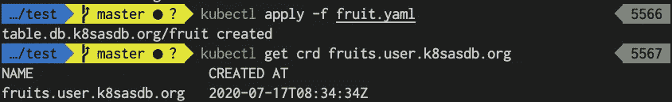

→成功(安装了 CRD =创建了一个表)

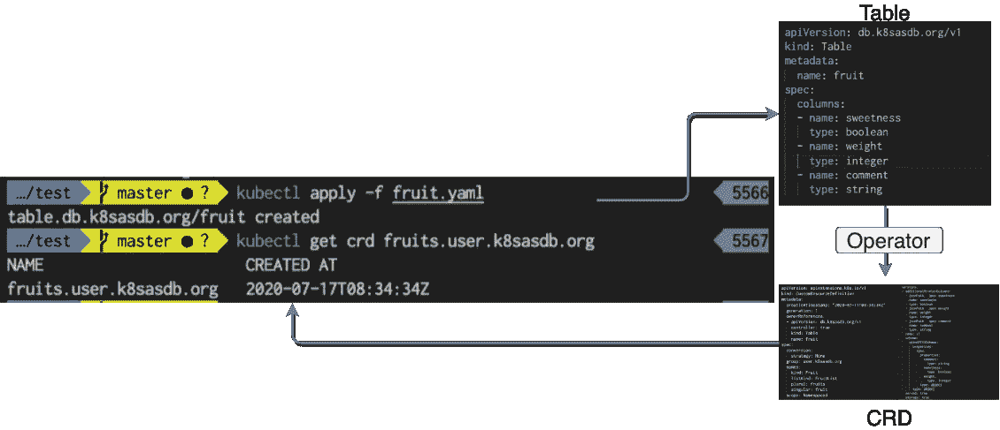

这等同于 SQL `CREATE TABLE fruits;`

## 创造记录

```
kubectl create -f apple.yaml
```

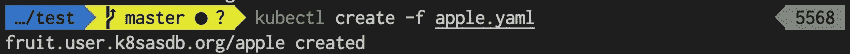

→成功(CR 已安装=记录已创建)

就像`INSERT INTO fruits values('apple', ...);`

## 获取记录列表

```
kubectl get fruits
```


→成功(列出了 2 个 Cr，并显示了每一列)

如果你熟悉数据库，这个结果看起来像 SQL 查询`SELECT * FROM fruits;`的结果吗？

## 获得记录

```
kubectl get fruit apple
```

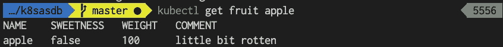

→成功。当然，其他名字如“香蕉”也适用。这相当于`SELECT * FROM fruits WHERE name = 'apple';`

## 删除记录

```
kubectl delete fruit apple
```


整个水果列表的检查命令显示删除后没有“苹果”的结果。

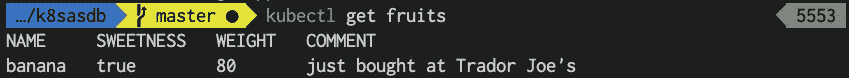

→成功。这意味着`DELETE FROM fruits WHERE name = 'banana';`

# 摘要

CRD 只是库伯内特斯的一张桌子。

您可以使用 CRD 创建新表。

您可以使用 CRs 添加记录。

您可以在 CRDs 中定义表模式(列名、类型等)。

当你掌握了 CRD、CR 和`kubectl`命令，你就可以把各种数据输入到 Kubernetes。

不需要害怕。即使你不记得 CRD 格式，一些类似操作符的生成器会帮助你管理 CRD。(我的运算符实现是开源的。此处发布[。如有，请反馈。)谢谢！](https://github.com/onelittlenightmusic/k8sasdb)


照片由[阿莱恩·德·戴娜](https://unsplash.com/@alinedenadai?utm_source=medium&utm_medium=referral)在 [Unsplash](https://unsplash.com?utm_source=medium&utm_medium=referral) 上拍摄