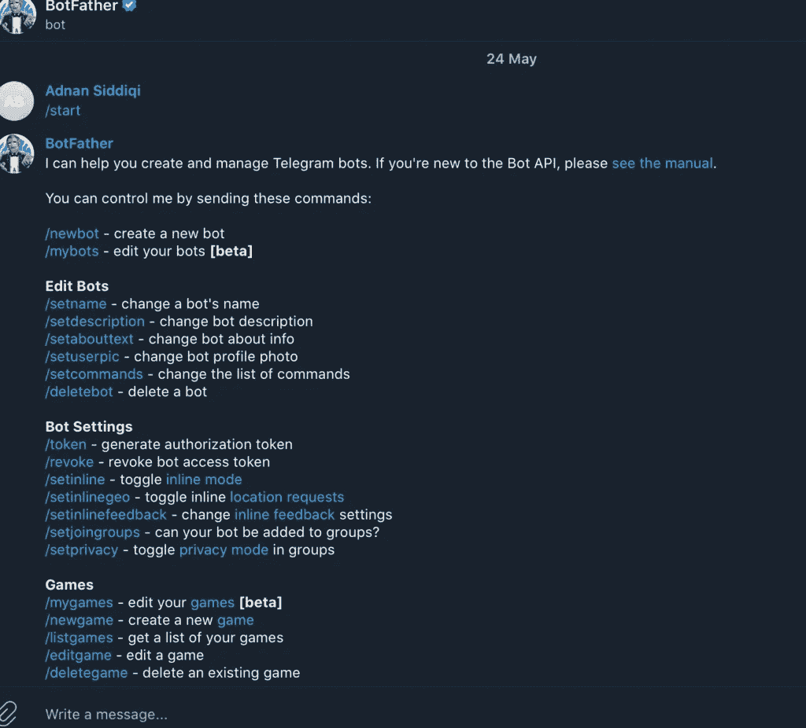
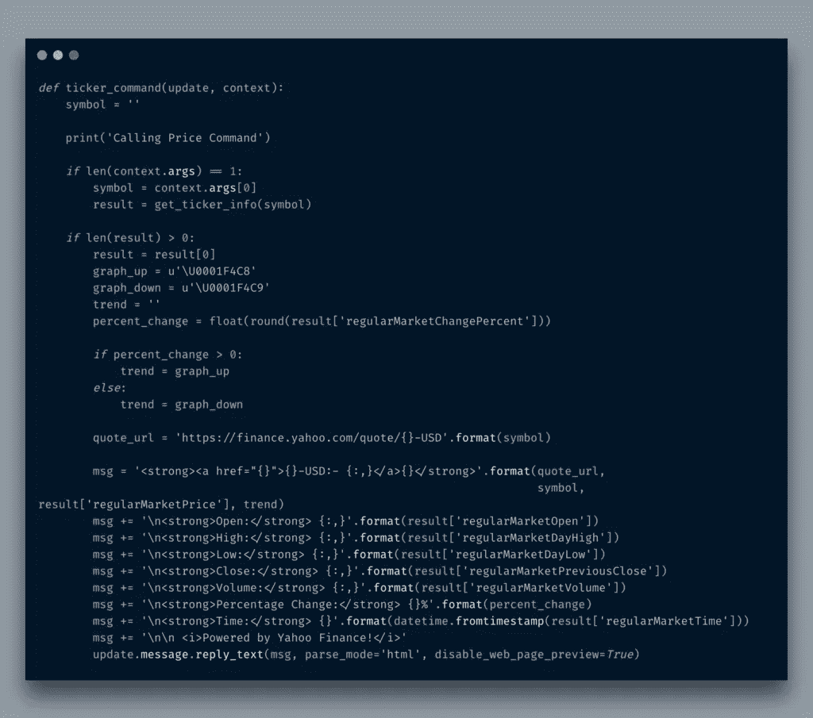
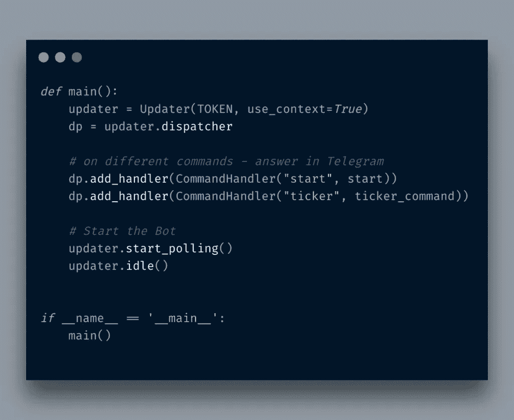
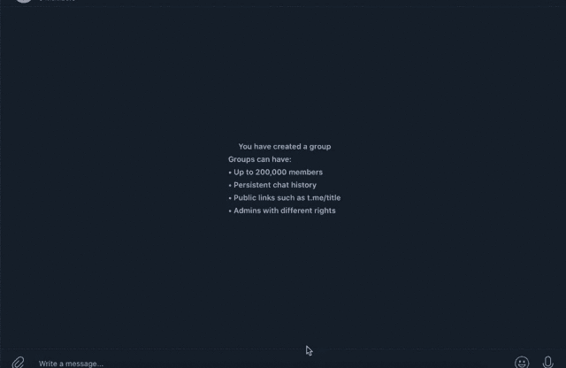

# 使用 Yahoo Finance API 在 Python 中创建一个加密电报机器人

> 原文：<https://itnext.io/create-a-crypto-telegram-bot-in-python-using-yahoo-finance-api-a5da9975c31c?source=collection_archive---------3----------------------->


因此，我正在为一个项目探索 Telegram APIs，这个项目有人让我去做。该脚本实际上是一个 cron 作业，每天发送消息。在使用它的过程中，我发现你可以想出自己的命令，这些命令可以从一些远程 API 中提取数据，并将结果显示给 Telegram 用户。我发现这是我写下一篇博文的机会🙂

Telegram 在通信方面与 WhatsApp 非常相似，在密码爱好者中非常受欢迎。许多密码交易员使用 Telegram 和 Discord 向他们的团队成员发送密码和股票信号。

电报应用程序被称为机器人。您创建了一个 bot，并获得了一个 API/Token 密钥，用于您的程序连接电报服务器。您可以创建一个无需任何用户干预就能持续发送消息的机器人，也可以创建一个将 command 作为输入并做出相应响应的机器人。我打算晚一点做。

# 创建一个机器人

你要做的第一件事就是发送一条`/start`消息给**机器人父亲**机器人。这个机器人有一个经过验证的勾号，将它与其他*假*机器人区分开来。当你发送一个`/start`命令时，它会给你一个大菜单命令来管理你的机器人。



你可以使用`/newbot`命令，它会要求你按照几个步骤来生成你的机器人。最后，它还会向您发送如下消息:

> 搞定了。祝贺你的新机器人。你会发现它在 t.me/mybot.你现在可以添加一个描述，关于你的机器人的部分和剖面图，见/帮助命令列表。顺便说一下，当你完成创建你的酷机器人，平我们的机器人支持，如果你想要一个更好的用户名。在你这样做之前，确保机器人是完全可操作的。使用此令牌访问 HTTP API:2815346687:aahzir 1 iocwskemg 21–7 ilal 4 GH 78 jml 3 _ 4 保持您的令牌**安全**和**安全存储它**，它可以被任何人用来控制您的 bot。

将这个令牌密钥保存在某个地方，因为这是您与您的机器人进行交互的唯一方式。为了让你的机器人可以被群组邀请，你必须发送`/setjoingroups`命令。它会要求你用@符号提到你的机器人名。例如，如果我的机器人名字是`mybot`，那么我会写`@mybot`并点击回车键。它将显示一个类似对话框的界面，您可以在其中选择*启用*选项。

现在，您可以轻松地邀请您的新机器人加入该群组

# 发展

好了，你的机器人准备好了。现在你将不得不写代码来自动化这个机器人。为了做到这一点，你必须为电报安装 [python 库。](https://python-telegram-bot.org/)

我要做的第一件事是在一个单独的文件中设置令牌密钥。你可以使用一个*文本/xml/JSON* ，无论你想要什么。我只是创建了`config.py`并将`TOKEN`中的令牌设置为常量。

现在我将创建一个名为`crypto.py`的主脚本文件，它将作为一个机器人控制器。在文件中导入如下内容:

```
from config import TOKEN
from telegram.ext import Updater, CommandHandlerUSAGE = '/ticker <SYMBOL>: For example: /ticker BTC or /ticker ETH'def start(update, context):
    update.message.reply_text(USAGE)def main():
    updater = Updater(TOKEN, use_context=True)
    dp = updater.dispatcher# on different commands - answer in Telegram
    dp.add_handler(CommandHandler("start", start))# Start the Bot
    updater.start_polling()
    updater.idle()
```

当您运行此脚本时，它将循环运行。转到您添加 bot 的组，它会发送在`USAGE`变量中设置的文本。非常简单。您创建一个调度，它是`Updater`类的对象，然后创建`CommandHandler`来处理您的定制命令。`add_handler`的第一个参数是你要发送的命令，第二个参数是收到命令后要调用的函数。脚本会丢弃未知的命令。`start_polling`将循环启动脚本，接受来自机器人的命令。尝试`/start`命令，它应该会打印出您在`USAGE`变量中设置的文本。

好了，我们已经测试了我们的机器人，现在是时候写真正的代码来获取加密价格了。为此，我使用了雅虎财经 API，因为它们可以免费使用，而且相当全面。我创建了另一个名为`yf.py`的文件，其中包含以下代码:


非常简单。现在，我通过如下所示的导入来调用这个函数:

`from yf import get_ticker_info`

我将创建一个名为`ticker_command`的新函数，它包含以下代码:



现在`main()`函数，ticker handler 命令将如下所示:



就是这样。如果一切顺利，这就是你的机器人的反应:



很酷，不是吗？在我结束之前，您应该注意到这个命令:

`update.message.reply_text(msg, parse_mode='html', disable_web_page_preview=True)`

这里我将消息格式设置为`HTML`。默认情况下，它是文本。您也可以使用*降价*进行文本格式化。我还禁用了链接预览，我还发送了验证硬币价格的主要来源的 URL

# 结论

所以你知道了用 Python 写一个基本的电报机器人有多简单。你可以通过在数据库或其他东西中记录事情来使它变得更复杂。基本结构是一样的。该代码可在 [Github](https://github.com/kadnan/PythonTelegramCryptoBot) 上获得。

***PS:如果你喜欢这个帖子，那么你可以通过*** [***支持***](http://blog.adnansiddiqi.me/support-this-content/) ***这个博客来表达你的爱。你友好的姿态将帮助我学习新的东西，并与像你这样的人分享。***

*原载于 2021 年 5 月 28 日*[*http://blog . adnansiddiqi . me*](http://blog.adnansiddiqi.me/create-crypto-telegram-bot-in-python-using-yahoo-finance-api/)*。*