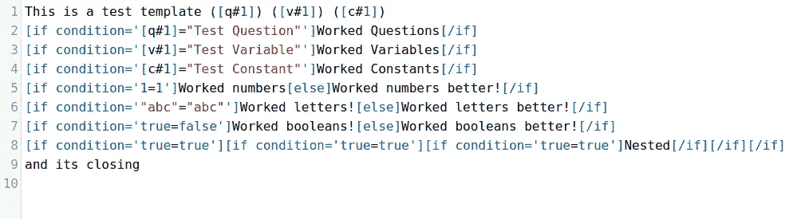

# 用 PEGJS 创建一个像 PRO 一样的自定义解析器

> 原文：<https://itnext.io/create-a-custom-parser-like-a-pro-with-pegjs-77e697313926?source=collection_archive---------0----------------------->

## 大问题需要大解决方案

正则表达式几十年前就存在了，开发人员几乎每天都使用它来搜索文本或执行快速替换。如果这样很好，那么？为什么是 PEGJS？

关于它的简短故事从文档自动化开始。我当前的应用程序需要处理复杂而庞大的法律文档(我可以自信地说，大约 118 个 word 文档页面，使用常规字体大小或更大)。由于法律文档具有很强的可重用性，因此需要提供使用*条件逻辑*、*变量*、*常量*、*函数的能力，并根据处理时注入的数据传递外部值*来构建不同的 PDF 文档。正则表达式在一段时间内很好地解决了这个问题，直到我们发现我们需要使用嵌套条件、函数以及两者的组合来支持更复杂的场景。

然后正则表达式完全停止工作:

*   事实证明，检测具有这种嵌套的嵌套条件并正确处理它是非常困难的。
*   文档开始变得庞大，在 100 多行文本中查找错误是一项艰巨的任务。
*   运行所有这些开始成为 CPU 和 RAM 密集型任务。

在与许多非常复杂的正则表达式斗争了两天之后，我决定改变我的思维方式，正如阿尔伯特·爱因斯坦所说:*“如果你想要不同的结果，就不要做同样的事情”*。我不久前听说了解析器，所以我看了一些 Javascript 选项。

*   [雪佛兰](https://chevrotain.io/docs/)
*   [钉](https://pegjs.org/)

# 解析器到底是做什么的？

解析器是一种软件，它将纯文本作为输入，并将其转换为有意义且可以解释的数据结构。根据定义，这已经解决了我的问题，耶！。在[https://en.wikipedia.org/wiki/Parsing](https://en.wikipedia.org/wiki/Parsing)的精彩解说

# 派格斯来营救了

**PEGJS** 是一个 ***解析器生成器*** ，它从一个 ***语法*** 生成 ***解析器*** 。解析器可用于生成 AST ( *抽象语法树*)，然后使用定制的**I*interpreter***(获取 AST 并遍历它的软件)处理 AST。

**这就是我前进的步伐:**

*   学习如何编写正确的语法来支持我在 PEGJS 上的自定义语言。
*   基于我的语法从 PEGJS 解析器返回一个好的 AST。
*   **写一个解释器来处理树并创建我的文档。**

# 语言定义

下面是需要支持的语法的概述。正如我们所看到的，纯文本结合了条件和一些奇怪的符号，解释如下。它看起来几乎像一个 MD 编辑器，但内部要复杂得多。

【https://peg-parser-viewer.herokuapp.com/ 

## 条件式

需要编写这样的条件，它可以接受几个操作符、标记、函数和分支:

*   相等=
*   大于或等于≥
*   次要或等于≤
*   更大>
*   minor<
*   Contains $=

## Tokens

*   ***【q # 1】***用于用户回答的特定问题的值
*   ***【c # 1】***为常数值
*   ***【v # 1】***用于用户为重用性而创建的变量

这些标记表示从数据源获取的信息，因此文档内部的逻辑将使用动态数据进行处理。

## 功能

该语言支持一组 15 个原生函数标记，接受 1 个参数作为输入，在处理最终被结果文本替换时必须执行。它还必须支持嵌套结构。

## 反馈支持

当语法错误时，语言需要向用户提供反馈。

# 编写 PEGJS 语法规则

我用 https://pegjs.org/online 开始了我的旅程，那是创造一个有效语法的战场。在我的例子中，语法的输出是一棵树，我们可以根据需要将它发送给另一个组件(解释器)进行遍历和处理。我需要一个可以访问数据库的有状态解释器来获取问题、答案、常量和变量，以便在处理逻辑之前执行替换。

peg 是使用规则编写的，后面是解析表达式，可能是 Javascript，它接受表达式并转换成有用的东西。

# 用 PEG 创建语法

PEG 使用规则来定义语法。

## 代码规则

一切都从一个**规则开始*开始*规则链到另一个我命名为**规则*代码*规则**。**

这意味着解析器希望任何形式的文本都遵循以下规则:

*   ***question token****:此规则解析一个特殊的问题令牌。*
*   ***variable token****:该规则将用户创建的变量解析为系统中的变量特殊记号。*
*   ***constant token****:该规则解析整个应用程序域中的静态值，如公司名称等。*
*   ***UnderlineToken:****因为文本支持 MD 格式，所以解析器需要知道这一点。*
*   ***TocToken:****此规则解析目录。*
*   ***highlight token:****这个规则解析一个特殊的标记，突出显示动态替换。*

*   *****function 语句:*** *这个规则解析将由解释器执行的函数。***
*   *****文本:*** *这只是构成我们正在构建的文档的文本、数字和符号。***

## **提问令牌规则**

**问题令牌将具有格式**【q # id】**，ID 是一个数字。**

## **可变令牌规则**

**变量令牌的格式为**【v # id】**，ID 是一个数字。**

## **康斯坦托肯法则**

**常量令牌的格式是**【c # id】**，ID 是一个数字。**

*****注意*** : *我在每个规则的末尾使用了 Javascript 语法来处理输出，并将有效的叶节点返回到我的树中。由于 ID 是一个数组，我们将输出连接到一行文本*。我们可以通过在规则末尾打开和关闭括号来使用 JS。**

## **底线原则**

**这里没有什么特别的，我们期望开始或结束标记，它没有被处理，因为它的 MD 编辑器知道当它显示时该做什么。**

## **托托肯规则**

**另一个简单的文本解析器表达式用于*目录*。**

## **HighlightToken 规则**

**这是一个简单的文字，用来突出显示一些文本。**

## **ConditionalBooleanStatement 规则**

**条件句更难理解，因为它结合了文字+其他规则。规则期望一个 ***开括号*** + ***空格*** (可选)+另一个文字 ***if 条件***+*空格* (可选)+文字***=****+****空格*** (可选)+ ***开单引号*** 注意 ***body1*** 和 ***body2*** 使用***Code r***ule*这意味着我们期望文本、令牌、条件或函数内部提供一个本质上的递归嵌套结构。当解释器需要处理这些节点并识别其中的结构时，所有这些都很方便。***

***注意我们使用了下面的 ***或条件*** 条件规则。这用于条件上的& &和 **||** 表达式，能够在一个条件中匹配多个条件。首先，我们期望 ***和条件*** 规则后面跟着字面**|**，后面跟着 ***和条件*** 规则。如果解析器不识别表达式，它将退回到 ***和条件*** 规则，这意味着条件不包含***|*|**运算符**。*****

******和*** 条件规则有两种不同的用法。首先，这是***or 条件*** 规则的回退规则。第二，这是一个由字面 ***& &*** 定义的 ***和*** 运算符，后跟另一个 ***条件语句*** 规则。如果解析器无法链接 ***和*** 操作符，它将退回到下面解释的 ***条件语句*** 规则。注意规则末尾的 Javascript 表达式，它链接了多个条件，并返回一个包含给定条件的整个先前条件链的谓词对象。***

******条件语句*** 规则是一个相当常见的条件的原始定义。它包括 3 个部分:***

*   ******lhs*** :左手侧数值。如果它不是一个值，它就退回到一个 ***函数语句*** 规则。***
*   ******运算符*** :下面解释的用于比较的运算符。***
*   ******rhs*** :右手侧数值。如果它不是一个值，它就退回到一个 ***函数语句*** 规则。***

******运算符*** 规则是一个简单的规则，它包含了一系列要使用的有效运算符。至少应该使用一个操作符，这就是解析器表达式末尾有+符号的原因。***

## ***function 语句规则***

***该规则用于定义编写 ***模板函数*** 的语法。这些功能将由后端的 functions dispatcher 组件执行。重要的是返回正确的结构，以便稍后在解释器组件中识别函数。***

******FunctionStatement***规则需要***all function tokens***列表中的任何函数标记，后跟一个 ***开始文字括号+ QuestionToken 或字符串或 function statement 规则。******

***注意参数可以是 ***令牌，字符串*** 或者其他 ***函数*** 。对于标记，函数将在解释器解析标记后处理。在字符串规则的情况下，解释器不需要任何东西。同样，一个函数可以调用另一个函数，所以一个函数可以被另一个函数嵌套，所以解释器需要足够聪明，首先递归地调度嵌套的函数。***

***类似于条件规则，我们返回一个表示函数结构的对象。***

## ***文本规则***

***文本规则是代码规则使用的最新回退规则。它解析除了函数、标记和条件使用的特殊字符之外的所有内容，如[]或$。为了使用它们，我们使用逃脱技巧。因此，如果文本需要是文字[那么用户需要写\[。然后，下面的规则将使用代表转义字符的十六进制代码替换该字符。***

# ***AST 输出示例***

***让我们以下面的输入为例，生成一个 ***AST(抽象语法树)。******

***在解析器获取输入并成功解析之后，我们将获得以下带有节点和叶子的 AST。现在可以将它发送给自定义解释器进行处理。***

# ***编写解释器***

***最后，还有语法工作和一个有意义且可以处理的 AST。这是解释器的任务，获取 AST 并将所有内容简化为一个纯文本模板。这个解释器是一个有状态的解释器，它在访问树和处理它之前从数据库接收大量数据。当树被访问时，每个节点被不同地对待。我们将在树中找到不同的节点:***

*   ***字符串节点，可能包含问题、变量或常量标记。***
*   ***对象节点，可能是条件或函数。由于其嵌套结构，这些节点必须用递归处理。***

***下面我们可以找到一个示例解释器来处理这个树，它就是我在下面列出的演示链接中使用的那个。***

## ***演示***

***这是我用 NodeJS 和 CodeMirror 作为编辑器准备的一个小演示。***

***[https://peg-parser-viewer.herokuapp.com/](https://peg-parser-viewer.herokuapp.com/)***

## ***结论***

***使用 PEGJS 消除了正则表达式处理器的所有问题，它可以用来支持和处理超级复杂的文本结构，创建一个定制语言来处理我们的模板，等等。这是一个非常快的解析器，我能够在 ms 中处理 120 页的文本，这太棒了。解析器还提供错误位置反馈，使模板编辑更容易，并提供语法信心。***

***我认为这足以解决我的问题，但我也很想尝试 Chevrotain，它提供了许多文档和示例，但与使用 PEGJS 相比，需要更高的学习曲线。***

******

## ***接下来***

***所有这些处理都不便宜，而且非常依赖 CPU。我们将探索如何通过使用多处理方法来水平扩展该流程，以避免主事件循环中的长时间运行操作。***