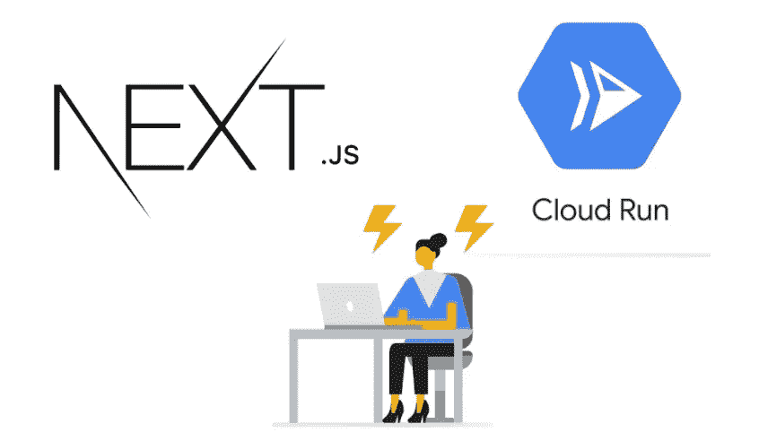
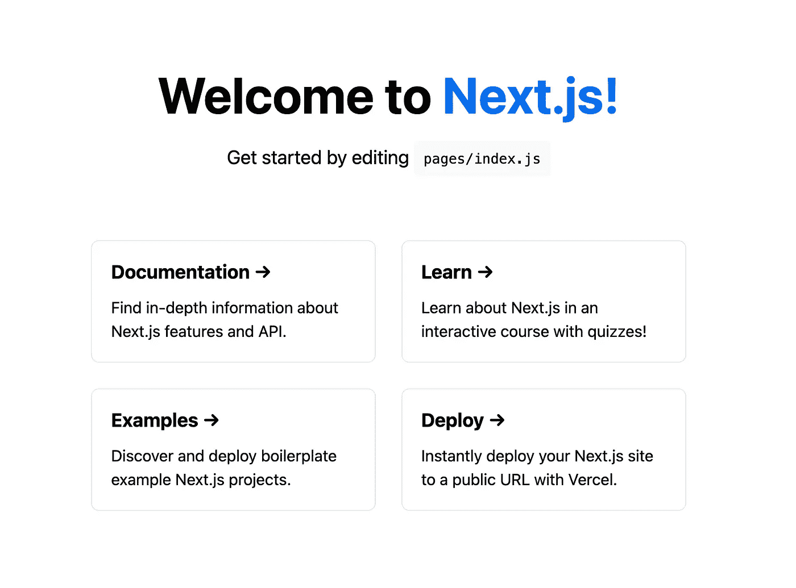
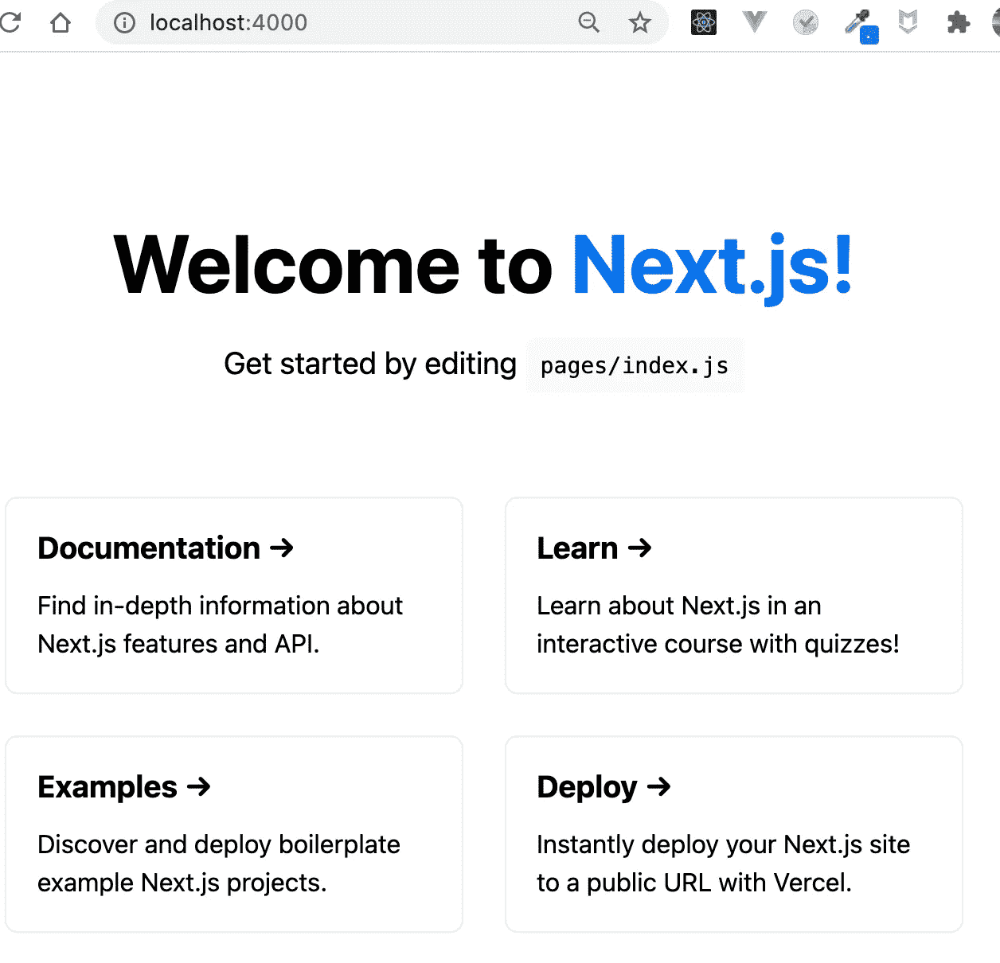
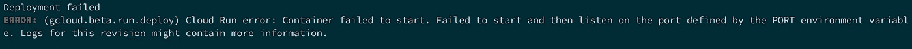

# 在 Google Cloud Run 上使用 Next.js 立即创建前台应用程序

> 原文：<https://itnext.io/create-a-front-app-immediately-with-next-js-on-google-cloud-run-d0cfde795ce3?source=collection_archive---------1----------------------->



当你创建一个原型时，速度和金钱是非常重要的。你需要以低成本尽快展示给用户。

js 是一个流行的前端框架，它使用简单的 lambda api 进行静态生成和服务器端渲染。因为它很容易设置，但仍然非常灵活，它是前端原型的最佳候选之一。

另一方面，Google Cloud Run 是一个无服务器的容器平台。因为它是无服务器的，你不需要维护基础设施，而且一开始就很便宜。如果您的应用程序是 dockernized 化的，您可能会获得低成本的高效开发体验。

所以这篇文章解释了 Google Cloud Run 上 Next.js app 的闪电般快速设置。它包括以下 3 个步骤。

1.  创建 Next.js 应用程序
2.  Dockernize Next.js 应用程序
3.  部署到 Google 云运行

# 开始前你需要什么

*   [Docker 桌面](https://docs.docker.com/docker-for-mac/install/)
*   [谷歌云账号](https://console.cloud.google.com/):请创建一个项目
*   [谷歌云 SDK](https://cloud.google.com/sdk/docs/install)

# 创建 Next.js 应用程序

创建 Next.js 应用程序最简单的方法是使用`create-next-app`。cli 会为您进行初始设置。

```
// with yarn
$ yarn create next-app// with npm
$ npx create-next-app
```

说完了，我们先来检查一下应用。

```
$ cd <your app name>
$ yarn dev
```

可以在`localhost:3000`看到 Next.js 的 Hello World 如下图。



Next.js 主页

# Dockernize Nextjs 应用程序

因为云运行是 docker 平台，所以你的应用必须 docker 化。要注册您的 Next.js 应用程序，请遵循以下 3 个步骤。

1.  创造`Dockerfile`
2.  创建`.dockerignore`
3.  配置端口设置

## 1.创造`Dockerfile`

还有像`node:15.0.1`这样的 base docker 镜像，但是对于你的应用来说还不够。它缺少你自己的包，设置等等。这就是`Dockerfile`进来的原因。您应该编写一些进程来将自定义设置包含到 docker 映像中。

```
$ touch Dockerfile
```

`Dockerfile`可能会像下面这样。请选择适合您的不同节点版本(最好使用与本地版本相同的版本)。

```
// base image
FROM node:15.2.1-alpine// working directory
WORKDIR /app// add binaries to $PATH
ENV PATH /app/node_modules/.bin:$PATH// install and cache app dependencies
COPY package.json /app/
COPY yarn.lock /app/
RUN yarn install// copy app files and build
COPY . /app
RUN yarn build# start app
CMD [ "yarn", "start" ]
```

## 2.创造。dockerignore

为了使你的 DX 更好，docker 镜像必须尽可能的小，因为这样可以减少构建时间。要让 docker 形象苗条，请打造`.dockerignore`。它从 docker 映像中删除不必要的文件。

```
$ touch .dockerignore
```

`.dockerignore`可能会像下面这样。不得包含 node_modules，因为 npm 软件包将在您构建 docker 映像时安装。

```
node_modules
yarn-error.logDockerfile
.dockerignore.git
.gitignore
```

因此，让我们建立 docker 图像来检查设置。

```
// docker build <PATH> -t <REPO_NAME>:<TAG>$ docker build . -t next-app:latest
```

创建后，您可以通过 docker images 命令检查它。

```
$ docker imagesREPOSITORY  TAG     IMAGE ID       CREATED             SIZE
next-app    latest  f834c5ae4f9a   6 minutes ago       117MB
```

## 3.配置端口设置

您自己的 docker 映像已经创建，您需要通过运行应用程序来检查您的 docker 映像是否良好。

```
$ docker run -p4000:3000 next-appyarn run v1.22.5
$ next start
ready - started server on [http://localhost:3000](http://localhost:3000)
```

`-p`选项是关于端口转发的。浏览器请求接受端口号`4000`并转发给`3000`。因为 Next.js 默认端口设置是`3000`，转发的请求到达 Next.js app。所以如果你在浏览器中打开`localhost:4000`，



本地主机:4000

看起来非常好🎉

然而，因为 Google Cloud Run 要求应用程序在通过`PORT`环境变量给定的特定端口上运行，所以您的启动脚本必须接受端口设置。如果没有端口设置，当您将映像部署到 Google Cloud Run 时，会出现如下错误。



所以请打开`package.json`编辑启动脚本。

```
{
  ...
  "scripts": {
    "dev": "next dev",
    "build": "next build",
    "start": "next start -p $PORT"  // accept $PORT here
  },
  ...
}
```

所以现在，启动脚本接受`PORT`环境变量。因为`PORT`是 Google Cloud Run 注入的，所以这个应用在 Google Cloud Run 中运行良好。另一方面，你要小心当地的环境。

例如，如果您想通过`yarn start`运行生产构建 Next.js 应用程序，您需要传递环境变量。

```
$ PORT=8080 yarn start
```

如果你想运行本地 docker 机器，你的运行命令应该像下面这样。

```
$ docker run -e PORT=8080 -p 4000:8080 next-app
```

它通过`-e`选项传递环境变量。浏览器请求接受`4000`并转发给`8080`并在`8080`中启动 Next.js app。

# 部署到 Google 云运行

因为你已经做了 Next.js app 的 dockernization，是时候部署了！

要部署云运行应用程序，有以下 3 个步骤。

1.  创建不同的名称空间 docker 图像标记
2.  将 docker 图像推送到 Google 容器注册表(GCR)
3.  将推送的映像部署到云运行

在继续之前，请启用`Cloud Run API`、`Container Registry API`、`Cloud Deployment Manager V2 API`的 Google Cloud API 使用 cli。

## 1.创建不同的名称空间 docker 图像标记

当您检查上面的 docker 映像时，您的 docker 映像的存储库是`next-app`。但是要部署到 Cloud Run，您的映像应该放在 GCR。这意味着你的图像必须存放在 GCR。所以还是先改库吧！

```
// docker tag <SOURCE_REPO_NAME> gcr.io/<GCP_PROJECT_NAME>/<GCR_REPO_NAME>:<GCR_TAG>$ docker tag next-app gcr.io/test-project/next-app:latest
```

现在你的图像可以像下面这样推送到 GCR 了。

```
$ docker imagesREPOSITORY  TAG  IMAGE ID  CREATED  SIZE
gcr.io/test-project/next-app:latest  2b51c1d11422  43 minutes ago  276MB
```

## 2.将 docker 图像推送到 Google 容器注册表(GCR)

因为 Google Cloud Run 会把你的 docker 镜像从 GCR 拉过来，所以你必须把你的 docker 镜像推送到 GCR。但是，如果您没有推送至 GCR，您将面临身份验证错误。所以请创建一个 gcloud 命令的`credHelper`来 docker 配置。

```
$ gcloud auth configure-docker
```

最后，让我们把你的码头工人形象推向 GCR。因为整个图像是通过互联网推送的，所以需要一些时间。

```
// docker push gcr.io/<GCP_PROJECT_NAME>/<GCR_REPO_NAME>:<GCR_TAG>$ docker push gcr.io/test-project/next-app:latest
The push refers to repository [gcr.io/test-project/next-app]
f01fa31cf258: Layer already exists
22ce882451cc: Layer already exists
970e4e2ffa6f: Layer already exists
65f238554c45: Layer already exists
053b1bdff0c1: Layer already exists
970feb8565a1: Layer already exists
78efe26eefc0: Layer already exists
1b2a921893cb: Layer already exists
92cab300fc69: Layer already exists
3e207b409db3: Layer already exists
latest: digest: sha256:5229e6386b3410a46d9771b8d863dd63ebeac620fe67c2c78f6cae67abd89bd1 size: 2413
~
```

如果你查看谷歌云控制台的 GCR，推送的图片会在那里。

## 3.将推送的映像部署到云运行

到目前为止，你已经在 GCR 注册了你自己的 docker 图片。因此，您只需使用映像部署云运行。

```
$ gcloud beta run deploy --image gcr.io/test-project/next-app:latest --project test-project --platform managed --region asia-northeast1 --allow-unauthenticatedService name (next-app):
Deploying container to Cloud Run service [next-app] in project [test-project] region [asia-northeast1]
✓ Deploying... Done.
  ✓ Creating Revision...
  ✓ Routing traffic...
  ✓ Setting IAM Policy...
Done.
Service [test-project] revision [test-project-00001-cej] has been deployed and is serving 100 percent of traffic.
Service URL: [https://next-app-5eabyjeviq-an.a.run.app](https://ham-media-liff-stg-5eabyjeviq-an.a.run.app)
```

`--platform`选项有三个值`managed`、`gke`和`kubernetes`。如果您更想要基础设施的灵活性，请选择`gke`和`kubernetes`。使用`--allow-unauthenticated`选项，可以对服务进行未经验证的访问。详情请看[官网](https://cloud.google.com/sdk/gcloud/reference/beta/run/deploy)。

因为您已经部署了服务，请转到服务 URL。可以看 Next.js hello world。


部署的服务

就是这样！最后，您完成了将 Next.js 应用程序部署到 Google Cloud Run。

# 技巧

每次部署时输入每个步骤非常耗时。所以我建议您创建如下所示的部署脚本。

```
// deploy.sh
#!/bin/bash
set -e// Image tag is the last commit hash
IMAGE_TAG=`git rev-parse HEAD`
REPO_NAME="Foo"
GCP_PROJECT_NAME="Bar"docker build . -t $REPO_NAME:$IMAGE_TAGdocker tag $REPO_NAME gcr.io/$GCP_PROJECT_NAME/$REPO_NAME:$IMAGE_TAGdocker push gcr.io/$GCP_PROJECT_NAME/$REPO_NAME:$IMAGE_TAGgcloud beta run deploy $REPO_NAME --image gcr.io/$GCP_PROJECT_NAME/$REPO_NAME:$IMAGE_TAG \
  --project $GCP_PROJECT_NAME \
  --platform managed \
  --region asia-northeast1 \
  --allow-unauthenticated
```

有了这个脚本，您只需要做的是

```
sh deploy.sh
```

嘣！自动进行构建和部署！

这篇文章解释了 Google Cloud Run 上 Next.js 应用程序的快速设置。因为你完成了基础设施，你可以从现在开始专注于应用程序代码！尽情享受吧！

# 参考文献

*   [Next.js](https://nextjs.org/)
*   [谷歌云](https://cloud.google.com/)