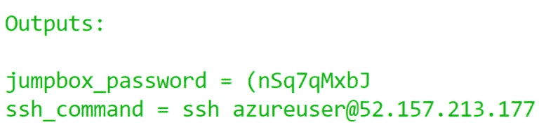
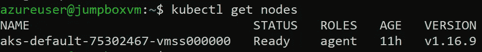
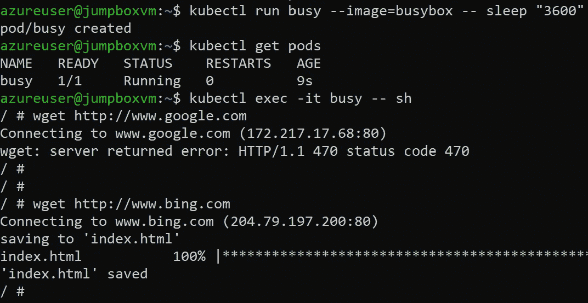

# 使用 Terraform 创建“完全私有”的 AKS 基础架构

> 原文：<https://itnext.io/create-a-fully-private-aks-infrastructure-with-terraform-e92358f0bf65?source=collection_archive---------0----------------------->


基础设施来自 https://medium . com/@ Dennis zielke/full-private-aks-clusters-without-any-public-IPS-finally-7f 5688411184

在 Azure 中，你可以[创建一个**私有** AKS 集群](https://docs.microsoft.com/en-us/azure/aks/private-clusters)，其中节点池和 API 服务器之间的流量不会离开私有网络。但是，通常，仅使节点和控制平面之间的通信私有并不足以满足您的安全需求。在*完全*私有集群中，你也不想暴露和使用公共 IP。

本文详细描述了这种架构:

[](https://medium.com/@denniszielke/fully-private-aks-clusters-without-any-public-ips-finally-7f5688411184) [## 完全私有的 AKS 群集—没有任何公共 IP—终于实现了！

### 在我上一篇关于利用 azure 防火墙的文章发表一年后，我想重温一下这个场景，因为我们刚刚推出了…

medium.com](https://medium.com/@denniszielke/fully-private-aks-clusters-without-any-public-ips-finally-7f5688411184) 

在这里，我将描述 Terraform 脚本，它将像上面的帖子一样管理确切的基础设施。我只是偶尔解释一下为什么我们需要不同的 Azure 资源，所以你可能想先看看 Dennis 的文章。

我发现这个项目也是实践不同地形特征的一个很好的例子:

*   将项目组织成模块
*   定义 terraform 和提供商版本
*   类型约束
*   each 和 for_each 表达式
*   功能
*   定义显式依赖关系
*   甚至使用置备程序！

源代码可以在这个资源库中找到:[https://github.com/patuzov/terraform-private-aks](https://github.com/patuzov/terraform-private-aks)

# 资源组

中心网络和分支网络将有两个独立的资源组。因此，在这里，它们位于 *main.tf、*以及 *terraform* 和 *provider* 块中。

*注意，从版本 2.5 开始，我们将需要 azurerm provider，因为这是为 AKS 群集资源引入****outbound _ type****参数的时候。*

```
terraform init
terraform apply
```

…我们可以在 Azure 门户中看到我们的两个资源组。

# 建立工作关系网

## 虚拟网络，子网

至于网络，我们将需要一个 VNET 和一个或多个子网:中心和分支。这是使用**地形模块**的好机会。使用模块，您可以隐藏复杂性，最重要的是，在 Terraform 中重用代码。

我们将创建一个*模块*文件夹和一个 *vnet* 文件夹，其中包含一个模块的所有常用文件: *main.tf、variables.tf、outputs.tf.*

虚拟网络资源没有什么稀奇的。只需设置通过输入变量提供的值:

现在，我们可能想要在这个 vnet 中创建一个子网列表，并且我们需要接收每个子网的以下输入值:名称和 IP 地址范围。我们可以接收包含以下信息的对象列表作为输入:

…在我看来，这对于这个模块的*接口*是有意义的。

对于每个这样的对象，可以使用 [*for_each*](https://www.terraform.io/docs/configuration/resources.html#for_each-multiple-resource-instances-defined-by-a-map-or-set-of-strings) 表达式创建一个子网资源。但是这个表达式要么需要一个字符串列表，要么需要一个映射。所以我们必须将我们的对象列表转换成一张地图。*为*表达救场:

表达式的*将创建一个映射，将 *subnet.name* 作为关键字，将*subnet . address _ prefixes*作为相应的值。对于每个这样的键/值对，将创建一个 *azurerm_subnet* 资源。*

在本模块中，我们需要虚拟网络和子网 id。我们在 *outputs.tf* 中对此进行了定义。使用同样的*技术*和 *for* 表达式来获取子网 id 作为映射:

最后，我们在我们的 main.tf 中使用这个模块:

您需要再次运行`terraform init`来初始化新模块。之后，您可以*应用*，VNETs 也在门户中，在相应的资源组下。

## 凝视

现在我们需要对等虚拟网络。 *azurerm* 提供者拥有*azure RM _ virtual _ network _ peering*资源。但是，由于对等必须双向进行，最好将其抽象到一个新的模块中。

下面是这个非常简单的模块的 *main.tf* 代码:

我们是这样使用它的:

请注意我们如何使用一个模块的输出作为另一个模块的输入。

不要忘记`terraform init`，以便初始化新模块。

如果应用此配置，您将在两个虚拟网络下看到*peering*设置。

## 防火墙

Azure 防火墙将需要一个公共 IP，我们还将为 AKS 需要的所有*外部访问*配置例外，以便正常运行(如获取映像或操作系统更新)。那么为什么不把它全部隐藏到另一个模块中呢？

这里是公共 IP 的代码，防火墙本身和一个网络规则的例子，用于 *aks 基础*(定义了更多的规则集合——参见 [git repo](https://github.com/patuzov/terraform-private-aks/blob/master/modules/firewall/main.tf) ) *:*

现在我们可以使用该模块:

*注意我们如何从网络模块的输出中获得 Azure 防火墙子网 ID。*

## 路由表

最后，我们将创建一个用户定义的路由，强制所有流量(0.0.0.0/0)从 AKS 子网流向防火墙(具体来说，流向其私有 IP)。为此，我们需要创建包含相应路由的路由表，并将其关联到 AKS 子网。是的，我们将为此创建一个新模块:

并使用该模块:

# 问

我们终于准备好定义 AKS 集群了！

这里有两件重要的事情需要提及:

*   启用实际私有 AKS 集群功能:`private_cluster_enabled = true`。这也将创建一个*私有 DNS 区域*资源，它将有一个 *A 记录*指向 API 的**私有** IP 地址，允许来自 AKS VNET(分支)的*每个人*解析控制平面的地址。
*   将*出站类型*设置为*用户定义路由*，这将阻止为集群的出口流量创建公共 IP，并使用“用户定义的”路由表:`outbound_type = "userDefinedRouting"`。

还有，你注意到`depends_on`的争论了吗？Terraform 可以识别资源是否依赖于另一个资源。例如，为了在“aks-subnet”子网中部署这个 AKS 集群，Terraform 知道它必须首先创建 vnet 和子网。这些是*隐式*依赖关系。如果 Terraform 没有*看到资源之间的*依赖关系，它会【幸运地】并行创建它们。

但是在我们的例子中，当我们设置了*userdefinerouting*出站类型时，AKS 将期望有一个与其子网相关联的路由表，所以它实际上依赖于路由表资源。我们可以通过*用`depends_on`参数显式地*定义它，让 Terraform 知道这个依赖关系。

此外，由于仍有[未解决的问题](https://github.com/Azure/AKS/issues/1557)，我们需要通过定义 *azure 角色分配，允许创建的服务 Prcinipal(通过托管身份)编辑来自 *vnet* 资源组的路由表中的用户定义的路由。*

我们完事了。我们现在有一个 AKS 集群，其中的 API 没有公共端点，只通过 Azure Backbone 与节点通信。该集群也不会暴露和使用任何公共 IP(除了我们允许的那些)。

# 跳箱

问题是，由于控制平面不公开任何公共端点，你将无法管理你的集群，比如说，从你的本地机器上使用 kubectl，或者甚至从 Azure DevOps 管道(如果你使用微软托管的代理)使用[。](https://docs.microsoft.com/en-us/azure/aks/private-clusters#limitations)

还记得上一步中的*私有 DNS 区域*吗？只有辐条 VNET 可以解析 API。但是我们也可以连接其他虚拟网络。因此，让我们在 Hub VNET 创建一个(Linux)虚拟机，在其上安装 kubectl，并在私有 DNS 区域中链接 VNET。

毫无疑问:我将*把这一切隐藏在一个单独的模块中。*

我将跳过公共 ip、网络安全组等的所有声明。你可以在 *jumpbox* 模块下的 [github repo 中找到它们。以下是最重要的事情:](https://github.com/patuzov/terraform-private-aks/tree/master/modules/jumpbox)

在这个演示中，我将为虚拟机管理员创建一个随机密码(使用 Terraform 的 *random_string* 资源),并在 terraform 输出中显示它，这样我就可以稍后通过 ssh 访问虚拟机。

您可能注意到了 VM 资源中的一个块，这是 Terraform 中的一个*禁忌*:[**remote-exec provisioner**](https://www.terraform.io/docs/provisioners/index.html)。Terraform 提供了它们，并恳请您不要使用它们。但是，在这种情况下，它完全符合！我们启动这个虚拟机只是为了测试我们可以从我们的私有网络用 kubectl 连接到控制平面。而且，由于不愿意手动安装，我将让 provisioner 在创建 VM 时自动安装 kubectl 和 azure cli。

如前所述，我们还需要将集线器 VNET 链接到专用 DNS 区域(由 AKS 集群自动创建)。我们可以使用*azure RM _ private _ DNS _ zone _ virtual _ network _ link*资源轻松实现这一点。

在本模块中，我们需要以下信息:

要使用这个模块，我们面临一个挑战:获取专用 DNS 区域的名称。它是在创建私有 AKS 集群时由 Azure 自动生成的(它不是由 Terraform 直接维护的),它甚至包含一个 GUID:

*9 C3 df 69 f-b281–42ef-9996–89941 b 484906 . private link . westeurope . azmk 8s . io*

幸运的是，它不是随机的。如果您查看 API 的私有 FQDN，您会看到:

*私人-aks-7b099028。****9 C3 df 69 f-b281–42ef-9996–89941 b 484906 . private link . westeurope . azmk 8s . io***

这些信息被 Terraform 所知。我们只需要从中提取专用 DNS 区域的名称，使用各种 Terraform 函数: *join，slice，split* 和 *length:*

```
**join**(“.”, **slice**(**split**(“.”, azurerm_kubernetes_cluster.privateaks.private_fqdn), 1, **length**(split(“.”, azurerm_kubernetes_cluster.privateaks.private_fqdn))))
```

模块的使用方法如下:

最后，我们想要定义我们的输出:

应用整个配置后，我们得到如下输出:



地形输出

现在我们可以 ssh 到已经安装了 kubectl 和 azure cli 的 Linux VM。剩下的就是[向 Azure](https://docs.microsoft.com/en-us/cli/azure/authenticate-azure-cli?view=azure-cli-latest#sign-in-interactively) 认证，[获取 kubectl](https://docs.microsoft.com/en-us/cli/azure/aks?view=azure-cli-latest#az-aks-get-credentials) 的配置，然后我们可以连接到 API:



在私有 AKS 集群中使用 kubectl

来自 pod 的流量将被重定向到 Azure 防火墙，并将应用相应的规则。让我们检查一下。

在*防火墙*模块中，定义了一个*测试*规则，它将允许*bing.com*的流量:

让我们创建一个 pod，并尝试从它的容器发出几个请求:



从容器发出外部 http 请求

这正是我们想要实现的:外部流量被阻止，除非我们有明确的规则允许它。