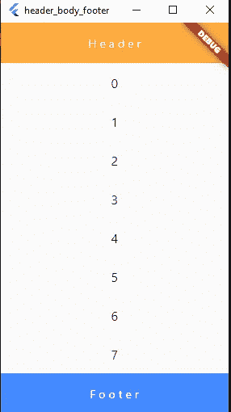
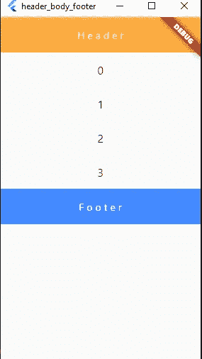
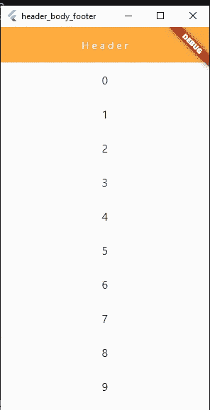
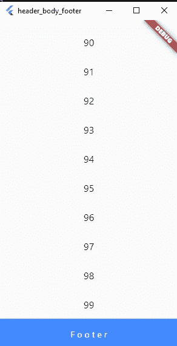

# 在 Flutter 中创建一个带有可滚动主体视图的粘性页脚

> 原文：<https://itnext.io/create-a-header-footer-with-scrollable-body-view-in-flutter-5551087270de?source=collection_archive---------0----------------------->

创建一个包含页眉和页脚的小部件，页脚显然应该留在屏幕的最后

那又怎样？

你会简单地说，我将在我的身体上使用扩展的小部件，所以它将占用所有的空间，并在顶部和底部留下一些页眉和页脚，所以你提供什么！。

但是如果主体是可滚动的(例如:listview)你肯定知道你不能在可滚动的小部件上使用扩展的小部件。

如果你的列表中总是有一些项目会把你的页脚往下推，那你就没有问题了，

但如果不是呢？

列表中没有足够的项目来向下推动页脚

别忘了你的列表是**可滚动的**

为了在 flutter 中创建一个粘性页脚，我们将使用细长条，

> 长条是可滚动区域的一部分，您可以将其定义为以特殊方式运行。您可以使用细长条来实现自定义滚动效果，如弹性滚动。
> 
> 【https://flutter.dev/docs/development/ui/advanced/slivers 

我们将从使用一个**自定义滚动条**开始，它与我们的 slivers 一起工作，第一个孩子将是**sliverslist**，它将包含标题和主体。

> 请注意，您必须在列表中使用 **shrinkWrap:true** ，这样您就可以强制您的列表只在需要时占用空间。

我们的 **CustomScroll** 的第二个子对象是 **SliverFillRemaining** 顾名思义，我们将把页脚放在这里，并使其成为剩余空间的底部。

请注意，**sliverfillriming**的默认行为是为它的子节点创建一个可滚动的主体，不要忘记更改这一点。

结果:

你总是可以用更强大的小部件替换这个标题，用替换 **SliverAppBar** 更花哨的选项，比如浮动、捕捉、钉住..

参见:

[https://API . flutter . dev/flutter/material/SliverAppBar-class . html](https://api.flutter.dev/flutter/material/SliverAppBar-class.html)

完整示例:

 [## obadajasm/页眉-正文-页脚-示例

### 在 GitHub 上创建一个帐户，为 obadajasm/Header-Body-Footer-example 开发做出贡献。

github.com](https://github.com/obadajasm/Header-Body-Footer-example/blob/master/lib/home_page.dart)