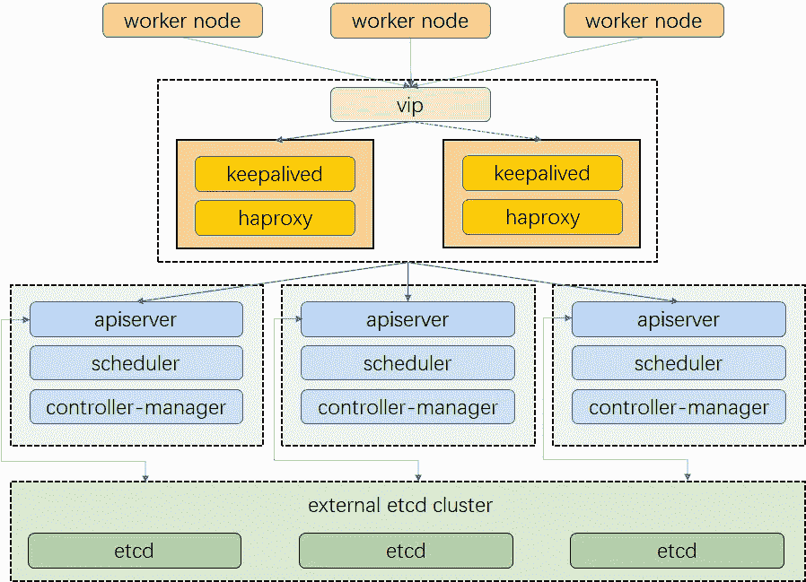
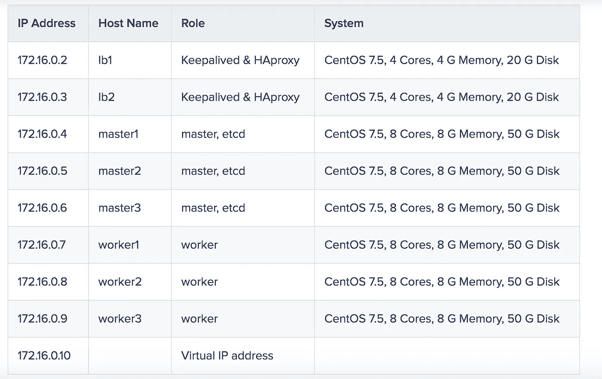

# 使用 Keepalived 和 HAproxy 创建高度可用的 Kubernetes 集群

> 原文：<https://itnext.io/create-a-highly-available-kubernetes-cluster-using-keepalived-and-haproxy-37769d0a65ba?source=collection_archive---------1----------------------->

一个高度可用的 Kubernetes 集群确保您的应用运行时不会出现生产所需的中断。在这方面，有很多方法可供您选择，以实现高可用性。例如，如果您的集群部署在云上(例如 Google Cloud 和 AWS)，您可以直接在这些平台上创建负载平衡器。同时，Keepalived、HAproxy、NGINX 也是你实现负载均衡的可能替代方案。

在本文中，我将使用 Keepalived 和 HAproxy 进行负载平衡，并实现高可用性。这些步骤如下所示:

1.  准备主机。
2.  配置 Keepalived 和 HAproxy。
3.  使用 KubeKey 建立一个 Kubernetes 集群。

# 集群架构

在我的集群中，我将设置三个主节点、三个工作节点、两个用于负载平衡的节点和一个虚拟 IP 地址。本例中的虚拟 IP 地址也可以称为“浮动 IP 地址”。这意味着在发生节点故障时，IP 地址可以在节点之间传递，从而实现故障转移，从而实现高可用性。



注意，在我的集群中，我不会在任何主节点上安装 Keepalived 和 HAproxy。诚然，您可以这样做，也可以实现高可用性。也就是说，我想尝试一种不同的方式，通过配置两个特定的节点来实现负载平衡(您可以根据需要添加更多这种节点)。只有 Keepalived 和 HAproxy 将被安装在这两个节点上，以避免与任何 Kubernetes 组件和服务的任何潜在冲突。

# 主机信息

以下是我的集群中每个节点的详细信息，供您参考:



关于节点、网络和依赖性需求的更多信息，[参见我以前的一篇文章](https://kubesphere.io/blogs/install-kubernetes-using-kubekey/#node-requirements)。

# 配置负载平衡

[Keepalived](https://www.keepalived.org/) 提供了 VRPP 实现，并允许您配置 Linux 机器进行负载平衡，防止单点故障。 [HAProxy](https://www.haproxy.org/) ，提供可靠、高性能的负载平衡，与 Keepalived 完美配合。

我上面说过，我会在`lb1`和`lb2`上同时安装 Keepalived 和 HAproxy。逻辑非常简单:如果其中一个节点出现故障，虚拟 IP 地址(即浮动 IP 地址)将自动与另一个节点相关联，以便集群仍然正常工作，从而实现高可用性。如果您愿意，您可以添加更多的节点，并为此安装 Keepalived 和 HAproxy。

运行以下命令，首先安装 Keepalived 和 HAproxy。

```
yum install keepalived haproxy psmisc -y
```

# HAproxy

1.  HAproxy 的配置在两台机器上完全相同，用于负载均衡。运行以下命令来配置 HAproxy。

`vi /etc/haproxy/haproxy.cfg`

2.下面是我的配置供你参考(注意`server`字段。注意`6443`是`apiserver`港):

```
global
    log /dev/log  local0 warning
    chroot      /var/lib/haproxy
    pidfile     /var/run/haproxy.pid
    maxconn     4000
    user        haproxy
    group       haproxy
    daemon

   stats socket /var/lib/haproxy/stats

defaults
  log global
  option  httplog
  option  dontlognull
        timeout connect 5000
        timeout client 50000
        timeout server 50000

frontend kube-apiserver
  bind *:6443
  mode tcp
  option tcplog
  default_backend kube-apiserver

backend kube-apiserver
    mode tcp
    option tcplog
    option tcp-check
    balance roundrobin
    default-server inter 10s downinter 5s rise 2 fall 2 slowstart 60s maxconn 250 maxqueue 256 weight 100
    server kube-apiserver-1 172.16.0.4:6443 check # Replace the IP address with your own.
    server kube-apiserver-2 172.16.0.5:6443 check # Replace the IP address with your own.
    server kube-apiserver-3 172.16.0.6:6443 check # Replace the IP address with your own.
```

3.保存文件并运行以下命令来重启 HAproxy。

`systemctl restart haproxy`

4.使其在重新启动后保持不变:

`systemctl enable haproxy`

5.确保在另一台机器上也配置了 ha proxy(`lb2`)。

# 保持存活

Keepalived 必须安装在两台计算机上，尽管它们的配置略有不同。

1.  运行以下命令来配置 Keepalived。

`vi /etc/keepalived/keepalived.conf`

2.下面是我的配置(`lb1`)供你参考:

```
global_defs {
  notification_email {
  }
  router_id LVS_DEVEL
  vrrp_skip_check_adv_addr
  vrrp_garp_interval 0
  vrrp_gna_interval 0
}

vrrp_script chk_haproxy {
  script "killall -0 haproxy"
  interval 2
  weight 2
}

vrrp_instance haproxy-vip {
  state BACKUP
  priority 100
  interface eth0                       # Network card
  virtual_router_id 60
  advert_int 1
  authentication {
    auth_type PASS
    auth_pass 1111
  }
  unicast_src_ip 172.16.0.2      # The IP address of this machine
  unicast_peer {
    172.16.0.3                         # The IP address of peer machines
  }

  virtual_ipaddress {
    172.16.0.10/24                  # The VIP address
  }

  track_script {
    chk_haproxy
  }
}
```

*注*

*   *对于* `*interface*` *字段，您必须提供自己的网卡信息。你可以在你的机器上运行* `*ifconfig*` *来得到这个值。*
*   *为* `*unicast_src_ip*` *提供的 IP 地址是您当前机器的 IP 地址。对于安装了 HAproxy 和 Keepalived 进行负载平衡的其他机器，必须在字段* `*unicast_peer*` *中输入它们的 IP 地址。*

3.保存文件并运行以下命令来重新启动 Keepalived。

`systemctl restart keepalived`

4.使其在重新启动后保持不变:

`systemctl enable haproxy`

5.确保您也在另一台机器(`lb2`)上配置了 Keepalived。

# 验证高可用性

在开始创建 Kubernetes 集群之前，确保您已经测试了高可用性。

1.  在机器`lb1`上，运行以下命令:

```
[root@lb1 ~]# ip a s
1: lo: <LOOPBACK,UP,LOWER_UP> mtu 65536 qdisc noqueue state UNKNOWN group default qlen 1000
    link/loopback 00:00:00:00:00:00 brd 00:00:00:00:00:00
    inet 127.0.0.1/8 scope host lo
       valid_lft forever preferred_lft forever
    inet6 ::1/128 scope host
       valid_lft forever preferred_lft forever
2: eth0: <BROADCAST,MULTICAST,UP,LOWER_UP> mtu 1500 qdisc mq state UP group default qlen 1000
    link/ether 52:54:9e:27:38:c8 brd ff:ff:ff:ff:ff:ff
    inet 172.16.0.2/24 brd 172.16.0.255 scope global noprefixroute dynamic eth0
       valid_lft 73334sec preferred_lft 73334sec
    inet 172.16.0.10/24 scope global secondary eth0 # The VIP address
       valid_lft forever preferred_lft forever
    inet6 fe80::510e:f96:98b2:af40/64 scope link noprefixroute
       valid_lft forever preferred_lft forever
```

2.正如您在上面看到的，虚拟 IP 地址已成功添加。模拟此节点上的故障:

`systemctl stop haproxy`

3.再次检查浮动 IP 地址，您可以看到它在`lb1`消失。

```
[root@lb1 ~]# ip a s
1: lo: <LOOPBACK,UP,LOWER_UP> mtu 65536 qdisc noqueue state UNKNOWN group default qlen 1000
    link/loopback 00:00:00:00:00:00 brd 00:00:00:00:00:00
    inet 127.0.0.1/8 scope host lo
       valid_lft forever preferred_lft forever
    inet6 ::1/128 scope host
       valid_lft forever preferred_lft forever
2: eth0: <BROADCAST,MULTICAST,UP,LOWER_UP> mtu 1500 qdisc mq state UP group default qlen 1000
    link/ether 52:54:9e:27:38:c8 brd ff:ff:ff:ff:ff:ff
    inet 172.16.0.2/24 brd 172.16.0.255 scope global noprefixroute dynamic eth0
       valid_lft 72802sec preferred_lft 72802sec
    inet6 fe80::510e:f96:98b2:af40/64 scope link noprefixroute
       valid_lft forever preferred_lft forever
```

4.理论上，如果配置成功，虚拟 IP 将故障转移到另一台机器(`lb2`)。在`lb2`上，运行以下命令，这是预期的输出:

```
[root@lb2 ~]# ip a s
1: lo: <LOOPBACK,UP,LOWER_UP> mtu 65536 qdisc noqueue state UNKNOWN group default qlen 1000
    link/loopback 00:00:00:00:00:00 brd 00:00:00:00:00:00
    inet 127.0.0.1/8 scope host lo
       valid_lft forever preferred_lft forever
    inet6 ::1/128 scope host
       valid_lft forever preferred_lft forever
2: eth0: <BROADCAST,MULTICAST,UP,LOWER_UP> mtu 1500 qdisc mq state UP group default qlen 1000
    link/ether 52:54:9e:3f:51:ba brd ff:ff:ff:ff:ff:ff
    inet 172.16.0.3/24 brd 172.16.0.255 scope global noprefixroute dynamic eth0
       valid_lft 72690sec preferred_lft 72690sec
    inet 172.16.0.10/24 scope global secondary eth0   # The VIP address
       valid_lft forever preferred_lft forever
    inet6 fe80::f67c:bd4f:d6d5:1d9b/64 scope link noprefixroute
       valid_lft forever preferred_lft forever
```

5.正如您在上面看到的，高可用性已成功配置。

# 使用 KubeKey 创建一个 Kubernetes 集群

[KubeKey](https://github.com/kubesphere/kubekey) 是一个创建 Kubernetes 集群的高效便捷的工具。如果您不熟悉 KubeKey，可以看看我以前的文章，关于使用 KubeKey 来[创建一个三节点集群](https://kubesphere.io/blogs/install-kubernetes-using-kubekey/)并扩展您的集群。

1.  从其 [GitHub 发布页面](https://github.com/kubesphere/kubekey/releases)下载 KubeKey，或者使用以下命令下载 KubeKey 版本 1.0.1。您只需将 KubeKey 下载到您的一台机器(如`master1`)上，作为**任务栏**进行安装。

`curl -sfL https://get-kk.kubesphere.io | VERSION=v1.0.1 sh -`

2.上面的命令下载 KubeKey 并解压文件。你的文件夹现在包含一个名为`kk`的文件。使其可执行:

`chmod +x kk`

3.创建一个配置文件来指定集群信息。我要安装的 Kubernetes 版本是`v1.17.9`。

`./kk create config --with-kubernetes v1.17.9`

4.将创建一个默认文件`config-sample.yaml`。编辑文件，以下是我的配置供您参考:

```
apiVersion: kubekey.kubesphere.io/v1alpha1
kind: Cluster
metadata:
  name: sample
spec:
  hosts:
  - {name: master1, address: 172.16.0.4, internalAddress: 172.16.0.4, user: root, password: Testing123}
  - {name: master2, address: 172.16.0.5, internalAddress: 172.16.0.5, user: root, password: Testing123}
  - {name: master3, address: 172.16.0.6, internalAddress: 172.16.0.6, user: root, password: Testing123}
  - {name: worker1, address: 172.16.0.7, internalAddress: 172.16.0.7, user: root, password: Testing123}
  - {name: worker2, address: 172.16.0.8, internalAddress: 172.16.0.8, user: root, password: Testing123}
  - {name: worker3, address: 172.16.0.9, internalAddress: 172.16.0.9, user: root, password: Testing123}
  roleGroups:
    etcd:
    - master1
    - master2
    - master3
    master:
    - master1
    - master2
    - master3
    worker:
    - worker1
    - worker2
    - worker3
  controlPlaneEndpoint:
    domain: lb.kubesphere.local
    address: 172.16.0.10   # The VIP address
    port: 6443
  kubernetes:
    version: v1.17.9
    imageRepo: kubesphere
    clusterName: cluster.local
  network:
    plugin: calico
    kubePodsCIDR: 10.233.64.0/18
    kubeServiceCIDR: 10.233.0.0/18
  registry:
    registryMirrors: []
    insecureRegistries: []
  addons: []
```

*注*

*   *用自己的 VIP 地址替换* `*controlPlaneEndpoint.address*` *的值。*
*   *关于这个配置文件中不同参数的更多信息，见* [*我之前的一篇博客*](https://kubesphere.io/blogs/install-kubernetes-using-kubekey/#install-kubernetes) *。*

5.保存文件并执行以下命令来创建集群:

`./kk create cluster -f config-sample.yaml`

6.安装完成后，您可以看到如下输出。

`Congratulations! Installation is successful.`

7.执行以下命令来检查名称空间的状态。

`kubectl get pod --all-namespaces`

```
NAMESPACE     NAME                  READY   STATUS    RESTARTS   AGE
kube-system   calico-kube
             -controllers
             -59d85c5c84-l7zp5      1/1     Running   0          42s
kube-system   calico-node-5d6gb     1/1     Running   0          21s
kube-system   calico-node-77bcj     1/1     Running   0          42s
kube-system   calico-node-bdzfp     1/1     Running   0          21s
kube-system   calico-node-ph756     1/1     Running   0          22s
kube-system   calico-node-phz7d     1/1     Running   0          22s
kube-system   calico-node-v7wnf     1/1     Running   0          22s
kube-system   coredns-74d59cc5c6
             -gdkmz                 1/1     Running   0          53s
kube-system   coredns-74d59cc5c6
             -j2lhc                 1/1     Running   0          53s
kube-system   kube-apiserver
             -master1               1/1     Running   0          48s
kube-system   kube-apiserver
             -master2               1/1     Running   0          19s
kube-system   kube-apiserver
             -master3               1/1     Running   0          19s
kube-system   kube-controller
             -manager-master1       1/1     Running   0          48s
kube-system   kube-controller
             -manager-master2       1/1     Running   0          19s
kube-system   kube-controller
             -manager-master3       1/1     Running   0          19s
kube-system   kube-proxy-29sfc      1/1     Running   0          21s
kube-system   kube-proxy-drzsc      1/1     Running   0          22s
kube-system   kube-proxy-lgwhd      1/1     Running   0          22s
kube-system   kube-proxy-npq6t      1/1     Running   0          21s
kube-system   kube-proxy-srlwx      1/1     Running   0          22s
kube-system   kube-proxy-vdtbk      1/1     Running   0          53s
kube-system   kube-scheduler
             -master1               1/1     Running   0          48s
kube-system   kube-scheduler
             -master2               1/1     Running   0          19s
kube-system   kube-scheduler
             -master3               1/1     Running   0          20s
kube-system   nodelocaldns
             -2chnt                 1/1     Running   0          22s
kube-system   nodelocaldns
             -2wszl                 1/1     Running   0          22s
kube-system   nodelocaldns-2xqlc    1/1     Running   0          21s
kube-system   nodelocaldns-92ksq    1/1     Running   0          53s
kube-system   nodelocaldns-cktmd    1/1     Running   0          22s
kube-system   nodelocaldns-skmlq    1/1     Running   0          21s
```

# 摘要

创建高度可用的 Kubernetes 集群不仅仅是业务应用程序无停机运行。它还涉及选择正确的工具，并使用它们以最优雅和高效的方式建立高可用性的集群。为什么不试试 Keepalived，HAproxy，KubeKey？也许他们会给你寻找已久的答案。

# 参考

KubeKey:一个用于 Kubernetes 和云本地插件的轻量级安装程序

[KubeKey GitHub 知识库](https://github.com/kubesphere/kubekey)