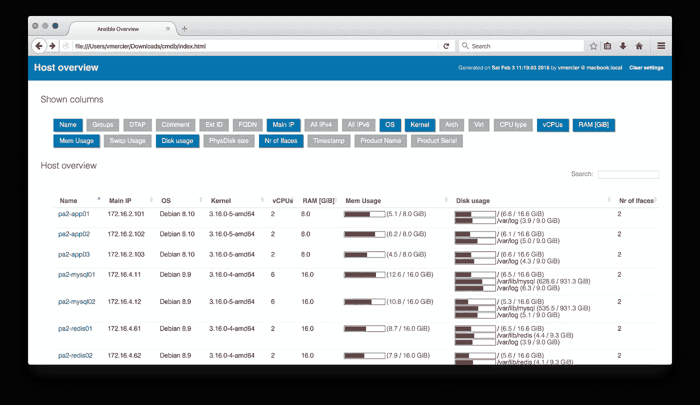
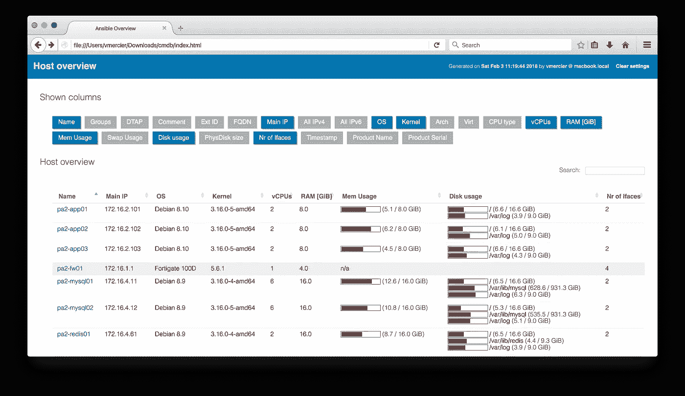

# 使用 Ansible 在一分钟内创建一个主机清单

> 原文：<https://itnext.io/create-a-host-inventory-in-a-minute-with-ansible-c7bf251166d9?source=collection_archive---------1----------------------->

我最近需要了解一个基础设施的概况:有多少台服务器？操作系统？硬件使用情况(CPU、RAM、磁盘等)？

[*点击这里在 LinkedIn* 上分享这篇文章](https://www.linkedin.com/cws/share?url=https%3A%2F%2Fitnext.io%2Fcreate-a-host-inventory-in-a-minute-with-ansible-c7bf251166d9)

不幸的是，该公司没有任何最新的主机库存或集中管理。有必要从每个虚拟机管理程序获取服务器信息，并使用云提供商提供的服务器来完成列表。

我用 Ansible 和 Ferry Boender 编写的令人敬畏的 [ansible-cmdb](https://github.com/fboender/ansible-cmdb) 模块完成了这项工作，而不是开始一个冗长的清单或监控项目。

> 在技术方面，ansible-cmdb 是对 ansible 事实信息的巧妙使用。它知道如何以非常方便格式呈现它。

好消息是我们不需要在服务器上安装任何程序，一切都将由 Ansible 和 ansible-cmd 在本地完成。


第一步是创建一个 Ansible 清单，这部分非常简单，因为我们只需要编写一个主机清单(每行一个)。库存不需要组。

```
vim hostspa2-app01
pa2-app02
pa2-app03
pa2-mysql01
[...]
```

> Ansible 安装模块通常用于[调试](http://docs.ansible.com/ansible/latest/faq.html#how-do-i-see-a-list-of-all-of-the-ansible-variables)，因为它显示所有主机信息。当启用事实缓存或使用 CLI 中的“树”选项时，事实会保存在磁盘上。

执行以下命令，收集“ *hosts* ”文件中列出的所有服务器的信息，并将其保存到“ *out* 目录中。

```
ansible -i hosts -m setup --tree out/ all
```

目录" *out* "现在已创建，包含清单中每台服务器的文件。

```
$ ls out/pa2-app01 pa2-app02 pa2-app03 pa2-mysql01 pa2-mysql02 pa2-redis01
[...]
```

现在我们需要安装 ansible-cmdb，我们使用的是 python 安装程序。显然，主要的 linux 发行版都有可用的包。

```
pip install ansible-cmdb
```

然后，我们使用 ansible-cmdb 通过指定主机事实目录来生成清单:

```
ansible-cmdb -t html_fancy_split -p local_js=1 out/open cmdb/index.html
```

默认情况下，所有信息(服务器列表和所有服务器信息)都显示在同一个页面上，如果有很多服务器和列，渲染可能会有点慢。

选项“ *-t html_fancy_split* ”指定一个内置模板，其中服务器信息被分隔在几个文件中，“ *-p local_js=1* ”将 javascript 存储在 html 中(有助于离线使用)。



库存主页

还可以将主机清单导出为 CSV 或 SQL 等其他格式。

```
ansible-cmdb -t csv out > overview.csv
```

因为 ansible-cmd 使用 ansible 事实，所以可以通过手动添加事实，将清单扩展到 Ansible 无法获取的设备，如网络设备或存储系统。

```
mkdir out_manual
```

我们必须用最小的可解析主机事实结构来声明每个设备:

```
vim out_manual/pa2-fw01{
  "groups": [
  ],
  "ansible_facts": {
    "ansible_default_ipv4": {
      "address": "172.16.1.1"
    }, 
    "ansible_all_ipv4_addresses": [
      "172.16.1.1",
      "172.16.2.1",
      "172.16.3.1",
      "172.16.4.1"
    ], 
    "ansible_interfaces": [
        "port1", 
        "port2", 
        "port3", 
        "port4"
    ], 
    "ansible_hostname": "pa2-fw01", 
    "ansible_nodename": "pa2-fw01", 
    "ansible_system_vendor": "Fortinet", 
    "ansible_distribution": "Fortigate", 
    "ansible_distribution_version": "100D", 
    "ansible_system": "FortiOS", 
    "ansible_kernel": "5.6.1", 
    "ansible_product_name": "100D", 
    "ansible_product_serial": "FGT-602803031004", 
    "ansible_memtotal_mb": 4096, 
    "ansible_processor_cores": 1
  }, 
  "changed": false
}
```

然后，我们重新生成主机清单，包括手动事实目录:

```
ansible-cmdb -t html_fancy_split out/ out_manual/open cmdb/index.html
```



Pro tips:如果您已经使用 Ansible 来管理您的基础设施，您可以只在 Ansible 服务器上启用事实缓存，并在 CRON 作业中执行 ansible-cmd 来保持您的库存是最新的:)

更多信息和参考资料:

*   [Ansible-cmd Github 页面](https://github.com/fboender/ansible-cmdb)
*   [可变设置模块](http://docs.ansible.com/ansible/latest/setup_module.html)