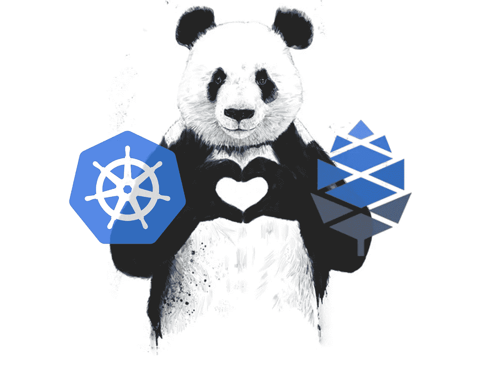
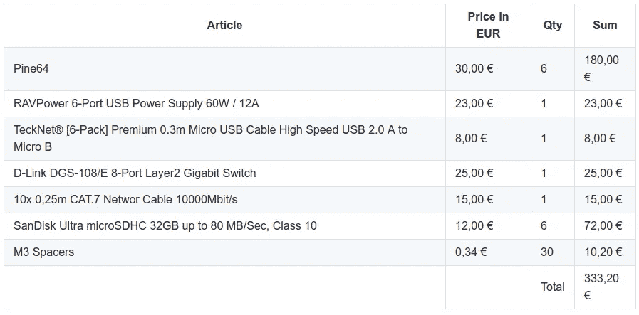
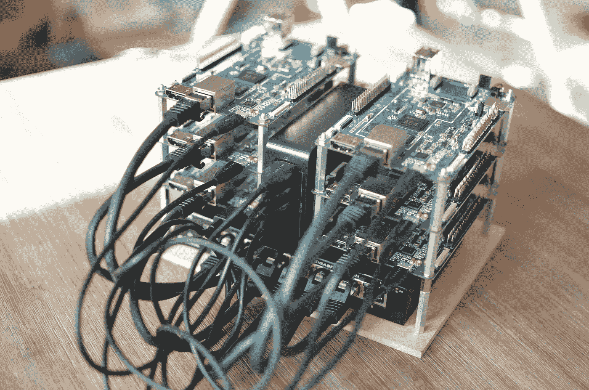
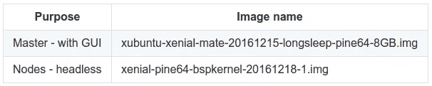

# 用 6 个 Pine64s 构建您自己的 Kubernetes 集群，价格不到 400€

> 原文：<https://itnext.io/create-a-kubernetes-cluster-with-pine64-428fc62d72e7?source=collection_archive---------4----------------------->



# 摘要

当你可以只使用`Google Cloud`、`Amazon Web Services`或`Microsoft Azure`时，为什么有人要用六个 Pine64 建造一个`Kubernetes (k8s) cluster`？

当然，答案不是我想创建一个集群作为生产集群使用。更好的想法是创建一个相对便宜的集群来使用 k8s，并观察如果集群中的一个节点出现故障，k8s 会如何表现。我还想看看这个集群的性能如何。

但是说实话，我建造它是因为我想这样做:)

在本文中，我将向您展示，为什么我选择了 Pine64 作为计算引擎，我如何一步一步地构建它，以及我所面临的挑战。

# 购物单

## 计算引擎

首先，是的，当然，我们需要一个计算引擎。

当我在寻找一个合适的计算引擎时，我一直在寻找一个便宜的计算引擎，它有很多 64 位内核，有很多 RAM，快速的网络连接，不消耗太多能源，而且很小。是的，这是不存在的，但我能找到的最好的交易是一个`Pine64`。

`Pine64`和一个`Allwinner A64`一起运行，后者有一个`1.152 GHz 64-bit quad-core ARM Cortex-A53`和`2GB DDR3 Memory`，一个`1000Mbps Ethernet Port`和一个`133mm x 80mm x 19mm`大小，消耗`2.5 Watt`，所有这些都是为了`29$`。Pine64 没有内置 Wi-Fi 模块。如果你需要 Wi-Fi，你必须花 10 美元购买 Wi-Fi 802.11 BGN/蓝牙 4.0 模块。但我不需要这个。所以，听起来对我来说很公平。

另一个候选人是 RaspberryPI 3。最大的缺点是，“只有”1GB 内存(Pine64 有 2GB)，“只有”100Mbps 以太网端口(Pine64 有 1000Mbps)，Raspbian 只能在 32 位上运行。

海运是从中国来的，所以需要几个星期才能送到德国，我还得支付一些海关费用，但还是可以的。

## 其他东西

当然，购物清单不止于此。您还必须购买一个`Switch`、一个`USB Power Supply with min 2A per Pine64`和一个`SD Card`、`Micro B USB cable`、一个`CAT.7 Ethernet Cable`和`30mm M3 Spacer`来将所有的 Pine64 堆叠在一起。我觉得如果想省点空间的话 25mm 应该也可以。

我在亚马逊上买了所有东西，还从康拉德那里买了垫片。



# 互相支持



我觉得一张图描述了 1000 多个字；)

# 安装 Kubernetes

安装 k8s 集群有几个步骤。一个计算引擎将作为`Kubernetes Master`运行，其他的将作为`Kubernetes Nodes`运行，实际的容器将在这里运行。

我决定使用一个带有 GUI 的主操作系统，这样我们可以插入一个监视器，让 Kubernetes Dashboard 运行。如果你不需要这个，你可以跳过步骤“下载主”。

1.  `Download` `OS`为库伯内特`Master`和`Nodes`
2.  `Install`上的`OS`和`Master`上的`each Node`
3.  `Install`使用`kubeadm`打开`Master`和`Nodes`
4.  检查安装

## 步骤 1:为 Kubernetes 下载操作系统

> *下载脚本可以在这里找到:*[*https://github . com/rillerale/k8s/blob/master/1-k8s-Download . sh*](https://github.com/rilleralle/k8s/blob/master/1-k8s-download.sh)

**主人——徐本图的异性伴侣**

去[http://wiki.pine64.org/index.php/Pine_A64_Software_Release](http://wiki.pine64.org/index.php/Pine_A64_Software_Release#Ubuntu_Desktop_Image_.5B20161215.5D_built_by_Pine64)下载`DD image (for 8GB micoSD card and above)`直接从 pine64.org 下载。如果此链接不起作用，请访问 Pine64 网站。

**节点— Xenial 基础映像**

前往[http://wiki.pine64.org/index.php/Pine_A64_Software_Release](http://wiki.pine64.org/index.php/Pine_A64_Software_Release#Xenial_Base_Image_.5B20161218-1.5D_by_longsleep)下载`DD image (for 8GB micoSD card and above)`直接从 pine64.org 下载。`Please extract the compressed file`。如果此链接不起作用，请访问 Pine64 网站。

## 步骤 2:使用 Mac 在主节点和节点上安装操作系统

我不想在如何使用 Mac 在 SD 卡上安装映像的手册上获得任何学分。我刚复制了树莓派的声明。他们写了一个很棒的指南！可以在这里找到:
[https://www . raspberrypi . org/documentation/installation/installing-images/MAC . MD](https://www.raspberrypi.org/documentation/installation/installing-images/mac.md)。您还可以找到 Linux 或 Windows 的操作指南。

> *请小心使用* `*dd*` *工具。如果你选择了错误的磁盘，你可以破坏你的操作系统！*

打开所有 SD 卡的包装，插入计算机，在一个 SD 上安装带 GUI 的操作系统，在其他 SD 上安装无头版本。



> *Snippets 文件可以在这里找到:*[*https://github . com/rileralle/k8s/blob/master/2-k8s-writesd . txt*](https://github.com/rilleralle/k8s/blob/master/2-k8s-writeSD.txt)

我的 SD 卡位于 **disk2** 下

```
$ diskutil list/dev/disk2 (internal, physical):
#:TYPE NAME                 SIZE        IDENTIFIER
0:FDisk_partition_scheme    *31.9 GB    disk2  
1:Windows_FAT_32 BOOT       52.4 MB     disk2s1  
2:Linux                     31.8 GB     disk2s2$ diskutil unmountDisk /dev/disk2Unmount of all volumes on disk2 was successful$ sudo dd bs=1m if=xubuntu-xenial-mate-20161215-longsleep-pine64-8GB.img of=/dev/rdisk2Password:  
#Grab a coffee! It will take some time. I had to wait for 5 minutes.7392+0 records in  
7392+0 records out  
7751073792 bytes transferred in 290.547506 secs (26677475 bytes/sec)$ sudo diskutil eject /dev/rdisk2Password:  
Disk /dev/rdisk2 ejected
```

瞧，那是主人的 SD 卡。请对其他 SD 卡重复上述操作，并使用正确的图像`xenial-pine64-bspkernel-20161218-1.img`。

**配置**

这两个映像的凭据是

*   用户名:ubuntu
*   密码:ubuntu

**设置网络**

**更改主机名**

```
$hostnamectl set-hostname 'new-hostname'
```

要有创意！

**设置静态 ip 地址**

Kubernetes 需要主节点和节点的静态 ip 地址，因为如果 ip 地址在安装后改变，集群将无法工作。

您可以将静态 ip 地址绑定到接口。所有 pines 都通过交换机上的以太网连接，因此不需要网关。

在`/etc/network/interfaces`中增加以下几行:

```
$sudo vi /etc/network/interfacesauto eth0:0  
allow-hotplug eth0:0  
iface eth0:0 inet static  
    address 192.168.11.1
    netmask 255.255.255.0
```

你可以选择任何地址。我决定对主节点使用 192.168.11.1，对节点使用 192 . 168 . 11 . 2–6。

**禁用网络管理器**

NetworkManager 安装在 Ubuntu Mate 映像上，这可能会导致静态 ip 地址出现问题。禁用网络管理器。

```
$ sudo systemctl stop NetworkManager.service
$ sudo systemctl disable NetworkManager.service
```

检查是否可以从主服务器 ping 节点。

**禁用节点上的交换**

如果启用了 swap，则无法执行 kubeadm join。
在操作系统启动时禁用交换。将下面一行添加到/etc/rc.local 中的 exit 0 行之前。

```
$sudo vi /etc/rc.local
....
swapoff -aexit 0
```

重新启动服务器。

## 步骤 3:在每个 Pine 上安装 Kubernetes 64

Kubernetes 的人写了一个很棒的分步手册，教你如何用 kubeadm 安装 Kubernetes。如果你遵循我的教程，你需要做的就是执行下面的命令。如果有问题，请查看网站。k8s 发展这么快。[https://kubernetes . io/docs/setup/independent/install-kube ADM/](https://kubernetes.io/docs/setup/independent/install-kubeadm/)

> *请注意，以下命令来自 0。— 3.需要在* `*master*` *和* `*every node*` *上执行。*
> 
> 请从主节点开始，因为我们需要在主节点上安装一个 pod 网络，然后才能加入其他节点！
> 
> *安装脚本可以在这里找到:*[*https://github . com/rillerale/k8s/blob/master/3-k8s-install . sh*](https://github.com/rilleralle/k8s/blob/master/3-k8s-install.sh)

**0。SSH 到机器或插件键盘和显示器:**

**1。成为 root:**

```
sudo su -
```

**2。安装 docker:**

```
apt-get update  
apt-get install -y docker.io
```

**3。安装 kubelet、kubeadm、kubectl 和 kubernetes-cni:**

```
apt-get update && apt-get install -y apt-transport-https  
curl -s https://packages.cloud.google.com/apt/doc/apt-key.gpg | apt-key add -  
cat <<EOF >/etc/apt/sources.list.d/kubernetes.list  
deb http://apt.kubernetes.io/ kubernetes-xenial main  
EOF  
apt-get update  
apt-get install -y kubelet kubeadm kubectl
```

> *请注意，上述命令必须在* `*master*` *和* `*every node*` *上执行。*
> 
> *用* `*a)*` *表示的下一步需要在* `*master*` *上执行。*
> 
> *其他步骤同* `*b)*` *需要在* `*nodes*` *上执行。*

**如果你在主控**

`**4a)**` **。运行 kubeadm init 命令:**如果一切正常，您会发现一条成功消息`Your Kubernetes master has initialized successfully!`和 3 条其他指令。我将在接下来的章节中描述`Start your cluster`、`Deploy pod network`和`Join nodes`。

```
sudo kubeadm init --pod-network-cidr=10.244.0.0/16
```

输出如下所示:

```
Your Kubernetes master has initialized successfully!To start using your cluster, you need to run (as a regular user): mkdir -p $HOME/.kube
  sudo cp -i /etc/kubernetes/admin.conf $HOME/.kube/config
  sudo chown $(id -u):$(id -g) $HOME/.kube/configYou should now deploy a pod network to the cluster.  
Run "kubectl apply -f [podnetwork].yaml" with one of the options listed at:  
  http://kubernetes.io/docs/admin/addons/You can now join any number of machines by running the following on each node  
as root: kubeadm join --token <token> <master-ip>:<master-port> --discovery-token-ca-cert-hash sha256:<hash>
```

`**5a)**`T60。写下令牌

Kubeadm 将打印出需要在节点上执行的命令。该命令将如下所示:

```
kubeadm join --token <token> <master-ip>:<master-port>
```

`**6a)**`T8。切换到普通用户:

```
exit
```

`**7a)**` **。将 Kubernetes 配置复制到主文件夹，这样您就可以在没有参数- kubeconfig:** 的情况下使用 `**kubectl**`

```
mkdir -p $HOME/.kube  
sudo cp -i /etc/kubernetes/admin.conf $HOME/.kube/config  
sudo chown $(id -u):$(id -g) $HOME/.kube/config
```

**`**8a)**` **。部署 pod 网络:****

> ***给 ARM64 装个 pod 网络很重要！因此，这条语句下载了法兰绒网络，用 arm64 替换了“正常的”amd64，并创建了 pod。***
> 
> ***VXLAN 不在 Pine64 上工作。所以用 udp 交换 vxlan。***

```
curl -sSL "https://github.com/coreos/flannel/blob/master/Documentation/kube-flannel.yml?raw=true" | sed "s/amd64/arm64/g" | sed "s/vxlan/udp/g" | kubectl create -f -
```

**`**9a)**` **。检查安装:****

**输入以下命令查看正在运行的窗格:**

```
sudo kubectl get pods --all-namespaces
```

**Kubernetes Dashboard 应该默认安装。如果没有，您可以使用以下命令安装它:**

```
curl -sSl "https://raw.githubusercontent.com/kubernetes/dashboard/master/src/deploy/recommended/kubernetes-dashboard-arm.yaml" | kubectl create -f -
```

****如果你在一个节点上****

**`**4b)**` **。成为 root:****

```
sudo su -
```

**`**5b)**` **。将节点加入到客户:****

**执行完`kubeadm init`命令后，现在该执行在主机上打印出来的命令了。**

```
kubeadm join --token <token> <master-ip>:<master-port>
```

## **步骤 4:检查安装**

****SSH to master:** 输入以下命令查看正在运行的 pod:**

```
kubectl get nodes
```

**现在，您应该可以看到所有节点。**

**恭喜您，现在您可以自豪地称自己为 Kubernetes 集群的所有者了！那不是很容易吗？！**