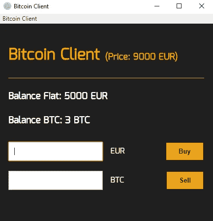
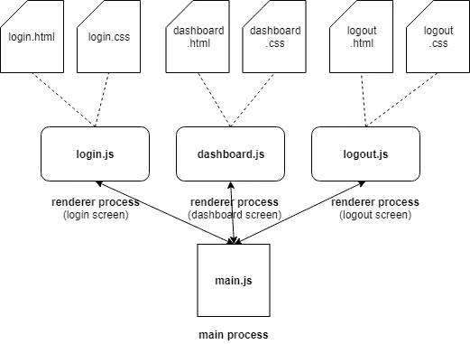
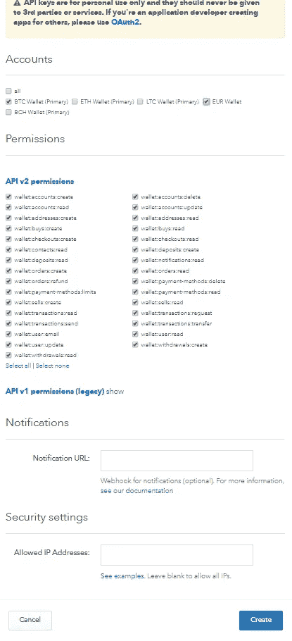
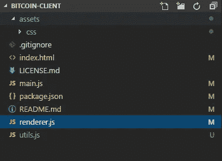
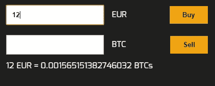
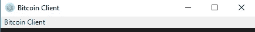
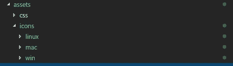

# 用电子创建跨平台比特币桌面客户端

> 原文：<https://itnext.io/create-a-multi-platform-bitcoin-desktop-client-with-electron-299639aeeba4?source=collection_archive---------7----------------------->


安德烈·弗朗索瓦在 [Unsplash](https://unsplash.com/search/photos/bitcoin?utm_source=unsplash&utm_medium=referral&utm_content=creditCopyText) 上的照片

[*点击这里在 LinkedIn 上分享这篇文章*](https://www.linkedin.com/cws/share?url=https%3A%2F%2Fitnext.io%2Fcreate-a-multi-platform-bitcoin-desktop-client-with-electron-299639aeeba4)

在本教程中，我们将创建一个**比特币桌面客户端**。它不会是最复杂的客户端；事实上，这很简单。不过，它最大的卖点是，由于 Electron 的跨平台架构，你可以在所有 Windows、Linux 或 MacOS 上使用它。**有了这个应用，你将能够使用比特币基地买卖比特币，并随时关注你的账户余额。**

请记住，本教程的主要目的是教你如何建立一个电子应用程序，以及如何使用比特币基地节点。js SDK。**因此，即使比特币客户端能够用真实货币进行交易，它也不会“准备好投入生产”。如果你用它交易，风险总是由你自己承担**

这是我们的应用程序在本教程之后的样子:



> 你可以在 [Github](https://github.com/javidgon/bitcoin-client) 中找到最新版本的比特币客户端源代码

## 先决条件

*   JS、HTML 和 CSS 知识
*   对交易术语有一些基本的了解(例如，菲亚特，买，卖…)
*   学习如何使用 electronic 开发桌面应用程序的动机！

# **什么是电子？**

根据官方文件:

*“Electron 通过提供具有丰富的本地(操作系统)API 的运行时，使您能够用纯 JavaScript 创建桌面应用程序。你可以把它看作 Node.js 运行时的一个变种，专注于桌面应用程序，而不是 web 服务器。”*

就是这样。如果你过去曾经使用过 Javascript/node.js，它会给你一种家的感觉。唯一有点“独特”的部分是组成每个电子应用程序的两种不同的进程类型:“主”和“呈现器”进程。

官方文档很好地解释了这些差异:

*在电子中，运行* `*package.json*` *的* `*main*` *脚本的进程称为主进程。在主进程中运行的脚本可以通过创建网页来显示 GUI。一个电子应用程序总是有一个主进程，但不会更多。*

*由于 Electron 使用 Chromium 来显示网页，所以也使用了 Chromium 的多进程架构。电子版中的每个网页都运行在自己的进程中，这个进程被称为渲染器进程。”*

简而言之，**你应用中的每个“屏幕”都将是一个不同的“渲染器”进程**。**这些进程将依赖于“主”进程(这将是唯一的)来创建 GUI 元素，如对话框或新屏幕**。

例如，这可能是典型电子应用程序的结构:



你不必现在就明白所有的事情。请记住**根据您是处于“主”进程还是“呈现器”进程，您可能直接访问某些电子功能，或者需要通过其他进程调用它们**(通过使用“ipc”或“远程”功能)。

> 如果你很好奇，你可以在这里找到进一步的信息

# 履行

## 步骤 0:在比特币基地创建一个 API 令牌

*   如果您仍然没有比特币基地帐户，您可以在此创建一个
*   进入“设置”→“API 访问”→“+新 API 键。”
*   填写模式对话框并点击“创建”请记住，我们不会使用所有这些权利，这只是为了在开发我们的应用程序时避免权限问题。**对于生产类 app，请不要使用这种方式。只选择你需要的。**



*   复制“ApiKey”和“ApiSecret”我们以后会需要它们。请妥善保管这些证件，不要张贴在任何地方！
*   就是这样。不幸的是，出于安全考虑，比特币基地在最初的 48 小时内禁用了 ApiKey。但是不要担心，这不是开发我们应用程序的障碍。

## 步骤 1:克隆“电子快速启动”存储库并安装电子

```
git clone [https://github.com/electron/electron-quick-start](https://github.com/electron/electron-quick-start)
cd electron-quick-start
npm install
```

## 第二步:将项目重命名为“比特币客户端”

```
mv electron-quick-start bitcoin-client
```

## 步骤 3:准备项目的结构

```
# Create the assets folder
mkdir bitcoin-client/assets# Create the css folder
mkdir bitcoin-client/assets/css# Create the "utils.js" file, where we'll store utilities
touch bitcoin-client/utils.js
```

现在你应该有这样的东西:



## 步骤 4:添加 Html 代码

打开文件“index.html”并添加以下代码:

如您所见，这是一个非常标准的 HTML 文件。这里没有什么是电子特有的。

## 步骤 5:添加一些样式

我们的应用程序现在有一个框架，但它也非常丑陋。幸运的是，这很容易解决。在“assets/css”中创建一个“index.css”文件，并添加以下代码:

## 步骤 6:更改浏览器窗口大小

好多了，但是屏幕也不好看。对我们的内容来说太大了。现在转到“main.js”文件并替换:

```
// Create the browser window.
mainWindow = new BrowserWindow({width: 800, height: 600})
```

作者:

```
// Create the browser window.
mainWindow = new BrowserWindow({ width: 450, height: 460 })
```

## 步骤 7:安装“coin base”node . js 库

转到我们应用程序的文件夹根目录并运行:

```
npm install coinbase --save
```

这不仅会安装这个库，还会将它添加到“package.json”文件中的依赖项列表中。

## 步骤 8:将“coinbase”库添加到“renderer.js”文件中

现在，转到“renderer.js”文件，在顶部添加以下代码:

你可以把从比特币基地复制的“apiKey”和“apiSecret”放在这里。如果您在创建的前 48 小时内，并且该密钥仍然被禁用，请不要担心，您可以稍后添加它。

## 步骤 9:添加对 HTML 元素和一些变量的引用

同样在“renderer.js”中，将此代码添加到我们在上一步中添加的代码行之后:

这里**我们为我们的 HTML 元素创建引用，这样我们可以附加事件并在稍后的**使用它们。此外，**我们定义了变量“useSandboxMode”，所以如果我们愿意(或者如果我们仍然在等待 ApiKey 被激活)，我们仍然可以使用带有虚假数据的应用程序**。

**值得一提的是“流动货币”这个变量。在这里您需要设置您的比特币基地钱包**的货币。因为我在欧洲，所以我用“欧元”如果你在“美国”，你可能想用“美元”在这里设置正确的货币对应用程序的运行至关重要，所以如果你不确定，去你的比特币基地账户仔细检查一下。

最后，我们定义“currentBalanceFiat”和“currentBalanceBtc”。它们将在“沙盒模式”中包含假数据(5000 和 3)，如果我们直接从比特币基地获取值，则为 0。

## 步骤 10:让我们创建一些 utils 函数

现在，在我们为不同的按钮和输入创建事件之前，我们需要定义一些 utils 函数来帮助我们与比特币基地交互。

*   getHowManyBtcCanIBuy :该函数将根据我们愿意支付的金额(美元或欧元)返回我们将获得的比特币数量。如果“沙盒模式”处于活动状态，我们假设比特币的价格为 9000 欧元。
*   **gettotalpriceofbtcament**:该函数将根据我们愿意出售的比特币数量返回价格。如果“沙盒模式”处于活动状态，我们假设比特币的价格为 9000 欧元。
*   **refreshRealData** :这个函数会用直接从比特币基地提取的真实数据刷新 GUI 中的余额，所以我们总是知道我们账户的真实状态。当然，这只在“沙盒模式”为假的情况下才有效。

转到“utils.js”文件，添加以下几行:

## 第十一步:我们来添加一些买卖比特币的事件！

太好了，我们快到了。可惜我们的 App 还是做不了多少。当我们点击按钮时，什么也没有发生。让我们解决这个问题。将以下代码添加到“renderer.js”文件的顶部

这将允许我们既使用来自 Electron 的一些对话框，又调用我们刚刚在 utils.js 文件中定义的函数。请注意我们如何使用“require(' electron '). remote .”That”。“远程”告诉 Electron，我们希望在“主”进程中运行这些功能，而不是在当前的“呈现器”进程中。**原因是只有“主”进程可以创建 UI 元素，比如对话框或新屏幕。**

现在，让我们添加允许我们购买比特币的事件！在“renderer.js”文件的底部添加以下代码:

> 注意(2018 年 10 月 3 日):截至今天，我在使用 coinbase node.js 库购买 BTC 时遇到了一些问题。我不否认这是由于我这边的一些不好的配置，但是其他人也有类似的[问题](https://github.com/coinbase/coinbase-node/issues/106)。一旦找到原因，我会更新教程。

如你所见，这很简单。根据我们是否使用“沙盒模式”,我们从比特币基地库中调用方法“购买”,或者我们简单地“假装”购买。我们还会在流程结束后“刷新”余额，这样我们就可以防止用我们不再拥有的钱购物。

现在，出售比特币会是什么情况？。在前面的代码之后，添加以下几行:

正如你所看到的，它几乎与前一个相同，所以这里没有什么神秘的:)

## 第十二步:好看！但我很想知道我用自己的钱买了多少比特币

我见过的几乎每个比特币客户端都有这个功能，所以我认为这将是我们应用程序的一个很好的补充。在 selling 方法后的“renderer.js”文件中添加以下代码:

正如我们所看到的，我们只是添加了两个新的事件，每当用户在各自的输入中键入内容时都会触发这两个事件。在这些事件中，我们将根据当前的比特币价格转换用户的输入，并显示其价值。例如:

12 个 BTCs = 108000 欧元

9000 欧元= 1 BTC

它看起来是这样的:



## 步骤 13:最后一次接触“renderer.js”文件

最后，我们希望我们的图形用户界面不时刷新。这很重要，因为如果你在我们的应用程序之外的比特币基地进行一些交易，我们的余额将完全过时！。在“renderer.js”文件的底部，添加以下代码:

如我们所见，我们创建了一个间隔，每 30 秒执行一次。

## 步骤 14:使用自定义菜单

现在应用程序看起来更好了。只剩下一件重要的事情。窗口的菜单。将此导入添加到“main.js”文件的顶部:

现在，同样在“main.js”文件中，在变量之后，添加自定义菜单:

## 第十五步:就这样！

最后，如果您运行:

```
npm start
```

您应该会看到一个功能齐全的比特币客户端:


我们刚刚创建的菜单呢？



很简单，但是现在我们知道如何定制它了！

## 步骤 16:让我们更改“package.json”文件

更改“package.json”文件是有意义的，这样我们就可以指定正确的“名称”、“关键字”等等。不要忘记改变“作者”的名字，现在是你的应用！

## 步骤 17:创建可执行文件

至于最后一步，我们需要生成可执行文件，以便在所需的操作系统中分发我们的应用程序。幸运的是，电子使这个过程变得非常简单。

*   安装`npm install electron-packager -g`
*   将所需的“脚本”命令添加到`package.json:`

*   在资产中创建一个“图标”文件夹，并为每个操作系统创建以下“子文件夹”:



*   为每个操作系统下载这些图标并保存到正确的文件夹: [Windows](https://raw.githubusercontent.com/javidgon/bitcoin-client/master/assets/icons/win/icon.ico) 、 [Linux](https://raw.githubusercontent.com/javidgon/bitcoin-client/master/assets/icons/linux/icon.png) 、 [MacO](https://github.com/javidgon/bitcoin-client/blob/master/assets/icons/mac/icon.icns?raw=true) S
*   现在，根据您的操作系统，您可以简单地运行:

`npm run package-mac`

`npm run package-win`

`npm run package-linux`

*   这将生成一个名为“release-builds”的文件夹，其中包含您的可执行文件！

## 第十八步:最后的话

仅此而已！。当您的 API 密钥被激活时，您将能够使用比特币基地来购买/出售比特币，只需将“useSandboxMode”设置为“true”，并将凭据添加到“renderer.js”文件中。

正如我们在开始时所说的，本教程的主要目的是教授如何用 electronic 开发桌面应用程序。所以，**我不建议用这个客户端每日交易真实的比特币**。原因是这个应用程序在“生产就绪”之前需要严格的测试和更好的输入验证

然而，如果你喜欢冒险，你当然可以尝试调整和测试它，看看它是否适合你，但这总是在你自己的风险:)

感谢您遵循本指南！祝您愉快！