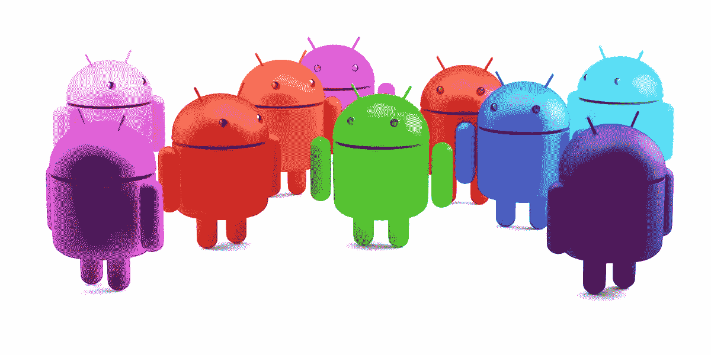

# 在一个 Android 应用程序中支持多个主题

> 原文：<https://itnext.io/create-a-multi-themes-app-in-android-99fb95e3414b?source=collection_archive---------2----------------------->



多主题

你对一个颜色的应用感到厌烦吗？

要不要建一个两种以上颜色模式的 app？

如果是的话，那么你来对地方了。

多主题应用程序让你的用户最喜欢你的应用程序，因为他们可能不喜欢你选择的默认颜色，所以你给他们一个机会使用他们最喜欢的颜色。这是一个强大的功能。让我们知道如何应用它。

**1-创建自定义调色板，让用户从:**中选择颜色

创建您的 **color_palette.xml** 布局

```
<?xml version="1.0" encoding="utf-8"?>
<LinearLayout xmlns:android="[http://schemas.android.com/apk/res/android](http://schemas.android.com/apk/res/android)"
    android:layout_width="wrap_content"
    android:layout_height="wrap_content"
    android:orientation="vertical"> <LinearLayout
        android:layout_width="match_parent"
        android:layout_height="wrap_content"
        android:orientation="horizontal"> <TextView
            android:id="@+id/blueColor"
            android:layout_width="50dp"
            android:layout_height="50dp"
            android:layout_margin="5dp"
            android:background="#3F51B5"
            android:textColor="#00000000"
            android:gravity="center"
            android:text="blue"/> <TextView
            android:id="@+id/blackColor"
            android:layout_width="50dp"
            android:layout_height="50dp"
            android:layout_margin="5dp"
            android:background="#000"
            android:textColor="#00000000"
            android:gravity="center"
            android:text="black"/> <TextView
            android:id="@+id/redColor"
            android:layout_width="50dp"
            android:layout_height="50dp"
            android:layout_margin="5dp"
            android:background="#F10000"
            android:textColor="#00000000"
            android:gravity="center"
            android:text="red"/> <TextView
            android:id="@+id/purpleColor"
            android:layout_width="50dp"
            android:layout_height="50dp"
            android:layout_margin="5dp"
            android:background="#79008E"
            android:textColor="#00000000"
            android:gravity="center"
            android:text="purple"/>
    </LinearLayout> <LinearLayout
        android:layout_width="match_parent"
        android:layout_height="wrap_content"
        android:orientation="horizontal"> <TextView
            android:id="@+id/greenColor"
            android:layout_width="50dp"
            android:layout_height="50dp"
            android:layout_margin="5dp"
            android:background="#009688"
            android:textColor="#00000000"
            android:gravity="center"
            android:text="green"/> <TextView
            android:id="@+id/greyColor"
            android:layout_width="50dp"
            android:layout_height="50dp"
            android:layout_margin="5dp"
            android:background="#777777"
            android:textColor="#00000000"
            android:gravity="center"
            android:text="grey"/> <TextView
            android:id="@+id/orangeColor"
            android:layout_width="50dp"
            android:layout_height="50dp"
            android:layout_margin="5dp"
            android:background="#FF5722"
            android:textColor="#00000000"
            android:gravity="center"
            android:text="orange"/> <TextView
            android:id="@+id/pinkColor"
            android:layout_width="50dp"
            android:layout_height="50dp"
            android:layout_margin="5dp"
            android:background="#E91E63"
            android:textColor="#00000000"
            android:gravity="center"
            android:text="pink"/>
    </LinearLayout>
</LinearLayout>
```


调色板

**2-在活动中创建一个你想要选择颜色的按钮:**

```
<Button
    android:id="@+id/chooseColor"
    android:layout_width="wrap_content"
    android:layout_height="wrap_content"
    android:onClick="chooseColor"
    android:text="[@string/choosecolor](http://twitter.com/string/choosecolor)"
    android:textColor="?colorAccent" />
```

使用按钮不是必须的。你可以在你的菜单或者任何你想要的视图中使用你的调色板。

**3-在 *styles.xml* 文件中添加主题。**

```
<resources xmlns:tools="[http://schemas.android.com/tools](http://schemas.android.com/tools)">
    <style name="AppTheme" parent="Theme.AppCompat.Light.DarkActionBar">
        <item name="colorPrimary">[@color/colorPrimary](http://twitter.com/color/colorPrimary)</item>
        <item name="colorPrimaryDark">[@color/colorPrimaryDark](http://twitter.com/color/colorPrimaryDark)</item>
        <item name="colorAccent">[@color/colorAccent](http://twitter.com/color/colorAccent)</item>
        <item name="android:windowDrawsSystemBarBackgrounds" tools:targetApi="lollipop">true</item>
        <item name="android:statusBarColor" tools:targetApi="lollipop">[@android](http://twitter.com/android):color/darker_gray</item>
    </style><style name="Theme1" parent="Theme.AppCompat.Light.DarkActionBar">
        <item name="colorPrimary">#212121</item>
        <item name="colorPrimaryDark">#000000</item>
        <item name="colorAccent">#30E57E</item>
    </style><style name="Theme2" parent="Theme.AppCompat.Light.DarkActionBar">
        <item name="colorPrimary">#F10000</item>
        <item name="colorPrimaryDark">#6E0000</item>
        <item name="colorAccent">#F10000</item>
    </style><style name="Theme3" parent="Theme.AppCompat.Light.DarkActionBar">
        <item name="colorPrimary">#79008E</item>
        <item name="colorPrimaryDark">#5C006C</item>
        <item name="colorAccent">#79008E</item>
    </style><style name="Theme4" parent="Theme.AppCompat.Light.DarkActionBar">
        <item name="colorPrimary">#009688</item>
        <item name="colorPrimaryDark">#00655C</item>
        <item name="colorAccent">#009688</item>
    </style><style name="Theme5" parent="Theme.AppCompat.Light.DarkActionBar">
        <item name="colorPrimary">#777777</item>
        <item name="colorPrimaryDark">#303030</item>
        <item name="colorAccent">#777777</item>
    </style><style name="Theme6" parent="Theme.AppCompat.Light.DarkActionBar">
        <item name="colorPrimary">#FF5722</item>
        <item name="colorPrimaryDark">#D53300</item>
        <item name="colorAccent">#FF784D</item>
    </style><style name="Theme7" parent="Theme.AppCompat.Light.DarkActionBar">
        <item name="colorPrimary">#E91E63</item>
        <item name="colorPrimaryDark">#C80145</item>
        <item name="colorAccent">#FF3C7F</item>
    </style>
</resources>
```

**4-创建自定义对话框并将其链接到您的调色板:**

我创建了一个接口，将我的封装在一个单独的类中。

```
interface ColorDialogCallback {
    void onChosen(String chosenColor);
}
```

我们将在我们的 **DialogManager** 类中填充这个接口

```
import android.app.Dialog;
import android.content.Context;
import android.view.View;
import android.view.Window;
import android.widget.TextView;public class DialogManager {public static void showCustomAlertDialog(Context context, final ColorDialogCallback callback) {
        final Dialog dialog = new Dialog(context);
        dialog.requestWindowFeature(Window.FEATURE_NO_TITLE);
        dialog.setContentView(R.layout.color_pallete);final TextView blueColor = dialog.findViewById(R.id.blueColor);
        blueColor.setOnClickListener(new View.OnClickListener() {
            [@Override](http://twitter.com/Override)
            public void onClick(View view) {
                callback.onChosen(blueColor.getText().toString());
                dialog.cancel();
            }
        });final TextView blackColor = dialog.findViewById(R.id.blackColor);
        blackColor.setOnClickListener(new View.OnClickListener() {
            [@Override](http://twitter.com/Override)
            public void onClick(View view) {
                callback.onChosen(blackColor.getText().toString());
                dialog.cancel();
            }
        });final TextView redColor = dialog.findViewById(R.id.redColor);
        redColor.setOnClickListener(new View.OnClickListener() {
            [@Override](http://twitter.com/Override)
            public void onClick(View view) {
                callback.onChosen(redColor.getText().toString());
                dialog.cancel();
            }
        });final TextView purpleColor = dialog.findViewById(R.id.purpleColor);
        purpleColor.setOnClickListener(new View.OnClickListener() {
            [@Override](http://twitter.com/Override)
            public void onClick(View view) {
                callback.onChosen(purpleColor.getText().toString());
                dialog.cancel();
            }
        });final TextView greenColor = dialog.findViewById(R.id.greenColor);
        greenColor.setOnClickListener(new View.OnClickListener() {
            [@Override](http://twitter.com/Override)
            public void onClick(View view) {
                callback.onChosen(greenColor.getText().toString());
                dialog.cancel();
            }
        });final TextView greyColor = dialog.findViewById(R.id.greyColor);
        greyColor.setOnClickListener(new View.OnClickListener() {
            [@Override](http://twitter.com/Override)
            public void onClick(View view) {
                callback.onChosen(greyColor.getText().toString());
                dialog.cancel();
            }
        });final TextView orangeColor = dialog.findViewById(R.id.orangeColor);
        orangeColor.setOnClickListener(new View.OnClickListener() {
            [@Override](http://twitter.com/Override)
            public void onClick(View view) {
                callback.onChosen(orangeColor.getText().toString());
                dialog.cancel();
            }
        });final TextView pinkColor = dialog.findViewById(R.id.pinkColor);
        pinkColor.setOnClickListener(new View.OnClickListener() {
            [@Override](http://twitter.com/Override)
            public void onClick(View view) {
                callback.onChosen(pinkColor.getText().toString());
                dialog.cancel();
            }
        });dialog.show();
    }
}
```

**5-在 *ThemeManager* 类**中创建一个处理多主题颜色的方法

```
import android.content.Context;public class ThemeManager {public static void setCustomizedThemes(Context context, String theme){
        switch (theme){
            case "blue":
                context.setTheme(R.style.AppTheme);
                break;
            case "black":
                context.setTheme(R.style.Theme1);
                break;
            case "red":
                context.setTheme(R.style.Theme2);
                break;
            case "purple":
                context.setTheme(R.style.Theme3);
                break;
            case "green":
                context.setTheme(R.style.Theme4);
                break;
            case "grey":
                context.setTheme(R.style.Theme5);
                break;
            case "orange":
                context.setTheme(R.style.Theme6);
                break;
            case "pink":
                context.setTheme(R.style.Theme7);
                break;
        }
    }
}
```

> 注意:您可以使用 ***Java 枚举*** *对来自* [*这里的*](https://www.w3schools.com/java/java_enums.asp) *的颜色进行硬编码。*

**6-将您选择的颜色主题保存在您的偏好设置中。**

创建 **ThemeStorage** 类，该类将设法在首选项中存储主题，以便在应用程序关闭后不会使选择的颜色消失。

```
import android.content.Context;
import android.content.SharedPreferences;public class ThemeStorage {public static void setThemeColor(Context context, String themeColor){
        SharedPreferences sharedpreferences = context.getSharedPreferences("theme_data", Context.MODE_PRIVATE);
        SharedPreferences.Editor editor = sharedpreferences.edit();
        editor.putString("theme", themeColor);
        editor.apply();
    }public static String getThemeColor(Context context){
        SharedPreferences sharedpreferences = context.getSharedPreferences("theme_data", Context.MODE_PRIVATE);
        return sharedpreferences.getString("theme", "grey");
    }}
```

**7。最后，拿起你喜欢的颜色，贯彻到你所有的活动中:**

让我们让魔法发挥作用😃

我们将在创建的按钮中调用 showCustomAlertDialog()方法，并实现 ColorDialogCallback 接口。

```
public void chooseColor(View view) {
        showCustomAlertDialog(this ,new ColorDialogCallback() {
            [@Override](http://twitter.com/Override)
            public void onChosen(String chosenColor) {if(chosenColor.equals(getThemeColor(getApplicationContext()))){
                    Toast.makeText(MainActivity.this, "Theme has already chosen", Toast.LENGTH_SHORT).show();
                    return;
                }
                Log.d(TAG, chosenColor);
                setThemeColor(getApplicationContext(), chosenColor);
                setCustomizedThemes(getApplicationContext(), chosenColor);
                recreate();
            }
        });
}
```

要在运行时更改主题，请在 ManiActivity 的“onCreate()方法中，在 setContentView()之前使用以下代码。

```
[@Override](http://twitter.com/Override)
protected void onCreate(Bundle savedInstanceState) {
    super.onCreate(savedInstanceState);
 **setCustomizedThemes(this,getThemeColor(this));**
    setContentView(R.layout.activity_main);
}
```

要使您选择的颜色应用于其他活动，请调用此方法 setCustomizedThemes(this，getThemeColor(this))；在其他活动的 onCreate()方法中，就在 setContentView()之前。

恭喜你，现在你有了一个多主题的应用程序🤩。你可以在你的应用中以你希望的方式实现它。

GitHub 上的样本 App，点击 [**多色**](https://github.com/Marwa-Eltayeb/Android-Features/tree/master/MultiColorThemes) **。**

这个功能在我的 app [**天气预报**](https://github.com/Marwa-Eltayeb/WeatherForecast) 中实现。

编码快乐！

更多文章:点击 [**此处**](https://marwa-eltayeb.medium.com/)

**在**[GitHub](https://github.com/Marwa-Eltayeb)|[LinkedIn](https://www.linkedin.com/in/marwa-eltayeb/)|[Twitter](https://twitter.com/Marwa_Eltayeb1)上找我