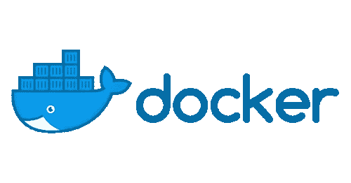

# 用 Docker 创建一个 MySQL 服务器

> 原文：<https://itnext.io/create-a-mysql-server-with-docker-55ea405f64b0?source=collection_archive---------2----------------------->



恰好我想为我的 Django Rest API 创建一个 MySQL 服务器。所以 Django Rest API 位于我的主机上——我很快会把它移到一个容器中。MySQL 将放在一个容器中。主机可以与容器内的数据库通信。

以下是命令:

```
docker run -d -p 3306:3306 --name=mysql-server --env="MYSQL_ROOT_PASSWORD=123456" mysql# This runs on a detached mode
# Open port 3306:3306
# Name of the server: mysql-server
# root password: 123456
# Container is created from mysql image
```

**备注:**

*   请检查是否有其他应用程序监听您的主机上的端口 3306。如果是，您可以将端口更改为不同的端口。

```
-p 12345:3306# This is one method to check for the port on MAC OS
netstat -vanp tcp | grep 3306
```

*   如果您无法从另一个 docker 连接到 MySQL，并得到以下错误:

```
Unable to load authentication plugin 'caching_sha2_password'.
```

然后，您可以在运行容器时添加下面的参数。是因为新版 MySQL 使用了 **caching_sha2_password** 而不是 **mysql_native_password** 。

```
mysqld --default-authentication-plugin=mysql_native_password
```

*   你可以通过你的主机访问 MySQL

```
# Through host
mysql -host 127.0.0.1 -P 3306 —protocol=tcp -u root -p# Through container
docker exec -ti mysql-server bash
mysql -u root -p
```

*   为连接创建用户和数据库

```
CREATE DATABASE databaseName;CREATE USER 'dnguyen'@'localhost' IDENTIFIED BY '123456';GRANT ALL PRIVILEGES ON databaseName.* TO 'dnguyen'@'localhost';FLUSH PRIVILEGES;QUIT
```

*   如果你使用 Django，下面是你需要放入 **settings.py** 的内容

```
DATABASES = {
      'default': {
        'ENGINE': 'django.db.backends.mysql',
        'NAME': 'databaseName',
        'USER': 'dnguyen', # or root
        'PASSWORD': '123456',
        'HOST': '127.0.0.1',
        'PORT': '3306', # or 12345
        'OPTIONS': {
            # Tell MySQLdb to connect with 'utf8mb4' character set
            'charset': 'utf8mb4',
        },
    }
}
```

从现在起，你可以随时连接到你的 MySQL。

希望这有所帮助；)