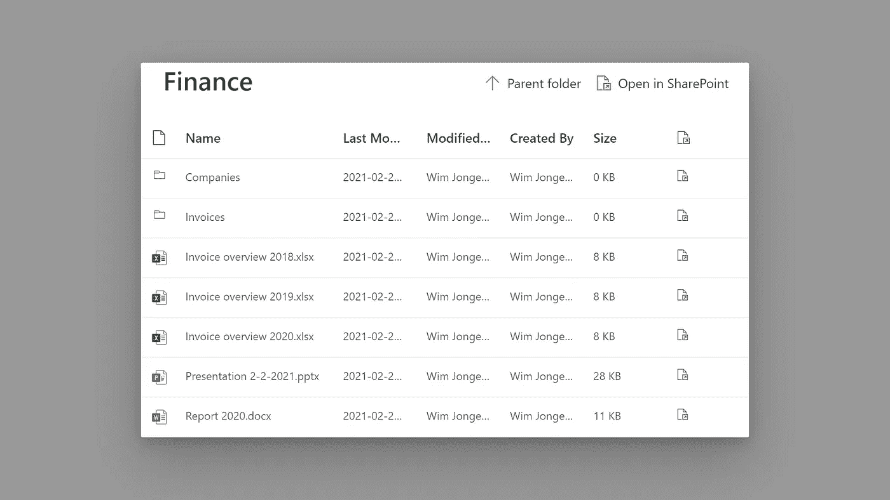
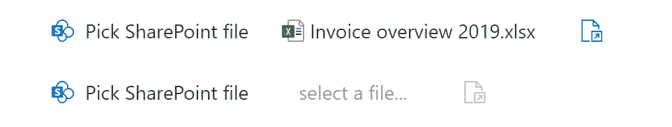

# 使用 Microsoft Graph 和 Fluent UI 在 React 中创建 SharePoint 文件选择器

> 原文：<https://itnext.io/create-a-sharepoint-file-picker-in-react-with-microsoft-graph-and-fluent-ui-8653e3342942?source=collection_archive---------4----------------------->

## 让您的 React 应用成为微软 365 生态系统的一部分

我们将创建的文件选择器

微软 365 平台在过去的十年里真正流行起来，许多转型企业最终将其 IT 环境转移到了云上。对于开发人员来说，这意味着通过将他们的应用程序与这些云环境相集成，可以获得越来越多的价值。为了促进这一点，微软创建了微软图形平台，在这个平台上，所有不同的系统通过一个 OData 网关连接到外部世界。

在本文中，我想向您展示如何使用 Microsoft Graph 构建一个文件选择器，从用户的在线驱动器中选择文件。如果您现在有一个应用程序，用户现在可以上传他们在本地 office 安装中创建的文件，您现在可以升级该应用程序，以处理他们 OneDrive 文件夹中的文件。

# 使用 Microsoft 身份验证

要开始使用 Graph，你首先需要用 Azure Active Directory 实现 SSO。最简单的方法就是跟随微软 React 的教程。您只需要验证码，您可以在“获取日历视图”步骤停止。

如果您从 Microsoft 示例中获取了准确的代码，您必须更改授权范围，以包括对用户文件的访问。我们还需要保持`user.read`的范围，这样`withAuthProvider`组件仍然可以加载当前用户的配置文件。

访问用户文件的正确范围

# **通过 Microsoft Graph 查询文件夹**

在我们设置了 Microsoft Identity 以获取所需的访问令牌后，我们可以开始通过 Graph client 编写查询。我们将从定义我们实际想要从 API 加载的数据开始。用于文件夹和项目的类型如下所示。根据您想要在文件选择器中包含多少列，您可以添加和删除`GraphItem`类型的属性，只是不要忘记相应地更新查询。

我们将要处理的两种基本类型的数据

通过使用`/me/drive/root`端点获取当前用户的根文件夹，可以使用 Microsoft Graph 查询用户的文件。根文件夹是用户登录 OneDrive 时看到的内容。通过扩展到`children`,我们可以在一个查询中获得根文件夹中的项目:

加载文件夹及其内容的 Microsoft Graph 查询，以及将数据解析为所需数据结构的函数

相同的 API 调用也可以用于所有其他文件夹，尽管基本 url 略有不同。你也可以扩展这个函数，例如通过使用`/me/drive/recent`而不是指向根文件夹来加载当前用户最近的所有文件。

# 文件选择器组件

文件选择器的根组件将保存当前视图中的`GraphFolder`的状态。在这个组件中，我们将在顶部呈现一个带有项目和一些附加信息的列表。当用户点击一个文件夹时，我们会将该文件夹加载到状态中并替换当前的文件夹。然而，如果用户点击一个文件，我们将调用来自 props 的回调，将选择的文件传递给`FilePicker`组件的消费者。这也将设置状态中的`selectedFile`属性并关闭模态。

文件选择器的根组件

在文件选择器本身的逻辑之外，我们也有一些它的关闭状态的逻辑。在关闭状态下，我们显示了一个打开文件选择器的按钮，在它旁边显示了所选文件的名称以及在 SharePoint 中打开它的链接。在带有文件夹的模型中，我们显示了两个组件:一个`commandBar`和一个`detailList`。`detailList`将显示文件夹中项目的列表，而`commandBar`将提供文件选择器的标题(如本文的标题图片所示)。

文件选取器的两种关闭状态

这个元素是来自[微软流畅用户界面库](https://developer.microsoft.com/en-us/fluentui#/)的`[CommandBar](https://developer.microsoft.com/en-us/fluentui#/controls/web/commandbar)`。该函数的实现如下所示。通过使用流畅的用户界面，我们不仅仅是从微软平台加载东西，我们还让它看起来像是更大生态系统的一部分。您已经在前面的代码示例中看到了一些用于`Modal`和`ProgressIndicator`的流畅 UI 元素。

文件选取器关闭状态的渲染函数

# 使用 Microsoft Fluent 用户界面显示文件夹

对于项目的渲染，我们将使用 Fluent UI 中的`[DetailList](https://developer.microsoft.com/en-us/fluentui#/controls/web/detailslist)`组件。该组件通过使用列定义的集合来呈现项目列表。请注意，在下面的示例代码中，我省略了很多列，它们本质上都是一样的，占用了很多空间。这个组件的完整代码可以在 GitHub 的[这里](https://gist.github.com/WimJongeneel/d4c256382da69b7045003a0cdba8b11d)找到。

当前打开的文件夹中的文件夹和文件列表的呈现功能

最重要的部分之一是`onItemInvoked`功能。在这里，当用户点击一行时，我们或者调用`loadFolder`或者`onSelectFile`。

在项目列表的顶部，我们将显示一个带有当前文件夹名称的`[CommandBar](https://developer.microsoft.com/en-us/fluentui#/controls/web/commandbar)`，一个导航到其父文件夹的按钮和一个在 SharePoint 中打开该文件夹的链接。这也是一个`CommandBar`(类似于关闭的视图)，但是这里我们也使用`farItems`道具来显示模态最右边的按钮。

文件选择器顶部栏的渲染功能

# 结论

有了标题，我们现在在 React 中有了一个完整的 SharePoint 文件选择器。当然，这一个仍然相对简单，但可以很容易地扩展像搜索，过滤器或多选等功能。我希望这篇文章向您展示了如何编写一个与微软云环境集成的 React 组件。