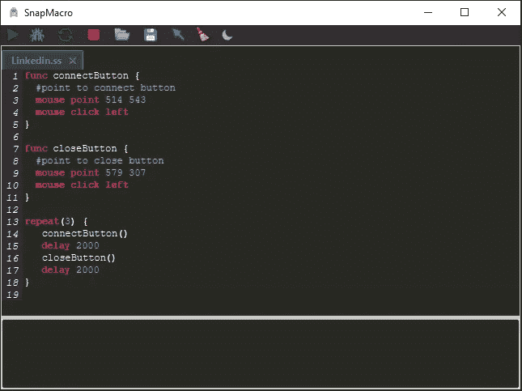

# 用 33 行代码创建一个简单的机器人创建器

> 原文：<https://itnext.io/create-a-simple-bot-creator-in-33-lines-of-code-f8c44cd870d7?source=collection_archive---------2----------------------->


大家好，我是 Amr Hesham，我是一名对 android 开发和编译器设计感兴趣的软件工程师，我喜欢玩一些 RPG 游戏，但其中一些游戏的设计是为了让你尽可能多地呆在游戏中，所以他们会给你一些重复而无聊的任务，例如，可能每天都要收集一些物品…等等，所以我已经搜索了一个机器人创建者来使用它并自动完成这些任务。

我发现了一个很好的工具，它有很多功能，比如控制鼠标，键盘，屏幕，用一些辅助语句检查像素颜色，比如 if，loop…等等。

但是要创建你的脚本，你需要用 GUI 添加一个命令列表，这意味着你可以像任何编程语言一样编写脚本，我讨厌这个想法，所以在尝试了这个程序后，我有一个问题，我如何才能设计一个这样的或者比它更好的程序？！

我开始搜索如何在 java 中控制鼠标、屏幕、键盘，经过一番研究，我得到了很多答案，并且在 Java 中发现了一个很神奇的类，叫做 Robot。

你可以在 Oracle 文档中看到的机器人

> 此类用于为测试自动化、自运行演示和其他应用程序生成本机系统输入事件，在这些应用程序中…

而且它有很多有用的方法来做我想做的事情，而且在这段时间里我看了一些编译器设计书籍，创作了很多玩具编程语言，也对 JavaFX 框架有了很好的体验，所以我发现如果把我在编译器设计、JavaFX 和 Robot 类方面的经验融合起来，来创作我的令人惊叹的 Bot Creator 项目，一定会很惊艳。

我已经开始创建一个脚本编程语言，为鼠标，键盘，屏幕添加关键字，然后我添加了对语句的支持，所以我添加了 if，while，repeat 语句，之后，我想让用户更容易地创建一个复杂的机器人，所以我添加了对变量，函数和内置函数的支持，例如，我添加了名为 pixelColor 的内置函数来获取当前鼠标位置像素值，完成此语言后，是时候启动 JavaFX 了，所以我为它创建了一个简单的编辑器，带有一些按钮，如运行，停止，重新启动…等。而这就是我称之为 [**SnapMacro**](https://github.com/amrdeveloper/snapmacro) 的结果。



SnapMacro 演示

在完成这个项目并在在线游戏中使用它之后，我还用它为 Linkedin 写了一个机器人来添加人，或者也许我可以用它来接受许多人的发明和其他事情。

这是 SnapMacro 背后的故事，顺便说一下，Snap 是我的脚本语言的名称，但本文并未在此结束，目标不仅仅是讲述我的故事，而是向您展示如何用相同的概念在短短 33 行中创建一个简单的 bot creator。

是的，正如你所看到的，它只有 33 行代码！

我们不会创建脚本语言或支持语句或变量，但我们将创建一个简单的机器人创建者，支持鼠标，键盘命令。

首先，我们想从我们的小机器人创造者那里得到什么？基本上，我们将支持 3 种类型的命令，结果将是 7 个命令。

鼠标命令

> 鼠标移动 x y
> 鼠标按右|左
> 鼠标释放右|左
> 鼠标滚轮 x

键盘命令

> 键盘按下 x
> 键盘释放 x

延迟命令

> 延迟 x

让我们开始创建 bot creator，我们将在本文中使用 Kotlin 编程语言，但您也可以使用 Java，或者采用这个概念并使用您最喜欢的编程语言，这都没有关系。

首先，我们将使用 Scanner 类从控制台读取用户输入，我们将初始化 Robot 类的一个实例，并且我们将用户何时检查当前命令的类型。

```
fun main() {
    val scanner = Scanner(System.`in`)
    val robot = Robot()
    while (scanner.hasNext()) {
        when (scanner.next()) {
            "mouse" -> {}
            "keyboard" -> {}
            "delay" -> {}
        }
    }  
}
```

现在，在每种类型中，我们需要支持一些命令，所以让我们从最小的命令开始“延迟”只有一个命令，延迟 x，以毫秒为整数，并使用机器人进行延迟，所以代码将是这样的。

```
"delay" -> robot.delay(scanner.nextInt())
```

现在让我们来看一下鼠标命令，它有 4 个命令移动、单击和滚动，首先是“按”命令，它将向右或向左移动，我们将使用 when 来检查这一点，然后我们有“释放”，它与结构中的“按”完全一样，然后我们有“移动”命令，它接受 x 和 y 值并将光标移动到这个位置，因此我们需要为此命令扫描两个整数，之后我们有“滚动”命令，它只需要一个正整数或负整数。

```
"mouse" -> when (scanner.next()) {
    "press" -> {
        when (scanner.next()) {
            "right" -> robot.mousePress(*BUTTON3_DOWN_MASK*)
            "left" -> robot.mousePress(*BUTTON1_DOWN_MASK*)
        }
    }
    "release" -> {
        when (scanner.next()) {
            "right" -> robot.mouseRelease(*BUTTON3_DOWN_MASK*)
            "left" -> robot.mouseRelease(*BUTTON1_DOWN_MASK*)
        }
    }
    "move" -> robot.mouseMove(scanner.nextInt(), scanner.nextInt())
    "wheel" -> robot.mouseWheel(scanner.nextInt())
}
```

现在，我们完成了鼠标命令，我们将进入键盘命令，它只有两个命令，“按”和“释放”，它们接受字符代码，但强迫用户编写键码不是很好，所以我们将读取字符并将其转换为键码，Robot 有一个很好的函数来完成这项工作，它名为 getExtendedKeyCodeForChar，它接受 Char 并返回整数形式的键码，因此键盘命令部分将如下所示。

```
"keyboard" -> {
    val action = scanner.next()
    val character = scanner.next()
    val key = KeyEvent.getExtendedKeyCodeForChar(character[0].toInt())
    when (action) {
        "press" -> robot.keyPress(key)
        "release" -> robot.keyRelease(key)
    }
}
```

现在恭喜你，你有了一个简单的机器人创建器，所以现在你可以写一个脚本。

```
mouse point 500 500
mouse press left
delay 500
mouse release left
mouse wheel 100
keyboard press A
delay 500
keyboard release A
delay 500
```

它会工作得很好，:D

这是全部代码，大约 33 行代码。

```
fun main() {
    val scanner = Scanner(System.*`in`*)
    val robot = Robot()
    while (scanner.hasNext()) {
        when (scanner.next()) {
            "mouse" -> when (scanner.next()) {
                "press" -> {
                    when (scanner.next()) {
                        "right" -> robot.mousePress(*BUTTON3_DOWN_MASK*)
                        "left" -> robot.mousePress(*BUTTON1_DOWN_MASK*)
                    }
                }
                "release" -> {
                    when (scanner.next()) {
                        "right" -> robot.mouseRelease(*BUTTON3_DOWN_MASK*)
                        "left" -> robot.mouseRelease(*BUTTON1_DOWN_MASK*)
                    }
                }
                "move" -> robot.mouseMove(scanner.nextInt(), scanner.nextInt())
                "wheel" -> robot.mouseWheel(scanner.nextInt())
            }
            "keyboard" -> {
                val action = scanner.next()
                val character = scanner.next()
                val key = KeyEvent.getExtendedKeyCodeForChar(character[0].toInt())
                when (action) {
                    "press" -> robot.keyPress(key)
                    "release" -> robot.keyRelease(key)
                }
            }
            "delay" -> robot.delay(scanner.nextInt())
        }
    }
}
```

如果你对这种类型的项目感兴趣，你不应该停留在这里，并尽可能地尝试改进它，如果你想将其转换为一种脚本语言，我向你推荐一本[**Crafting Interpreter**](https://craftinginterpreters.com/)书，它将教你如何创建一个编译器和解释器，你还可以存储命令并支持一些新命令，如重启、退出等。

你可以在:[**Github**](https://github.com/amrdeveloper)[**Linkedin**](https://www.linkedin.com/in/amrdeveloper/)[**Twitter**](https://twitter.com/amrdeveloper)上找到我。

感谢并享受编码😋。