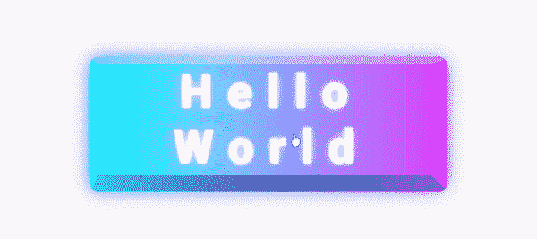
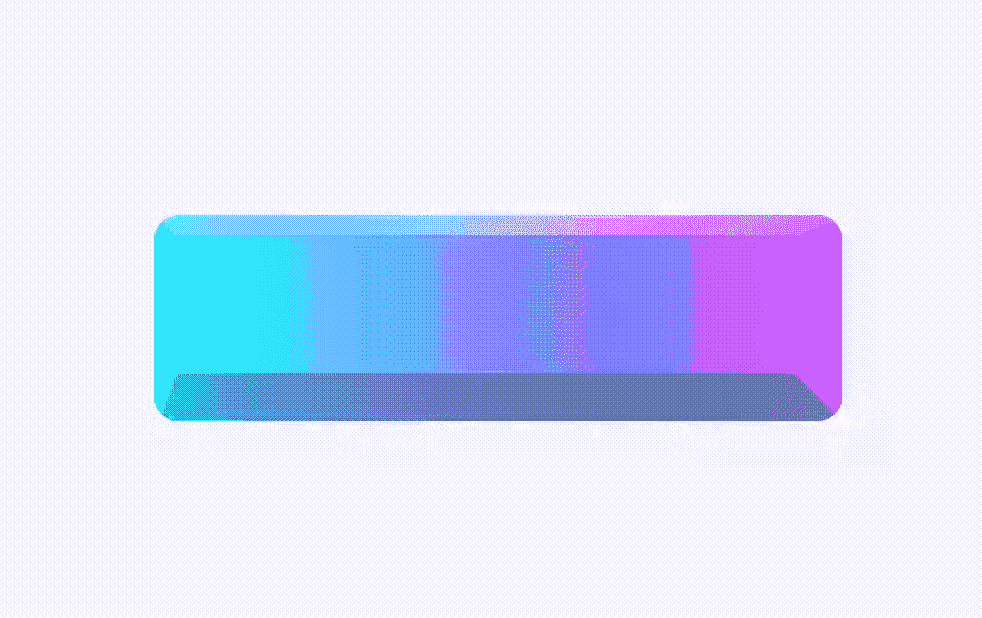
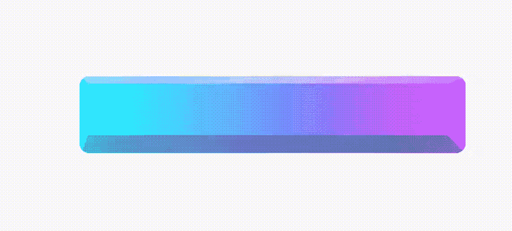

# 用 responsive_styled_widget 包在 Flutter 中创建一个黏糊糊的、有反应的赛博朋克按钮

> 原文：<https://itnext.io/create-a-squishy-responsive-cyberpunk-button-in-flutter-590488b44a78?source=collection_archive---------4----------------------->



一个灵敏的赛博朋克按钮

你想在 Flutter 中快速创建一个这样的按钮吗？它有圆角，四个不同的边界与四个梯度填充，一个梯度阴影，文字与不同的字母间距和阴影。此外，该按钮实际上是响应性的，具有自动高度和评估为 max(屏幕宽度的 50%，500px)的宽度。如果您将鼠标指针移到它上面，光标也会变成单击手势。下面是我能想到的一些使用 Flutter out of the box 来实现这一点的步骤。

1.  计算宽度并不难。使用 MediaQuery 获得屏幕宽度，然后做一些简单的数学运算就可以了。
2.  四个边框可以使用四个带有渐变填充的自定义画笔绘制。圆角可以使用带有圆角的容器小部件来实现。文本位置需要在点击后移动，所以你也需要计算移动。
3.  目前的抖动阴影只使用单一颜色，所以为了实现这种渐变阴影，我们可以在按钮下堆叠一个带有图像过滤模糊的渐变容器。
4.  使用 MouseRegion 小部件来实现鼠标光标的改变。

使用 CSS，你可以更容易地实现这个按钮样式，因为 CSS 支持响应长度单位，圆角加上不同颜色的边框，带有伪选择器和模糊的渐变阴影，等等。如果我们创建一个能够轻松实现 Flutter 中所有这些特性的小部件会怎么样？

首先，让我们处理一下响应性。我建议你看看这篇[文章](https://kevinvan.medium.com/dimension-a-css-inspired-distance-calculating-package-for-flutter-e0604f62e707)，在那里我介绍了[维度](https://pub.dev/packages/dimension)包。简而言之，这个包允许您定义各种响应距离测量。

```
///10% of the screen width
var length = 10.toVWLength;
///maximum of two lengths
length = Dimension.max(10.toVWLength, 100.toPXLength);
///nested expression with clamp, min, addition of lengths
length = Dimension.clamp(100.toPXLength, 20.toPercentLength + 10.toPXLength, Dimension.min(500.toPXLength, 50.toVWLength));
```

使用此软件包，您可以精确控制想要使用的尺寸。使用 style 类描述小部件样式:

```
class Style {
  bool? visible;
  double? opacity;

  Alignment? alignment;

  Dimension? width;
  Dimension? height;

  EdgeInsets? margin;
  EdgeInsets? padding;

  BoxDecoration? backgroundDecoration;
  BoxDecoration? foregroundDecoration; List<ShapeShadow>? shadows;
  List<ShapeShadow>? insetShadows;
  MorphableShapeBorder? shapeBorder;

  SmoothMatrix4? transform;
  Alignment? transformAlignment;

  Alignment? childAlignment;
  DynamicTextStyle? textStyle;
  TextAlign? textAlign;

  SystemMouseCursor? mouseCursor;
}
```

它非常类似于容器小部件使用的参数。然后可以使用 StyleContainer 小部件来构造最终的小部件:

```
Widget widget = StyledContainer(
    style: style,
    child: Text("Hello World")
);
```

还有 AnimatedStyledContainer，它将在您提供的不同样式之间平滑地动画化，类似于 AnimatedContainer 小部件。

```
Widget widget = GestureDetector(
  onTapDown: (TapDownDetails details) {
    setState(() {
      toggleStyle = false;
    });
  },
  onTapUp: (TapUpDetails details) {
    setState(() {
      toggleStyle = true;
    });
  },
  child: AnimatedStyledContainer(
      duration: Duration(milliseconds: 100),
      style: toggleStyle ? beginStyle : endStyle,
      child: Text("Hello World")),
);
```

当在开始样式和结束样式之间切换时，AnimatedStyledContainer 将在它们之间平滑动画。请注意，由于样式可以是在不同屏幕尺寸下映射到不同样式的样式映射，因此如果您调整应用程序窗口的大小，动画也可能会触发。这就是一开始用来实现霓虹按钮的东西。

那么这个按钮的样式看起来怎么样呢？看起来是这样的:

乍一看可能有点长，但是大部分代码是用来配置这个按钮使用的四个边框和三个文本阴影的。

# 带转换的样式



左:旋转变换。右图:内部阴影发光

您还可以使用 SmoothMatrix4 类在样式中插入转换。它与 Flutter 用来描述变换的 Matrix4 类有一个几乎相同的接口，但它只允许可以平滑动画化的变换(缩放、平移和旋转)。此外，它使用 Dimension 类来描述翻译，因此您可以编写如下内容:

```
SmoothMatrix4()..translate(-100.toVWLength)
```

以确保无论屏幕大小如何，动画总是在屏幕外开始。

# 样式序列化/反序列化

如果你关注过我过去的文章，你会知道我发布的 UI 包都支持序列化。而这么做的原因就是为了这个[包](http://responsive_styled_widget)(名为 responsive_styled_widget)。通过调用以下命令，可以很容易地将 neon 按钮样式序列化为 JSON 字符串:

```
style.toJson();
```

其实风格图也可以序列化:

```
styles.toJson();
```

要取回样式/样式映射，请使用此函数:

```
dynamic? parsePossibleStyleMap(Map<String, dynamic>? style);
```

这将为您提供单个样式或样式映射，您可以将它们插入 StyledContainer 小部件。

# 有什么意义？

你可能会认为这个样式表违反了 Flutter 的组成思想，并把我们带回了 CSS，我同意你的观点。但是我认为这个样式表主要是由三个广泛使用的 Flutter 部件组成的:容器、DefaultTextStyle 和 Transform。我所做的是增加响应性(通过 Dimension 类和 ScreenScope 类)，边界和阴影的渐变着色，形状变形和可序列化。Style 类包含了您可以设置的大多数 UI 样式，但是 Flutter 创建自定义 UI 的能力不会因为使用这个包而受到影响。如果你不喜欢样式表的想法，你仍然可以使用 [dimension](https://pub.dev/packages/dimension) 包和 [morphable_shape](https://pub.dev/packages/morphable_shape) 包来创建响应距离和各种形状边界。

我能想到的关于这个包的一些额外用例是:

1.  CSS 样式的转换器。这个包支持各种 CSS 样式，如边距、填充、宽度、高度、背景装饰(颜色、渐变、图像)、边框样式、阴影、文本样式、变换。它还支持@media 规则和维度计算，如(calc，min，max，clamp)。编写一个可以将一些复杂的 CSS 样式转换成 Flutter 的转换器应该是相当容易的。
2.  一个 UI 库。您可以生成一个想要使用的常见 UI 样式的列表，并将它们保存在 JSON 中，就像 tailwind css 正在做的那样。然后，您可以在应用程序中的任何地方重用这些样式。制作这些样式的动画很容易，因为您手边有 AnimatedStyledContainer 小部件(或者使用显式动画)。修改这些样式也很简单，因为 Style 类为您提供了 copyWith 和 merge 方法来快速生成新的样式。
3.  如果你想更极端，你可以在整个框架中使用样式，给每个小部件一个 id、一个类或其他选择器，并使用一个状态管理框架来提供所有的样式。然后 Dart 代码只提供 javascript 的功能。

今天的文章就到这里。谢谢大家！